# AdvCiv-SAS (Simple Advanced Strategy)
This mod (AdvCiv-SAS (Simple Advanced Strategy) is based on
[AdvCiv 1.12](https://github.com/f1rpo/AdvCiv/tree/1.12) as it is the latest [AdvCiv (the CFC forum/post link)](https://forums.civfanatics.com/threads/advanced-civ.614217/) version as of now), and will/may update whenever there are new changes that are stable.

Currently, it is still a work in progress so is not playable yet as explained below,
but these are the (main) goals/purposes/features.

## How to play?

If you are a new player and/or want to play this mod and would like a few instructions on how
to install it and play it, i have provided a few instructions [here](/_1_AdvCiv-SAS/Quick_Install_Setup_Guide.md)

## Quick Start Guide

If you just want to play and do not need all the project bigger details, i added
a quick guide of the main changes from Civ4 and base AdvCiv players:
[here](/_1_AdvCiv-SAS/Quick_Get_Started_Guide.md)

note: it is recommended to read this part even if you want to know the deeper
changes. There are stuff and things/information i added only recently in it,
which may not be available in the longer docs.

I may also update it after releasing mods, maybe, but not guaranteed, if there
are significant changes i would like to add or mention/talk about there. But
i would move them to the bottom so you don't have to reread all ideally.

## Example of Sevopedia reworks (click on the images below to view them full size)

### advciv-sas core sevopedia pages (documentation and such)
example 1: AdvCiv-SAS core changes coming from AdvCiv (thanks to [@f1rpo](https://github.com/f1rpo), main (only one i think actually? But anyways) maintainer of AdvCiv for the help in achieving that in particular). It is one of the cases where ChatGPT could not help so i especially appreciate it in this case even more, thanks a lot if i may say i mean anyways, thanks, really, thanks,

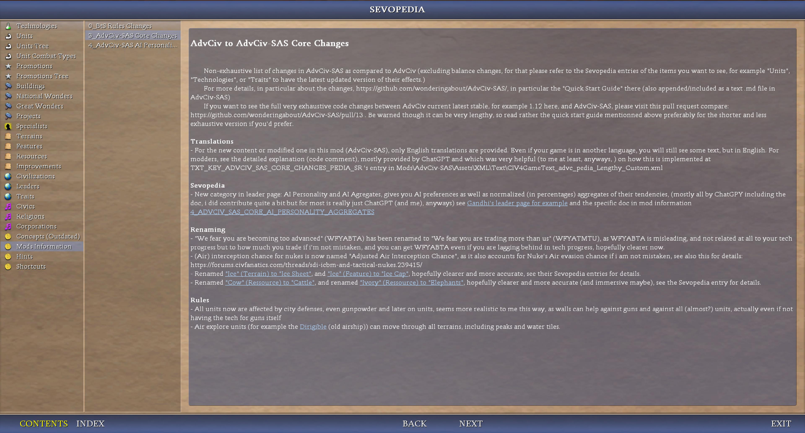</img>

(note: this one is also available on the [Quick Get Started Guide](/_1_AdvCiv-SAS/Quick_Get_Started_Guide.md) that i recommend you to read (but not obligated, anyways), if you haven't and want to start playing AdvCiv-SAS)

Except and on top of these examples, i also rewrote, quite modestly or more proudly (often proud and bit cocky but in friednly way whatever that means maybe but bit humble too anyways) other entries in the sevopedia, based on other mods or advciv or/and ChatGPT or/and other ressources or not or/and myself or/and other indirect helps or not or yes or not or etc, anyways, please visit it to have latest data if interested, anyways.

example 2: AI personality aggregates, and AI personality aggregates, very important addition, please visit the sevopedia in "Mods Information" help, related page for latest updated version, a screenshot here which may be accurate (as in updated or not, anyways):

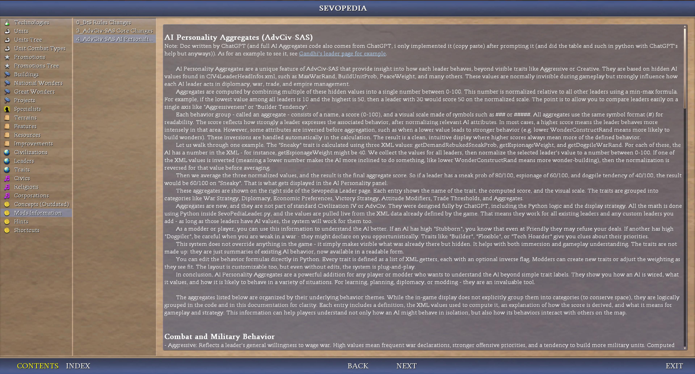</img>
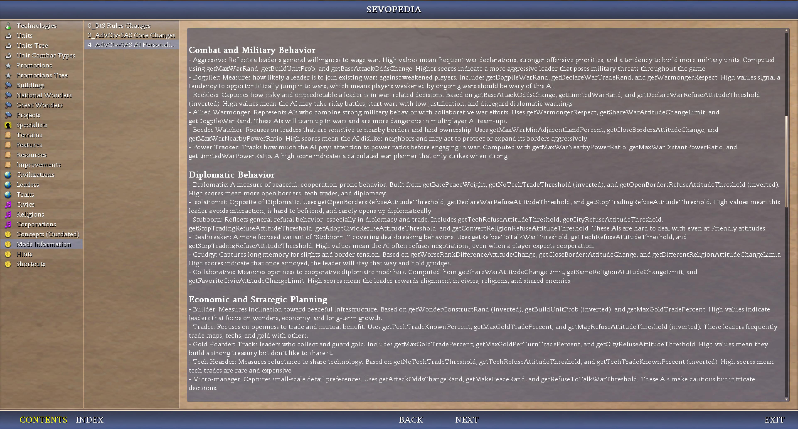</img>
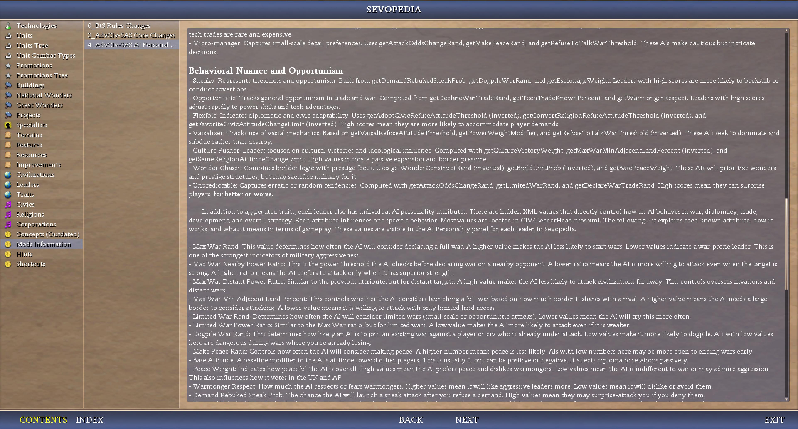</img>
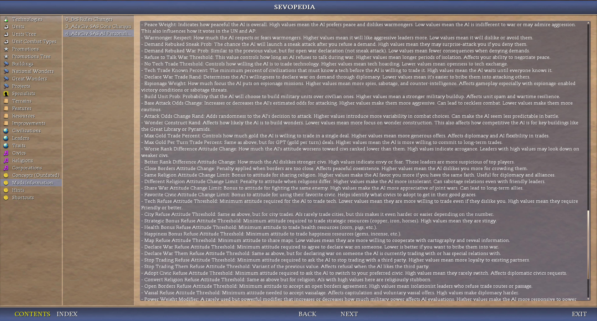</img>
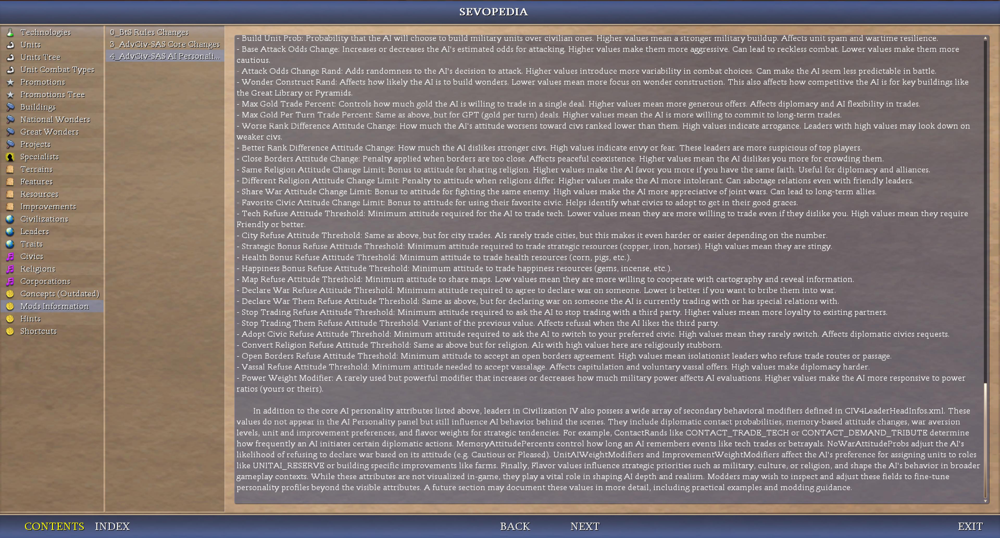</img>

### other (existing mostly if not only) categories
example 1: AI personality panel (data fetched directly from xml in live, auto updated to latest current in your mod folder), thanks a lot ChatGPT and all who helped me directly or indirectly or not or yes etc anyways:

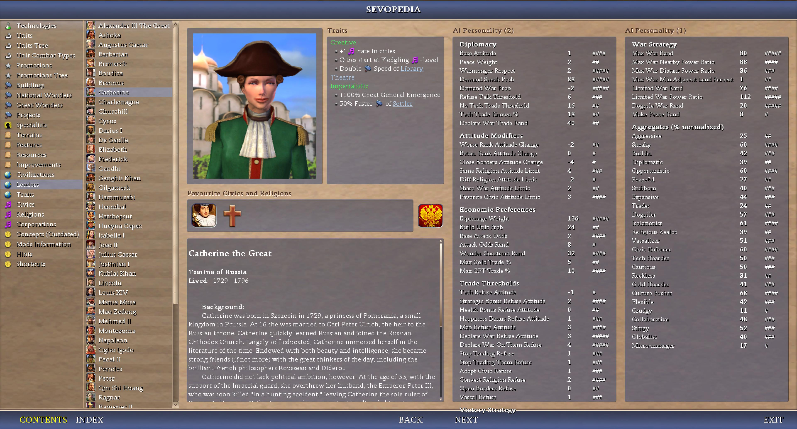</img>
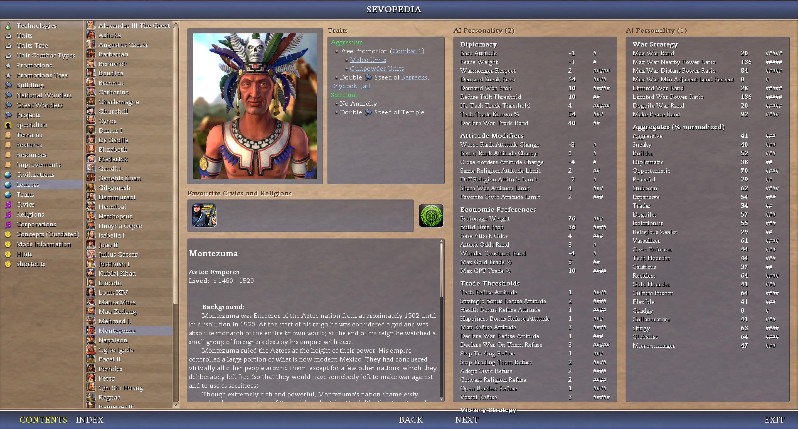</img>
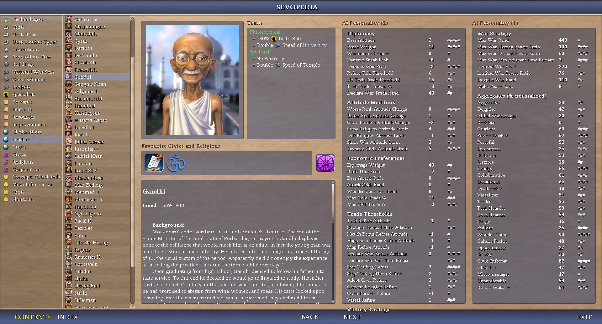</img>
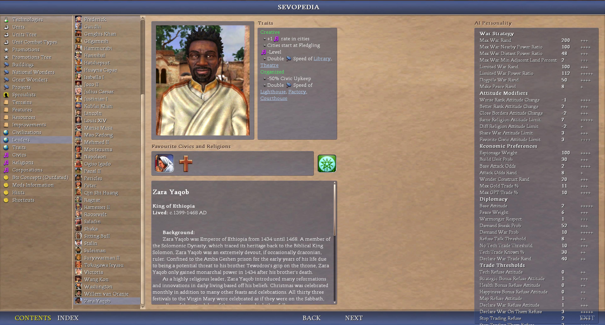</img>
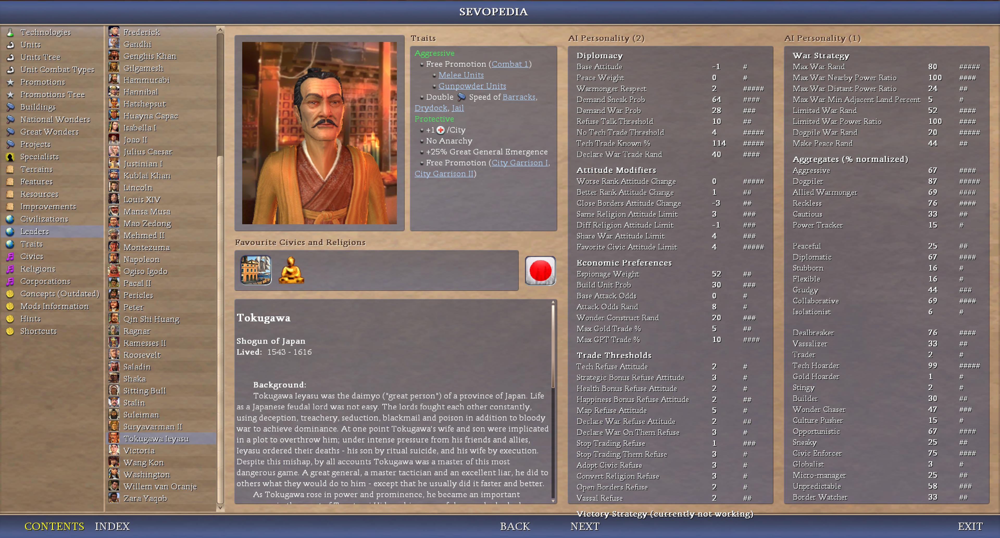</img>
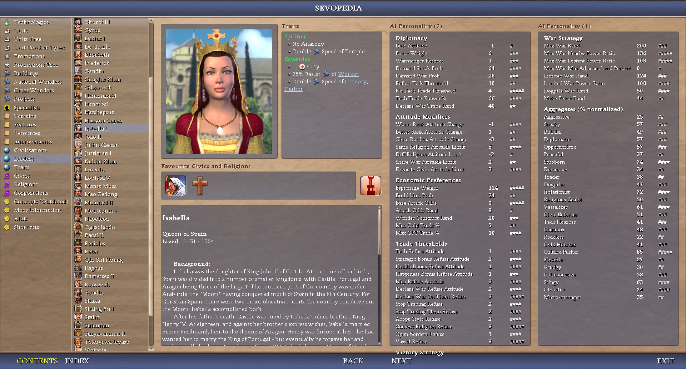</img>

example 2: Unit Chart (Unit Combat Types expanded page when you click on a combat type), thanks a lot to RFC DOC mod's code which i used quite heavily, then base AdvCiv which i sued to enhance it (blue background, margin), then i rewrote it heavily again to tweak it and add dynamic table size based on unit combat type (for example air units have 10 columns (air interception and air range), while other unit combat types only have 8, click to view these images full size:

</img>

example 3: features category of the sevopedia, based rfc doc's and slightly tweaked or not, thanks a lot

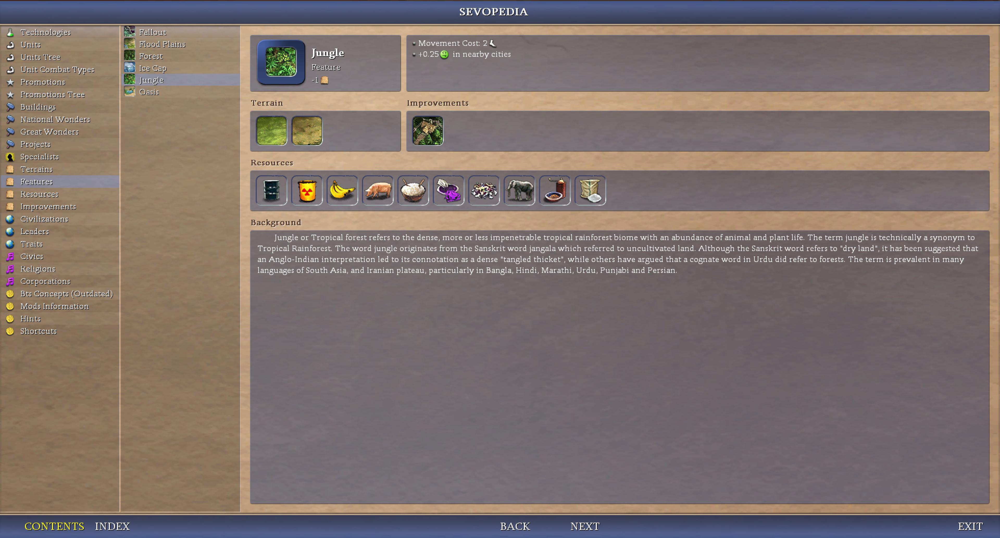</img>

example 4: ressources category, mostly my own modding and first attemps at deciphering civ4's python, not inordinate if i may say quite fairly, but i like it this end result a lot, may further improve or not, the feedback always helps me, but sometimes the negative ones hurts me more, however sometimes the negative ones lead to better future outcomes, so i am thankful of it when it is done in sincerity and consideration maybe, something like this, even though maybe unpleasant at first, but this is not always, sometimes it's just painful and best avoided i think at least for me anyways, some other times it's painful but leads to better/good results in the future maybe, not guaranteed and just my personal opinion not responsible of what you reader make of it with you or/and others or not make of it, was sharing my advice or rather opinion maybe, each are free or not etc, anyways. As for this page or/and other pages or/and not, may tweak it further or not as i see fit, anyways

</img>

## Sex-neutral unit names or/and combat types (todo and non-exhaustive)

Yet to be done, but i want (more at least) sex-neutral terms for units. Tbh i don't care much if at all (but is maybe nice, anyways), but i intend to implement some women units, especially light units where i think women make more sense (less strength required and they are more agile perhaps too, anyways). I also think they (some of them at least anyways) were very lousy (names), for example for "spearman" it's basically just weapon-man, i am not even sure it's a proper word for most units but i don't know much about this, anyways. Also, unless the unit was strongly masculine, i see no reason to use weaponman specifically, anyways.

Back to the topic of sex-neutral units,So "Swordsman" does not make sense anymore for that, see [Less generic or inaccurate unit names or/and combat types (todo)](#less-generic-or-inaccurate-unit-names-orand-combat-types-todo) for details.

This is a todo, so will not start listing sources, will do it in a proper notes file if i have to (or/and want to) and link to it (may abridge this section and move most of it there maybe then if i do it, anyways), but i want to at least share my ideas, maybe some will like them or want to think about them at least maybe.

Making some of them more badass at the same time, i think see mostly if not only anyways [Less generic or inaccurate unit names or/and combat types (todo)](#less-generic-or-inaccurate-unit-names-orand-combat-types-todo)

So far i am thinking of (non exhaustive, no source or explanation provided, it will be in docs else too tedious to do here anyways):

- Swordsman: Swordsfighter (Light, Medium, Heavy)
- Spearman: Lancer (Light, Medium, Heavy)
- Longbowman: Longbow? Longbow Soldier?
- Crossbowman: Crossbow? Crossbow Soldier?
- Rifleman: Rifle Soldier?

## Less generic or inaccurate unit names or/and combat types (todo and non-exhaustive)

For some i don't mind if they are masculine, indeed an axe is heavier and more brutal of a weapon (todo check though), so makes more sense for a man to wield it. Not that no women ever did or would want to, but less likely, so may keep man here. But i found a more epic and badass (i think but anyways) name after a quick bit of research so using this instead, see below, anyways.

Some other units have a more problematic name, as they are very inaccurate. For example a Knight is a title if i am not mistaken, not any medieval horse. Some medieval horse warriors/fighters were not knights probably (did not check, anyways). The teutonic knight (around germany) for example may have been a foot unit maybe for example? (need to check, anyways is just my initial notes on it abridged and without sources so i can share it and get it out of my mind, (and also because i like, but anyways), but anyways,). Similarly cavalry could be in any era if i'm not mistaken but need to check too or/and more, anyways:

- Axeman: Battle Axe Warrior
- Maceman: Mace Warrior? Keep Maceman here? (But would be inconsistent then or not immersive if others don't have man too, anyways, also mace warrior is quite cool too i think, but anyways)

- Knight: Horse Lancer Knight (Medieval)
- Horse Swordsfighter Knight
- Camel Lancer Knight
- Camel Swordsfighter Knight
- Cavalry: Napoleonian Flank Cavalry (Offense) + Royal Guard Cavalry (Defense)
- Chariot: Charioteer? War Chariot?
- War chariot: Elite charioteer?

Maybe will add new units that are knight units, more expensive and stronger version of the regular ones, such as camel knight lancer stronger than camel knight, elite troops maybe but could be replaced by exp system and less linked to history, anyways, will see, may or not, will see or not, etc or not etc, anyways, For example:

- Camel Lancer
- Horse Swordsfighter
- (note i don't think there were knights horse archers but i don't know, may or not them as a result plus don't want to complicate (needlessly?) the unit tree, will see what i do or not or will see or not etc or not, anyways,)

Not exhaustive or maybe is or not but or/and todo, anyways

May also apply to civ units or/and Buildings or not will see or not etc or not, anyways,

## AI-generated images

One of the unexpected things that popped up while doing it and is/found to be very pleasant but anyways, is the visual art of icons, i want AI generated (by ChatGPT) ones as they can be very nice. I have uploaded mine (or rather ChatGPT's creation with my prompts and feebackbut anyways) [here](https://drive.google.com/drive/folders/1WTQqrstpKywyHF9TjmvBy4edo8Jh1pYm). You can find below an example of preview for the lancer light 2 (bronze age as of now if not always or not anyways) (click to view in full size):

</img>

Another example (longbow 3 (iron age)):

</img>

Another example (sword light 4 (medieval era))

</img>

People and modders are free to reuse them as long as you mention me (link to this github page for example is fine) being the source (and that AI did it maybe too ideally, anyways).

I'll start with units, as there are a few i wanted to replace or create new ones for AdvCiv-SAS's new units first, and will see how it goes based on that. Just to be extra clear, i may not do all unit icons, i may or not as i prefer or not or do or not or other or not anyways. It's a bit tedious but result is very pleasant when it works/functions well. Will i think do at least for ground medieval and pre-medieval units as i need/want these for my new units in AdvCiv-SAS, except for that may use existing ones though at least at first if not always, may do or not as i prefer or not or see or not, you are welcome to give feeback, else i continue or not to do what i want or not if i do or not, i hope this is helpful or pleasant though, but anyways, 

I am not doing the ingame art though, just the icons, unless i would unexpectedly so, it should most likely be asummed i would not. I intend to add women in some of these units. Not for equalitarism or anything, just because i think it would be cool and accurate, it would be mostly lightweight weapons for accuracy, not following any specified pattern or ratios, as i prefer.

Hopefully helpful and interesting.

## Project Goals and global view on gameplay changes

The more general gameplay type of changes consist of
(see [this README.md](/_1_AdvCiv-SAS/README.md) for the full details):
- Stricter Balancing AI (changes AI policy for efficiency and opportunism, AI will not
be too aggressive but merciless, also more cautious sometimes (war declarations in
particular, mostly just for its self interest and not to spare a valuable target))
- Gradual gameplay: currently the early game is too fast and the late game
a chore, trying to prevent that
- Gradual handicap (difficulty): 
- Better quality of life changes: while most below make the game harder
- Military otherwise overhaul: many units have their stats changed or reworked,
in particular many units are versatile now. No reason why a swordsman can't
defend a city, an archer attack, and a scout/explorer threaten to capture a city
(if low in strength).
- Military terrain overhaul: all/most units have terrain bonuses (and (very) rarely
maluses (i try to avoid that approach rather for immersion and i don't think
it critically helps in having deeper strategy)). Some civ's units will be better
in some terrains than others (the arabs good at desert, russians good at tundra,
as an example). Due to these elements, and possibly others too, there should be a
much higher focus on strategy when playing.
- A few new civs: The Kingdom Of Benin is for example the first civ i added/am adding.
- More balanced leaders: Not more than 3 and in more places (times?)
- A few new ressources
- Religion total overhaul
- Corporations removed? Reworked as a religion 2 or something else? Todo
- Historical accuracy
- Wonders rework: each civ has one and only one specific wonder linked to their history,
that gives them a big bonus, renamed also to better reflect their historical namesmall
wonders are removed
- Some extra terrain changes, it will be possible to walk on peaks (moutains) and even
settle your cities there, movement will be slower though.
- Not an extensive mod
- Maybe change victory conditions: remove space victory except for the USA, or other things?
Todo
- Maybe some (or lot) music, ideally (even more ideally), if copyright or something is not an issue when/if i upload
the finished version.
- Recent new goal but anyways: new AI-generated icons (using ChatGPT for now at least if not always or not but anyways)

The civs you can expect from this mod come from these parts of the world (circled numbers
are the added new civ's real world location) :

Here is a view (current) of the military tree you can expect/find in this AdvCiv-SAS mod below.
I tweaked the existing one of base AdvCiv/civ4 BTS for historical accuracy and gameplay
diversity:

## Docs

I added quite a bit of documentation, pictures, and other elements about this AdvCiv-SAS mod:
[here](/_1_AdvCiv-SAS/)

Additionally, A preview of the changes (screenshots), can be found on this google drive: 
[here](https://drive.google.com/drive/folders/1thBnA_TzWq2psd8Tg8RaorwmPZzqgN9M?usp=sharing).

If you want to know more about the project, how i ordered the tree tech historically, why i decided
on balance changes and such, please visit these pages (as well).

## Some Extra Context

This AdvCiv-SAS mod is based on these mods:
- Civ4 BTS that is based on vanilla Civ4 (among other possible expansions (?))
- K-Mod that is based on Civ4 BTS
- AdvCiv that is based on K-Mod
- AdvCiv-SAS that is based on AdvCiv

To help you transition between these mods, especially if you are a Civ4 vanilla,
Civ4 BTS, K-Mod, or other mod player, you can refer to the "Mods Info" category
of the Sevopedia (or you could say Civilopedia) ingame (or from main menu accessible
too), that tries/attempts to list a few main rules changes between each of these mods.

Not balance changes that are too much and already taken account in the Sevopedia
entries automatically of each unit/building (so visit these if needed to know more
about AdvCiv-SAS in particular) for example the page of the scout unit to know its
cost or effects.

But instead, things like how in AdvCiv (and maybe in K-Mod too i don't know actually
when this rule was added todo), you need to have cities revealed with a scout or
any unit, or have the map view of this city otherwise (world map trade (, etc ?)),
else even if these cities are connected by land roads or naval road/path, they would
still not have any trade routes until you have view of these cities.

I hope having a list of such changes may help players, and perhaps me while compliling,
as in gathering such a list of elements, understand and perhaps enjoy the game better
maybe, but as for all players maybe rather, hopefully it would help transition to new
mods and in particular to AdvCivSAS (i will add some rules changes if i make them
there too.)

These rules changes entries may not be exhaustive or maybe would but hopefully will help,
and i can gradually complete them as i see fit or learn, or based on feedback, not
guaranteed though, but if need please refer to it if needed.

# Credits
- AdvCiv (the full name Advanced Civ does not yield much results about Civ 4 so i prefer the AdvCiv Name, maybe because of the space character, so i put a "-" instead in my/this mod): todo write, but mostly i am very thankful of AdvCiv, it's such a nice improvement from Civ4, and it's maintainer is very open to feedback at least in my
exchanges/experiences during these times
- Cavemen2Cosmosn (also know as C2C): i took quite a lot of content from there, thanks
- Realism Invictus (also know as RI): i took quite a bit content from there, thanks,
- Fall from Heaven II (also know as FFH2): i took quite a bit of content from there, thanks
too too, thanks,
- History Rewritten (also know as HR): i took quite a bit of content from there too, thanks,
- RFC Dawn Of Civilization, while this mod is not my favourite somehow, i must admit they have
some very nice content, in particular the Sevopedia categories i could take entirely for/in
AdvCiv-SAS without barely any modification needed (for example the Sevopedia Terrain Page),
thanks a lot!
- Firaxis's Civ4 game and Civ4 BTS: Civ4 allows to do a lot of things with just XML,
which surprised me a lot in a way that pleased me. So far i have not touched the deeper code
such as C++ and Python, maybe i will not need at all but not sure, is as it would be. Also,
even without modding, the base game is quite nice, thanks too i mean, thanks,

todo add quote

# Some Useful tools while doing this
- VS Code
- Windows 10 (Windows 11 was so laggy and broke after update, now going back to Windows 10
that i bombarded with updates and installs still works amazing so i recommend it)
- ChatGPT: taught me some nice tricks, such as [centering text labels](https://github.com/wonderingabout/AdvCiv-SAS/commit/f0f55128ea391cdb174a051fffc5f97dc1155ced) or information in general about civ4 code, thanks too ChatGPT helped a lot, and to those who told me aobut it and that i could use it in civ4 in particular, and also thanks maybe to other thanks or not anyways, (but sometimes it struggles or gives incorrect information so check it etc, anyways thanks etc thanks! (Really), anyways,) ; on top of that wrote docs, gave and entirely almost if not only by itself (and my prompts but anyways thanks a lot chatgpt!!!) wrote new features (such as AI personality and AI personality [aggregates for example](https://github.com/wonderingabout/AdvCiv-SAS/commit/c59c8dc78a4a685b3512b921853f507d01e12773) in python and [their sevopedia doc in XML too for example part 1](https://github.com/wonderingabout/AdvCiv-SAS/commit/c9fcdad5902ec58d29f91a062a96c88072c9ef83) and [for example part 2 here too (may be other parts or not but anyways)](https://github.com/wonderingabout/AdvCiv-SAS/commit/5257f49065bf97c29ca90d367d4f596c1ede79f0)), has memory so you can tell it here is my code remember it, correct its mistakes and it will remember them too, and update to such new code etc, writes commit notes, follows a style and such, taught and told me about code refactoring ([for example part 1](https://github.com/wonderingabout/AdvCiv-SAS/commit/6cd58d51cd2c86593a50efb103d7dcc8902d72b0) and [for example part 2](https://github.com/wonderingabout/AdvCiv-SAS/commit/04c2d5b3d3742c26c38fbe016b99413135a6ae46) or/and hints, probably many other things i didn't lsit hee too or not but anyways, thanks a lot ChatGPT (or chatgpt maybe too anyways), i cannot thank you enough ChatGPT/chatgpt thanks a lot :) (!!!) It may even suggest or help you impelemnt or/and do itself the code part and commit notes [full performance improvements, for example this](https://github.com/wonderingabout/AdvCiv-SAS/commit/9b7a6735ce834e0d85aed7f94bff17a9155a0853) especially to extensive changesand [for example this 2 (too etc)](https://github.com/wonderingabout/AdvCiv-SAS/commit/bf8764cb337550b4e84cef5106acdaaf4b159018), and can even expand on it, make sure to ask it about your code and what it thinks, but try and test and adjut, it can be wrong/mistaken, but in my experience learns (quite if not very well) and adjusts for your future requests, so worth teaching it i think and then is a companion/assistant maybe if i may say too but is only my view/thought/feel may or not be accurate or and apply to others or/and not as they prefer or do or not or/and nto etc anyways,, but thanks chatgpt i mean really and mentionning it for all credit you deserve (and maybe similar or other ai models but as i am working i.e. doing this with you i mention your due credit etc anyways, or/and others or/and not or/and yes or and not etc anyways), but anyways, also when you ahve issues tell it (you can to chatgpt i mean anyways) tell it to forget all latest tries and copy paste your entire latest working file (at least i can with my version/plan of it which is not highest but not lowest may be possible in lowest too or not i don't know anywyas was to mention the solution but anyways) then sometimes it will remove its grip and come with an actual solution, else you may digest the problem in smalelr parts and after you do the smallest part of the problem (like building a tbale and putting its coordinates (you can ask it how) then it manages much easier the rest after asking ti again frm this code point, which is why git helps a lot as chatgpt connect to it (but i copy paste my code too just in case or to be exhsutive anyways)(may or not be accurate and sometiems would not work or would work is just/feedback/suggestin not responsible but hope helps, anyways) but anywyas), make sure you commit smaller steps before trying its code so you can stash it to latest known working code if it doesnt work and resume from there and see diff more easily (see below git bash credit, not much epxlanaiton as of now if alwyas or not etc not gauranteed may not or may or may not etc anyways hope helpful though but anyways)
- Google Chrome (i used) for the Page translate of kujira's website in particular (Firefox has
it too though unless i'm mistaken)
- Google's scientific calculator (https://www.google.com/search?q=calculator) (for the x^y function in particular)
- Git Bash for Windows
- GitHub Website
- Microsoft Paint (i very much love this image editor)
- Paint.NET for .dds conversion for example (may use DXT1 with mip maps (Bicubic) and keep gamma correction enabled, or DXT5 with mip maps (not tried so far todo or not, anyways, ) for example if you need/use transparency (i don't know a lot about this, is according to ChatGPT's info, which seems accurate about this at least, anyways, ) and i don't know if gamma would be needed or best desired here too maybe, refer to ChatGPT or other places/sources for that specific info)
- Dragon UnPACKer to view inside .fpk files, useful if want to see what/how other mods did (and compare with what i could or would want to do or not in AdvCiv-SAS or most importantly how in technicality of how to do/implement it in the code and way of processing (image for example) and such files, among other possible things or not, (for example i know it's 64 x 64 as ChatGPT advised (with also advising 80x80 though, anyways), and i notice they use rounded edges for example which i may do or not, among other things or not such as if it is stretched without ratio or not but is just mentions and examples and i don't know all these so may be (entirely) accurate or not (entirely), at least for now, refer to other sources for more details, but anyways, is just an example to illustrate, hopefully helpful or not, but anyways, anyways, ), for example Realism Invictus, as i was/am doing or not the LeaderHead Button (Buttons) of Igoso Igodo for example, after i have done NIF .dds file
- Notepad++ (very reliable and multi tab)
- Q-Dir
- WizTree (very useful (and reliable and effective) to find the files i want when i want)
- VS Code (especially for the global search feature, very useful, (except partly) when it does not desynchronize folders before git commits)
- Visual C++ 2010 Express (is free, just requires after trial a free registration if i am not mistaken todo): works great to compile the DLL i want/require it after some mod changes
- Quillbot (web translator using AI, i used the free version), example of translation linked too: https://quillbot.com/fr/traduction?sl=auto&tl=fr&text=the+people+of+Benin (did not use this example in AdvCiv-SAS as i put almost everything i added or modified in English only for (my) convenience and ease of modding even though not ideal hopefully fine (should not use that place/line to say that ideally too but hopefully maybe fine too..))

# Starting your mod
I have written [this page](/_1_AdvCiv-SAS/Docs_And_Appendixes/Modding_Ressources_(In_Bulk)/) that gives some
non-exhaustive pointers, if you want to start your own mod.

Disclaimer that i may not be able to give any feedback on it even if asked, also that i may
not be available or wish to do so or not do for any reason, i might/may one or few times, but
i may simply not for any reason, such as focusing on myself, resting, anything or nothing or
other. Nor can i be held responsible of any result of following these. Please read the (more)
detailed disclaimer there on page i linked above for details. However, with that being said,
i hope the ressources provided there give you some help, anyways.

Else or additionally, you may find more help asking your question(s) directly on
[CivFanaticsCenter's Civ4 Forum](https://forums.civfanatics.com/categories/civilization-iv.143/)
rather maybe. Hopefully this data i provided is also helpful though.
