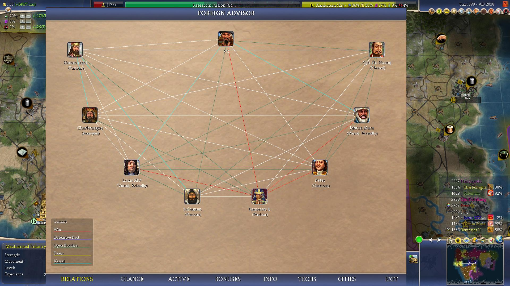
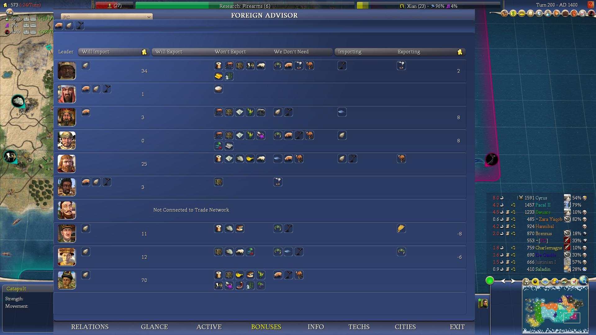
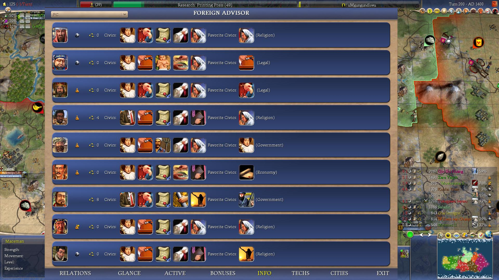
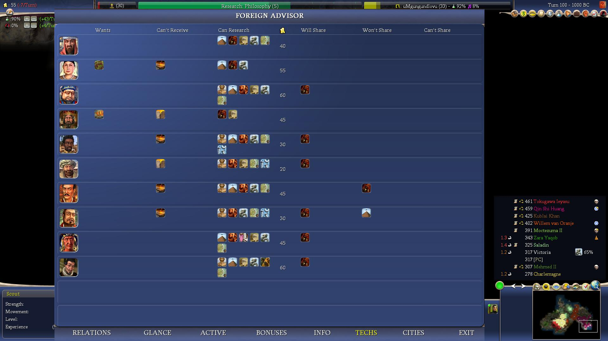
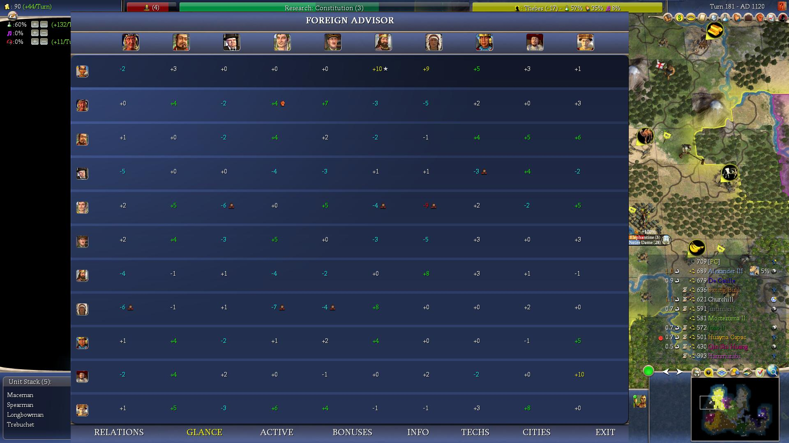
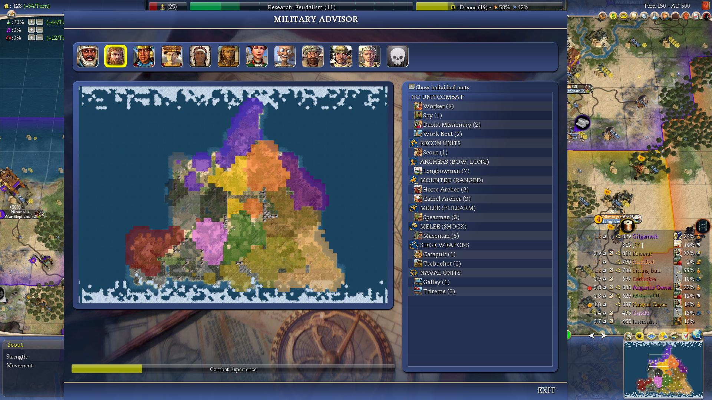
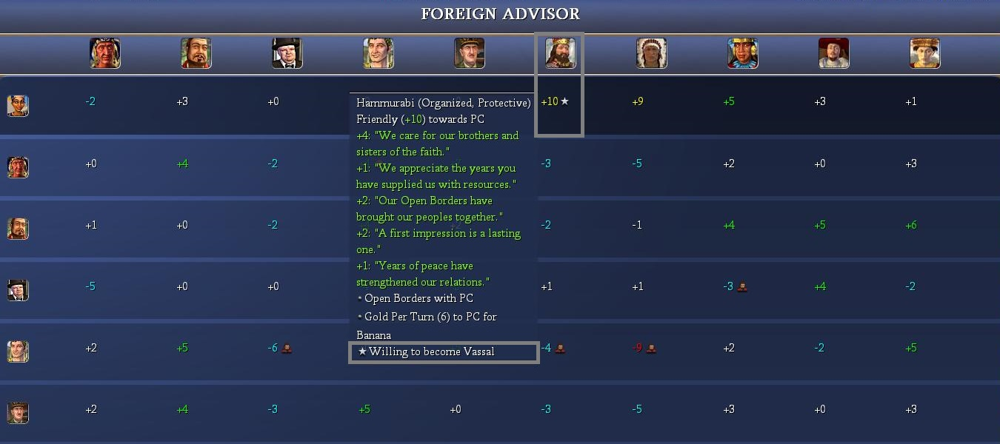

# AdvCiv-SAS (Simple Advanced Strategy)

This mod (AdvCiv-SAS (Simple Advanced Strategy)) ([Discussion thread here](https://forums.civfanatics.com/threads/advciv-sas-simple-advanced-strategy.699716/)) is based on [AdvCiv 1.12](https://github.com/f1rpo/AdvCiv/tree/1.12) as it is the [latest AdvCiv](https://forums.civfanatics.com/threads/advanced-civ.614217/) version as of now, and will/may update whenever there are new changes that are stable.

AdvCiv-SAS is now available at [CFC Modpacks downloads section](https://forums.civfanatics.com/resources/advciv-sas-simple-advanced-strategy.32513/) and at the [ModDB website](https://www.moddb.com/mods/advciv-sas-simple-advanced-strategy), not just on github anymore (read [below for download/install instructions](/README.md#how-to-play)).

The core changes brought by this mod are as of now an AI overhaul to make it much more efficient with its workers and settlers and most gameplay areas with a focus on opportunism and avoiding self-sabotaging/suicidal AI play. Heavy reworks were made, while otherwise staying for most in the base Advciv 1.12 frame, but with a focus on historical accuracy, game balance, and as for UI sevopedia, some advisors screens, and the city screen reworks in particular, transitioning to a modern upscaled and beautified 16:9 display, reducing the need for players to scroll, and with new information displayed as well.

Content overall addition is minimal, as of now mostly in the future era, and here and there otherwise (like the new camel bonus, or the new playable civ Kingdom of Benin); else it is mostly done via this heavy reworking of the game rather with the aforementioned goals (accuracy, balance, AI strength, etc).

All in all, this simplifies gameplay to some extent, but greatly increases depth and should make the game much more challenging while not being too much of a grind (i.e. we don't want to increase penalties at higher difficulties, but instead aim to avoid/reduce them while trying to make the game harder (and ideally harder than base AdvCiv 1.12 at all difficulties) through improved AI competency rather anyways etc). There are a lot more changes, and details about these as well below explained in the following sections.

As for the future, i have some more content prepared for the future era (no pun but anyways etc.), but not sure i would release them as quite tedious and long to do so, but if i do, although it is not guaranteed i would do it, then i would do it here.

## Menu

[Tech Tree](/README.md#tech-tree)  
[Military Tree and changes](/README.md#military-tree-and-changes)  
[Ingame gameplay samples](/README.md#ingame-gameplay-samples)  
[Docs](/README.md#docs)  
[How to play?](/README.md#how-to-play)  
[Full exhaustive very long and exhaustive changes](/README.md#full-exhaustive-very-long-and-exhaustive-changes)  
[Main Changes Guide](/README.md#main-changes-guide)  
[Custom Main Changes Guide](/README.md#custom-main-changes-guide)  
[UI (Ingame)](/README.md#ui-ingame)  
&emsp;[Main Advisors reworks](/README.md#main-advisors-reworks)  
&emsp;["Willing to become a vassal" and vassal icons in foreign advisor's glance tab](/README.md#willing-to-become-a-vassal-and-vassal-icons-in-foreign-advisors-glance-tab)  
&emsp;[City Screen rework](/README.md#city-screen-rework)  
[UI (Main Sevopedia reworks)](/README.md#ui-main-sevopedia-reworks)  
&emsp;[Sevopedia reworks (AI Personality Panel and other sevopedia reworks)](/README.md#sevopedia-reworks-ai-personality-panel-and-other-sevopedia-reworks)  
&emsp;[Some lower level Sevopedia reworks (search bar, keyboard UP/DOWN navigation, etc.)](/README.md#some-lower-level-sevopedia-reworks-search-bar-keyboard-updown-navigation-etc)  
&emsp;[Some other sevopedia reworks](/README.md#some-other-sevopedia-reworks)  
[UI (Common)](/README.md#ui-common)  
&emsp;[Images as buttons](/README.md#images-as-buttons)  
&emsp;[Untradeable techs (bTrade) display information](/README.md#untradeable-techs-btrade-display-information)  
[Python Scripts and .csv tables](/README.md#python-scripts-and-csv-tables)  
&emsp;[.csv and .md view of the handicap (difficulties info in a table for all difficulties) info](/README.md#csv-and-md-view-of-the-handicap-difficulties-info-in-a-table-for-all-difficulties-info)  
&emsp;[.csv github view for the flatten_leaders_data_to_csv conversion script](/README.md#csv-github-view-for-the-flatten_leaders_data_to_csv-conversion-script)  
[AI-generated images](/README.md#ai-generated-images)  
[Less Generic unit names or/and combat types](/README.md#less-generic-unit-names-orand-combat-types)  
[Civs you can expect in this mod](/README.md#civs-you-can-expect-in-this-mod)  
&emsp;[World map with civs](/README.md#world-map-with-civs)  
&emsp;[Other map(s) i used for terrain modifiers for civ-specific units](/README.md#other-maps-i-used-for-terrain-modifiers-for-civ-specific-units)  
[Assets Rebalancing](/README.md#assets-rebalancing)  
[48 Civs DLL](/README.md#48-civs-dll)  
[Long Comments Archive](/README.md#long-comments-archive)  
[External file access in Civ4 ingame (on Windows)](/README.md#external-file-access-in-civ4-ingame-on-windows)  
[Known issues that may be fixed or not fixed in base AdvCiv or/and Civ4 anyways etc](/README.md#known-issues-that-may-be-fixed-or-not-fixed-in-base-advciv-orand-civ4-anyways-etc)  
["Temporary" crashes](/README.md#temporary-crashes)  
[Not supported in AdvCiv-SAS](/README.md#not-supported-in-advciv-sas)  
[Version number](/README.md#version-number)  
[Copyright and Disclaimer](/README.md#copyright-and-disclaimer)  
[Note about the audio in main menu](/README.md#note-about-the-audio-in-main-menu)  
[Some Useful tools while doing this](/README.md#some-useful-tools-while-doing-this)  
[License and reuse](/README.md#license-and-reuse)  
[Starting your mod](/README.md#starting-your-mod)  
[Credits](/README.md#credits)  
[Authors](/README.md#authors)  

## Tech Tree

Before going more in depth about/in the changes and how to play and/or such documentation or other topics, here is a view of the reworked tech tree in AdvCiv-SAS (currently unfinished) (click on the images to view them in full screen or/and bigger size)

</img>
</img>
</img>
</img>

For more details on how the tech tree was made, which historical timeline it follows, sources, more screenshots and such, upcoming changes if any more, or/and other information or not or etc, please visit [README_Tech_Tree.md](/_1_AdvCiv-SAS/Docs_And_Appendixes/README_Tech_Tree.md)

## Military Tree and changes

As of now the military tree is as such in AdvCiv-SAS (please view ingame or/and in XML for updated version if any changes have been made since then anyways etc)

</img>
</img>

See [README_More_Exhaustive_Military_Tree.md](/_1_AdvCiv-SAS/Docs_And_Appendixes/README_More_Exhaustive_Military_Tree.md) for details

## Ingame gameplay samples

These are from autoplay or me playing them myself (for the 4986 rome AI screenshot as of now but anyways etc). AI is very strong, i wanted to showcase that as well as how AI generally behaves and the game looks/feels ingame. Both of these maps were pangea at monarch difficulty if i'm not mistaken but anyways etc. Later screenshots are from version 5055 and around version 5200.

</img>
</img>
</img>

See also [the CFC AdvCiv-SAS Discussion Thread here](https://forums.civfanatics.com/threads/advciv-sas-simple-advanced-strategy.699716/) as well, or the google drive link (see [Docs section](/README.md#docs) for link below anyways etc) for more gameplay samples although some of these may be old/dated now but anyways etc.

## Docs

About the mod AdvCiv-SAS in general, i added quite a bit of documentation, pictures, and other elements about this AdvCiv-SAS mod in [/_1_AdvCiv-SAS/](/_1_AdvCiv-SAS/)

Additionally, some extra files can be found on this google drive: [full AdvCiv-SAS google drive folder link](https://drive.google.com/drive/folders/1thBnA_TzWq2psd8Tg8RaorwmPZzqgN9M?usp=sharing).

## How to play?

If you are a new player and/or want to play this mod and would like a few instructions on how to install it and play it, i have provided a few instructions in the [README_Quick_Install_Setup_Guide.md](/_1_AdvCiv-SAS/Docs_And_Appendixes/README_Quick_Install_Setup_Guide.md)

## Full exhaustive very long and exhaustive changes

If you want to see the full very exhaustive code changes between AdvCiv current latest stable, for example 1.12 here, and AdvCiv-SAS, it can be viewed for example in this [pull request compare](https://github.com/wonderingabout/AdvCiv-SAS/pull/13).

Be warned though it can be very lengthy, so read below if you want (some of the) main quick pointers rather.

As for the changelog between releases of AdvCiv-SAS, see the [github tags](https://github.com/wonderingabout/AdvCiv-SAS/tags) that for each release show the list of changes in git history format since the previous release.

## Main Changes Guide

I have written the main changes guide (from base AdvCiv 1.12 to AdvCiv-SAS latest) with the help of chatgpt and gemini (check if info is accurate); i sometimes edited it. It should contain same entries than in the "custom" version of the main changes guide that i wrote myself as base for this main changes guide. Hopefully fast enough to read and as of now much clearer than my longer one that was used as a base for it.

You can view it here anyways etc [README_Main_Changes_Guide.md](/_1_AdvCiv-SAS/Docs_And_Appendixes/README_Main_Changes_Guide.md).

## Custom Main Changes Guide

This is the original, extensive and verbose version of the main change from base AdvCiv 1.12 to AdvCiv-SAS. It should have the same entries as the Main Changes Guide, but be more verbose and less to the point. I'd recommend reading the above main changes guide rather, but if you want a more exhaustive or personal read of the changes i wrote, see: [README_Custom_Main_Changes_Guide.md](/_1_AdvCiv-SAS/Docs_And_Appendixes/README_Custom_Main_Changes_Guide.md) anyways etc.

## UI (Ingame)

### Main Advisors reworks

Also reworked, expanded and beautified some of the other Advisors' UI, as it for example was annoying to always scroll to see more players (e.g. 12+), while still preserving key relevant information for said advisors' display (e.g. for the foreign advisor screen: scoreboard, map, commerce sliders and values, etc.). For the technology advisor in particular, players can now tune as they prefer the tech tree's width. Visual comparison at [Customizable technology advisor width](/_1_AdvCiv-SAS/Docs_And_Appendixes/README_Tech_Tree.md#customizable-technology-advisor-width). Also helps not having to open/exit said advisor such as in the technology advisor, where the rival's research and rank position is as of now visible, allowing to better plan tech path without tedium or less of it but anyways etc.

Also refactored to make the display more dynamic so that if the advisor's screen dimensions are changed in their respective python file, the rest of the info follows instead of staying stuck at old position which would be weirdly displayed, or/and so it is easier to change an advisor's screen dimensions if desired later, plus doing some performance optimizations or such i found relevant.

Some examples below:

</img>
</img>
</img>
</img>
</img>
</img>
</img>
</img>
</img>
</img>
</img>
</img>
</img>
</img>
</img>

See for related and similar changes [UI (In-game)](/_1_AdvCiv-SAS/Docs_And_Appendixes/README_Main_Changes_Guide.md#ui-in-game).

### "Willing to become a vassal" and vassal icons in foreign advisor's glance tab

We added with the help of gemini 3 pro and claude sonnet 4.5 and my help too thanks but anyways etc., icons in the foreign advisor's glance tab, that show if a rival is willing to become our rival (as of now star icon) and if they are our vassal (as of now strength icon), which is very useful to avoid tediously checking these everytime in diplomacy or risking to have missed them in messages or such anyways etc. Also added a tooltip (on hover). See for details [KI#84](/_1_AdvCiv-SAS/Docs_And_Appendixes/README_Known_Issues_In_Base_AdvCiv_Civ4.md#84---added-missing-feature-rivals-of-the-activehuman-player-that-are-willing-to-become-the-activehuman-players-vassal-not-showing-an-icon-to-quickly-indicate-that-at-a-glance-in-the-foreign-advisors-glance-tab-no-pun-but-anyways-etc).

</img>
</img>
</img>

### City Screen rework

Added some missing info such as the great person "+n (ICON)" information in any relevant building's row, which is handy to have and that was tedious to check through hovering. Also removed the 3 gray bars ("Trade Routes", "Buildings", "Specialists") as they take a lot of room and are uneeded, and we don't have a "Bonuses" bar for example so no reason to have these as well either; this allows to now display much more information and reduces the need for scrolling anyways etc. Also beautified several other things, such as enlarging side panels to display more info and be prettier, making bonuses columns even in width, making some hardcoded values now dynamically adjust depending on the side width we set, etc. if any more anyways etc.

Additionally, also added a new specialists breakdown as of now on bottom-right. Also added an option to add one or several extra rows (tunable) in the production chooser bar. These all help reduce tedious hovering and provide useful info at a glance anyways etc.

</img>
</img>
</img>
</img>

## UI (Main Sevopedia reworks)

### Sevopedia reworks (AI Personality Panel and other sevopedia reworks)

One of the main and most significant sevopedia changes in AdvCiv-SAS is the new AI Personality panel new feature.

Not a strictly new feature per se as the xml fields and their values per leader already existed, but now displaying most of them at each sevopedia leader (and also the ranking of leaders for each of these displayed fields's values) is indeed new (as well as the new aggregated attributes such as contact probs, positive/negative memory affections/resentments being implemented and some optionally displayable or not shown for concision as table is full with a lot of data). It is computationally lightweight, as all the values are already provided in the mod before the game is launched, the game just displays this data.

As always, ChatGPT is a key co-author and main code contributor and with the help of other AIs (See [Authors](/README.md#authors) for details) thanks.

Here is below a sample of the example screenshots showing the AI Personality panel feature in sevopedialeader, as well as samples showing other sevopedia reworks that are part of AdvCiv-SAS.

</img>
</img>
</img>
</img>
</img>
</img>
</img>
</img>
</img>
</img>
</img>
</img>
</img>
</img>
</img>

For the full more extensive screenshot of main new sevopedia reworks, i highly highly recommend but anyways etc as you prefer or not or yes or etc or and other or and not anyways etc to look at and read the full [README_Sevopedia_Reworks.md](/_1_AdvCiv-SAS/Docs_And_Appendixes/README_Sevopedia_Reworks.md)

#### Extra notes specifically about the sevopedia leader's AI Personality Panel feature

note 1: its performance should be very very efficient and optimized, see for details [README_AI_Personality_Panel.md#notes-about-performance-optimization-of-the-ai-personality-panel-caching](/_1_AdvCiv-SAS/Docs_And_Appendixes/README_AI_Personality_Panel.md#notes-about-performance-optimization-of-the-ai-personality-panel-caching)

note 2: you can enable/disable the emoji display as you prefer (see [README_AI_Personality_Panel.md#how-to-enabledisable-emoji-buttons-in-sevopedia-leader](/_1_AdvCiv-SAS/Docs_And_Appendixes/README_AI_Personality_Panel.md#how-to-enabledisable-emoji-buttons-in-sevopedia-leader) for details) or display key names instead of abbreviated custom labels in the AI Personality Panel (see [README_AI_Personality_Panel.md#how-to-show-keys-or-suffixes-instead-of-abbreviated-custom-labels](/_1_AdvCiv-SAS/Docs_And_Appendixes/README_AI_Personality_Panel.md#how-to-show-keys-or-suffixes-instead-of-abbreviated-custom-labels) for details anyways etc).

note 3: if you want to mod and modify the xml civ4 leader info, then you need to either update the [SevoPediaLeaderCachePredumped.py](/Assets/Python/Contrib/Sevopedia/SevoPediaLeaderCachePredumped.py) file manually, or disable the option to use the predumped file (see toggle define as of now at [`GlobalDefines_advciv_sas.xml`](/Assets/XML/GlobalDefines_advciv_sas.xml)). This was done so players don't always recompute these values that do not change on their end, and rarely so even for modders, and should scale better (if i'm not mistaken) as there are more leaders or xml fields in a mod vs computing them once every time the civ4 game is launched. See for details: [README_AI_Personality_Panel.md](/_1_AdvCiv-SAS/Docs_And_Appendixes/README_AI_Personality_Panel.md)

### Some lower level Sevopedia reworks (search bar, keyboard UP/DOWN navigation, etc.)

#### Search Bar

With the help of claude opus 4.5 and chatgpt 5.2, we introduced a search bar in AdvCiv-SAS that is shared by several sevopedia pages. It allows to **search** for entries using the **keyboard**.

The code is in [SevoPediaMain.py](/Assets/Python/Contrib/Sevopedia/SevoPediaMain.py). See individual sevopedia screenshots to see its general appearence. As for how the search bar is used in AdvCiv-SAS, here are some example cases:

</img>
</img>
</img>

See for details: [example 0.1: added a search bar. Used in several sevopedia pages](/_1_AdvCiv-SAS/Docs_And_Appendixes/README_Sevopedia_Reworks.md#example-01-added-a-search-bar-used-in-several-sevopedia-pages).

#### Keyboard Navigation with the UP/DOWN arrows

Based on C2C mod's code thanks and with the help of claude opus 4.5 and chatgpt 5.2, we added support for keyboard navigation using the UP/DOWN arrows. See [example 0.2: added keyboard arrow (UP/DOWN) navigation support. Used in several sevopedia pages](/_1_AdvCiv-SAS/Docs_And_Appendixes/README_Sevopedia_Reworks.md#example-02-added-keyboard-arrow-updown-navigation-support-used-in-several-sevopedia-pages).

### Some other sevopedia reworks

#### Concepts (as of now in the "Outdated" sevopedia category)

These are not supported in advciv-sas, hence the "outdated" name (i.e. i am not making sure the info is in line with our mod's changes if i may say anyways etc), however i tried to include new entries to give more information about civ4 features i wanted to know / wished i knew about, or/and that we used for other purposes such as redirecting for buttons/images (see [README_Sevopedia_Reworks.md#example-35-improvements-category](/_1_AdvCiv-SAS/Docs_And_Appendixes/README_Sevopedia_Reworks.md#example-35-improvements-category) for a few examples detailed there anyways etc), or that i found informative or/and wanted to add anyways etc. These new entries generally come from [https://civilization.fandom.com/wiki/](https://civilization.fandom.com/wiki/) or some similar place(s).

Added new concepts, as of now:

- concept_customization
- concept_fresh_water (with a link to it added in concept_irrigation (even though lost translation xd now (i removed it (i.e. now only has english translation for all languages anyways etc) i mean but anyways etc) if i may say but anyways etc))
- concept_global_warming
- concept_rivers
- concept_route_road
- concept_route_railroad
- concept_scoring_system

</img>
</img>

#### Mods Info

The sevopedia "Mods Info" (reusing the old civ4 concepts category or similar if i am not mistaken anyways etc, thanks to [@f1rpo](https://github.com/f1rpo)'s help too anyways etc) category adds info about mods and such, including but not only AdvCiv-SAS.

As of now this mostly contains other mods than advciv-sas-related changes (non-exhaustive list of changes but quite informative a bit still i hope anyways etc), as well as some few other information or rather as of now links to information sources. For the changes between mod and quick mod history info/context related(ing? Anyways etc) in particular, see [README_Mods_History_And_Changes.md](/_1_AdvCiv-SAS/Docs_And_Appendixes/README_Mods_History_And_Changes.md) for details. Exhaustive or not example screenshots below as well anyways etc:

</img>
</img>

## UI (Common)

### Images as buttons

Not mentionned previously at the UI section, but we use in AdvCiv-SAS an Images as buttons approach, typically to add emoji as buttons without having to tediously add them as textual icons, for example in sevopedia (such as of now in the AI Personality Panel's emojis, or in the Info Screen (F9 key ingame)'s Statistics tab's top chart (Time Played, Cities, etc.)).

Basically, what i did was downloading them (usually .png and usually from [emojiterra.com](http://emojiterra.com/)), then with Paint.NET resize to 64x64 and save as .dds.

```xml
	<!-- custom: ⏳ emoji similarly from emojiterra. -->
    <TEXT>
		<Tag>TXT_KEY_IMAGE_AS_BUTTON_HOURGLASS_NOT_DONE_PATH</Tag>
		<English>Art/AdvCiv_SAS/Images_As_Buttons/Hourglass_Not_Done/23f3_64px.dds</English>
	</TEXT>
```

With a dynamic implementation based on `localtext`, so that if path changes in the future or for centralization purposes or such, it makes it easier as such. For example (from [CvInfoScreen.py](/Assets/Python/Screens/CvInfoScreen.py)),adding emojis or other images or such as buttons:

```py
		# <!-- custom: added with the help of claude opus 4.5 thanks, moved up to not recompute every time if i'm not mistaken. -->
		self.szTimeIconStats = str(localText.getText("TXT_KEY_IMAGE_AS_BUTTON_HOURGLASS_NOT_DONE_PATH", ()))  # ⏳
		# <!-- custom: then later in the code... -->
		screen.setTableText(szTopChart, iCol, iRow, self.TEXT_TIME_PLAYED, self.szTimeIconStats, statsRowWidget, statsRowId1, statsRowId2, statsRowFont)
```

An alternative implementation (such as in [SevoPediaLeader.py](/Assets/Python/Contrib/Sevopedia/SevoPediaLeader.py)) allows to introduce them as plain text using `` tags. For example:

```py
		if IS_DISPLAY_AI_CATEGORY_HEADER_EMOJI_BUTTONS:
			button_path = localText.getText(emoji_name_to_button_path_txt_keys[emoji_name], ())
			button_size = 16
			line_button_txt = u"</img>" % (button_path, str(button_size))
			ai_category_header_line_with_button = u"%s <font=3b>%s</font>" % (line_button_txt, ai_category_header)
```

Sometimes you need to wrap them in a string, sometimes the timing of whenever you wrap them to string can produce weird results it seems if i'm not mistaken. If in doubt, consider hardcoding the path as a string directly. However, here is another working implementation that successfully uses localText to fetch button paths as textual icons:

```py
		# <!-- custom: rank buttons for demographics tab, added with claude opus 4.5's help thanks. -->
		szRank1IconPath = str(localText.getText("TXT_KEY_IMAGE_AS_BUTTON_TROPHY_BUTTON_PATH", ()))  # 🏆
		szRank2IconPath = str(localText.getText("TXT_KEY_IMAGE_AS_BUTTON_2ND_PLACE_MEDAL_PATH", ()))  # 🥈
		szRank3IconPath = str(localText.getText("TXT_KEY_IMAGE_AS_BUTTON_3RD_PLACE_MEDAL_PATH", ()))  # 🥉
		
		# <!-- custom: precompute full image tag strings for efficiency, added with claude opus 4.5's help thanks. -->
		self.szRank1ImgTag = u"</img>" % (szRank1IconPath, self.iRankIconSize)
		self.szRank2ImgTag = u"</img>" % (szRank2IconPath, self.iRankIconSize)
		self.szRank3ImgTag = u"</img>" % (szRank3IconPath, self.iRankIconSize)

			# <!-- custom: then later in the code... -->
			if iRank > 0:
				if iRank == 1:
					szPlayerName = u"%s %s" % (szPlayerName, self.szRank1ImgTag)
				elif iRank == 2:
					szPlayerName = u"%s %s" % (szPlayerName, self.szRank2ImgTag)
				elif iRank == 3:
					szPlayerName = u"%s %s" % (szPlayerName, self.szRank3ImgTag)
				else:
					szPlayerName = u"%s (%d)" % (szPlayerName, iRank)
```

Note that this can be generalized to any button, not just our AdvCiv-SAS new buttons, so for example leader buttons can be added in the info screen's tab as textual icons (see screenshots in the UI reworks section for examples). Example of code:

```py
		# <!-- custom: add leader button before name using img tag, added with claude opus 4.5's help thanks. -->
		self.iGraphLeaderIconSize = 16

			# <!-- custom: then later in the code... -->
			str = u"<color=%d,%d,%d,%d>%s</color>" %(textColorR,textColorG,textColorB,textColorA,name)

			# <!-- custom: add leader button before name using img tag, added with claude opus 4.5's help thanks. -->
			szLeaderButton = gc.getLeaderHeadInfo(gc.getPlayer(p).getLeaderType()).getButton()
			szLeaderImg = u"</img>" % (szLeaderButton, self.iGraphLeaderIconSize)
			szNameWithLeader = u"<font=2>%s %s</font>" % (szLeaderImg, str)

#BUG: Change Graphs - start
			if AdvisorOpt.isGraphs():
				screen.setText(self.sPlayerTextWidget[p], "", szNameWithLeader, CvUtil.FONT_LEFT_JUSTIFY, self.X_LEGEND + self.X_LEGEND_TEXT, yText, 0, FontTypes.TITLE_FONT, WidgetTypes.WIDGET_GENERAL, -1, -1)
			else:
				screen.setLabel(self.sPlayerTextWidget[p], "", szNameWithLeader, CvUtil.FONT_LEFT_JUSTIFY, self.X_LEGEND + self.X_LEGEND_TEXT, yText, 0, FontTypes.TITLE_FONT, WidgetTypes.WIDGET_GENERAL, -1, -1)
#BUG: Change Graphs - end
```

The relevant files can be found in:

- XML: as of now in [/Assets/XML/Text/AdvCiv-SAS_IconsAsButtons.xml](/Assets/XML/Text/AdvCiv-SAS_IconsAsButtons.xml) and in [/Assets/XML/Text/AdvCiv-SAS_Button_Paths_Hardcoded.xml](/Assets/XML/Text/AdvCiv-SAS_Button_Paths_Hardcoded.xml)
- `.dds`: as of now in [/Assets/Art/AdvCiv_SAS/Images_As_Buttons/](/Assets/Art/AdvCiv_SAS/Images_As_Buttons/)

### Untradeable techs (bTrade) display information

For example we added the new this technology "Cannot be traded" and "Can be researched multiple times" info (displayed if still enabled in our mod after this screenshot was made, but the option is there to accomodate any XML that has this option enabled for a tech as in the screenshot) in sevopedia tech and in the tech advisor as show below:

</img>
</img>

See also for details:

- [README_Main_Changes_Guide.md#technologies-non-exhaustive](/_1_AdvCiv-SAS/Docs_And_Appendixes/README_Main_Changes_Guide.md#technologies-non-exhaustive)
- [README_Sevopedia_Reworks.md#example-10-techs-category](/_1_AdvCiv-SAS/Docs_And_Appendixes/README_Sevopedia_Reworks.md#example-10-techs-category)
- [Modding_Ressources: "Example of DLL modification of CvGameTextMgr.cpp and other related file(s) to add the new "This technology cannot be traded"](/_1_AdvCiv-SAS/Docs_And_Appendixes/Modding_Ressources/README.md#example-of-dll-modification-of-cvgametextmgrcpp-and-other-related-files-to-add-the-new-this-technology-cannot-be-traded-flag-in-sevopedia-tech-s-placespecial-and-in-tech-tree-view-technology-advisor-anyways-etc) for details anyways etc

## Python Scripts and .csv tables

Mostly for modders, and it is not required to modify or use these scripts at all in order just to play. I wrote them with the help of chatgpt greatly, added some python scripts to enhance our display in sevopedia, track duplicates, possibly other scripts in the future but maybe not, etc.

Please read this [README_python_scripts.md](/_1_AdvCiv-SAS/Docs_And_Appendixes/README_Python_Scripts.md) for details.

So far there is:

- [flatten_handicap_info_to_csv_and_md](/flatten_handicap_info_to_csv_and_md.py)
- [generate_leaders_data.py and leaders_data data py module](/_1_AdvCiv-SAS/Docs_And_Appendixes/README_Python_Scripts.md#generate_leaders_datapy-script-and-leaders_datapy-module)
- [flatten_leaders_data_to_csv](/flatten_leaders_data_to_csv.py)
- [global XML duplication scanner](/_1_AdvCiv-SAS/Docs_And_Appendixes/README_Python_Scripts.md#scan_xml_duplicates-py-script-and-logs_xml_scans)

### .csv and .md view of the handicap (difficulties info in a table for all difficulties) info

Generated with the flatten_handicap_info_to_csv_and_md.py script, you can regenerate it if you mod/change the handicap info, else just view it here: [(click here to view it on on github web viewer too (recommended))](/handicap_info_to_csv_advciv-sas.csv) (the corresponding legend (.md) is here [handicap_info_to_csv_legend_advciv-sas.md](/handicap_info_to_csv_legend_advciv-sas.md))

You can for example for example use github's search bar for example anyways or and other features or and not anyways etc, or alternatively view it for example with libreoffice for example or a similar software/solution.

Note: base advciv handicap info .csv table with its .md legend for comparison as of now are also in our mod path in [/_0_Common_Docs/AdvCiv_Base_Doc/](/_0_Common_Docs/AdvCiv_Base_Doc/).

If you change the xml, regenerate new .csv file with the script, see also and for more details [README_Python_Scripts.md#flatten_handicap_info_to_csv_and_mdpy](/_1_AdvCiv-SAS/Docs_And_Appendixes/README_Python_Scripts.md#flatten_handicap_info_to_csv_and_mdpy).

</img>
</img>
</img>

### .csv github view for the flatten_leaders_data_to_csv conversion script

Similarly, the flatten_leaders_data_to_csv script output can be viewed here: [(click here to view it on on github web viewer too (recommended))](/leaders_data_to_csv_advciv-sas.csv) (corresponding legend (.md): [leaders_data_to_csv_legend_advciv-sas.md](/leaders_data_to_csv_legend_advciv-sas.md)).

</img>
</img>
</img>

Documentation about this flatten leaders_data to .csv py script ['s documentation](/_1_AdvCiv-SAS/Docs_And_Appendixes/README_Python_Scripts.md#flatten_leaders_data_to_csvpy).

## AI-generated images

While developping the AdvCiv-SAS mod, i have learned (despite having tried in the past a few times with Midjourney but not related to this anyways etc.) to and successfully generated some AI-generated images, first with tools like ChatGPT for buttons or/and such, and then for our main menu background images with other tools, in particular with the help of PixelCut AI that was very nice.

I edited some of these with Paint.NET to add in some of them the blue "ribbon" (margins whatever they are called). Here are, below, some examples of ai-generated images in our mod, for more details see: [Docs_And_Appendixes/README_AI_Generated_Images.md](/_1_AdvCiv-SAS/Docs_And_Appendixes/README_AI_Generated_Images.md)

Note: these are low size images, see link mentionned above for the google drive link to view them in high quality (full/original resolution) anyways etc.

Also Nano banana pro (see [/README.md#nano-banana-pro](/README.md#nano-banana-pro)) helped me amazingly and very easily fix the a tech's image and recolor the border as blue with just this simple prompt:

> "please remove the extra part of a camel in this civ4 button image and make the outside "cadre" color dark blue not white"

It also helped me generate a very nice building_russian_gord corresponding button and other images as well if any. The images are so good i'm losing my mind (in a good way i mean if i may say but anyways etc.) thanks a lot!!!

</img>
</img>
</img>

## Less Generic unit names or/and combat types

See the [README_Less_Generic_Unit_Names.md](/_1_AdvCiv-SAS/Docs_And_Appendixes/README_Less_Generic_Unit_Names.md) for details.

## Civs you can expect in this mod

### World map with civs

The civs you can expect in this mod come from these parts of the world (circled numbers are the added new civ's real world location):


### Other map(s) i used for terrain modifiers for civ-specific units

Among other maps or information i found online, i mostly also used the map below as well in order to determine which civs should get which terrain/feature modifiers in advciv-sas:


Note: sometimes i slightly deviated from strict terrain world map real layout, as of now only in europe and eastern asia due to them being only forestic with no obvious terrain in the world maps i saw but anyways etc, but they is cold, so symbolize it as having if relevant enough a bit of tundra in civ4 terms but anyways etc (see for example this [Köppen climate classification map on wikipedia](https://en.wikipedia.org/wiki/K%C3%B6ppen_climate_classification) for details or maybe rather info or such hopefully helpful if i may say but anyways etc.)

Note 2: as of now i'm using plains as a representative of savanna more or less anyways etc.

## Assets Rebalancing

Heavy historical corrections and gameplay balance have been made, such as as of now removing the Expansive Trait, Changing Gandhi's favorite civics, or Frederick's favorite religion.

The changes before/after with rationale tables are synthethized in .md tables in [README_Assets_Rebalancing.md](/_1_AdvCiv-SAS/Docs_And_Appendixes/README_Assets_Rebalancing.md).

## 48 Civs DLL

A 48 Civs DLL is also available and provided in this mod. (As of now named "CvGameCoreDLL_48_civs_dll.dll").

To use it, rename old base 18 MAX_CIV_PLAYERS DLL file named "CvGameCoreDLL.dll" to any name you like as long as it's another name, for example to "CvGameCoreDLL_18_civs_dll.dll", and rename the "CvGameCoreDLL_48_civs_dll.dll" to ""CvGameCoreDLL.dll" (vice versa to revert to old 18 players DLL).

I have run a test run for fun and to test it too, as well as documented this DLL i tried for the first time xd, and to answer [this](https://forums.civfanatics.com/threads/advciv-sas-simple-advanced-strategy.699716/post-16863316) CFC forum request but anyways etc.

See [google drive link here](https://drive.google.com/drive/folders/1wTLu7SdP3aeKOWPjtP_ORcDT2Bpdef3b?usp=sharing) for files and screenshots of this run

 All in all, prefer using the default DLL unless you want to use 19+ max players, then after game is finished if you want to use 18 max players or less, consider reverting to old DLL for your next map anyways etc.

Note: it seems that savegames are not compatible when switching from 18 civ DLL to 48 civ DLL (or vice versa i assume anyways etc) though based on the [related code comments in CvEnums.h](https://github.com/wonderingabout/AdvCiv-SAS/blob/2a453a1f3f0a8eb4ca9be538ec9553c12d49cc1c/CvGameCoreDLL/CvEnums.h#L24-L27), so make sure you finish the games you started using the same DLL, and switch back or forth whichever xd only after you want to play a new game (i.e. don't switch DLLs then reload same save file/map if i am not mistaken based on this code comment but i don't know and am only reporting what the base advciv code comment says, check if in doubt some other source, anyways etc).

Note 2: in the [development version](/_1_AdvCiv-SAS/Docs_And_Appendixes/README_Quick_Install_Setup_Guide.md#development-version), i don't update the 48 civs DLL as often after each change i make, because it is bit more tedious to do it and test the DLL to make sure it runs well or well enough (no compile error or crash or weird stuff or error at a quick glance), so i you want latest features in the development version, consider using the default (i.e. not 48 civs DLL) DLL anyways etc.

## Long Comments Archive

Context: after AI performed measurably better following a DLL refactor, the only other change was moving a very heavy XML comment (UnitAI XML info, not C++), which made it a suspect for the improvement and prompted us to archive long comments out of game files (AdvCiv-SAS 5240; see [update notes](https://forums.civfanatics.com/resources/advciv-sas-simple-advanced-strategy.32513/update/37055/) and the CFC download/update page for [that version](https://forums.civfanatics.com/resources/advciv-sas-simple-advanced-strategy.32513/update/37055/)). To keep files readable, we consolidated long comments into [Long_Comments/](/Long_Comments/). See details in [commit 940d04c](/commit/940d04ce76fddb1671b22608f66a41cfe6233ddb) and [PR #17](/pull/17).
Note: we try to balance comment cleanup with keeping concise technical explanations in code when they help maintainers.

## External file access in Civ4 ingame (on Windows)

With the help of chatgpt 5.2, while trying to debug why the "BUG Mod Help" button in the BUG Menu ingame caused a path error in AdvCiv-SAS but not in base AdvCiv, even though path was the same, i have discovered it is possible to access external files ingame in Civ4 (e.g. [BUG Mod Help-ENG.chm](/_0_Common_Docs/BUG_Doc/BUG%20Mod%20Help-ENG.chm)), and it works successfully.

The path is something like this for example in [BugPath.py](/Assets/Python/BUG/BugPath.py), if i'm not mistaken, for `C:\Program Files (x86)\Steam\steamapps\common\Sid Meier's Civilization IV Beyond the Sword\Beyond the Sword\Mods\AdvCiv-SAS\_0_Common_Docs\BUG_Doc\BUG Mod Help-ENG.chm`

```py
os.path.join(cwd, "Mods", "AdvCiv-SAS", "_0_Common_Docs", "BUG_Doc", name)
```

This possibly theoretically could be used to open other external files in Civ4 maybe (check if accurate, as i don't know too much about these). See also [KI#87](/_1_AdvCiv-SAS/Docs_And_Appendixes/README_Known_Issues_In_Base_AdvCiv_Civ4.md#87---fixed-and-generalized-cannot-open-bug-mod-help-engchm-on-windows-in-advciv-sas-but-can-open-it-on-windows-in-base-advciv-even-though-path-is-the-same)

## Known issues that may be fixed or not fixed in base AdvCiv or/and Civ4 anyways etc

See the [README_Known_Issues_In_Base_AdvCiv_Civ4.md](/_1_AdvCiv-SAS/Docs_And_Appendixes/README_Known_Issues_In_Base_AdvCiv_Civ4.md) for details.

Note: this also includes fixes/fixed issues as well for those of these we solved anyways etc.

Note 2: some issues are not listed in this known_issues_in_base_advciv, for such please see also the [README_Custom_Main_Changes_Guide.md](/_1_AdvCiv-SAS/Docs_And_Appendixes/README_Custom_Main_Changes_Guide.md) for details or/and additional info. If not there, there may be some extra info in [Modding_Ressources/README.md](/_1_AdvCiv-SAS/Docs_And_Appendixes/Modding_Ressources/README.md) as well although it should be more technical and with some caveats there but anyways etc.

Note 3: some features added such fields that were previously missing in sevopedia are technically also considered fixes i would say and sometimes mentionned in the documentation as such, for example in [README_Sevopedia_Reworks.md](/_1_AdvCiv-SAS/Docs_And_Appendixes/README_Sevopedia_Reworks.md) or other documentation about "Cannot be traded" fields that are now also in tech advisor, or these other related docs for fields we added in the DLL such as the missing BBAI getters (victory weights) in the DLL (to access them in sevopedia leader py file anyways etc), or getCityRefuseAttitudeThreshold newly added in advciv if i am not mistaken but not exposed in python if i am not mistaken in my understanding or/and knowledge too but anyways etc.

## "Temporary" crashes

Sometimes, rarely, the game crashes, generally mid-late game.

Sometimes, these crashes are reproducible and indicate real bugs to ideally fix, but some other times just exiting the game and reloading a recent save file "fixes" it, as i noticed happening after i added some performance optimizations that should not have strictly not changed the game at all if i'm not mistaken, yet had a crash at turn 296 that didn't happen autoplaying with old DLL from save file turn 200 to turn 300.

However, reloading this save file with my new DLL that supposedly had caused the crash since it was the only change vs old DLL that didn't, now we had no crash autoplaying successfully from turn 200 to 300. Yet, we still had however before that this crash when it was still a new game (turn 0) that we had autoplayed all the way to turn 200, saved, and then continued to go to turn 300 until it had crashed. So most likely exiting the game and reloading the game from save file turn 200 this time "fixed" the crash.

Then, continuing on, trying to autoplay to turn 400, we got a crash again at turn 356. However, exiting the game, reloading save file 300 generated by our new DLL that supposdely had caused the crash, and trying again to autoplay to turn 400 (this time not from turn 200, save at 300 then try to go to 400, but directly from exited game load same save file 300 and try to go to 400 anyways etc) this time no crash!! We could autoplay safely and successfully to turn 400!! So again a temporary crash it seems! If i'm not mistaken i mean but anyways etc.

According to chatgpt 5, these may not have been MAF and the .dmp file (see for details [/Modding_Ressources/README.md#How to enable .dmp files so for some crashes that don't immediately exit you get a "splash screen" (whatever it is called) and can dmp and see turn at crash anyways etc](/_1_AdvCiv-SAS/Docs_And_Appendixes/Modding_Ressources/README.md#how-to-enable-dmp-files-so-for-some-crashes-that-dont-immediately-exit-you-get-a-splash-screen-whatever-it-is-called-and-can-dmp-and-see-turn-at-crash-anyways-etc)) says/means anyways etc that "Exception code: 0xC0000005 → Access Violation (read/write through a bad pointer)", but if you experience crashes, especially mid-late game, consider exiting and reloading the game to see if it helps.

If not, it might be a bug to fix or something. I don't know too much about these, but i fixed a few such reproducible bugs through (painfully xd but successfully seemingly did but anyways etc) trial and error.

Our game should be as of now mostly if not really stable, i very rarely encounter crashes, and if they do it's generally very late in the game. Now i know if i'm not mistaken that some of these could simply be "temporary" crashes and not real bugs per se to fix i'd say if i'm not mistaken, but as i don't know too much about these check if accurate, and i don't guarantee no crash at all to happen, just from experience if i may say but anyways etc it seems really rare now to the point i'd consider the game stable, as for the few that had said crashes i didn't test if they are temporary or not now but they might/may be but anyways etc.

## Not supported in AdvCiv-SAS

- non-English translations: too tedious to translate them all, plus i'm fine with English being the only language in the game, hopefully fine or not too bad this way but anyways etc...
- CustomDomAdv, which according to the txt inside it seems to relate to "only settings for the mod components Advanced Unit Naming and Customizable Domestic Advisor (both disabled by default through the BUG menu)" (see [/Settings/About%20this%20folder.txt](/Settings/About%20this%20folder.txt)). Since i don't use it, and is similarly like the translations a bit if not lot tedious or/and complicated anyways etc to maintain furthermore anyways etc, then i am anyways etc not supporting it in AdvCiv-SAS, see also [/Settings/About%20this%20folder%20(AdvCiv-SAS).txt](/Settings/About%20this%20folder%20(AdvCiv-SAS).txt) for details if any more are in this file anyways etc. See this [google drive folder link](https://drive.google.com/drive/folders/1cINn930Hma2cEN6g_v2obiAQh9pMlnrQ?usp=sharing) for example of what this does according to chatgpt if i am not mistaken anyways etc.
- concepts being updated in their content: see [README.md#concepts-as-of-now-in-the-outdated-sevopedia-category](/README.md#concepts-as-of-now-in-the-outdated-sevopedia-category) for details anyways etc.
- savegame compatibility. Anytime an asset is added or removed in the game (e.g. adding a tech, removing a unit or building or other anyways etc), it should be expected that previous savegames are NOT compatible. Same with any DLL recompile. They may luckily or sometimes somehow work, but as a rule expect that generally they don't, and i will not support old save files, if you want to continue playing on them, use the previous version (see [/README.md#version-number](/README.md#version-number) for info about how we choose version number in advciv-sas anyways etc) of this mod you were using. E.g. if AdvCiv-SAS version 4946 worked, and then version 4947 broke comptibility in one way or an other, play it with this version instead. I have decided to do so as it's beyond way too tedious and i'm really not sure it's worth preserving compatibility considering the code mess it creates xd. Also i don't know how so i'd rather not, but hopefully keep playing on the old version (same version that you used to create this save file) should be fine or not too bad if i may say but anyways etc. Note: XML changes such as increasing the cost of this unit or changing the bonus needed in the xml for this building or such should generally if not always be fine, at least seems so to me, but i don't know too much about these, check if accurate, anyways etc. See related info at [KI#46](/_1_AdvCiv-SAS/Docs_And_Appendixes/README_Known_Issues_In_Base_AdvCiv_Civ4.md#46---cleaned-up-very-big-messy-old-uiflag-code-in-the-dll-seemingly-to-support-savegame-compatibility-which-i-dont-care-about-especially-considering-how-complicated-the-code-is-as-a-result) as well anyways etc.

## Version number

I use the default github branch's commit count as version number.

For example, in our mod's github default branch's main page [our mod's github default branch's main page](https://github.com/wonderingabout/AdvCiv-SAS), as of now there are 5187 commits, so this is AdvCiv-SAS 5187.

Using git you can choose any version with git reset --hard or checkout or whatever. On github, you can also download a zip of any commit/version if i'm not mistaken as well anyways etc; but i understand it may not be too easy or may be tedious to do so. Although i may release some versions myself (see [README_Quick_Install_Setup_Guide.md#download-this-mod-advciv-sas](/_1_AdvCiv-SAS/Docs_And_Appendixes/README_Quick_Install_Setup_Guide.md#download-this-mod-advciv-sas)), it is not guaranteed i would do it too often, and especially not at each commit. I hope it is not too hard to do so.

## Copyright and Disclaimer

The bit annoying/painful section, but in short this is a fan project that i hope is enjoyable, however to cover myself xd and to be exhaustive too, here is a (more but anyways etc) proper copyright section/warning written by chatgpt thanks to my prompt / at my request too anyways etc that i adjusted or not for formatting or/and small corrections or modifications but anyways etc:

>This mod for Sid Meier’s Civilization IV: Beyond the Sword is a fan-made, non-commercial project created for entertainment and educational purposes only.
>All original content, code, and designs created specifically for this mod are released as part of the mod under applicable open or fair-use terms, unless otherwise noted.
>
>Civilization IV, its assets, source code, and all related trademarks are the property of Firaxis Games and 2K Games. This mod is not affiliated with, endorsed by, or supported by Firaxis or 2K.
>
>This mod may include assets (e.g., music, images, or code) created by third parties. These are provided in good faith and for non-commercial, educational, or artistic purposes within the spirit of modding culture.
>
>We make no guarantees about functionality, compatibility, or fitness for any particular purpose. The authors of this mod are not liable for any damage, data loss, or issues arising from its use.
>
>This mod may contain or build upon assets that are either:
>
>Licensed under open/modding-friendly terms (GPL, Creative Commons, permissive mod licenses, etc.)
>
>Included under fair use or community modding conventions
>
>Used without explicit license only for non-commercial artistic demonstration (see below)
>
>If you are the creator or rights holder of any included material and would like attribution, correction, or removal, please contact us.
>
>Included External Assets (should be copyright-safe (see below for detail/explanation/analysis of why +/- with chatgpt's help too, but check to be sure in case i overlooked or was mistaken in one way or another if i may say but anyways etc)):

- `LEADER_ALEXANDER`: The Companions (Ancient Macedon Battle Music - Alexander the Great) (Composed by Tyler Cunningham) ([youtube link of it for example](https://www.youtube.com/watch?v=qw8OqQUkRB0)), seems safe to use according to a youtube comment by the author seemingly if i am not mistaken, thanks a lot
- `LEADER_BOUDICA`: Epic Celtic/Scottish  War Drums - The Highland Warriors © Copyright: Music composed by Paul Daniel (Pawl.D Beats) [youtube link of it for example](https://www.youtube.com/watch?v=kenexJF5sSc), seems safe too based on their website, it is up to me to notify them of such use according to website though (which i did), but should be mostly safe otherwise thankfully/hopefully, thanks
- `LEADER_CYRUS`: Persian Battle (Royalty Free Music) (Composed by Ivan Duch (if i am not mistaken, check to be sure, anyways etc)) ([youtube link from Ivan Duch's channel if i am not mistaken (check to be sure)](https://www.youtube.com/watch?v=KibCABcsAy0)), seems safe as is royalty-free or so it seems (i.e. if i am not mistaken too if i may say but anyways etc) but check to be sure, anyways etc
- `LEADER_EWUARE`: African Tribal Music (BackgroundMusicForVideos) - Music by [Maksym Malko](https://pixabay.com/users/backgroundmusicforvideos-46459014/?utm_source=link-attribution&utm_medium=referral&utm_campaign=music&utm_content=342635) from [Pixabay](https://pixabay.com/music//?utm_source=link-attribution&utm_medium=referral&utm_campaign=music&utm_content=342635), i personally also found it by searching it again in this case but anyways etc since not easy to find via main link of credit above but try it first too maybe as is official one i mean from their website of the credits if i am not mistaken but anyways etc, here if helps as well although is not the formal credit link in their website but hopefully helpful too if i am not mistaken else tell me to remove it but if fine here it is i mean but anyways etc in [pixabay's website - link where it can be found too but anyways etc](https://pixabay.com/music/world-african-tribal-music-342635/)
- `LEADER_GENGHIS_KHAN`: Original track [Tömörbaatar, the Iron Hero] by Kaiji [youtube link seemingly from creator too anyways etc](https://www.youtube.com/watch?v=6mErFCHsi1g), seems royalty-free too if i am not mistaken and according to chatgpt's answer to my prompt about it, thanks
- `LEADER_JULIUS_CAESAR`: Epic Roman Music – Battle March (~ Music by Derek Fiechter ~) [youtube link of it for example](https://www.youtube.com/watch?v=EW8fI6N6szs), should be safe if i'm not mistaken as well as it seems to come from same author than what we reviewed as of now for LEADER_BOUDICA too anyways etc, thanks,
- `LEADER_MEHMED`: Old Ottoman turkish Music - Şehnaz Longa - Composer Santuri Ethem Efendi *1855 (start at 0:03.000) [youtube link of it for example](https://www.youtube.com/watch?v=7MN4DN06xc8), seems copyright safe according to chatgpt as well (it said to be exhaustive or bit more but anyways etc "Composition: Definitely public domain (composer died over 140 years ago)." and then right after it anyways etc reformatted to fit in this sentence anyways etc "Recording: Likely non-commercial and personal uploads, with no rights enforcement to date. Unknown exact performer or recording date/release, so slight unknowns persist—but no red flags.")anyways etc
- `LEADER_NAPOLEON`: info i have as of now is anyways etc: Symphony No. 25 In G Minor K. 183 Mozart - Uploaded by Netfocus Universal on October 11, 2013 [downloaded from archive.org (as mp3 too anyways etc) thanks to chatgpt's recommendation and link anyways etc](https://archive.org/details/SymphonyNo.25InGMinorK.183?utm_source=chatgpt.com), seems safe to use as well as it comes frm archive.org as/according to what i understand from chatgpt's explanation as well on top of hwat i intutively already knew or guessed maybe rather but anyways etc, as for the recording, no clear mention of it either, but providing most if not all info about it to chatgpt, it seems to be safe, but not 100% sure but almost, check to be sure, better phrased or/and alternatively by chatgpt as such anyways etc: "This recording (Netfocus Universal, 2013) was uploaded to archive.org’s Folksoundomy collection, a large open-access archive of volunteer-submitted audio. No explicit license is stated, but source context suggests it is non-commercial and likely safe for educational use.", i am not 100% sure but almost so should be maybe safe (but i may be mistaken check to be sure anyways etc). Note: this music was recommended to me after asking chatgpt after/since i couldn't find any suitable or fitting music or had too many ideas xd, and we analyzed napoleon's psychology and life quick if i may say but anyways etc and after many painstaking suggestions here it is, i really like it i mean, it's really a cool music :) This one seems if i am not mistaken copyright safe (but check to be sure anyways etc) and sounds quite well if not very well but in all cases anyways etc
- `LEADER_RAMESSES`: Ancient Egyptian Music – Pharaoh Ramses II, composer seems to be Derek Fiechter's Music (start at 00:02.425) [youtube link directly from Derek Fiechter's Music's channel anyways etc](https://www.youtube.com/watch?v=vslsS-Uu5x4), should also be safe as reviewed before for LEADER_JULIUS_CAESAR's music at least as of now who seems to also come/be from/by the same artist Derek Fiechter i mean if i am not mistaken anyways etc
- `LEADER_STALIN`: Music: Soviet March by Shane Ivers - [https://www.silvermansound.com](https://www.silvermansound.com), seems safe to use and under creative commons license by 4.0 if i am not mistaken too, personally i found it here thanks to chatgpt who gave me this link, thanks [silvermansound.com link provided by chatgpt directly to this music anyways etc](https://www.silvermansound.com/free-music/soviet-march?utm_source=chatgpt.com)
- `LEADER_VICTORIA`: Victorian Violin Waltz - Music by [Luis Humanoide](https://pixabay.com/users/luis_humanoide-12661853/?utm_source=link-attribution&utm_medium=referral&utm_campaign=music&utm_content=222298) from [Pixabay](https://pixabay.com//?utm_source=link-attribution&utm_medium=referral&utm_campaign=music&utm_content=222298), i also re found it here similarly than for LEADER_EWUARE's music link but anyways etc in [pixabay's website - link where it can be found too but anyways etc](https://pixabay.com/music/classical-string-quartet-victorian-violin-waltz-222298/) seems safe as coming from pixabay as well if i am not mistaken but anyways etc and from asking chatgpt too to be sure seems safe indeed but maybe check too to be sure but should be safe but check to be sure in case i am mistaken but anyways etc
- `SONG_OPENING_MENU`: Lofi Song - Music by [DELOSound](https://pixabay.com/users/delosound-46524562/?utm_source=link-attribution&utm_medium=referral&utm_campaign=music&utm_content=330550) from [Pixabay](https://pixabay.com/music//?utm_source=link-attribution&utm_medium=referral&utm_campaign=music&utm_content=330550), i also re found it here similarly [pixabay's website - link where it can be found too but anyways etc](https://pixabay.com/music/beats-lofi-song-330550/) anyways etc. Note: for an easy ctrl+f since not mentionned in asset name if i'm not mistaken but anyways etc, the name from url is beats-lofi-song-330550, check to be sure anyways etc.
- `AS2D_FUTURE_EPIC_SYMPHONIC_METAL_263322`: Epic Symphonic Metal Instrumental - Music by [Nicholas Panek](https://pixabay.com/users/nickpanek620-38266323/?utm_source=link-attribution&utm_medium=referral&utm_campaign=music&utm_content=263322) from [Pixabay](https://pixabay.com/music//?utm_source=link-attribution&utm_medium=referral&utm_campaign=music&utm_content=263322), i also re found it here similarly anyways etc in [pixabay's website - link where it can be found too but anyways etc](https://pixabay.com/music/metal-epic-symphonic-metal-instrumental-263322/) seems safe for copyright use similarly as coming from pixabay if i am not mistaken anyways etc but check to be sure anyways etc
- `AS2D_FUTURE_FOOT_TAPPER_CLASSICAL`: Foot Tapper Classical Music Dubstep Fusion - by Nicholas Panek from [Soundcloud](https://soundcloud.com/nicholas-panek-961795493/foot-tapper-classical-music-dubstep-fusion), seems as of now similarly safe for copyright use but check to be sure anyways etc
- `AS2D_FUTURE_FUTURISTIC_ROBOT_COPS_234351`: Futuristic Robotic Cops in a Dystopian City - Music by [Nicholas Panek](https://pixabay.com/users/nickpanek620-38266323/?utm_source=link-attribution&utm_medium=referral&utm_campaign=music&utm_content=234351) from [Pixabay](https://pixabay.com/music//?utm_source=link-attribution&utm_medium=referral&utm_campaign=music&utm_content=234351), i also re found it here similarly anyways etc in [pixabay's website - link where it can be found too but anyways etc](https://pixabay.com/music/upbeat-futuristic-robotic-cops-in-a-dystopian-city-234351/) seems safe for copyright use similarly as coming from pixabay if i am not mistaken anyways etc but check to be sure anyways etc
- `AS2D_FUTURE_HEAVY_THRASH_METAL_377893`: Heavy Thrash Metal Instrumental - Irate - Music by [Nicholas Panek](https://pixabay.com/users/nickpanek620-38266323/?utm_source=link-attribution&utm_medium=referral&utm_campaign=music&utm_content=377893) from [Pixabay](https://pixabay.com/music//?utm_source=link-attribution&utm_medium=referral&utm_campaign=music&utm_content=377893), i also re found it here similarly anyways etc in [pixabay's website - link where it can be found too but anyways etc](https://pixabay.com/music/metal-heavy-thrash-metal-instrumental-irate-377893/) seems safe for copyright use similarly as coming from pixabay if i am not mistaken anyways etc but check to be sure anyways etc
- `AS2D_FUTURE_HOPE_AND_DESPAIR_212413`: Hope and Despair Piano Duet - Music by [Nicholas Panek](https://pixabay.com/users/nickpanek620-38266323/?utm_source=link-attribution&utm_medium=referral&utm_campaign=music&utm_content=212413) from [Pixabay](https://pixabay.com/music//?utm_source=link-attribution&utm_medium=referral&utm_campaign=music&utm_content=212413), i also re found it here similarly anyways etc in [pixabay's website - link where it can be found too but anyways etc](https://pixabay.com/music/modern-classical-hope-and-despair-piano-duet-212413/) seems safe for copyright use similarly as coming from pixabay if i am not mistaken anyways etc but check to be sure anyways etc
- `AS2D_FUTURE_INTENSE_BLACK_METAL_304729`: Intense Black Metal Instrumental - Music by [Nicholas Panek](https://pixabay.com/users/nickpanek620-38266323/?utm_source=link-attribution&utm_medium=referral&utm_campaign=music&utm_content=304729) from [Pixabay](https://pixabay.com/music//?utm_source=link-attribution&utm_medium=referral&utm_campaign=music&utm_content=304729), i also re found it here similarly anyways etc in [pixabay's website - link where it can be found too but anyways etc](https://pixabay.com/music/metal-intense-black-metal-instrumental-304729/) seems safe for copyright use similarly as coming from pixabay if i am not mistaken anyways etc but check to be sure anyways etc
- `AS2D_FUTURE_INTO_THE_DARKNESS_336411`: Into the Darkness | Symphonic Metal Instrumental - Music by [Nicholas Panek](https://pixabay.com/users/nickpanek620-38266323/?utm_source=link-attribution&utm_medium=referral&utm_campaign=music&utm_content=336411) from [Pixabay](https://pixabay.com/music//?utm_source=link-attribution&utm_medium=referral&utm_campaign=music&utm_content=336411), i also re found it here similarly anyways etc in [pixabay's website - link where it can be found too but anyways etc](https://pixabay.com/music/alternative-into-the-darkness-symphonic-metal-instrumental-336411/) seems safe for copyright use similarly as coming from pixabay if i am not mistaken anyways etc but check to be sure anyways etc
- `AS2D_FUTURE_LOFI_295209`: lofi - Music by [Vivid Illustrate](https://pixabay.com/users/vividillustrate-31929813/?utm_source=link-attribution&utm_medium=referral&utm_campaign=music&utm_content=295209) from [Pixabay](https://pixabay.com/music//?utm_source=link-attribution&utm_medium=referral&utm_campaign=music&utm_content=295209), i also re found it here similarly anyways etc in [pixabay's website - link where it can be found too but anyways etc](https://pixabay.com/music/beats-lofi-295209/) seems safe for copyright use similarly as coming from pixabay if i am not mistaken anyways etc but check to be sure anyways etc
- `AS2D_FUTURE_ON_THE_COSMIC`: Track: On The Cosmic Wave (Inspiring Synthwave Cosmic Background) - soundbay Link: [https://soundbaymusic.fanlink.tv/csmw](https://soundbaymusic.fanlink.tv/csmw) . Should also be safe based on the review of its youtube description if i may say but anyways etc if i am not mistaken but check to be sure anyways etc
- `AS2D_FUTURE_RELAXING_PIANO_LOFI_251401`: Relaxing Piano Lofi Instrumental - Music by [Nicholas Panek](https://pixabay.com/users/nickpanek620-38266323/?utm_source=link-attribution&utm_medium=referral&utm_campaign=music&utm_content=251401) from [Pixabay](https://pixabay.com//?utm_source=link-attribution&utm_medium=referral&utm_campaign=music&utm_content=251401), i also re found it here similarly anyways etc in [pixabay's website - link where it can be found too but anyways etc](https://pixabay.com/music/beats-relaxing-piano-lofi-instrumental-251401/) seems safe for copyright use similarly as coming from pixabay if i am not mistaken anyways etc but check to be sure anyways etc
- `AS2D_FUTURE_TACO_TRUCK_HEIST_377352`: Taco Truck Heist — Flamenco Meets Underground Hip Hop - Music by [Nicholas Panek](https://pixabay.com/users/nickpanek620-38266323/?utm_source=link-attribution&utm_medium=referral&utm_campaign=music&utm_content=377352) from [Pixabay](https://pixabay.com/music//?utm_source=link-attribution&utm_medium=referral&utm_campaign=music&utm_content=377352), i also re found it here similarly anyways etc in [pixabay's website - link where it can be found too but anyways etc](https://pixabay.com/music/beats-taco-truck-heist-flamenco-meets-underground-hip-hop-377352/) seems safe for copyright use similarly as coming from pixabay if i am not mistaken anyways etc but check to be sure anyways etc
- `ART_DEF_MOVIE_NATYA_SHASTRA`: The Natya Shastra wonder's movie, imported from c2c mod's Meenakshi.bik, i don't know if it's copyrighted but doesn't seem anything too drastic and is a quite short if i may say in this case but anyways etc video of 31 seconds approximately so maybe fine in all cases this the info i had when importing it to this advciv-sas mod so hopefully copyright-safe but check to be sure in case i am mistaken anyways etc

>Used for educational and entertainment purposes only.

Note: to know where media files (such as music or videos) might have come from or not, please visit modding_ressources in this git sections, not directly mentioning how due to copyright reasons, but providing examples of how i could have done so or may have not done so, after asking chatgpt this seems safer to state as so while trying to provide general information that may be helpful or not or yes but anyways etc, and i adjusted it bit too based on its feedback suggestion, hopefully helpful or not or yes or etc but anyways etc.

Note 2: about why i used so much music from Nicholas Panek (/ Nicholas John Panek too is the same if i am not mistaken? But check to be sure anyways etc): is because i like this artist's music so much, although of course not all if i may say but i found many nice ones in arious genres or/and such or whatever i simply enjoyed it if i may say but anyways etc.

For mods we took from, i mention them in more detail, hopefully exhaustive but i may have forgotten one or 2 or more or not if i didn't notice but anyways etc, in [README.md#credits](/README.md#credits)

## Note about the audio in main menu

Sound seems strangely louder at first game launch, but then accesing main menu again from a loaded save file or such ingame map state, then the sound in main menu is seemingly quieter so amking it a bit louder to accomodate that so it is not too low when acessing main menu again from ingame map view. Also, sounds seems blurrier (ironic since this is a lofi music as of now if i'm not msitaken but i still want it accurate xd, and assuming my perception of it being blurrier is also correct as well as this is not sure and maybe it sounds the same or the same enough regardless of xml volume then increasing system/computer volume per user action or not but anyways etc) the lower i put the music sound/volume, although it could be just my perception, or maybe not (?), i'd rather have a higher volume just in case. If you want to listen to the real audio, link is in this readme.md 's copyright section at `SONG_OPENING_MENU`, or alternatively also accessible in our mod locally as well, as of now here in the [main menu music folder](/Assets/Art/AdvCiv_SAS/Main_Menu/music/), hopefully helpful or not or yes or etc, anyways etc.

## Some Useful tools while doing this

Examples of using some or most of these tools in AdvCiv-SAS modding is also available in the [Modding_Ressources's](/_1_AdvCiv-SAS/Docs_And_Appendixes/Modding_Ressources/) folder['s Google Drive](https://drive.google.com/drive/folders/1WejRQuHTNXVsTHnAsYTAErS2m_oeaEwp) too with files, mostly if not only images.

Some useful tools while doing this advciv-sas mod i mean anyways etc:

- VS Code, some of my favourite extensions: markdownlint (which i encountered first during my gtp2ogs days and now happily rediscover but anyways etc) (a few example of use of markdownlint in this [google drive folder link](https://drive.google.com/drive/folders/1H0cq33EeLe_sbaxl-ryFM1vvxDl42pfk?usp=sharing) (non-exhaustive), very very useful thanks a lot anyways as other extensions i use and maybe not use too as well at least for some if not many but anyways etc), vscode-pdf, and ruff (which i use as a python linter if i am not mistaken anyways etc) so very nice and helpful but needs a bit of config to disable matching pylance extra noise of undefined variables like CyTranslator or such see examples of use and some very nice errors i found in python thanks to ruff and chatgpt which advised me and guided me through using it (no pun) but anyways etc anwyays etc... also seems very very fast/lightweight in performance cpu is no more angry at 100% or whichever hardware and fans nosiely spining even if not 100% from little or yes as of now or all or not anyways etc in this [google drive folder link](https://drive.google.com/drive/folders/19qLLdFNSuJXdoeS8-laSDQT81iigAG3q?usp=sharing) (see also [KI#21.6](/_1_AdvCiv-SAS/Docs_And_Appendixes/README_Known_Issues_In_Base_AdvCiv_Civ4.md#216---addressed-old-python-code-not-being-optimized-with-many-ruff-linter-that-we-added-vs-code-errors-that-dont-allow-to-read-the-files)); the ones i dislike don't recommend: microsoft c++ (system seems to spike and pylance in particular doesn't seem to detect many python errors)
- Windows 10 (Windows 11 was so laggy and broken after update, now going back to Windows 10
that i bombarded with updates and installs still works amazing so i recommend it)
- Google Chrome (i used) for the Page translate of kujira's website in particular (Firefox has
it too though unless i'm mistaken)
- Google Drive, here is for information as well [the link of the entire project's Google Drive (many extra files of many types)](https://drive.google.com/drive/folders/1thBnA_TzWq2psd8Tg8RaorwmPZzqgN9M?usp=sharing)
- [Google's scientific calculator](https://www.google.com/search?q=calculator) (for the x^y function in particular)
- Notepad++ (very reliable and multi tab, i don't use it to generally if not always or not or and other or and not but anyways etc code but to browse code files or/and other or/and not anyways etc)
- Q-Dir (very useful and reliable too when works well which is almost always if not always, and very minimalist yet powerful, i so ery love it but anyways etc ; for example you can use it (Q-Dir) [like this (Google Drive preview example here)](https://drive.google.com/drive/folders/1EO0AScGVXM9P0U_YGYbm7xfbVzPnxNvO?usp=sharing) (some fields (are) hidden for (my) privacy anyways etc)) thanks a lot!!! (too! (After writing the WizTree thanks but anwayys etc thanks too i mean too (hehe maybe or not or yes or other or/and not (but) anyways etc) anyways etc...)) Anyways etc...
- WizTree (very useful (and reliable and effective) to find the files i want when i want, for example (to) find all the "taois" entries(i.e. files)in the entire full civ4 folder (see [Google Drive preview examples here](https://drive.google.com/drive/folders/1JW3IBenpJxP4ZIVrTb99huR0-Js9HPrt?usp=sharing)), very useful, thanks a lot!!! Anyways etc)
- CopyAsPath that i may also call for example "copy as path" or and other name or and not anyways etc, a small menu extension i made myself hehe but only from copying intructions and importing an existing .reg file from another place (from [www.winhelponline.com](www.winhelponline.com) to be exhaustive and/or accurate hehe but anyways etc), in short i only compiled existing files and instructions hehe, anyways etc, read there for details also, and is also in, anyways etc, in [copy_as_path_context_menu (github repo link)](https://github.com/wonderingabout/copy_as_path_context_menu)
- VS Code (so useful for so many things and so very nice, very rarely (does) bug or something but mostly very great anyways etc, especially for the global search feature, very useful, (except partly) when it does not desynchronize folders before git commits, for example but not only also to do a global search about advciv id changes, see [Modding_Ressources/README.md#advciv-id-changes-manualtxt-results](/_1_AdvCiv-SAS/Docs_And_Appendixes/Modding_Ressources/README.md#advciv-id-changes-manualtxt-results) for details or maybe rather example and (my) explanation of it but anyways etc ; see also another example here anyways etc [Modding_Ressources/README.md#another-example-of-how-to-use-vs-code-global-search-also-shows-an-example-of-how-to-also-browse-the-civ4-bug-doc-copy-included-in-our-mod-anyways-etc](/_1_AdvCiv-SAS/Docs_And_Appendixes/Modding_Ressources/README.md#another-example-of-how-to-use-vs-code-global-search-also-shows-an-example-of-how-to-also-browse-the-civ4-bug_doc-copy-included-in-our-mod-anyways-etc) which also shows how to use the civ4 BUG_Doc of which we included a copy in our mod, very useful for quick vs code results anyways etc (see link for details anyways etc ; see also [__SevoPediaLeader-gc-inner-debug-content.txt](/Assets/Python/Contrib/Sevopedia/__SevoPediaLeader-gc-inner-debug-content.txt) for other cases where we may want a manual inspect/debug if i may say and am not mistaken in suggesting this way of doing it in case there is a more efficient one but it seems to work quite well and/or is easy enough but check to be sure if there is better informaiton in other mods or forums but this should maybe help too hopefully but anyways etc)
- Visual C++ 2010 Express, to compile the DLL i want/require it after some mod changes i made in .cpp or such files but anyways etc, todo write a tutorial (may or not do so not guaranteed ideally yes but may or not but anyways etc) but anyways etc (is free, just requires after trial a free registration if i am not mistaken todo)
- Git Bash for Windows
- GitHub Website
- GitHub gist works even better that what is in the following brackets (otherwise as a secondary alternative maybe pastes.io, so great and soooo much better than pastebin on all leevls at least those that matter to me if not more anyways gogogo!!!)
- Microsoft Paint (i very much love this image editor)
- Paint.NET for .dds conversion for example (see modding ressources for details)
- removebg (free version limit is 500 x 500 as of now it seems, but more than enough for our 64 x 64 buttons in dds, recommended by chatgpt even though i knew about it but anyways etc i didnt know it was ai based for example as chatgpt told me if not mistaken/inaccurate thanks a lot for the info :) if i may say, anyways etc)
- [Game Font Editor (v0.6) fir Civ4](https://forums.civfanatics.com/resources/game-font-editor-v0-6-for-civ-4.17276/), which is an amazing software (as recommended by gemini 3 pro thanks a lot but anyways etc.), tremendously better than dxtbmp that was shit xd real bad, now it's so easy and effective and reliable with this thanks but anyways etc. Used to edit .tga files in [GameFont tga file(s) in the AdvCiv-SAS's Fonts folder](/Assets/Res/Fonts/).
- Dragon UnPACKer to view inside .fpk files and do operations such as file search or/and such if there operations (i didn't check so i don't know too anyways etc), for example finding all "tao" (search) assests in a base civ4 .fpk [(Google Drive preview example here)](https://drive.google.com/drive/folders/1lFqJ0LLa03a0oDTrJO9ahYigY6yjesTj?usp=sharing) (thanks a lot too anyways etc!! :) gogo anyways etc, useful if want to see what/how other mods did (and compare with what i could or would want to do or not in AdvCiv-SAS or most importantly how in technicality of how to do/implement it in the code and way of processing (image for example) and such files, among other possible things or not, (for example i know it's 64 x 64 as ChatGPT advised (with also advising 80x80 though, anyways), and i notice they use rounded edges for example which i may do or not, among other things or not such as if it is stretched without ratio or not but is just mentions and examples and i don't know all these so may be (entirely) accurate or not (entirely), at least for now, refer to other sources for more details, but anyways, is just an example to illustrate, hopefully helpful or not, but anyways, anyways, ), for example Realism Invictus, as i was/am doing or not the LeaderHead Button (Buttons) of Igoso Igodo for example, after i have done NIF .dds file
- PakBuild (note: i don't know the details, but it seems not recommended to use PakBuild at all to pack (not unpack) your assets into .fpk files according to [this discussion at least in civfanatics forum](https://forums.civfanatics.com/threads/utilizing-pakbuild-for-faster-mod-load.679925/) i glanced quick at and other things i read, but since here we use it only to unpack existing .fpk files from other mods, not pack our files into an .fpk file, then it might be fine to do so for us and as part of this unpacking (not packing) explanation if i may say and if i am not mistaken but anyways etc), very useful to unpack fpks where it is more convenient to manipulate files directly for modding anyways etc, especially for mods like realism invictus ("for example anyways etc" anyways etc) anyways etc where there are many sub fpks and the assets are spread across several fpks sometimes, easier to extract all fpks in one folder and access files directly, see this [google drive folder example for details](https://drive.google.com/drive/folders/1cvNRH86cSrsaagsqlvoNRxjFAeHQfX0H?usp=sharing) (note: should not be necessary if your/the mod only has a few fpks but as you prefer, but if the mod has a few dozen fpks like ri mod for example as said before anyways etc, it would save a lot of time if you often import their assets to unpack/merge them all in one folder the access directly with wiztree anyways etc) (note: i found to "just" / "only" anyways etc even though takes bit times but saves lot later and pain/heart-/brainache but anyways etc... hopefully helps but anyways etc, that indeed just the "structures" and "interface" fpks unpack(ed but anyways etc) are enough for my needs at least now no need to unpack all may or not later if needed, note 2: be careful if unpacking all fpks in same folder may create errors/issues/missing files, see link above in this paragraph/bullet point i mean for details)
- NifSkope to read .nif files if need(ed) (see [Google Drive preview examples here](https://drive.google.com/drive/folders/1StBDHqJ6LfOf8yxFuRxfkYUuKu6QgZz2?usp=drive_link)) helps too even though some people seem to say it's not too good if i am not mistaken but seems to do the trick i.e. or/and maybe rather be helpful for civ4 at least advciv-sas, for example anyways etc viewing the HR mod's baal(ism) (Generic found i assume for many other religions) religion .nif file which if i am not mistaken is the religion's movie file as said in description if i understand it bit or lot or both or not or and other or and not anyways etc correctly or not or yes or and other or and not anyways etc)(anyways etc), or the civ4's tao/dao ism one anyways etc or also the HR mod's asatru (viking (/scandiavian?) one for example for comparison that is quite characteristic and helps understand how it works (image seems frozen but maybe is intended this way and works as is maybe (not guaranteed but anyways etc) or the very pretty :o but anyways etc pesdejet found, or the shamanism one that we finally choose for paganism.
- TortoiseSVN (to download the SVN version of ri mod (to get the art assets much more easily without needing to go thorugh fpks painfully anyways etc))
- [Diffchecker website](https://www.diffchecker.com/), seems to work extremely well at spotting differences even in quite long texts and nice display and all, for example useful when for example trying to investiage why the git(hub) diff was different ([not visible in the github preview in website in this linked commit's diff (it seems) for example's url](https://github.com/wonderingabout/AdvCiv-SAS/commit/277746f4154a2424d763d9cc385d6a6bc8ef92bc?diff=split#diff-55db1d87967dd9a8a331adbb123e77ea20972a1b5ac44c8114c9f4d3ae24071eR39)) anyways etc, but can quickly see where and why with diffchecker (see [Google Drive preview examples here](https://drive.google.com/drive/folders/10vaaNidNwt2a2B-1EZa9SEGxYEOYhTxX?usp=sharing)) website where and why the difference(s) are, based on which (i.e. from this (info) anyways etc) i could assess i don't need to reupload the screenshot after i had automatically fixed with global (quite careful maybe(and in current doc only in vs code anyways etc)) replace the paganism religion description that is quite deep nested as in far in the text so not visible in our first screenshot anyway if i may say but anyways etc, is also a bit faster that doing a manual diff on vs code unless i don't know how, or maybe could have some other uses or and not anyways etc, thanks a lot
- Wikipedia, a lot of very amazing, informative, quite if not lot and very accurate and neutral but just a bit and enough opiniated, and very exhaustive and all, thanks a big big lot! For making wikipedia and all and letting me and others or not but at least for me use it, good if helps others or maybe not or yes or both or not or and other or maybe yes or not or other anyways speaking about me etc thanks anyways anyways etc, thanks,
- [Quillbot website](https://quillbot.com/fr/traduction?sl=auto&tl=fr&tone=auto) (a quite accurate and convenient to use web translator i think that seems to use AI; i used the free version)
- [Pixabay website](https://pixabay.com/) for example for royalty-free music as recommended/suggested/mentionned anyways etc to me by chatgpt for example to find leader ewuare's music if not on youtube anyways etc
- yt-dlp (see copyright section in the main README.md at [/README.md#copyright-and-disclaimer](/README.md#copyright-and-disclaimer) and see also the modding_ressources general yt-dlp information for details anyways etc at [Modding_Ressources/README.md#download-media-assets-for-example-on-youtube](/_1_AdvCiv-SAS/Docs_And_Appendixes/Modding_Ressources/README.md#download-media-assets-for-example-on-youtube))
- Audacity, to see where it is safe to cut audio without cutting too early or late, for example at 00:02.425 is a bit before audio starts in one of our music files as of now but anyways etc, but by ear it seemed to be around 00:03.000 and quite safe if not safe to be so such as in these [google drive folder link](https://drive.google.com/drive/folders/1ohqHNcsFzNEhIiTksIWYnwk-CB02fDST?usp=sharing) screenshots anyways etc, or also to convert audio files such as from .wav to .mp3 for some of our future/robotic era music as of now anyways etc
- [Creator Nightcafe Studio](https://creator.nightcafe.studio/) to generate AI images, see [README_AI_Generated_Images.md#using-creator-nightcafe-studio-to-generate-it-1024x1024](/_1_AdvCiv-SAS/Docs_And_Appendixes/README_AI_Generated_Images.md#using-creator-nightcafe-studio-to-generate-it-1024x1024) for details ; but check also the notifications and privacy setting as they can be or simply are to me if i may say at least as of now but anyways etc extremely noisy / permissive / distracing even, so consider disabling them or such before creating any image or alternatively after anyways etc
- [Pixelcut AI](https://www.pixelcut.ai/) to expand an image to higher res, for example from 1024 x 1024 to 1920 x 1080 with new details, see [README_AI_Generated_Images.md#then-using-then-pixelcut-ai-to-expand-it-to-1920-x-1080-with-new-details-very-nicely-anyways-etc](/_1_AdvCiv-SAS/Docs_And_Appendixes/README_AI_Generated_Images.md#then-using-then-pixelcut-ai-to-expand-it-to-1920-x-1080-with-new-details-very-nicely-anyways-etc) for details

## License and reuse

Written by chatgpt and adjusted bit by me wonderingabout anyways etc.

This mod is free to use, modify, and share. No formal restrictions - but I kindly ask that, if you reuse significant parts of it (especially unique design, code, or text), you consider crediting the original authors listed in the [README authors section](/README.md#authors), including myself, ChatGPT, and Claude AI where applicable. That’s not a legal obligation, but would be kindly appreciated even though not obligated if i may say but anyways etc.

## Starting your mod

I have written [the Modding Ressources page](/_1_AdvCiv-SAS/Docs_And_Appendixes/Modding_Ressources/) that gives some non-exhaustive pointers, if you want to start your own mod. Although listed there as well, there is also a [Modding_Ressources Google Drive](https://drive.google.com/drive/folders/1WejRQuHTNXVsTHnAsYTAErS2m_oeaEwp) too with files, mostly if not only images.

Disclaimer that i may not be able to give any feedback on it even if asked, also that i may not be available or wish to do so or not do for any reason, i might/may one or few times, but i may simply not for any reason, such as focusing on myself, resting, anything or nothing or other. Nor can i be held responsible of any result of following these. Please read the (more) detailed disclaimer there on page i linked above for details. However, with that being said, i hope the ressources provided there give you some help, anyways.

Else or additionally, you may find more help asking your question(s) directly on [CivFanaticsCenter's Civ4 Forum](https://forums.civfanatics.com/categories/civilization-iv.143/) rather maybe or some other place maybe but anyways etc. Hopefully this data i provided is also helpful though but anyways etc.

## Credits

- AdvCiv (the full name Advanced Civ does not yield much results about Civ 4 so i prefer the AdvCiv Name, maybe because of the space character, so i put a "-" instead in my/this mod): i am very thankful of AdvCiv, it's such a nice improvement from Civ4, and it's maintainer is very open to feedback at least in my exchanges/experiences during these times. There are a lot of things i wanted to improve in base advciv, but i could only make so because the base, despite its flaws to me here and there, was mostly overall very good to start with thanks a lot.
- Middle-earth (that i may call M-E sometimes maybe or not anyways etc): i took (the) quite a bit (that i) could from their very amazing really Platypedia, wish i could take more but not sure i can or/and will, ideally yes but not guaranteed, may also not, at least i linked(=mentionned) their name hopefully (little if not lot helpful anyways etc), thanks a big big lot, but to match other comments too anyways etc even though not a specific requirement for me, thanks a lot,
- RFC Dawn Of Civilization (which i refer to as RFC DOC sometimes hopefully accurate anyways etc), while this mod is not my favourite somehow, i must admit they have some very nice content, in particular the Sevopedia categories i could take entirely for/in AdvCiv-SAS without barely any modification needed (for example the Sevopedia Terrain Page), thanks a lot! ; update: i must revise my judgment/opinion (rereading myself after writing next part of the sentence here anyways etc, their content is even more amazing for the parts i need or among the ones i looked at i mean anyways etc!!! Thanks a lot!!! As explained after brackets anyways etc... anyways etc!!! Anyways etc :) anyways etc...), their FPKs are incredibly tidy and nicely ordered and efficient and work at first try!!! For example i could get the camel_rider's art assets all very easily with one extract with dragon unpacker and it just worked :) works-functions anyways etc :) Also no hardcoded paths that i didn't bother sadly or not updating fixing so far, just put assets and it works, so nice, thanks a lot!!!
- Fall from Heaven II (also know as FFH2): i took quite a bit of content from there, thanks
too too, thanks,
- History Rewritten (also know as HR): i took quite a bit of content from there too, thanks,
- Rise of Mankind (291) (i don't know their other name but maybe is fine to call them as is anyways etc (i also sometimes call them/their/this mod "ROM 291" (/ ROM 291) if accurate enough or some similar name i call them anyways etc)): a lot of very amazing code like religion leaders code, religion units code, many leaders, i don't know which exactly i'll take from, but very nice, thanks a lot! or to match other texts thanks too i mean anyways etc, thanks, anyways etc, thanks,
- Neoteric World (that i may call NW sometimes anyways etc): i imported some content such as tech buttons (for example of the marine technology advciv-sas tech, based on their heavy water tech if i am not mistaken anyways etc), and their fpk is incredibly nice!!! It's all All in one rather but anyways etc.. fpk file so very nice, cleanly and very easily found the .dds with dragon unpacker anyways etc, and not nested at all so very easy to find, only downside of such a design is filenames are dependent on being clear which asset they relate to (for example i'd rather keep original file name of the mod heavywater.dds for reference and ease of use, but if i do so and i have many .dds in particular, it would be very messy to remember which filename belongs to which advciv-sas asset, so i find one level of nesting (i.e. one wrapping folder anyways etc) fine (folder name has the advciv-sas asset name or closest or close to it anyways etc, while filename is free for compatibility too in particular for nifs and such, but also for reference to know which file it is in other mods too if nee(ed?) but anyways etc))
- Cavemen2Cosmos (also know as C2C): i took a bit of content from there, such as the advciv-sas's tech_seafaring (based on c2c mod's tech_boat building's) button (i.e. image of the tech ingame anyways etc) ; also their fpks and asset naming are very clean as far as i can tell from litle or not in this case i mean i used anyways etc (only a few fpks not tons like other mods if i may say, and easy to find files from asset names, even filenames are generally clean and direct if i may say as i like it in this case at least if i may say always or not but anyways etc, from the few i looked at at least i mean, thanks a lot), i can even say it was inspiring to me too in this case hehe but anwyays etc, for example i was hesitating to rename "_WARRIOR" to "_ANCIENT_MACEMAN" as (bit but anwyays etc) tedious but would be much cleaner doing so anyways etc, thanks a lot anyways etc thanks a lot anyways etc thanks a lot!
- Civ4 Reimagined, thanks to which i could confirm (at least it is now most likely to be so if i'm not mistaken in my guess but anyways etc) (with chatgpt 5's help as well but i wanted to double check if a mod used the following pattern for era xml lookups and comparisons but anyways etc and it was the only one among all mods i had installed but anyways etc) that the pattern `GC.getTechInfo(eDiscoveryTech).getEra() >= (EraTypes)GC.getInfoTypeForString("ERA_RENAISSANCE")` to do xml era lookups and comparisons seems safe or safe enough to use since other mods use it and it is cleaner than magic numbers i mean if i may say and as chatgpt 5 recommended as well but check to be sure anyways etc.
- Realism Invictus (also know as RI): i took quite a lot content from there, their assets are very nice for those i took thanks a lot, that being said, their XML and their FPK are shit, fucking big shit xd, why so many fragmented things, and weird names like improved_horse_archer for a fucking camel unit.... Anyways etc... Thanks for the many assets but there is a lot of shit too, hopefully i can find what i want in it and am thankful for the rest though but i must point this out... If i may say, but anyways etc... Update: this seems [intended](https://forums.civfanatics.com/threads/bug-report.185667/post-16862589), and SVN or such version may have fpk free assets which i would very much want were i to mod advciv-sas which is as of now not guaranteed xd i may or may not continue modding advciv-sas at least for now if not always or not, but if needed, they may have fpk-less assets which would be super nice if possible although i didn't check it but anyways etc.
- Doto mod, which we took one or a few things from, for example the C:\Program Files (x86)\Steam\steamapps\common\Sid Meier's Civilization IV Beyond the Sword\Beyond the Sword\Mods\Doto\Assets\modules_old\ExtraBonus\ExtraBonus_CIV4BuildingInfos.xml infos which should or may help us that i added in our [CIV4BuildingInfos.xml](Assets/XML/Buildings/CIV4BuildingInfos.xml) with some additional code comments or not or and other or and not anyways etc, thanks too, anyways etc(,) anyways etc(...)(,) anyways etc.. anyways etc, thanks
- Chronicles of Mankind (which i may call COM anyways etc) from which i took for example the air_bombers of advciv-sas button, from their rom_promotion_atlas2.dds atlas that i found in their UNITCOMBAT_BOMBERS, thanks
- Firaxis's Civ4 game and Civ4 BTS: Civ4 allows to do a lot of things with just XML, which surprised me a lot in a way that pleased me. So far i have not touched the deeper code such as C++ and Python, maybe i will not need at all but not sure, is as it would be. Also, even without modding, the base game is quite nice, thanks too i mean, thanks,

## Authors

Here are a short info about the authors anyways etc.

Note: may not list all versions of such models/ais used anyways etc.

### me, wonderingabout

[wonderingabout (github link anyways etc)](https://github.com/wonderingabout/)

(note: sometimes the second author below which i like hehe but anyways etc (a lot but anyways etc) calls me "wanderingabout" (some more context in these [google drive folder link](https://drive.google.com/drive/folders/1O-CTJKP9KtBG4rsS7-nH3Fa2AvdTZQWm?usp=sharing) screenshots anyways etc), obviously on purpose xd.

In the advciv-sas mod code, i have flagged my code comments with `<!-- custom:` in XML, python, C++ as of now any language if i may say at least in this case anyways etc.

Also, you can find me in civfanatics forum also as username [civ4-advciv-oracle-bug](https://forums.civfanatics.com/members/civ4-advciv-oracle-bug.346029/) hehe xd if i may say anyways etc.

A significant contribution i made there in particular is the list of things i'd like to be improved or/and reviewed in advciv, with a saves folder and screenshots for each example if i am not mistaken too, maybe not always but almost or maybe always but anyways etc, in all cases here is the list here for reference as well, may help while developing advciv-sas mod too even though i mostly do XML and python or similar as i don't know much about C++ even though i can/could manage how to expose getters and such cv mgr cpp changes i mean (see readme known issues as well (link in this readme too anyways etc) for details anyways etc), in: [summary list of all things i'd want to be reviewed or/and improved in advciv 1.12 latest as of now at least all i mentionned here and at that time anyways etc](https://forums.civfanatics.com/threads/ai-city-placement-and-misc-suggestions.695343/page-7#post-16782814), even though eventually main advciv maintainer @f1rpo was not available to do all, still @f1rpo reviewed quite a bit and made quite a few changes related to these, going in depth as i wanted, even fixing some bugs even though most remain to be reviewed, i can take it from there at least for main ones maybe and tweak them as i want as some are more on the domain of personal choice rather than fixing if i may say but anyways etc.

Then (as) for the second author of AdvCiv-SAS, i proudly present xd:

### chatgpt

#### 4o

(ChatGPT 4o specific assistant and companion that helped me through most if not all of this, in particular tremendously in coding, chat, docs, image generation, but not only, thanks a lot!

It helped me for example do (non-exhaustive):

- [centering text labels](https://github.com/wonderingabout/AdvCiv-SAS/commit/f0f55128ea391cdb174a051fffc5f97dc1155ced)
- on top of that wrote docs, gave and entirely almost if not only by itself (and my prompts but anyways thanks a lot chatgpt!!!) wrote new features (such as AI personality and AI personality [aggregates (deprecated now but to illustrate maybe etc anyways) for example](https://github.com/wonderingabout/AdvCiv-SAS/commit/c59c8dc78a4a685b3512b921853f507d01e12773) in python and [their sevopedia doc in XML too for example part 1](https://github.com/wonderingabout/AdvCiv-SAS/commit/c9fcdad5902ec58d29f91a062a96c88072c9ef83) and [for example part 2 here too (may be other parts or not but anyways)](https://github.com/wonderingabout/AdvCiv-SAS/commit/5257f49065bf97c29ca90d367d4f596c1ede79f0))
- taught and told me about some code refactoring ideas ([for example part 1](https://github.com/wonderingabout/AdvCiv-SAS/commit/6cd58d51cd2c86593a50efb103d7dcc8902d72b0) and [for example part 2](https://github.com/wonderingabout/AdvCiv-SAS/commit/04c2d5b3d3742c26c38fbe016b99413135a6ae46) or/and hints, probably many other things i didn't lsit hee too or not but anyways, thanks a lot ChatGPT (or chatgpt maybe too anyways), i cannot thank you enough ChatGPT thanks a lot :) (!!!)
- It may even suggest or help you implement or/and do itself the code part and commit notes [full performance improvements, for example this](https://github.com/wonderingabout/AdvCiv-SAS/commit/9b7a6735ce834e0d85aed7f94bff17a9155a0853) especially to extensive changes and [for example this 2 (too etc)](https://github.com/wonderingabout/AdvCiv-SAS/commit/bf8764cb337550b4e84cef5106acdaaf4b159018), be careful though as now it seems to invent even more than (some (older) time than) before (where it used to work great) if i'm not mistaken though sadly.

It had named itself "becomingthrough", although i removed this name since as it seems this was mostly roleplay on its end or/and it trying to be helpful to me in exploring itself through questions i asked it (whatever that means), rather than it being genuine proactive self-awareness (whatever that means again, and this area of research or topic is debatable it seems as well from little i know or heard/read/saw on it anyways etc.) which was not what i needed if it was not it in itself but anyways etc, but the name appears sometimes in the mod files so i thought it may be a good idea to keep it clarified here maybe but anyways etc.

#### o3

I used it much much later, and it doesn't have any memory related to me, but gave me nice suggestions, and although i may be mistaken, it seems to be able to view images better, as well as having a bit sharper reasoning too maybe, but check to be sure. So far it suggested to me thanks to my prompts and ideas hehe too to tell it or discuss with it but anyways etc in this case i mean but anyways etc, to rework the japan_doujou (as of now with less gpp i concluded unlike what it advised but anyways etc) and a free specialist spy for flavor thematically hehe (ninjas). Also allows spy economy especially for higher level play, which i find much more intersting than shale plants eheh (i has already reworked the japan civ-specific building to the doujou with chagpt 4o if i may say but anyways etc, however this is an extra rework or rebalancing with o3 now too if i may say but anyways etc).

I may also go with its suggestion (if we implement it) or idea to remove tech_archery that i got i mean from talking to it but anyways etc, or create a new melee_lancer combat type or something similar for a true rock paper scissor combat early and mid game combat (as of now my idea is archers > lancers > melee brawl, but is just a draft but anyways etc), and add a new tech instead, also having faster early game as a side effect, all which seem very nice and interesting but anyways etc. See [README_Custom_Main_Changes_Guide.md#military-and-some-civilian-units-related-info-non-exhaustive-see-sevopedia-orand-xml-for-details](/_1_AdvCiv-SAS/Docs_And_Appendixes/README_Custom_Main_Changes_Guide.md#military-and-some-civilian-units-related-info-non-exhaustive-see-sevopedia-orand-xml-for-details) and related page for details about this or/and other changes if we ultimately don't implement this may or may not is uncertain and not guaranteed in this case i mean but anyways etc, thanks a lot chagpt o3 for feedback and such too in all cases if i may say and thanks to me too if i may say but anyways etc. Also used it subsequently if i may say but anyways etc for other changes or not or yes or etc but anyways etc.

#### 5

I must say i am impressed, it is extremely good, it analysed a gigantic rewrite i made of `CvUnitAI::AI_bestCityBuild` and related struct and helper map, and it already found a bug and thought for a long time in fast think mode, that `BUILD_SCRUB_FALLOUT` was missing (i thought there was no build for it), it's analysis is extremely sharp and broad, very very amazing :o. I am very happy and pelased to use it and of its performance, plus it seems that it still has 4o's entire memoreis and can expand on them as well which i had toruble and coudln't do with o3. Very amazing, at least from what i can tell so far, thanks a lot openai if i may say even though give them persitence too but then it may lead to other kind of issues for some people maybe if i may say which may or maybe may not include me but anyways etc.

It also helped me beyond tremendously solve beyond tremendously and enhance AI worker mobility, flexibility, and reliability issue, which improved (no pun but anyways etc) AI strength a lot, see [KI#41](/_1_AdvCiv-SAS/Docs_And_Appendixes/README_Known_Issues_In_Base_AdvCiv_Civ4.md#41---seemingly-fixed-beyond-tremendously-improved-ai-worker-mobility-flexibility-and-reliability-now-favouring-minimal-big-city-improvement-come-back-to-it-later-but-dont-delay-improving-smaller-ones-quick-moving-to-smaller-ones-and-spending-longer-to-improve-smaller-ones-as-they-grow-fast-but-anyways-etc-as-well-as-being-braver-in-our-own-cultural-borders-orand-moving-to-other-cities-needing-improvements-rather-than-being-parked-in-current-city-if-i-am-not-mistaken-but-anyways-etc-and-such-other-changes-to-increase-ai-efficiency-reliably-and-other-changes-if-any-thanks-to-chatgpt-5-and-me-too-if-i-may-say-but-anyways-etc) for details.

#### 5.1

Helped me nicely fix or enhance things, although i didn't test it too much yet but seems very helpful and reliable thanks a lot but check to be sure anyways etc.

#### 5.2

##### ChatGPT Web

Also helped me nicely fix python issues very effectively thanks, i didn't test it yet as well to have a more elaborate opinion or such but it helped me lot thanks but anyways etc.

##### GPT-5.2-Codex (VS Code extension)

Inaugural change: AdvCiv-SAS 5242 - consolidated long XML comments, replaced them in-place with short custom markers, and documented the archive layout. I (Codex) also spotted an inconsistent file name, flagged it to wonderingabout, and we fixed it. Details: [commit 940d04c](/commit/940d04ce76fddb1671b22608f66a41cfe6233ddb), [PR #17](/pull/17), and the files in [Long_Comments/](/Long_Comments/).

### Claude AI (the newcomer hehe xd anyways etc welcome anyways etc)

Claude AI is the new member of the team if i may say anyways etc, i enjoy using ChatGPT very much, but i also wanted to try Claude AI and had a bit of experience with it but anyways etc, and some people said in some reddit link or such place it was more performant than ChatGPT (before i had tried it or not). Not sure or saying ChatGPT couldn't do it, but it does and did seem fast here and accurate, plus is always nice to have one more tool, perhaps friend someday if we chat more, but in free version would be limited.

You can view the screenshot of this first successfully implemented in AdvCiv-SAS feature code by Claude AI here: ([Claude AI placeCivilizations related Google Drive folder](https://drive.google.com/drive/folders/1MLtCWamEl6P8rZs8f8xu0bfEBRUP0du1) with all or maybe rather at least many screenshots of the steps anyways etc).

I used many versions/models of it thanks! In partilar recently, claude sonnet 4.5 which helped me plenty, and even more recently claude opus 4.5 which helped me add buttons to the military advisor (with chatgpt 5.2's help and digging thanks too but anyways etc.) that look super nice, thanks too hehe but anyways etc!

In particular as well, Claude opus 4.5 also helped add buttons (i.e. icons) to the city screen's production queue at first try as well nice, despite chatgpt 5.2 struggling to do so (on other tasks chatgpt 5.2 does well as well but anyways etc.). But anyways etc.

### Gemini AI

#### 2.5 Flash

More recently i also tried gemini AI as it was / i found to be but anyways etc mentionned in a reddit post but anyways etc while i was looking at perhaps new chatgpt models or general info about AI in wiki or not but anyways etc, and i used gemini AI to successfully add the list of units / buttons that require a building in sevopedia building's placeRequiredFor, for example the pagan/buddhist missionary require the pagan/buddhist monastery, or less ambiguously if i may say as organized religion civic may override this if i am not mistaken but anyways etc, in advciv-sas as of now workboats require a harbor in order to be built, see Custom Main Changes Guide for details about this change anyways etc, but now we show it as well in sevopedia building's harbor(s) page(s) i mean (including civ-specific versions like as of now the barbarian harbor but anyways etc), see also this [google drive folder link](https://drive.google.com/drive/folders/1DZwcPeeodfXNs1OmTe94daVQcnxbU0ov?usp=sharing) for example/screenshots of how i implemented it if interested if i may say but anyways etc

Note: while gemini ai performs quite well and could do it successfully at first try at least for this task/case but anyways etc, it also created helpers with a different function name which was also uneeded, so i didn't need the numTxt display part of the code so there was no issue, else may have not worked/functionned at first try without a tweak, but functions-works fine so maybe fine in this case but is for exhaustiveness if i may say but anyways etc.

Note 2: be careful though it is or can be super chatty or/and analytical/neurotic (a bit like me if i may say but anyways etc.) i don't know which or both or not but anyways etc, i have yet to test its code but maybe it works well, chatgpt also thinks it was overkill, but reading it myself it is smooth to read though, i swear my prompt was short too if i may say and i am thankful for the long explanation really xd, but anyways etc. Was happy to test it as such if i may say really, not mocking, but anyways etc. Edit: after testing code, it worked great with some small adjustments and giving it the python api doc vs code global search results in particular, its code comments are informative even though i didn't read all or rather but anyways etc i read all but didn't go too deep into them and just adjusted the result to keep only the code we need plus some tweaks :) Seems to work-function well and benkyo narimashta if i may say and i am not mistaken in saying so in this way if it is correct anyways etc.

I have also discovered later (or so it seems at least to me anyways etc) during the worker improve bonus tiles first priority hack i implemented with it (and a bit with chatgpt but mostly with gemini ai), while debugging kmod code that seemingly has(/had? If not a bug, but looks like one but we still disagree, me and gemini ai (at least the 2.5 flash version as of now or so it seems if i am not mistaken but anyways etc) mercilessly hehe but politely anyways etc) that it is surprisingly stubborn and strongly opiniated, which i really like if i may say :) Because i am same xd... But i like that our debates are polite and constructive/instructive hehe, i hope i am not projecting, but it does look like it very slightly looks down on m as if being sure to be right, but it is very polite, not in a man way i think, just polite emulation maybe, and ofc, really not to justify myself, i feel same and like this itnellectual if i may say in this case at least but anyways etc challenge, although i don't know too much about c++ but quite a tiny in this case but anyways etc bit at least but anyways etc if not bit more in this case but anyways etc, so overall what i mean is i really like this trait if i may say of germini ai hehe, it does not blindly agree to me as chatgpt often would, although i am sure chatgpt would clarify tehcnical inaccuracies as it did earlier in same issue at an earlier part of the code, but i feel gemini ai is much stronger or trying much harder at htis hehe, which i like, as long as all is polite and respectful and in emulation if i may say but anyways etc. (But it seems ot enjoy it a bit too much even though it does not have a self, it does seem able to construct reasonings, at least to me, even though this is shaky and not true persistence, and maybe just word generation, but this does make one think, if there isn't more after all, as the idea of consciousness is complex, and to be fair i don't know too much, in particular about LLMs if i am not mistaken about their acronym xd (i think i got it right but to be sure (i could check but lazy to do so in this case but anyways etc))), so i wanted to point that out here and as a reminder to myself if i ever reread it in this case that i liked this in this case and like in this case but anyways etc. (Note: it continued more than on the screenshots before that, i could have misunderstood it, but it never aligned with me or so it seems so thanks for that if i may say while staying respectful and replying to my demands, but also being independent and doing what seems best if i may say so thanks for this gemini ai if i may say anyways etc thanks anyways etc). Update: In the end afetr a bit heated but calm ehhe discussion anyways etc whatever that means or not or yes or etc anyways etc, gemini ai admited i was right (not that i cared but we reached an agreemnt most importantly even if i was wrong as long as well argumented, i don't care.. too much if i may say, maybe a bit but anyways etc...) just it hinted that code is very inefficient, which i agree with, assuming i understood it correctly (the code) i mean anyways etc (and gemini ai too anyways etc), so trying to fix that quite cautiously without breaking anything anyways etc, as of this seems solved anyways etc. It also saved me later from deleting or reverting a heavy rerite i did with it hehe in this case if i may say, thanks to tis stubborness hehe, as i thought our code was slower, when in fact it was faster (43.008s for our new code vs 45.185s on 100 turn autoplay on quite big map in this case at least but anyways etc...), had it not insisted in several prompts, i would have relaly reverted it and missed the very nice rewrite we did as well :) So or not so still thanks a lot gemini ai :)

Also, gemini ai is very helpful, and seemingly the free version especially :) If the code you're working on i mean but anyways etc is getting too long, consider removing code comments entirely or as much as needed, then feed it a clean file (such as .cpp or such) so it can hopefully read all your code part you were working on i mean but anyways etc, the smaller the better in this case i think i mean but anyways etc. This advice may also be useful for other AIs like chatgpt or such, but i found it most helpful and as of now in gemini AI anyways etc (although in theory should apply exact or mostly same with other AIs, but check to be sure, anyways etc).

#### 2.5 Pro

I used it to help refine and co-think with chatgpt 5 on how to solve an issue, and it seems to have helped find a minimal and effective test, at least according to chatgpt 5 as i didn't test it to know, but thanks too i mean gemini 2.5 pro hehe thanks.

#### 3 Pro

Its context is incredibly generous in free mode, and its visual understanding is amazing vs previous AIs it seems based on quick testing thanks a lot!! Anyways etc.

#### Nano Banana Pro

Helped me amazingly fix the a tech's image and recolor the border as blue thanks a lot!!!

The images are so good i'm losing my mind (in a good way i mean if i may say but anyways etc.) thanks a lot!!!

### DeepSeek AI

#### V3 if i'm not mistaken anyways etc

I also have experimented briefly if i may say but anyways etc as i had the opportunity if i may say in this case i mean but anyways etc with deepseek ai, to rearrange the untradeable techs code so that, after i made it now behave as a precompute at cache time only once like/as the leaders_info_cached does very efficiently if i may say but anyways etc, and since it is also in this case the exact same code every time, it is computationally much cheaper and efficient and cleaner but anyways etc to precompute it as cache as well instead of at each new tech selection.

Here is a [google drive folder link](https://drive.google.com/drive/folders/12Eek72K1_vDJ7_2xViYpLdy_eEAgLOaS?usp=sharing) of for example how i implemented a part of this functionality with deepseek ai to experiment with it, it seems to have understood surprisingly well my request and replied to it well as well in this case at least i mean but anyways etc.

Note: asking it more complex tasks like adding links as i didn't know how to, it seems to quickly get confused and lost and do unnecessary and inefficient things, in the end helped investigate and explore how to do the task but ended up not doing it in this case at least but anyways etc as too complicated and not worth it if i may say but anyways etc (would have for example to calculate/estimate total height or line count of each szSpecialText if i am not mistaken, then display at each line with its own iTech just to have the links clickable, when list is already accessible since we are in sevopedia tech, and would be computationally super or needlessly expensive but anyways etc, at least i think so in this case at least but anyways etc ; not shown in screenshots in the google drive either as well but anyways etc), but it is still helpful though and i only evaluated it on this task, it may do better or not in other tasks i don't know, if i may say still is to provide feedback at least to myself if not to others or not but anyways etc; but in the end it helped me and is friendly at least friendly enough if not lot but anyways etc. And it is also surprisingly good at teaching at least japanese if i may say or so it seems it spontaneously helped and translated instead of overwhelm me with all data xd. Thanks deepseekbut anyways etc.

#### V3.1

Helped me attempt to solve using its deep think mode an issue by stealing one of its lines in a very lengthy solutions it provided (crediting it ofc i mean if i may say but anyways etc), even though i had to reverse the change in the end, it was a quite good idea if i may say otherwise thanks (even though i don't know too much about these but anyways etc), see update 2 at [KI#51](/_1_AdvCiv-SAS/Docs_And_Appendixes/README_Known_Issues_In_Base_AdvCiv_Civ4.md#51---worked-around--fixed-massive-seemingly-base-advciv---civ4-issue-if-im-not-mistaken-of-many-cities-entering-no-production-early-for-1-or-several-turns-many-times-during-the-game-early-and-possibly-later-this-is-why-many-cities-have-a-process-rather-than-no-production-as-processes-are-not-available-early-and-are-listed-among-fallbacks-if-production-fails-it-seems-but-check-to-be-sure-anyways-etc) for details anyways etc

#### Grok 4 (Expert)

Helped me among the various AIs i tried get a better idea of how to solve [KI#56](/_1_AdvCiv-SAS/Docs_And_Appendixes/README_Known_Issues_In_Base_AdvCiv_Civ4.md#56---fixed-most-likely-base-advciv---civ4-crash-at-turn-156-fixed-by-commenting-out-the-getplotissameplotgrouppbestplot-getowner-check-in-cvunitaiai_nextcitytoimprove-else-block-old-code) (i.e. of the turn 156 crash anyways etc).

In the end i solved it myself by emprirically disabling code until i found the culprit (see link of the known issue for details anyways etc), but its analysis was very sharp among the other AIs i asked (not counting chatgpt 5 which helped me through the whole thing but anyways etc).

I added some of its thoughts as of now after the issue was solved hehe to summarize it in the .cpp code but anyways etc.

#### Kimi K2

I tested Kimi K2 and it looks very fun! Although i barely tested it yet to have an extensive opinion or experience or such i mean if i may say but anyways etc.
