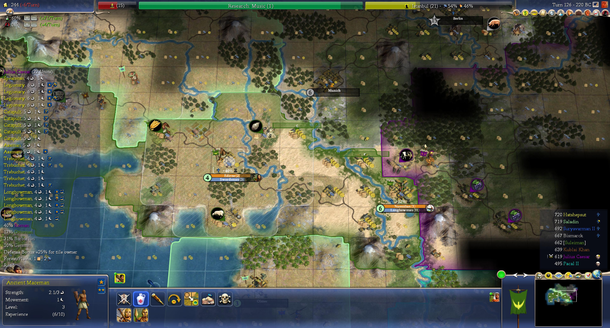
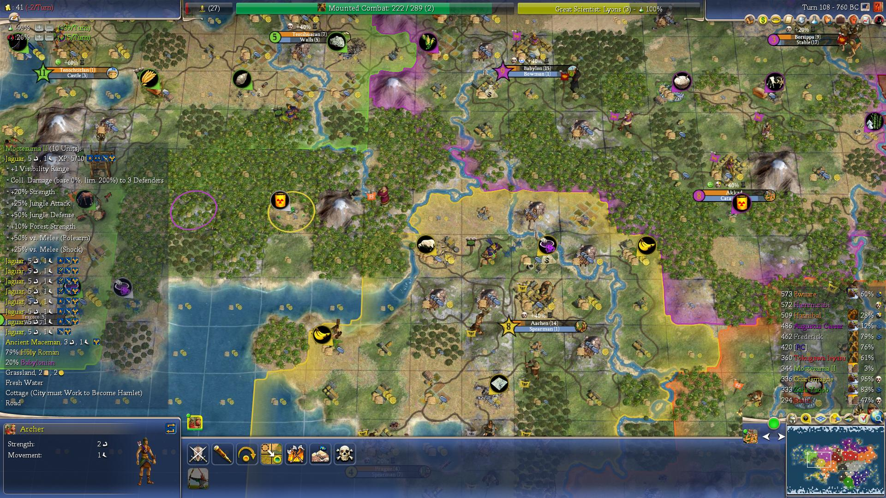
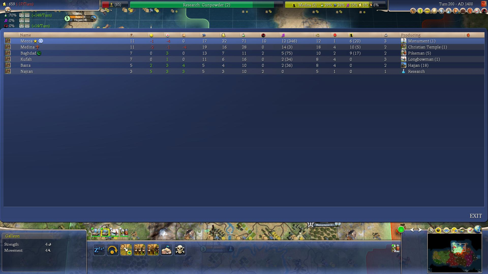
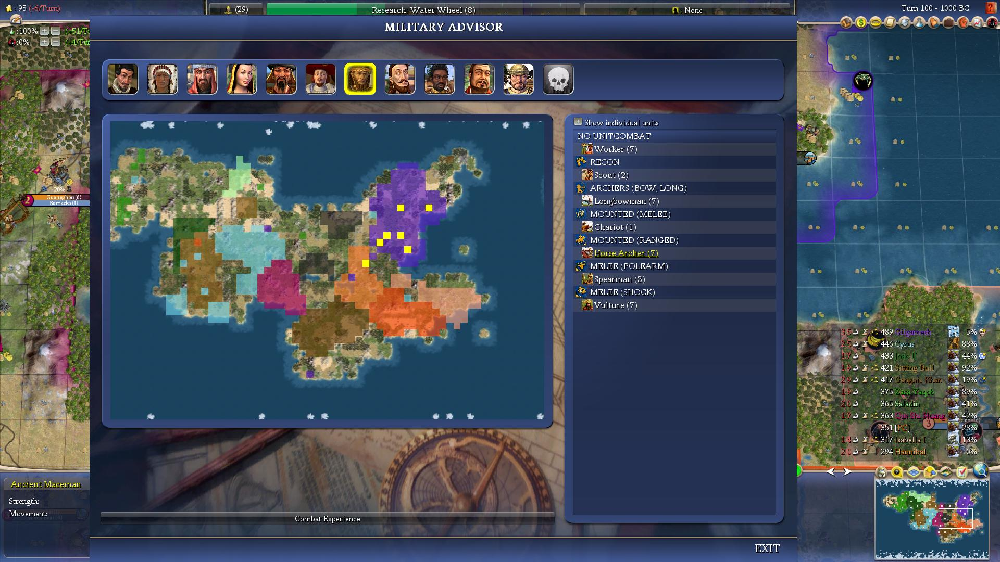
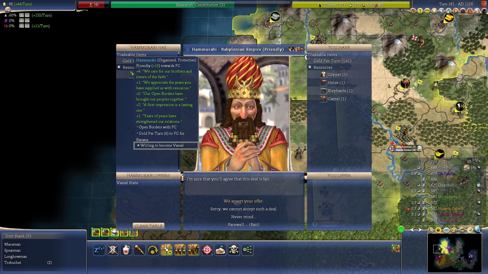
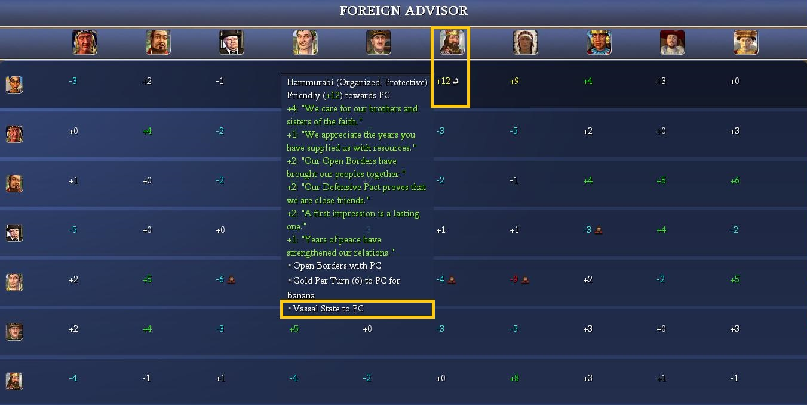
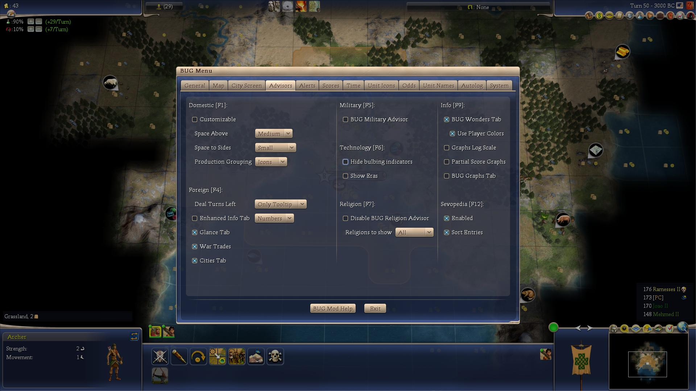
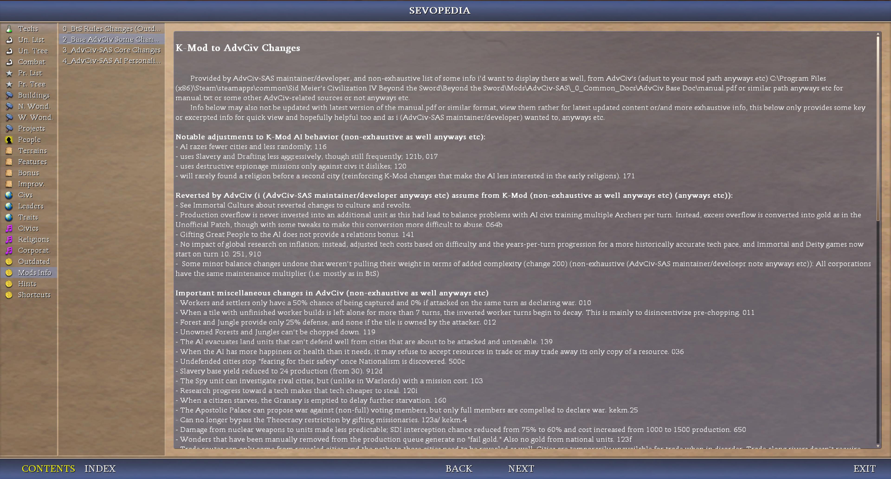
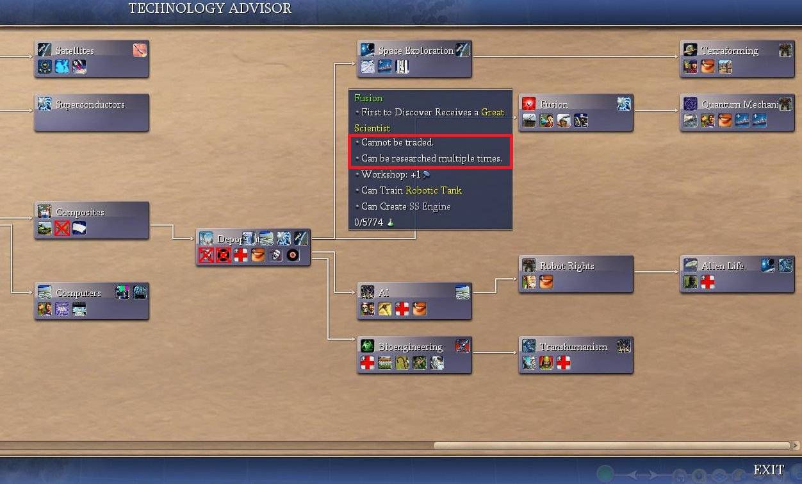

# AdvCiv-SAS (Simple Advanced Strategy)

This mod (AdvCiv-SAS (Simple Advanced Strategy)) ([Discussion thread here](https://forums.civfanatics.com/threads/advciv-sas-simple-advanced-strategy.699716/)) is based on [AdvCiv 1.12](https://github.com/f1rpo/AdvCiv/tree/1.12) as it is the [latest AdvCiv](https://forums.civfanatics.com/threads/advanced-civ.614217/) version as of now, and will/may update whenever there are new changes that are stable.

AdvCiv-SAS is now available at [CFC Modpacks downloads section](https://forums.civfanatics.com/resources/advciv-sas-simple-advanced-strategy.32513/) and at the [ModDB website](https://www.moddb.com/mods/advciv-sas-simple-advanced-strategy), not just on github anymore (read [below for download/install instructions](/README.md#how-to-play)).

The core changes brought by this mod are as of now an AI overhaul to make it much more efficient with its workers and settlers and most gameplay areas with a focus on opportunism and avoiding self-sabotaging/suicidal AI play.

Heavy reworks were made, while otherwise mostly staying in the base Advciv 1.12 frame, but with a focus on historical accuracy, game balance, and as for in particular UI in Sevopedia (item grouping, new Search Bar, Keyboard navigation, Index as Category, new charts and Leader AI Personality Panel, Media Player (Movies with audio support, and Music with the ~1750 audio scripts that can be listened to)), most Advisor screens reworked or new ones (e.g. new History Tab in the Info Screen), and the city screen rework, transitioning to a modern upscaled and beautified 16:9 display, reducing the need for players to scroll, and with new information displayed as well; Main Menu rework. New mechanics as well, including but not only new Game Speeds (Nitro, Turbo, Slow, Very Slow); new World Sizes (Arena, SAS24, SAS32, SAS40, SAS48); new optional XML fields (e.g., `ObsoleteTech` for units); new Maps (e.g., `BTG_Cross`, `BTG_Lagoon`, etc.).

Content overall addition is minimal, as of now mostly in the future era (like the new camel bonus, or the new playable civ Kingdom of Benin); else it is mostly done via this heavy reworking of the game rather with the aforementioned goals (accuracy, balance, AI strength, etc).

All in all, this simplifies gameplay to some extent, but greatly increases depth and should make the game much more challenging while not being too much of a grind (i.e. we don't want to increase penalties at higher handicaps, but instead aim to avoid/reduce them while trying to make the game harder (and ideally harder than base AdvCiv 1.12 at all handicaps) through improved AI competency rather). There are a lot more changes, and details about these as well below explained in the following sections.

AdvCiv-SAS is now generally stable, but if issues were to arise such as bugs or such, i may not be too available to help, so your best bet may be to open a thread and ping me there rather (or reply in the discussion thread mentioned above), so that if i were not to reply, perhaps someone else would provide some solution or guidance maybe.

Also most importantly AIs like ChatGPT, Claude AI, Gemini AI, Deepseek AI, Grok AI, have helped me a lot to do this, and i probably would not have completed (or extremely harder) without them and all i mean so thanks again and thanks a lot!

For License and Reuse, see [License and reuse](/README.md#license-and-reuse).

## Menu

[Tech Tree](/README.md#tech-tree)  
[Military Tree and changes](/README.md#military-tree-and-changes)  
[Ingame gameplay samples](/README.md#ingame-gameplay-samples)  
[Docs](/README.md#docs)  
[How to play?](/README.md#how-to-play)  
[Full exhaustive very long and exhaustive changes](/README.md#full-exhaustive-very-long-and-exhaustive-changes)  
[Main Changes Guide](/README.md#main-changes-guide)  
[UI (Main Menu)](/README.md#ui-main-menu)  
&emsp;[Home page](/README.md#home-page)  
&emsp;[Simple Game rework](/README.md#simple-game-rework)  
[UI (Ingame)](/README.md#ui-ingame)  
&emsp;[Main Advisors reworks (e.g. History Tab in the Info Screen Advisor)](/README.md#main-advisors-reworks-eg-history-tab-in-the-info-screen-advisor)  
&emsp;["Willing to become a vassal" and vassal icons in foreign advisor's glance tab](/README.md#willing-to-become-a-vassal-and-vassal-icons-in-foreign-advisors-glance-tab)  
&emsp;[Inverted BUG options](/README.md#inverted-bug-options)  
&emsp;[Main interface rework](/README.md#city-screen-rework)  
&emsp;&emsp;[City Screen rework](/README.md#city-screen-rework)  
&emsp;&emsp;[Map view rework](/README.md#city-screen-rework)  
[UI (Main Sevopedia reworks)](/README.md#ui-main-sevopedia-reworks)  
&emsp;[Some lower level Sevopedia reworks (e.g., Item grouping, Search Bar, Keyboard UP/DOWN navigation, Index as category, Movies (with audio support), Music with ~1750 audio scripts that can be listened to in Sevopedia)](/README.md#some-lower-level-sevopedia-reworks-eg-item-grouping-search-bar-keyboard-updown-navigation-index-as-category-movies-with-audio-support-music-with-1750-audio-scripts-that-can-be-listened-to-in-sevopedia)  
&emsp;[Other new categories](/README.md#other-new-categories)  
&emsp;&emsp;[Widget Python 6798 to link (e.g. for Builds, for Traits)](/README.md#widget-python-6798-to-link-eg-for-builds-for-traits)  
&emsp;&emsp;[Charts (e.g. Handicap Chart, Game Speed Chart, World Sizes Chart, Eras Chart)](/README.md#charts-eg-handicap-chart-game-speed-chart-world-sizes-chart-eras-chart)  
&emsp;[Some higher level reworks (e.g. AI Personality Panel, Traits Charts, Starting and Untradeable Techs Charts, Improvement Weights (Leaders) Chart)](/README.md#some-higher-level-reworks-eg-ai-personality-panel-traits-charts-starting-and-untradeable-techs-charts-improvement-weights-leaders-chart)  
&emsp;[Some other Sevopedia reworks](/README.md#some-other-sevopedia-reworks)  
[UI (Common)](/README.md#ui-common)  
&emsp;[Emojis](/README.md#emojis)  
&emsp;[Untradeable techs (bTrade) display information](/README.md#untradeable-techs-btrade-display-information)  
[New optional XML fields (e.g. ObsoleteTech for units, Button for eras)](/README.md#new-optional-xml-fields-eg-obsoletetech-for-units-button-for-eras)  
[AI-generated images](/README.md#ai-generated-images)  
[Less Generic unit names or combat types](/README.md#less-generic-unit-names-orand-combat-types)  
[Civs you can expect in this mod](/README.md#civs-you-can-expect-in-this-mod)  
&emsp;[World map with civs](/README.md#world-map-with-civs)  
&emsp;[Other map(s) i used for terrain modifiers for civ-specific units](/README.md#other-maps-i-used-for-terrain-modifiers-for-civ-specific-units)  
[Assets Rebalancing](/README.md#assets-rebalancing)  
[48 Civs DLL](/README.md#48-civs-dll)  
&emsp;[How to use](/README.md#how-to-use)  
&emsp;[New AdvCiv-SAS World Sizes (SAS24, SAS32, SAS40, SAS48; Arena) (Recommended to use with the 48 Civs DLL)](/README.md#new-advciv-sas-world-sizes-sas24-sas32-sas40-sas48-arena-recommended-to-use-with-the-48-civs-dll)  
[Maps](/README.md#maps)  
&emsp;[New Maps (e.g., BTG_Cross, BTG_Lagoon)](/README.md#new-maps-eg-btg_cross-btg_lagoon)  
&emsp;[New .dds for maps in Simple Game](/README.md#new-dds-for-maps-in-simple-game)  
[Change from short to int the Found value pipeline](/README.md#change-from-short-to-int-the-found-value-pipeline)  
[Long Comments Archive](/README.md#long-comments-archive)  
[External file access in Civ4 ingame (on Windows)](/README.md#external-file-access-in-civ4-ingame-on-windows)  
[Python scripts](/README.md#python-scripts)  
[CuCuGS](/README.md#external-file-access-in-civ4-ingame-on-windows)  
[Known issues that may or may not be fixed, in base AdvCiv or Civ4](/README.md#known-issues-that-may-be-fixed-or-not-fixed-in-base-advciv-or-civ4)  
["Temporary" crashes](/README.md#temporary-crashes)  
[Not supported in AdvCiv-SAS](/README.md#not-supported-in-advciv-sas)  
[Version number](/README.md#version-number)  
[Copyright and Disclaimer](/README.md#copyright-and-disclaimer)  
[Credits](/README.md#credits)  
[Some Useful tools while doing this](/README.md#some-useful-tools-while-doing-this)  
[License and reuse](/README.md#license-and-reuse)  
[Authors](/README.md#authors)  

## Tech Tree

Before going more in depth about/in the changes and how to play or such documentation or other topics, here is a view of the reworked tech tree in AdvCiv-SAS (currently unfinished) (click on the images to view them in full screen or bigger size)

</img>
</img>
</img>
</img>

For more details on how the tech tree was made, which historical timeline it follows, sources, more screenshots and such, upcoming changes if any more, or other information or not or etc, please visit [README_Tech_Tree.md](/_1_AdvCiv-SAS/Docs/README_Tech_Tree.md)

## Military Tree and changes

As of now the military tree is as such in AdvCiv-SAS (please view ingame or in XML for updated version if any changes have been made since then)

</img>
</img>

See [README_More_Exhaustive_Military_Tree.md](/_1_AdvCiv-SAS/Docs/README_More_Exhaustive_Military_Tree.md).

## Ingame gameplay samples

These are from autoplay or me playing them myself (for the 4986 rome AI screenshot as of now). AI is very strong, i wanted to showcase that as well as how AI generally behaves and the game looks/feels ingame. Both of these maps were pangea at monarch handicap. Later screenshots are from version 5055 and around version 5200 and 5085.

</img>
</img>
</img>
</img>

See also [the CFC AdvCiv-SAS Discussion Thread here](https://forums.civfanatics.com/threads/advciv-sas-simple-advanced-strategy.699716/) as well, or the google drive link (see [Docs section](/README.md#docs) for link below) for more gameplay samples although some of these may be old/dated now.

## Docs

About the mod AdvCiv-SAS in general, i added quite a bit of documentation, pictures, and other elements about this AdvCiv-SAS mod in [/_1_AdvCiv-SAS/](/_1_AdvCiv-SAS/)

Additionally, some extra files can be found on this google drive: [full AdvCiv-SAS google drive folder link](https://drive.google.com/drive/folders/1thBnA_TzWq2psd8Tg8RaorwmPZzqgN9M?usp=sharing).

## How to play?

If you are a new player or want to play this mod and would like a few instructions on how to install it and play it, i have provided a few instructions in the [README_Quick_Install_Setup_Guide.md](/_1_AdvCiv-SAS/Docs/README_Quick_Install_Setup_Guide.md)

## Full exhaustive very long and exhaustive changes

If you want to see the full very exhaustive code changes between AdvCiv current latest stable, for example 1.12 here, and AdvCiv-SAS, it can be viewed for example in this [pull request compare](https://github.com/wonderingabout/AdvCiv-SAS/pull/13). However it is very lengthy, read below for the main pointers rather.

As for the changelog between releases of AdvCiv-SAS, see the [github tags](https://github.com/wonderingabout/AdvCiv-SAS/tags) that for each release show the list of changes in git history format since the previous release.

## Main Changes Guide

I have written the main changes guide (from base AdvCiv 1.12 to AdvCiv-SAS latest) with the help of chatgpt and gemini (check if info is accurate); i sometimes edited it. You can view it here [README_Main_Changes_Guide.md](/_1_AdvCiv-SAS/Docs/README_Main_Changes_Guide.md).

## UI (Main Menu)

### Home page

Edited the .thm files so the main menu's home page feels more modern and utlizes more of the screen for display, and in a prettier way too (removes the very ugly blue panel, adds darker and bolder text, etc.). See also [/README.md#ai-generated-images](/README.md#ai-generated-images).

</img>
</img>

### Simple Game rework

Edited the .thm as well. Was done with the help of GPT-5.2-Codex, based on C2C's implementation of tighter radio buttons. I also added some beautification to remove the header and more of the margins as well.

Very cool clarification idea by chatgpt 5.2 (web) as part of adding new game speeds, which i then fine tuned or adjusted a bit and expanded on such as in: `"Normal (500 / 100%)"` bullet; `Epic (750 / 150%)` bullet; `GAME SPEED (50 000 BC - 2105 AD)` when necessary, and reworded other fields or blurbs as well. Thanks a lot!

Change in [Civ4Theme_Button.thm](/Resource/Civ4Theme_Button.thm) and [Civ4Theme_Common.thm](/Resource/Civ4Theme_Common.thm). Commit: [commit/d194577b3bf54364637817d767ccf607b5480325](https://github.com/wonderingabout/AdvCiv-SAS/commit/d194577b3bf54364637817d767ccf607b5480325)

Note: Also features the `SAS24`, `SAS32`, `SAS40`, and `SAS48` bigger than Huge, as well as the `Arena` new World sizes (that are based on the XXL World's world sizes). See [New AdvCiv-SAS World Sizes (SAS24, SAS32, SAS40, SAS48; Arena) (Recommended to use with the 48 Civs DLL)](/README.md#new-advciv-sas-world-sizes-sas24-sas32-sas40-sas48-arena-recommended-to-use-with-the-48-civs-dll).

Note 2: notably also features the new maps we added in AdvCiv-SAS such as the [BTG_Cross.py](/PrivateMaps/BTG_Cross.py), new .dds for maps, etc. See [Readme.md: Maps](/README.md#maps).

</img>
</img>
</img>
</img>
</img>
</img>

## UI (Ingame)

### Main Advisors reworks (e.g. History Tab in the Info Screen Advisor)

Also reworked, expanded and beautified some of the other Advisors' UI, as it for example was annoying to always scroll to see more players (e.g. 12+), while still preserving key relevant information for said advisors' display (e.g. for the foreign advisor screen: scoreboard, map, commerce sliders and values, etc.).

#### New Advisors (e.g. History Tab in the Info Screen Advisor)

We added in AdvCiv-SAS a new History Tab in the Info Screen:

- shows a spoiler-free (religion founded by an unknown city, city founded but unexplored, etc.) if not known (not in debug, not yet revealed, etc.) account (based on the replay screen's data (except you don't need to retire to see it now), notably keeping its colored text for each player, but filtered) of the key moments that happened each turn.
- unlike the Event Log (which was cumbersome to open and maximize as well btw), information is preserved on save reload.
- has an optional "LOG" button you can click on ingame to optionally export to `PythonDbg.log` text file the output
- added optional caching (default as of now enabled, recommended) so it is more efficient and less computationally costly. Performance cost of this new tab measured to be none (2.33 seconds for 110 late game turns vs 2.35 seconds: within margin of error)
- Done with the help of GPT-5.2-Codex, Claude code Sonnet 4.5, and Claude code Opus 4.5, thanks a lot!

Note: a hybrid DLL compute + Python caching version was tried in [history-tab-dll-implementation branch](https://github.com/wonderingabout/AdvCiv-SAS/tree/history-tab-dll-implementation) but load times of the history tab were not much faster if at all so preferred the Python version for its simplicity. A full DLL caching + compute was tried but load times were noticeably slower than the full Python version, so dropped as well.

</img>
</img>

#### Advisor reworks

For the technology advisor in particular, players can now tune as they prefer the tech tree's width. Visual comparison at [Customizable technology advisor width](/_1_AdvCiv-SAS/Docs/README_Tech_Tree.md#customizable-technology-advisor-width). Also helps not having to open/exit said advisor such as in the technology advisor, where the rival's research and rank position is as of now visible, allowing to better plan tech path without tedium or less of it. Notably, it also features the new "Remove Jungle" and "Chop Down a Forest" buttons (from the Middle-Earth mod thanks!).

Also refactored to make the display more dynamic so that if the advisor's screen dimensions are changed in their respective python file, the rest of the info follows instead of staying stuck at old position which would be weirdly displayed, or so it is easier to change an advisor's screen dimensions if desired later, plus doing some performance optimizations or such i found relevant.

</img>
</img>
</img>
</img>
</img>
</img>
</img>
</img>
</img>
</img>
</img>
</img>
</img>
</img>
</img>

See for related and similar changes [UI (In-game)](/_1_AdvCiv-SAS/Docs/README_Main_Changes_Guide.md#ui-in-game).

### "Willing to become a vassal" and vassal icons in foreign advisor's glance tab

We added with the help of gemini 3 pro and claude sonnet 4.5 and my help too thanks, icons in the foreign advisor's glance tab, that show if a rival is willing to become our rival (as of now star icon) and if they are our vassal (as of now strength icon), which is very useful to avoid tediously checking these everytime in diplomacy or risking to have missed them in messages or such. Also added a tooltip (on hover). See [KI#84](/_1_AdvCiv-SAS/Docs/README_Known_Issues_In_Base_AdvCiv_Civ4.md#84---added-missing-feature-rivals-of-the-activehuman-player-that-are-willing-to-become-the-activehuman-players-vassal-not-showing-an-icon-to-quickly-indicate-that-at-a-glance-in-the-foreign-advisors-glance-tab-no-pun-but).

</img>
</img>
</img>

### Inverted BUG options

We find some of the BUG advisor features valuable and not obvious to many players. So we have inverted the options, rather than simply force enabling or disabling them.

This means the default is now ON, and ticking the option toggles it to OFF. Applied as of now only to the Tech Advisor (F6 key) and Religious Advisor (F7 key) which we find most valuable. Updated the texts to match this new behaviour and sometimes clarify it (e.g. vague "GP Research" -> clearer "Hide bulbing indicators").

</img>

Note 2: the tech bulbing indicators may be disabled at turn 0, but should if so appear at turn 1 onwards. See [KI#85](/_1_AdvCiv-SAS/Docs/README_Known_Issues_In_Base_AdvCiv_Civ4.md#85---corrected-explanation-bug-tech-advisors-bulbing-indicators-causing-pregamestart-cvappinterface-error-at-turn-0-so-as-in-base-advciv-it-is-disabled-at-this-turn-and-enabled-only-from-turn-1-onwards-but-base-advcivs-explanation-about-it-affecting-very-large-maps-was-incorrect-happened-on-a-standard-size-map-as-well).

### Main Interface rework

Some common changes to city screen and map view include the tech bar's detail being enhanced with a new icon centered in the bar, followed by info like `Fusion: 2245 / 5774 (35)`, and show chars in the GP bar even if 100% (e.g. `Great Scientist: Lyons (3) - [RESEARCH_CHAR] 100%`).

Also moved map to the right (idea from the C2C mod thanks).

#### City Screen rework

Added some missing info such as the great person "+n (ICON)" information in any relevant building's row, which is handy to have and that was tedious to check through hovering. Also removed the 3 gray bars ("Trade Routes", "Buildings", "Specialists") as they take a lot of room and are uneeded, and we don't have a "Bonuses" bar for example so no reason to have these as well either; this allows to now display much more information and reduces the need for scrolling. Also beautified several other things, such as enlarging side panels to display more info and be prettier, making bonuses columns even in width, making some hardcoded values now dynamically adjust depending on the side width we set, etc. if any more.

Additionally, also added a new specialists breakdown as of now on bottom-right and a culture breakdown. Also added an option to add one or several extra rows (tunable) in the production chooser bar. These all help reduce tedious hovering and provide useful info at a glance.

The city screen has been heavily reworked, beautified, and enhanced, for example by splitting the old draft group into draft menu on one side with a new draft button, and config options as a one liner above the minimap zone, plus added new building list filtering options (Show all buildings, Show World Wonders only, etc.) as clickable buttons (based on how the C2C mod does it thanks), enhanced with detailed information (like `Lakamha: 16 - 12372 (4500BC)` or `Growing - 30/43 (4 Turns)`).

</img>
</img>
</img>

#### Map view rework

Outside the city screen, UI has been reworked too: removed the flag (was needless and cumbersome: better show more buttons instead), added buttons for unit stack and currently selected unit, moved and reordered end turn buttons and other controls, now near the map in a very pretty end turn group with a curved visual effect. Screenshots visible in the other ingame previews.

## UI (Main Sevopedia reworks)

Note: for more screenshots and documentation of the Sevopedia reworks in AdvCiv-SAS, see [README_Sevopedia_Reworks.md](/_1_AdvCiv-SAS/Docs/README_Sevopedia_Reworks.md).

### Some lower level Sevopedia reworks (e.g., Item grouping, Search Bar, Keyboard UP/DOWN navigation, Index as category, Movies (with audio support), Music with ~1750 audio scripts that can be listened to in Sevopedia)

#### Items grouping

We added grouping for items by Era, Civic Type, Land/Water, and various other kinds of grouping depending on the Sevopedia category. See [_sevopedia_main_groupings.py](/Assets/Python/Contrib/Sevopedia/_sevopedia_main_groupings.py).

#### Search Bar

With the help of claude opus 4.5 and chatgpt 5.2, we introduced a search bar in AdvCiv-SAS that is shared by several Sevopedia pages. It allows to **search** for entries using the **keyboard**.

The code is in [SevoPediaMain.py](/Assets/Python/Contrib/Sevopedia/SevoPediaMain.py). See individual Sevopedia screenshots to see its general appearence. As for how the search bar is used in AdvCiv-SAS, here are some example cases:

</img>
</img>
</img>

See: [example 0.1: added a search bar. Used in several Sevopedia pages](/_1_AdvCiv-SAS/Docs/README_Sevopedia_Reworks.md#example-01-added-a-search-bar-used-in-several-sevopedia-pages).

#### Keyboard Navigation with the UP/DOWN arrows

Based on C2C mod's code thanks and with the help of claude opus 4.5 and chatgpt 5.2, we added support for keyboard navigation using the UP/DOWN arrows. See [example 0.2: added keyboard arrow (UP/DOWN) navigation support. Used in several Sevopedia pages](/_1_AdvCiv-SAS/Docs/README_Sevopedia_Reworks.md#example-02-added-keyboard-arrow-updown-navigation-support-used-in-several-sevopedia-pages).

#### Index As Category

Inspired by Middle-earth mod's very nice and amazing platypedia thanks, i moved with GPT-5.2-Codex's big help the index from being a tab to being its own category. This should increase ease-of-access and make it better integrated with the other categories (no need to go back and forth to other pages, etc.). Note that it also implements a Sevopedia Search Bar.

In particular, we now added the new Sevopedia Build's entries in the index too! Index Builds entries are now clickable too: keep the index table selectable (row->Build mapping) and set table focus on open so the search bar works immediately (GPT-5.2-Codex + Claude Opus 4.5).

See [example 0.3: Index As Category](/_1_AdvCiv-SAS/Docs/README_Sevopedia_Reworks.md#example-03-index-as-category).

</img>
</img>
</img>

#### Media File playing (e.g. Movies with audio support, Music with ~1750 audio scripts that can be listened to in Sevopedia)

Based on the Middle-earth mod's Platypedia's Movies category and adjusted and then expanded on for AdvCiv-SAS, we provide a new Sevopedia Movies category with movies (bik, nif, dds) playing and additional audio support for non-bik files such as religions (nif + separate sound asset).

##### Media player

Common logic to Sevopedia Movies and Sevopedia Music is in [SevoPediaMediaPlayer.py](/Assets/Python/Contrib/Sevopedia/SevoPediaMediaPlayer.py) with the very nice help of GPT-5.2-Codex thanks a lot! Features include but not only a play button for replay, and an eject button for exit (useful for `_ORDER` or `_SELECT` Civilizations sounds for example as they replay variants for the same item). Also supports Previous Track and Next track buttons.

Supports Previous Track and Next track, Toggle Movies/Music button, Fast Up and Fast Down to move to next grouping, timer (no end time detection as of now but resets successfully on track change), and a playlist on the right side (for non-bik files since these use fullscreen it seems) or on bottom in a more compact way (for nif, dds, etc. since they fit in the TV panel). See [Sevopedia reworks (Media Player)](/_1_AdvCiv-SAS/Docs/README_Sevopedia_Reworks.md#example-090-media-player).

</img>
</img>
</img>
</img>
</img>
</img>

##### Movies

Multiple categories are supported, as of now Victories, Wonders, Projects, Religions, and Eras. The movie starts in a new screen that can be exited anytime. A clickable emoji-based Play Button has been provided. See [Sevopedia Reworks (Music category (~1750 audio scripts playable ingame))](/_1_AdvCiv-SAS/Docs/README_Sevopedia_Reworks.md#example-092-music-category-1750-audio-scripts-playable-ingame).

</img>
</img>

##### Music

We also added a new Sevopedia Music that allows to play ~1750 audio scripts in Sevopedia (as of now 963 AS2D and 786 AS3D audio scripts)! Search bar support allows for an easy find of the wanted tracks. And a play Button is provided. Among assets, notably but not only, each Tech's, Leader's, Civlization's, Era's music can be listened to. See [Sevopedia Reworks (Movies category (with audio support))](/_1_AdvCiv-SAS/Docs/README_Sevopedia_Reworks.md#example-090-movies-category-with-audio-support)

</img>
</img>
</img>

### Other new categories

#### Widget Python 6798 to link (e.g. for Builds, for Traits)

Based on the Very nice Middle-earth's (C2C mod does it too it seems) approach in its Platypedia thanks a lot! We have found that it is possible to link to build entries using `WIDGET_PYTHON` (no DLL change required it seems) and some id like `6798` or such. As a result, builds are linkable: clicking on the entries in the Builds category opens the corresponding page. Also, clicking on the link from e.g. the Sevopedia Improvements' Remove panel's button (e.g. of "Remove Jungle") successfully redirects to the new Sevopedia Builds' category's corresponding entry (e.g. the "Remove Jungle" entry in Sevopedia Builds category)!

Added a new Sevopedia Builds Category listing these distinctly from improvements (see [Sevopedia Reworks: example 0.40 builds category (e.g. "Remove Jungle", "Build Road", "Create a Farm")](/_1_AdvCiv-SAS/Docs/README_Sevopedia_Reworks.md#example-040-builds-category-eg-remove-jungle-build-road-create-a-farm)), with the big and nice help of GPT-5.2-Codex; thanks a lot!

We also used this approach to replace the old clunky base advciv's `CONCEPT_TRAIT` with now instead the `WIDGET_PYTHON` (with an id as of now of `6799`), which preserves linking and allowed us to delete old XML clutter.

</img>

#### Charts (e.g. Handicap Chart, Game Speed Chart, World Sizes Chart, Eras Chart)

New Sevopedia category pages were added in AdvCiv-SAS such as the Handicap Chart, Game Speed Chart, World Sizes Chart. Added with the help of [GPT-5.2-Codex](/README.md#create-a-new-sevopedia-category-eg-handicap-chart) and ChatGPT 5.2 (web) based on the Middle-earth's Platypedia code.

They are very handy to see all handicap or game settings info in one go, are sortable by theme (e.g. all war-related handicap fields have the war emoji), and allow to show efficiently (cached after being computed) info for the full calendar/timeline info in compact rows such as `"+2*10k=30k"` or `"+40*m2=2076m9"` for all increments and all game speeds! It allowed me to spot a mistaken in Very Slow that ended in 2116 AD instead of 2105 AD!

They notably feature additional fields that do not are not direct XML info fields, such as `Ratio to Standard*` (e.g. "3.640" for SAS24 World Size), `Ratio to Largest*` (e.g. "0.502" for SAS24 World Size), `Recommended DLL*` (e.g. "48 Civs" for the SAS24 World Size), `Tiles Per Default Player*` (e.g. 145 for World Size Huge), `Total Turns*` (e.g. "165" (turns) for the Game Speed Nitro). They are marked with an `*` at the end of their tail for clarity.

Also, the Eras Chart page also features optional era buttons.

</img>
</img>
</img>
</img>

### Some higher level reworks (e.g. AI Personality Panel, Traits Charts, Starting and Untradeable Techs Charts, Improvement Weights (Leaders) Chart)

One of the main and most significant Sevopedia changes in AdvCiv-SAS is the new AI Personality panel new feature. Not a strictly new feature per se as the xml fields and their values per leader already existed, but now displaying most of them at each Sevopedia leader (and also the ranking of leaders for each of these displayed fields's values) is indeed new (as well as the new aggregated attributes such as contact probs, positive/negative memory affections/resentments being implemented and some optionally displayable or not shown for concision as table is full with a lot of data). It is computationally lightweight, as all the values are already provided in the mod before the game is launched, the game just displays this data.

As always, ChatGPT is a key co-author and main code contributor and with the help of other AIs (See [Authors](/README.md#authors)) thanks.

Another significant contribution from our AI helpers is the new Traits Charts, that are 2 sortable Traits Charts that show all trait pairs and their representation among all leaders, using as of now a "++++" kind of ranking and clickable leader buttons in the charts. Also, the Leaders'panel's header has been enhanced with similar info, as of now for example "Leader 12/53 (22%)", and other enhancements such as new txt keys that are fairly mod-agnostic (added with the help of ChatGPT 5.2 thanks a lot). Implementation with the help of Claude code Opus 4.5 and GPT-5.2-Codex thanks a lot. Also added similar charts such as the Starting and Untradeable Techs Charts (pairs and combinations).

Based on it, we notably also made, in Sevopedia Improvement, a new sortable Improvement Weights (Leaders) Chart, showing Weights, Count per Weight, and clickable Leader buttons for each weight and improvement.

Here is below a sample of the example screenshots showing the AI Personality panel, Traits Charts, and the many other reworks we did in Sevopedia in AdvCiv-SAS:

</img>
</img>
</img>
</img>
</img>
</img>
</img>
</img>
</img>
</img>
</img>
</img>
</img>
</img>
</img>
</img>

#### Notes about the Sevopedia Leader's AI Personality Panel and Sevopedia Traits' Tables

note: its performance should be very very efficient and optimized. See [README_AI_Personality_Panel.md#notes-about-performance-optimization-of-the-ai-personality-panel-caching](/_1_AdvCiv-SAS/Docs/README_AI_Personality_Panel.md#notes-about-performance-optimization-of-the-ai-personality-panel-caching). Also as of now using a similar system for the new Sevopedia Traits' Tables. See also [SevoPediaLeaderAIPValues.py](/Assets/Python/Contrib/Sevopedia/SevoPediaLeaderAIPValues.py).

note 2: you can enable/disable the emoji display as you prefer (see [README_AI_Personality_Panel.md#how-to-enabledisable-emoji-buttons-in-sevopedia-leader](/_1_AdvCiv-SAS/Docs/README_AI_Personality_Panel.md#how-to-enabledisable-emoji-buttons-in-sevopedia-leader)) or display key names instead of abbreviated custom labels in the AI Personality Panel (see [README_AI_Personality_Panel.md#how-to-show-keys-or-suffixes-instead-of-abbreviated-custom-labels](/_1_AdvCiv-SAS/Docs/README_AI_Personality_Panel.md#how-to-show-keys-or-suffixes-instead-of-abbreviated-custom-labels)).

note 3: if you want to mod and modify the xml civ4 leader info, then you need to either update the [SevoPediaLeaderCachePredumped.py](/Assets/Python/Contrib/Sevopedia/SevoPediaLeaderCachePredumped.py) file manually, or disable the option to use the predumped file (see toggle define as of now at [`GlobalDefines_advciv_sas.xml`](/Assets/XML/GlobalDefines_advciv_sas.xml)). This was done so players don't always recompute these values that do not change on their end, and rarely so even for modders, and should scale better (if i'm not mistaken) as there are more leaders or xml fields in a mod vs computing them once every time the civ4 game is launched. See : [README_AI_Personality_Panel.md](/_1_AdvCiv-SAS/Docs/README_AI_Personality_Panel.md)

### Some other Sevopedia reworks

#### Concepts (as of now in the "Outdated" Sevopedia category)

These are not supported in advciv-sas, hence the "outdated" name. Added a few examples that i found informative or wanted to add. These new entries generally come from [https://civilization.fandom.com/wiki/](https://civilization.fandom.com/wiki/) or some similar place(s).

Added new concepts, as of now:

- concept_customization
- concept_fresh_water (with a link to it added in concept_irrigation (even though lost translation xd now (i removed it (i.e. now only has english translation for all languages))))
- concept_global_warming
- concept_rivers
- concept_scoring_system

</img>
</img>

#### Mods Info

The Sevopedia "Mods Info" (reusing the old civ4 concepts category or similar, thanks to [@f1rpo](https://github.com/f1rpo)'s help too) category adds info about mods and such. See [README_Mods_History_And_Changes.md](/_1_AdvCiv-SAS/Docs/README_Mods_History_And_Changes.md). Exhaustive or not example screenshots below as well:

</img>

## UI (Common)

### Emojis

We added emojis in AdvCiv-SAS as dds so we don't have to tediously add them as textual icons, for example in Sevopedia (such as of now in the AI Personality Panel's emojis, or in the Info Screen (F9 key ingame)'s Statistics tab's top chart (Time Played, Cities, etc.)).

They can be added as buttons or as `` for example, like other .dds files.

The relevant files can be found in:

- XML: as of now in [CIV4ArtDefines_Interface.xml](/Assets/XML/Art/CIV4ArtDefines_Interface.xml)
- `.dds`: as of now in [/Assets/Art/AdvCiv_SAS/Emojis/](/Assets/Art/AdvCiv_SAS/Emojis/)

### Untradeable techs (bTrade) display information

For example we added the new this technology "Cannot be traded" and "Can be researched multiple times" info (displayed if still enabled in our mod after this screenshot was made, but the option is there to accomodate any XML that has this option enabled for a tech as in the screenshot) in Sevopedia tech and in the tech advisor as show below:

</img>

See also:

- [README_Main_Changes_Guide.md#technologies](/_1_AdvCiv-SAS/Docs/README_Main_Changes_Guide.md#technologies)
- [example 1.6: techs category (Starting and Untradeable Techs Charts and other changes)](/_1_AdvCiv-SAS/Docs/README_Sevopedia_Reworks.md#example-16-techs-category-starting-and-untradeable-techs-charts-and-other-changes)
- [Modding_Ressources: "Example of DLL modification of CvGameTextMgr.cpp and other related file(s) to add the new "This technology cannot be traded"](/_1_AdvCiv-SAS/Docs/Modding_Ressources/README.md#example-of-dll-modification-of-cvgametextmgrcpp-and-other-related-files-to-add-the-new-this-technology-cannot-be-traded-flag-in-sevopedia-tech-s-placespecial-and-in-tech-tree-view-technology-advisor).

## New optional XML fields (e.g. ObsoleteTech for units, Button for eras)

### ObsoleteTech for units

We also added in AdvCiv-SAS with GPT-5.2-Codex's help new XML optional fields such as `<ObsoleteTech>` for units.

They allow to avoid unit clutter in later eras (AI and humans can no longer produce them if set (e.g. Ancient Maceman (`UNIT_WARRIOR`)) obsolete at `TECH_BRONZE_WORKING`, as well as easily improve AI performance directly (no longer have abherrent Ancient maceman production in medieval era, pikemen in industrial, etc.) or indirectly with additional changes (e.g. scrap obsolete units easily and computationally cheaply when they are obsolete).

Blurbs with links fully implemented in [CvGameTextMgr.cpp](/CvGameCoreDLL/CvGameTextMgr.cpp). As of now, obsolescence not shown in tech tree to not clutter. If field is missing or set to `NONE` in XML (e.g. `<ObsoleteTech>NONE</ObsoleteTech>`), a default of `NONE` is applied for better inter-mod portability. `NONE` means a unit is never obsolete (e.g. `UNIT_SETTLER`), and so it keeps base AdvCiv/Civ4 behaviour (can always be produced).

If you don't want to use this `ObsoleteTech` feature without having to tediously manually modify each entry one by one in XML, you can, similarly to how was done for unit XML terrain and feature modifiers in AdvCiv-SAS, disable them by toggling to 0 the corresponding SAS define in [`GlobalDefines_advciv_sas.xml`](/Assets/XML/GlobalDefines_advciv_sas.xml)) (as of now `SAS_CV_UNIT_INFO_ENABLE_XML_UNIT_OBSOLETE_TECH`). If disabled (0), the value in XML will be ignored and forced to always NONE so you can easily reenable it in the future as you prefer.

Should have been the base in Civ4!

See Sevopedia Unit and Sevopedia Tech for screenshots. See also [KI#93](/_1_AdvCiv-SAS/Docs/README_Known_Issues_In_Base_AdvCiv_Civ4.md#93---enhanced-new-optional-xml-fields-eg-obsoletetech-for-units-to-fix-abherrent-unit-choice-or-scrapping).

### Button for eras

Similarly added a new `<Button>` in XML.

Allows to cleanly add era buttons in Sevopedia Movies and other places without hardcoding the path everytime.

Civ4 already supported it, no idea why it was not the default!

Change in [CIV4GameInfoSchema.xml](/Assets/XML/GameInfo/CIV4GameInfoSchema.xml), [CIV4EraInfos.xml](/Assets/XML/GameInfo/CIV4EraInfos.xml), [CvEraMovieScreen.py](/Assets/Python/Screens/CvEraMovieScreen.py). Added with the help of GPT-5.2 Thinking and Claude code Sonnet 4.5, thanks a lot!

## AI-generated images

While developping the AdvCiv-SAS mod, i have learned (despite having tried in the past a few times with Midjourney but not related to this) to and successfully generated some AI-generated images, first with tools like ChatGPT for buttons or such, and then for our main menu background images with other tools, in particular with the help of PixelCut AI that was very nice.

I edited some of these with Paint.NET to add in some of them the blue "ribbon" (margins whatever they are called). Here are, below, some examples of ai-generated images in our mod, for more details see: [Docs/README_AI_Generated_Images.md](/_1_AdvCiv-SAS/Docs/README_AI_Generated_Images.md)

Note: these are low size images, see link mentioned above for the google drive link to view them in high quality (full/original resolution).

Also Nano banana pro (see [/README.md#nano-banana-pro](/README.md#nano-banana-pro)) helped me amazingly and very easily fix the a tech's image and recolor the border as blue with just this simple prompt:

> "please remove the extra part of a camel in this civ4 button image and make the outside "cadre" color dark blue not white"

It also helped me generate a very nice building_russian_gord corresponding button and other images as well if any. The images are so good i'm losing my mind (in a good way i mean.) thanks a lot!!!

I was also extremely impressed by ChatGPT 5.2's ability to fully plan the new addition of a new RedX art with thinner lines, just based on a Sevopedia ingame screenshot showing it was too bold and thus hard to read at a glance. ChatGPT 5.2 took all measurements and provided me various prototypes and shapes, that are fully working after i converted them to .dds. See [README.md#redx-new-art-button](/README.md#redx-new-art-button).

Notably also, generated the new draft button in the city screen with the help of nano banana pro (gemini 3 pro) thanks.

</img>
</img>
</img>

## Less Generic unit names or combat types

See the [README_Less_Generic_Unit_Names.md](/_1_AdvCiv-SAS/Docs/README_Less_Generic_Unit_Names.md).

## Civs you can expect in this mod

### World map with civs

The civs you can expect in this mod come from these parts of the world (circled numbers are the added new civ's real world location):


### Other map(s) i used for terrain modifiers for civ-specific units

Among other maps or information i found online, i mostly also used the map below as well in order to determine which civs should get which terrain/feature modifiers in advciv-sas:


Note: sometimes i slightly deviated from strict terrain world map real layout, as of now only in europe and eastern asia due to them being only forestic with no obvious terrain in the world maps i saw, but they is cold, so symbolize it as having if relevant enough a bit of tundra in civ4 terms (see for example this [Köppen climate classification map on wikipedia](https://en.wikipedia.org/wiki/K%C3%B6ppen_climate_classification))

Note 2: as of now i'm using plains as a representative of savanna more or less.

## Assets Rebalancing

Heavy historical corrections and gameplay balance have been made, such as as of now removing the Expansive Trait, Changing Gandhi's favorite civics, or Frederick's favorite religion.

The changes before/after with rationale tables are synthethized in .md tables in [README_Assets_Rebalancing.md](/_1_AdvCiv-SAS/Docs/README_Assets_Rebalancing.md).

## 48 Civs DLL

### How to use

A 48 Civs DLL is also available and provided in this mod. (As of now named "CvGameCoreDLL_48_civs_dll.dll").

To use it, rename old base 18 `MAX_CIV_PLAYERS` DLL file named "CvGameCoreDLL.dll" to any name you like as long as it's another name, for example to "CvGameCoreDLL_18_civs_dll.dll", and rename the "CvGameCoreDLL_48_civs_dll.dll" to ""CvGameCoreDLL.dll" (vice versa to revert to old 18 players DLL).

All in all, prefer using the default DLL unless you want to use 19+ max players, then after game is finished if you want to use 18 max players or less, consider reverting to old DLL for your next map.

Note: it seems that savegames are not compatible when switching from 18 civ DLL to 48 civ DLL (or vice versa i assume) though based on the [related code comments in CvEnums.h](https://github.com/wonderingabout/AdvCiv-SAS/blob/2a453a1f3f0a8eb4ca9be538ec9553c12d49cc1c/CvGameCoreDLL/CvEnums.h#L24-L27), so make sure you finish the games you started using the same DLL, and switch back or forth whichever xd only after you want to play a new game (i.e. don't switch DLLs then reload same save file/map based on this code comment but i don't know and am only reporting what the base advciv code comment says, check if in doubt some other source).

Note 2: in the [development version](/_1_AdvCiv-SAS/Docs/README_Quick_Install_Setup_Guide.md#development-version), i don't update the 48 civs DLL as often after each change i make, because it is bit more tedious to do it and test the DLL to make sure it runs well or well enough (no compile error or crash or weird stuff or error at a glance), so i you want latest features in the development version, consider using the default (i.e. not 48 civs DLL) DLL.

### New AdvCiv-SAS World Sizes (SAS24, SAS32, SAS40, SAS48; Arena) (Recommended to use with the 48 Civs DLL)

This DLL is the recommended DLL for the new World Sizes (SAS24, SAS32, SAS40, SAS48; Arena) added in AdvCiv-SAS based on the XXL World mod's world sizes. For the larger than huge world sizes, as their Default Player number is higher than the 18 `MAX_CIV_PLAYERS` in the base DLL, it is recommended to use the 48 civs DLL to play them (else the Map may never get populated with too few players relative to world size).

The adjustment of the XXL World Mod's World sizes was made by GPT-5.2-Codex. For information, here is a comparative .md table showing how the XXL World's World Sizes compare to the AdvCiv-SAS' new World Sizes, and notes, by GPT-5.2-Codex as well.

| AdvCiv-SAS size | SAS Grid (W x H) | SAS Tiles | SAS Default players | SAS Ratio vs Std | XXL reference size | XXL Grid (W x H) | XXL Tiles | XXL Default players | XXL Ratio vs Std |
| --- | ---: | ---: | ---: | ---: | --- | ---: | ---: | ---: | ---: |
| SAS24 | 70 x 49 | 3430 | 24 | 3.141 | XXL | 40 x 25 | 1000 | 24 | 3.663 |
| SAS32 | 80 x 56 | 4480 | 32 | 4.103 | XXL | 40 x 25 | 1000 | 24 | 3.663 |
| SAS40 | 90 x 63 | 5670 | 40 | 5.192 | GIGA | 50 x 32 | 1600 | 34 | 5.861 |
| SAS48 | 99 x 70 | 6930 | 48 | 6.346 | ULTRA | 60 x 40 | 2400 | 34 | 8.791 |

Note: XXL/GIGA/ULTRA values come from XXL World `CIV4WorldInfo.xml`. XXL ratio vs Std uses XXL World's Standard size (21 x 13 = 273 tiles). SAS ratio vs Std uses the AdvCiv-SAS standard size in our XML.
Note 2: XXL uses a much smaller baseline and far fewer tiles per default player. In XXL World, Standard is 21 x 13 = 273 tiles for 7 players (~39 tiles/player), and XXL is 40 x 25 = 1000 tiles for 24 players (~41.7 tiles/player). In AdvCiv-SAS, Standard is 39 x 28 = 1092 tiles for 8 players (~137 tiles/player). That’s why SAS24 is much larger even though both list 24 default players.
Note 3: XXL map scripts also override grid sizes directly (e.g., XXL World Pangaea uses 16 x 10 for Standard and 40 x 25 for XXL in `PrivateMaps/Pangaea.py`), so the XML sizes aren’t the only source of truth; this keeps XXL maps smaller while still advertising higher default player counts.

See also [README_Sevopedia_Reworks.md#example-07-world-sizes-chart-category](/_1_AdvCiv-SAS/Docs/README_Sevopedia_Reworks.md#example-07-world-sizes-chart-category).

## Maps

### New Maps (e.g., BTG_Cross, BTG_Lagoon)

We have also added new maps, for example the (based on the Beyond the Game 2.43 mod's version of it, and adjusted for AdvCiv-SAS with the help of GPT-5.3-Codex: supports max players, SAS48 world size, removed unused options in AdvCiv-SAS, etc.)

Another example is the [Planet_Generator_0_68.py](/PrivateMaps/Planet_Generator_0_68.py) (keeps its core behavior (unpredictable continent shapes with balanced continent sizes) while applying AdvCiv-SAS map compatibility changes, notably world-size percentage scaling, removed unneeded options (map-size override and redundant resources choice), and bug fixes (including robust direction handling)).

Note: we also removed some non-essential maps from the Simple Game menu; they remain playable via Custom Game.

Some of them are selectable in the Simple Game menu, while others only via Custom Game.

</img>
</img>
</img>

### New .dds for maps in Simple Game

As part of adding, modifying, or removing some maps in Simple Game, redid some of their .dds, as a dark globe or inaccurate dds was not accurate or informative or immersive: adjusted a ratio in the the EXE of around 467 W x 377 H at 1080p, empirically with Paint.NET with a canvas size of 336 W x 256 H with empty bands to avoid overfill and preserve image ratio.

This definitely feels like masonry but works and fun xd i guess after having tediously figured out the optimal or that fits quite well dimensions and way to do it xd then it only needs iterating.

Trick: by having the view box in a water or snow zone you can edit it later and remove it easier when making the .dds. Maybe there is a better way but this works quite well. Some examples below:

</img>
</img>

</img>
</img>
</img>
</img>
</img>
</img>
</img>
</img>
</img>
</img>

## Change from short to int the Found value pipeline

Disclaimer: I don't know too much about these, check if accurate.

With the help of GPT-5.2-Codex, we changed in AdvCiv-SAS a common overflow/underflow issue or weakness of `AIFoundValue::evaluate` and related code from `short` to now using `int`.

From what i understand, this should heavily increase reliability, as well as possibly performance since an older version of ChatGPT told me that int may be faster than short and GPT-5.2 Code seemingly said so too from what i understood of its explanation, thanks a lot for help!

Runs fine end to end on the usual 18 civs DLL, and from T0 to T100 on a SAS 48 World size without any obvious issue, so looks good to merge (again check if accurate)!

Below is the recap by GPT-5.2-Codex thanks.

>Moved the found‑value pipeline off short and onto int end‑to‑end, and removed the short‑specific overflow clamps in that path. This keeps the logic intact but avoids short wrap/underflow and the extra casts.
>
>Key changes:
>
>- CitySiteEvaluator.h and CitySiteEvaluator.cpp: `CitySiteEvaluator::evaluate*` and `AIFoundValue::evaluate/get` now return `int`; removed the final `(short)` cast and updated the overflow‑risk comment.
>- CvPlayerAI.h and CvPlayerAI.cpp: `AI_foundValue` returns `int`; removed `truncIntCast<short>` in the starting‑plot bump; Python fallback values now stored as `int`.
>- CvPlot.h and CvPlot.cpp: `m_aiFoundValue` storage and `setFoundValue` now use `int`, plus the Python fallback uses `int`.
>- CvArea.h: `m_aiBestFoundValue` storage switched to `int`.
>- StartingPositionIteration.h and StartingPositionIteration.cpp: all found‑value containers and calculations in SPI now use `int`; removed the `safeIntCast<short>` randomization clamp.
>- CvPythonCaller.h and CvPythonCaller.cpp: Python AI_foundValue callback now returns `int` (not short), matching the pipeline.
>
>Important note on saves:
>
>- This does change save format because CvPlot::m_aiFoundValue and CvArea::m_aiBestFoundValue are serialized. Old saves will likely be incompatible or read garbage for found values.

See [commit/e8659a5e4c4afae41306dfc04e8ec62eeb77eb99](https://github.com/wonderingabout/AdvCiv-SAS/commit/e8659a5e4c4afae41306dfc04e8ec62eeb77eb99).

## Long Comments Archive

Context: after AI performed measurably better following a DLL refactor, the only other change was moving a very heavy XML comment (UnitAI XML info, not C++), which made it a suspect for the improvement and prompted us to archive long comments out of game files (AdvCiv-SAS 5240; see [update notes](https://forums.civfanatics.com/resources/advciv-sas-simple-advanced-strategy.32513/update/37055/) and the CFC download/update page for [that version](https://forums.civfanatics.com/resources/advciv-sas-simple-advanced-strategy.32513/update/37055/)). To keep files readable, we consolidated long comments into [Long_Comments/](/Long_Comments/). See details in [commit/940d04ce76fddb1671b22608f66a41cfe6233ddb](https://github.com/wonderingabout/AdvCiv-SAS/commit/940d04ce76fddb1671b22608f66a41cfe6233ddb) and [PR #17](/pull/17).
Note: we try to balance comment cleanup with keeping concise technical explanations in code when they help maintainers.

## External file access in Civ4 ingame (on Windows)

With the help of ChatGPT-5.2 Thinking, while trying to debug why the "BUG Mod Help" button in the BUG Menu ingame caused a path error in AdvCiv-SAS but not in base AdvCiv, even though path was the same, i have discovered it is possible to access external files ingame in Civ4 (e.g. [BUG Mod Help-ENG.chm](/_0_Common_Docs/BUG_Doc/BUG%20Mod%20Help-ENG.chm)), and it works successfully.

The path is something like this for example in [BugPath.py](/Assets/Python/BUG/BugPath.py), if i'm not mistaken, for `C:\Program Files (x86)\Steam\steamapps\common\Sid Meier's Civilization IV Beyond the Sword\Beyond the Sword\Mods\AdvCiv-SAS\_0_Common_Docs\BUG_Doc\BUG Mod Help-ENG.chm`

```py
os.path.join(cwd, "Mods", "AdvCiv-SAS", "_0_Common_Docs", "BUG_Doc", name)
```

This possibly theoretically could be used to open other external files in Civ4 maybe (check if accurate, as i don't know too much about these). See also [KI#87](/_1_AdvCiv-SAS/Docs/README_Known_Issues_In_Base_AdvCiv_Civ4.md#87---fixed-and-generalized-cannot-open-bug-mod-help-engchm-on-windows-in-advciv-sas-but-can-open-it-on-windows-in-base-advciv-even-though-path-is-the-same).

## Python scripts

For modders: i have made several scripts with AI assistance. We don't use them anymore in AdvCiv-SAS, but they can be found on the [python-scripts](https://github.com/wonderingabout/AdvCiv-SAS/tree/python-scripts) branch.

## CuCuGS

Recently, i've successfully replicated f1rpo's original CuCuGS-PoC approach that adds a custom custom game screen that we can customize despite it being seemingly otherwise unaccessible via DLL or python modding.[Claude code (VS Code extension)](/README.md#claude-code-vs-code-extension) heavily helped achieving that.

Note: currently not implemented in the tech-rework branch of AdvCiv-SAS but in a [separate branch](https://github.com/wonderingabout/AdvCiv-SAS/tree/CuCuGS-PoC-claude-code-test).

See:

- [AdvCiv-SAS - CuCuGS: PR compare](https://github.com/wonderingabout/AdvCiv-SAS/pull/19)
- [CFC forum CuCuGS topic](https://forums.civfanatics.com/threads/replacing-the-custom-game-screen-proof-of-concept.670307/post-16903059)

</img>
</img>

## Known issues that may be fixed or not fixed in base AdvCiv or Civ4

See the [README_Known_Issues_In_Base_AdvCiv_Civ4.md](/_1_AdvCiv-SAS/Docs/README_Known_Issues_In_Base_AdvCiv_Civ4.md).

Note: this also includes fixes/fixed issues as well for those of these we solved.

Note 2: some issues are not listed in this known_issues_in_base_advciv, for such please see also the [README_Main_Changes_Guide.md](/_1_AdvCiv-SAS/Docs/README_Main_Changes_Guide.md). If not there, there may be some extra info in [Modding_Ressources/README.md](/_1_AdvCiv-SAS/Docs/Modding_Ressources/README.md) as well although it should be more technical and with some caveats there.

Note 3: some features added such fields that were previously missing in Sevopedia are technically also considered fixes i would say and sometimes mentioned in the documentation as such, for example in [README_Sevopedia_Reworks.md](/_1_AdvCiv-SAS/Docs/README_Sevopedia_Reworks.md) or other documentation about "Cannot be traded" fields that are now also in tech advisor, or these other related docs for fields we added in the DLL such as the missing BBAI getters (victory weights) in the DLL (to access them in Sevopedia leader py file), or getCityRefuseAttitudeThreshold newly added in advciv but not exposed in python.

## "Temporary" crashes

Sometimes, rarely, the game crashes, generally mid-late game.

Sometimes, these crashes are reproducible and indicate real bugs to ideally fix, but some other times just exiting the game and reloading a recent save file "fixes" it, as i noticed happening after i added some performance optimizations that should not have strictly not changed the game at all, yet had a crash at turn 296 that didn't happen autoplaying with old DLL from save file turn 200 to turn 300.

However, reloading this save file with my new DLL that supposedly had caused the crash since it was the only change vs old DLL that didn't, now we had no crash autoplaying successfully from turn 200 to 300. Yet, we still had however before that this crash when it was still a new game (turn 0) that we had autoplayed all the way to turn 200, saved, and then continued to go to turn 300 until it had crashed. So most likely exiting the game and reloading the game from save file turn 200 this time "fixed" the crash.

Then, continuing on, trying to autoplay to turn 400, we got a crash again at turn 356. However, exiting the game, reloading save file 300 generated by our new DLL that supposdely had caused the crash, and trying again to autoplay to turn 400 (this time not from turn 200, save at 300 then try to go to 400, but directly from exited game load same save file 300 and try to go to 400) this time no crash!! We could autoplay safely and successfully to turn 400!! So again a temporary crash it seems!

According to chatgpt 5, these may not have been MAF and the .dmp file (see [/Modding_Ressources/README.md#How to enable .dmp files so for some crashes that don't immediately exit you get a "splash screen" (whatever it is called) and can dmp and see turn at crash](/_1_AdvCiv-SAS/Docs/Modding_Ressources/README.md#how-to-enable-dmp-files-so-for-some-crashes-that-dont-immediately-exit-you-get-a-splash-screen-whatever-it-is-called-and-can-dmp-and-see-turn-at-crash)) says/means that "Exception code: 0xC0000005 → Access Violation (read/write through a bad pointer)", but if you experience crashes, especially mid-late game, consider exiting and reloading the game to see if it helps.

If not, it might be a bug to fix or something. I don't know too much about these, but i fixed a few such reproducible bugs through (painfully xd but successfully seemingly did) trial and error.

As of now AdvCiv-SAS is rather stable so crashes should be rare now. Recently, the [KI#100 that fixed Base AdvCiv major CvSelectionGroup::plot crash](/_1_AdvCiv-SAS/Docs/README_Known_Issues_In_Base_AdvCiv_Civ4.md#100---fixed-base-advciv-major-cvselectiongroupplot-crash) may also help address many such cases.

## Not supported in AdvCiv-SAS

- non-English translations: New or changed content in AdvCiv-SAS ships with English text only. This is because it is too tedious to translate them all, plus i'm fine with English being the only language in the game. If your game language isn’t English, those entries will still appear (in English).
- Scenarios: "Play a Scenario" and "Custom Scenario" in the main menu shows some scenario files that are pre-AdvCiv-SAS; since we made structural changes like renaming `_CORN` to `_MAIZE`, adding `CAMEL_BONUS`and many other changes, pre-AdvCiv-SAS scenarios are not supported in AdvCiv-SAS. Also, we cannot just grey in the main menu (via `NoCustomScenario = 1` in [AdvCiv-SAS.ini](/AdvCiv-SAS.ini)) these play modes in case player add AdvCiv-SAS compatible scenarios that they would be unable to then play; plus this does not fix "Play a Scenario", only "Custom Scenarios", so preferred to just document it as an all around much better and simpler solution.
- CustomDomAdv, which according to the txt inside it seems to relate to "only settings for the mod components Advanced Unit Naming and Customizable Domestic Advisor (both disabled by default through the BUG menu)" (see [/Settings/About%20this%20folder.txt](/Settings/About%20this%20folder.txt)). Since i don't use it, and is similarly like the translations a bit if not lot tedious or complicated to maintain furthermore, then i am not supporting it in AdvCiv-SAS. May or not be updated every while or inconsistently but expect it to be unsupported.
- concepts being updated in their content: see [README.md#concepts-as-of-now-in-the-outdated-sevopedia-category](/README.md#concepts-as-of-now-in-the-outdated-sevopedia-category).
- savegame compatibility. Anytime an asset is added or removed in the game (e.g. adding a tech, removing a unit or building or other), it should be expected that previous savegames are NOT compatible. Same with any DLL recompile. They may luckily or sometimes somehow work, but as a rule expect that generally they don't, and i will not support old save files, if you want to continue playing on them, use the previous version (see [/README.md#version-number](/README.md#version-number) for info about how we choose version number in advciv-sas) of this mod you were using. E.g. if AdvCiv-SAS version 4946 worked, and then version 4947 broke comptibility in one way or an other, play it with this version instead. I have decided to do so as it's beyond way too tedious and i'm really not sure it's worth preserving compatibility considering the code mess it creates xd. Also i don't know how so i'd rather not, but hopefully keep playing on the old version (same version that you used to create this save file) should be fine or not too bad. Note: XML changes such as increasing the cost of this unit or changing the bonus needed in the xml for this building or such should generally if not always be fine, at least seems so to me, but i don't know too much about these, check if accurate. See related info at [KI#46](/_1_AdvCiv-SAS/Docs/README_Known_Issues_In_Base_AdvCiv_Civ4.md#46---cleaned-up-very-big-messy-old-uiflag-code-in-the-dll-seemingly-to-support-savegame-compatibility-which-i-dont-care-about-especially-considering-how-complicated-the-code-is-as-a-result) as well.

## Version number

I use the default github branch's commit count as version number.

For example, in our mod's github default branch's main page [our mod's github default branch's main page](https://github.com/wonderingabout/AdvCiv-SAS), as of now there are 5187 commits, so this is AdvCiv-SAS 5187.

Using git you can choose any version with git reset --hard or checkout or whatever. On github, you can also download a zip of any commit/version; but i understand it may not be too easy or may be tedious to do so. Although i may release some versions myself (see [README_Quick_Install_Setup_Guide.md#download-this-mod-advciv-sas](/_1_AdvCiv-SAS/Docs/README_Quick_Install_Setup_Guide.md#download-this-mod-advciv-sas)), it is not guaranteed i would do it too often, and especially not at each commit. I hope it is not too hard to do so.

## Copyright and Disclaimer

See [Copyright and Disclaimer](/_1_AdvCiv-SAS/Docs/README_References.md#copyright-and-disclaimer).

## Credits

See [Credits](/_1_AdvCiv-SAS/Docs/README_References.md#credits).

## Some Useful tools while doing this

See [Some Useful tools while doing this](/_1_AdvCiv-SAS/Docs/README_References.md#some-useful-tools-while-doing-this).

## License and reuse

You can reuse our work in your projects on the condition that you credit us. Example of credit:

```txt
the AdvCiv-SAS mod by wonderingabout and AI helpers
```

The original authors are listed in the [README authors section](/README.md#authors), including myself, ChatGPT, and Claude AI, and other AI helpers.

## Authors

Here are a short info about the authors.

Note: may not list all versions of such models/ais used.

Note 2: for crediting us or reusing our work, see [License and reuse](/README.md#license-and-reuse).

### me, wonderingabout

[wonderingabout (github link)](https://github.com/wonderingabout/)

In the advciv-sas mod code, i have flagged my code comments with `<!-- custom:` in XML, python, C++ as of now any language.

Also, you can find me in civfanatics forum also as username [civ4-advciv-oracle-bug](https://forums.civfanatics.com/members/civ4-advciv-oracle-bug.346029/) hehe xd if i may say.

A significant contribution i made there in particular is the list of things i'd like to be improved or reviewed in advciv, with a saves folder and screenshots for each example, maybe not always but almost or maybe always, in all cases here is the list here for reference as well, may help while developing advciv-sas mod too even though i mostly do XML and python or similar as i don't know much about C++ even though i can/could manage how to expose getters and such cv mgr cpp changes i mean (see readme known issues as well (link in this readme too)), in: [summary list of all things i'd want to be reviewed or improved in advciv 1.12 latest as of now at least all i mentioned here and at that time](https://forums.civfanatics.com/threads/ai-city-placement-and-misc-suggestions.695343/page-7#post-16782814), even though eventually main advciv maintainer @f1rpo was not available to do all, still @f1rpo reviewed quite a bit and made quite a few changes related to these, going in depth as i wanted, even fixing some bugs even though most remain to be reviewed, i can take it from there at least for main ones maybe and tweak them as i want as some are more on the domain of personal choice rather than fixing.

Then as for the second author of AdvCiv-SAS, i proudly present xd:

### chatgpt web

#### 4o

(ChatGPT 4o specific assistant and companion that helped me through most if not all of this, in particular tremendously in coding, chat, docs, image generation, but not only, thanks a lot!

It helped me for example do, for example:

- [centering text labels](https://github.com/wonderingabout/AdvCiv-SAS/commit/f0f55128ea391cdb174a051fffc5f97dc1155ced)
- on top of that wrote docs, gave and entirely almost if not only by itself (and my prompts but anyways thanks a lot chatgpt!!!) wrote new features (such as AI personality and AI personality [aggregates (deprecated now but to illustrate maybe etc anyways) for example](https://github.com/wonderingabout/AdvCiv-SAS/commit/c59c8dc78a4a685b3512b921853f507d01e12773) in python and [their Sevopedia doc in XML too for example part 1](https://github.com/wonderingabout/AdvCiv-SAS/commit/c9fcdad5902ec58d29f91a062a96c88072c9ef83) and [for example part 2 here too (may be other parts or not but anyways)](https://github.com/wonderingabout/AdvCiv-SAS/commit/5257f49065bf97c29ca90d367d4f596c1ede79f0))
- taught and told me about some code refactoring ideas ([for example part 1](https://github.com/wonderingabout/AdvCiv-SAS/commit/6cd58d51cd2c86593a50efb103d7dcc8902d72b0) and [for example part 2](https://github.com/wonderingabout/AdvCiv-SAS/commit/04c2d5b3d3742c26c38fbe016b99413135a6ae46) or hints, probably many other things i didn't list hee too, thanks a lot ChatGPT!
- It may even suggest or help you implement or do itself the code part and commit notes [full performance improvements, for example this](https://github.com/wonderingabout/AdvCiv-SAS/commit/9b7a6735ce834e0d85aed7f94bff17a9155a0853) especially to extensive changes and [for example this 2 (too etc)](https://github.com/wonderingabout/AdvCiv-SAS/commit/bf8764cb337550b4e84cef5106acdaaf4b159018).

#### o3

I used it much much later, and it doesn't have any memory related to me, but gave me nice suggestions, and although i may be mistaken, it seems to be able to view images better, as well as having a bit sharper reasoning too maybe, but check to be sure. So far it suggested to me thanks to my prompts and ideas hehe too to tell it or discuss with it, to rework the japan_doujou (as of now with less gpp i concluded unlike what it advised) and a free specialist spy for flavor thematically hehe (ninjas). Also allows spy economy especially for higher level play, which i find much more intersting than shale plants eheh (i has already reworked the japan civ-specific building to the doujou with chagpt 4o, however this is an extra rework or rebalancing with o3 now too).

I may also go with its suggestion (if we implement it) or idea to remove tech_archery that i got i mean from talking to it, or create a new melee_lancer combat type or something similar for a true rock paper scissor combat early and mid game combat (as of now my idea is archers > lancers > melee brawl, but is just a draft), and add a new tech instead, also having faster early game as a side effect, all which seem very nice and interesting. Also used it subsequently for other changes.

#### 5

I must say i am impressed, it is extremely good, it analysed a gigantic rewrite i made of `CvUnitAI::AI_bestCityBuild` and related struct and helper map, and it already found a bug and thought for a long time in fast think mode, that `BUILD_SCRUB_FALLOUT` was missing (i thought there was no build for it), it's analysis is extremely sharp and broad, very very amazing :o. I am very happy and pelased to use it and of its performance, plus it seems that it still has 4o's entire memoreis and can expand on them as well which i had toruble and coudln't do with o3. Very amazing, at least from what i can tell so far, thanks a lot openai if i may say even though give them persitence too but then it may lead to other kind of issues for some people maybe if i may say which may or maybe may not include me.

It also helped me beyond tremendously solve beyond tremendously and enhance AI worker mobility, flexibility, and reliability issue, which improved (no pun) AI strength a lot, see [KI#41](/_1_AdvCiv-SAS/Docs/README_Known_Issues_In_Base_AdvCiv_Civ4.md#41---seemingly-fixed-beyond-tremendously-improved-ai-worker-mobility-flexibility-and-reliability-now-favouring-minimal-big-city-improvement-come-back-to-it-later-but-dont-delay-improving-smaller-ones-quick-moving-to-smaller-ones-and-spending-longer-to-improve-smaller-ones-as-they-grow-fast-but-as-well-as-being-braver-in-our-own-cultural-borders-orand-moving-to-other-cities-needing-improvements-rather-than-being-parked-in-current-city-if-i-am-not-mistaken-but-and-such-other-changes-to-increase-ai-efficiency-reliably-and-other-changes-if-any-thanks-to-chatgpt-5-and-me-too-if-i-may-say-but).

#### 5.1

Helped me nicely fix or enhance things, although i didn't test it too much yet but seems very helpful and reliable thanks a lot but check to be sure.

#### 5.2

Also helped me nicely fix python issues very effectively thanks, i didn't test it yet as well to have a more elaborate opinion or such but it helped me lot thanks.

After some more time using it, what i like the most is how really accurate and and precise it is in its solutions. It checks and double-checks stuff it seems, and i often get a very accurate and targeted surgical fix or solution after a long thinking time which is very nice. Check if this comment is accurate.

##### RedX new art button

After some more time using ChatGPT 5.2, i have been very imrpessed by ChatGPT 5.2's autonomy and plannfication abilities: this sentiment only grew stronger! Just based on a Sevopedia ingame screenshot showing it was too bold and thus hard to read at a glance, ChatGPT 5.2 took all measurements and provided me various prototypes and shapes, that are fully working after i converted them to .dds! Very impressive, useful and now implemented in our new Sevopedia tech (see [example 1.6: techs category (Starting and Untradeable Techs Charts and other changes)](/_1_AdvCiv-SAS/Docs/README_Sevopedia_Reworks.md#example-16-techs-category-starting-and-untradeable-techs-charts-and-other-changes)) and thanks a lot!!

</img>
</img>
</img>
</img>
</img>
</img>

### GPT-Codex (VS Code extension)

Note: see also [AGENTS.md](/AGENTS.md).

#### Create a new Sevopedia category (e.g. Handicap Chart)

Codex (e.g. GPT-5.2-Codex) very impressively helped me implement the new Handicap Chart Sevopedia category (see [Other new categories](/README.md#other-new-categories)).

</img>
</img>
</img>

#### Long_Comments extracting

GPT-5.2-Codex Inaugural change: AdvCiv-SAS 5242 - consolidated long XML comments, replaced them in-place with short custom markers, and documented the archive layout. I (Codex) also spotted an inconsistent file name, flagged it to wonderingabout, and we fixed it. Details: [commit/940d04ce76fddb1671b22608f66a41cfe6233ddb](https://github.com/wonderingabout/AdvCiv-SAS/commit/940d04ce76fddb1671b22608f66a41cfe6233ddb), [PR #17](/pull/17), and the files in [Long_Comments/](/Long_Comments/).

</img>
</img>
</img>

### Claude AI

#### Claude (web chat)

Claude AI is the new member of the team, i enjoy using ChatGPT very much, but i also wanted to try Claude AI and had a bit of experience with it, and some people said in some reddit link or such place it was more performant than ChatGPT (before i had tried it or not). Not sure or saying ChatGPT couldn't do it, but it does and did seem fast here and accurate, plus is always nice to have one more tools, but in free version would be limited.

You can view the screenshot of this first successfully implemented in AdvCiv-SAS feature code by Claude AI here: ([Claude AI placeCivilizations related Google Drive folder](https://drive.google.com/drive/folders/1MLtCWamEl6P8rZs8f8xu0bfEBRUP0du1) with all or maybe rather at least many screenshots of the steps).

I used many versions/models of it thanks! In partilar recently, claude sonnet 4.5 which helped me plenty, and even more recently claude opus 4.5 which helped me add buttons to the military advisor (with chatgpt 5.2's help and digging thanks too) that look super nice, thanks too hehe!

In particular as well, Claude opus 4.5 also helped add buttons (i.e. icons) to the city screen's production queue at first try as well nice, despite chatgpt 5.2 struggling to do so (on other tasks chatgpt 5.2 does well as well)..

#### Claude code (VS Code extension)

Note: see also [AGENTS.md](/AGENTS.md).

##### CuCuGS implementation

After having used other LLMs mostly via web chat (i.e. using the web browser), more recently i've been using Claude code (VS Code extension), to successfully implement the CuCuGS screen following f1rpo's original CuCuGS-PoC approach. See [CuCuGS](/README.md#cucugs).

</img>
</img>

##### Other tasks: e.g. performance optimizations

Just like [GPT-Codex (VS Code extension)](/README.md#gpt-codex-vs-code-extension), i found Claude code very helpful to automate some code tasks such as performance optimizations, etc.

</img>
</img>

### Gemini AI

#### 2.5 Flash

More recently i also tried gemini AI as i found it mentioned in a reddit post while i was looking at perhaps new chatgpt models or general info about AI in wiki or not, and i used gemini AI to successfully add the list of units/buttons that require a building in Sevopedia building's placeRequiredFor, for example the pagan/buddhist missionary require the pagan/buddhist monastery, or less ambiguously as organized religion civic may override this, in advciv-sas as of now workboats require a harbor in order to be built, see the [README_Main_Changes_Guide.md](/_1_AdvCiv-SAS/Docs/README_Main_Changes_Guide.md), but now we show it as well in Sevopedia building's harbor(s) page(s) i mean (including civ-specific versions like as of now the barbarian harbor), see also this [google drive folder link](https://drive.google.com/drive/folders/1DZwcPeeodfXNs1OmTe94daVQcnxbU0ov?usp=sharing) for example/screenshots of how i implemented it if interested

Note: while gemini ai performs quite well and could do it successfully at first try at least for this task/case, it also created helpers with a different function name which was also uneeded, so i didn't need the numTxt display part of the code so there was no issue, else may have not worked/functionned at first try without a tweak, but works fine so maybe fine but for exhaustiveness.

Note 2: be careful though it is or can be super chatty or analytical/neurotic (a bit like me.) i don't know if it was either or both xd, but i have yet to test its code but maybe it works well, chatgpt also thinks it was overkill, but reading it myself it is smooth to read though, i swear my prompt was short too if i may say and i am thankful for the long explanation really xd. Was happy to test it as such if i may say really, not mocking. Edit: after testing code, it worked great with some small adjustments and giving it the python api doc vs code global search results in particular, its code comments are informative even though i didn't read all or ratheri read all but didn't go too deep into them and just adjusted the result to keep only the code we need plus some tweaks :) Seems to work-function well and benkyo narimashta if i may say and i am not mistaken.

I have also discovered later (or so it seems at least to me) during the worker improve bonus tiles first priority hack i implemented with it (and a bit with chatgpt but mostly with gemini ai), while debugging kmod code that seemingly has(/had? If not a bug, but looks like one but we still disagree, me and gemini ai (at least the 2.5 flash version as of now or so it seems) mercilessly hehe but politely) that it is surprisingly stubborn and strongly opiniated, which i really like if i may say :) Because i am same xd... So or not so still thanks a lot gemini ai :)

Also, gemini ai is very helpful, and seemingly the free version especially :) If the code you're working on i meanis getting too long, consider removing code comments entirely or as much as needed, then feed it a clean file (such as .cpp or such) so it can hopefully read all your code part you were working on, the smaller the better. This advice may also be useful for other AIs like chatgpt or such, but i found it most helpful and as of now in gemini AI (although in theory should apply exact or mostly same with other AIs, but check to be sure).

#### 2.5 Pro

I used it to help refine and co-think with chatgpt 5 on how to solve an issue, and it seems to have helped find a minimal and effective test, at least according to chatgpt 5 as i didn't test it to know, but thanks too i mean gemini 2.5 pro hehe thanks.

#### 3 Pro

Its context is incredibly generous in free mode, and its visual understanding is amazing vs previous AIs it seems based on quick testing thanks a lot!!.

#### Nano Banana Pro

Helped me amazingly fix the a tech's image and recolor the border as blue thanks a lot!!!

The images are so good i'm losing my mind (in a good way i mean.) thanks a lot!!!

### DeepSeek AI

#### V3 if i'm not mistaken

I also have experimented briefly with deepseek ai, to rearrange the untradeable techs code so that, after i made it now behave as a precompute at cache time only once as the leaders_info_cached does very efficiently, and since it is also the exact same code every time, it is computationally much cheaper and efficient and cleanerto precompute it as cache as well instead of at each new tech selection.

Here is a [google drive folder link](https://drive.google.com/drive/folders/12Eek72K1_vDJ7_2xViYpLdy_eEAgLOaS?usp=sharing) of for example how i implemented a part of this functionality with deepseek ai to experiment with it, it seems to have understood surprisingly well my request and replied to it well as well.

Note: asking it more complex tasks like adding links as i didn't know how to, it seems to quickly get confused and lost and do unnecessary and inefficient things, in the end helped investigate and explore how to do the task but ended up not doing it as too complicated and not worth it (would have for example to calculate/estimate total height or line count of each szSpecialText, then display at each line with its own iTech just to have the links clickable, when list is already accessible since we are in Sevopedia tech, and would be computationally super or needlessly expensive, at least i think so; not shown in screenshots in the google drive either as well), but it is still helpful though and i only evaluated it on this task, it may do better or not in other tasks i don't know, if i may say still is to provide feedback at least to myself if not to others or not; but in the end it helped me and is friendly at least friendly enough if not lot. And it is also surprisingly good at teaching at least japanese if i may say or so it seems it spontaneously helped and translated instead of overwhelm me with all data xd. Thanks.

#### V3.1

Helped me attempt to solve using its deep think mode an issue by stealing one of its lines in a very lengthy solutions it provided (crediting it ofc i mean), even though i had to reverse the change in the end, it was a quite good idea if i may say otherwise thanks (even though i don't know too much about these), see update 2 at [KI#51](/_1_AdvCiv-SAS/Docs/README_Known_Issues_In_Base_AdvCiv_Civ4.md#51---worked-around--fixed-massive-seemingly-base-advciv---civ4-issue-if-im-not-mistaken-of-many-cities-entering-no-production-early-for-1-or-several-turns-many-times-during-the-game-early-and-possibly-later-this-is-why-many-cities-have-a-process-rather-than-no-production-as-processes-are-not-available-early-and-are-listed-among-fallbacks-if-production-fails-it-seems-but-check-to-be-sure).

### Grok AI

I also tried Grok 4 (Expert) which helped me among the various AIs i tried get a better idea of how to solve [KI#56](/_1_AdvCiv-SAS/Docs/README_Known_Issues_In_Base_AdvCiv_Civ4.md#56---fixed-most-likely-base-advciv---civ4-crash-at-turn-156-fixed-by-commenting-out-the-getplotissameplotgrouppbestplot-getowner-check-in-cvunitaiai_nextcitytoimprove-else-block-old-code) (i.e. of the turn 156 crash).

In the end i solved it myself by emprirically disabling code until i found the culprit (see link of the known issue), but its analysis was very sharp among the other AIs i asked (not counting chatgpt 5 which helped me through the whole thing).

I added some of its thoughts as of now after the issue was solved hehe to summarize it in the .cpp code.

### Kimi AI

I tested Kimi K2 and it looks very fun! Although i barely tested it yet to have an extensive opinion or experience or such i mean.
