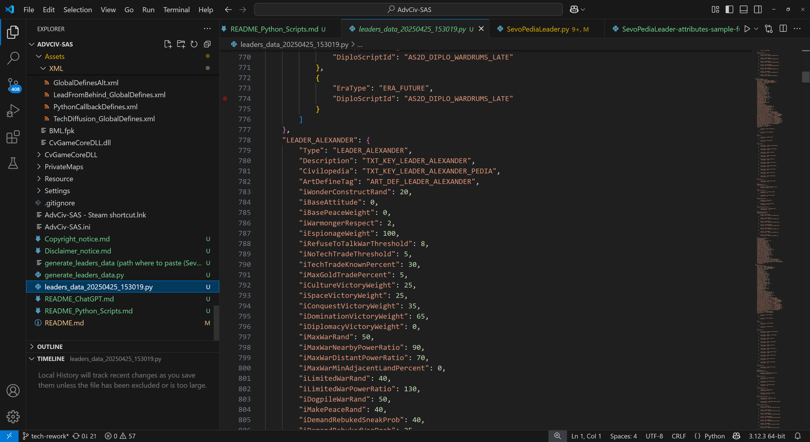
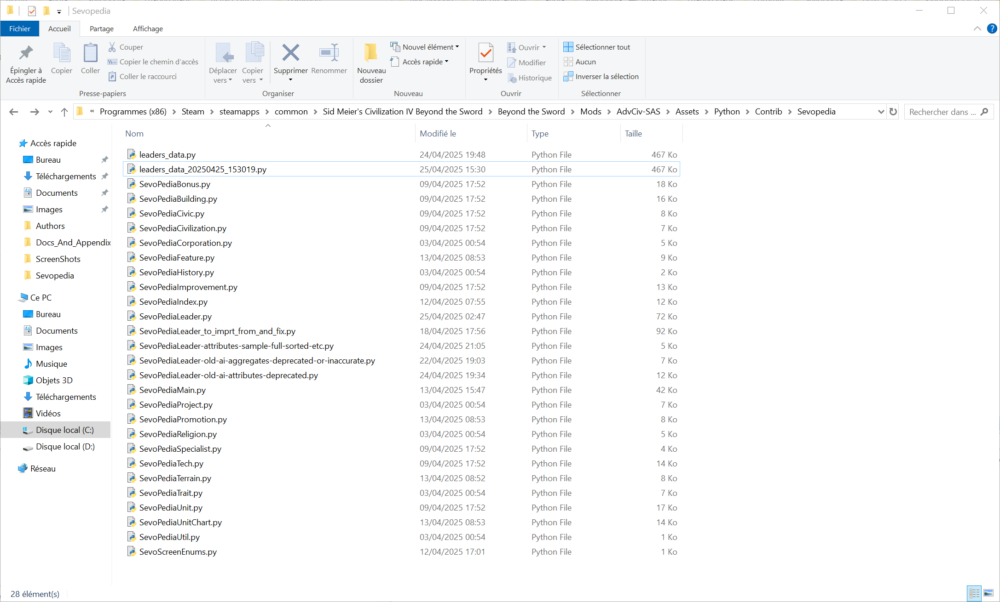
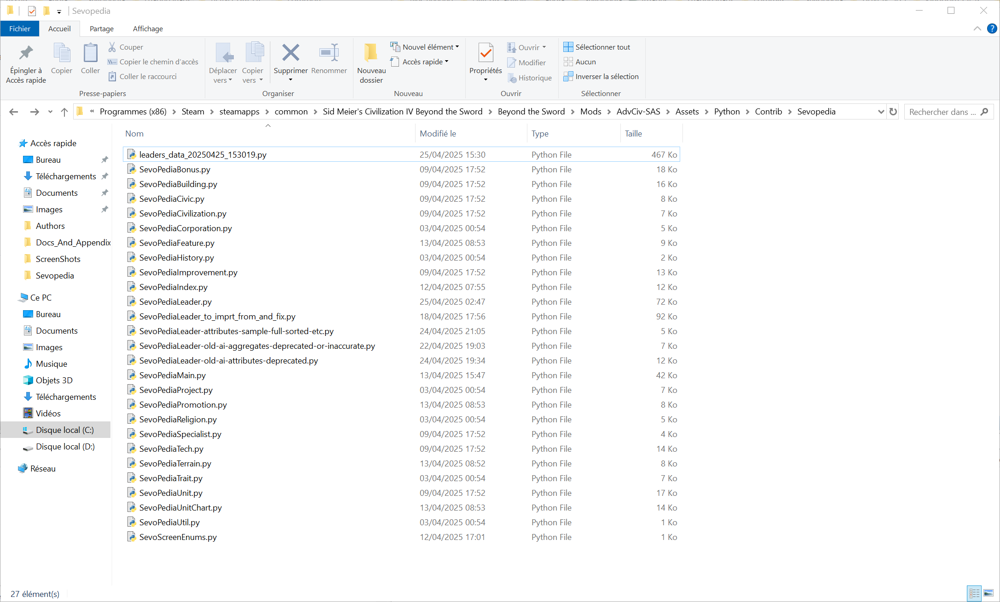
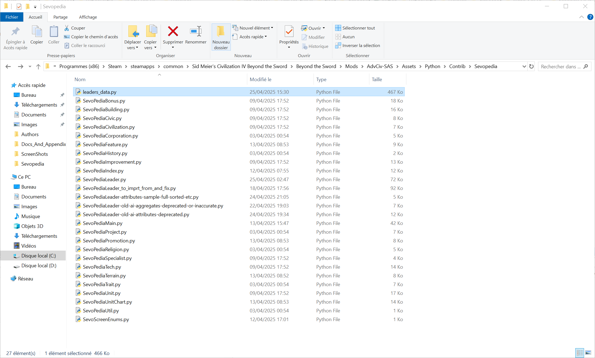
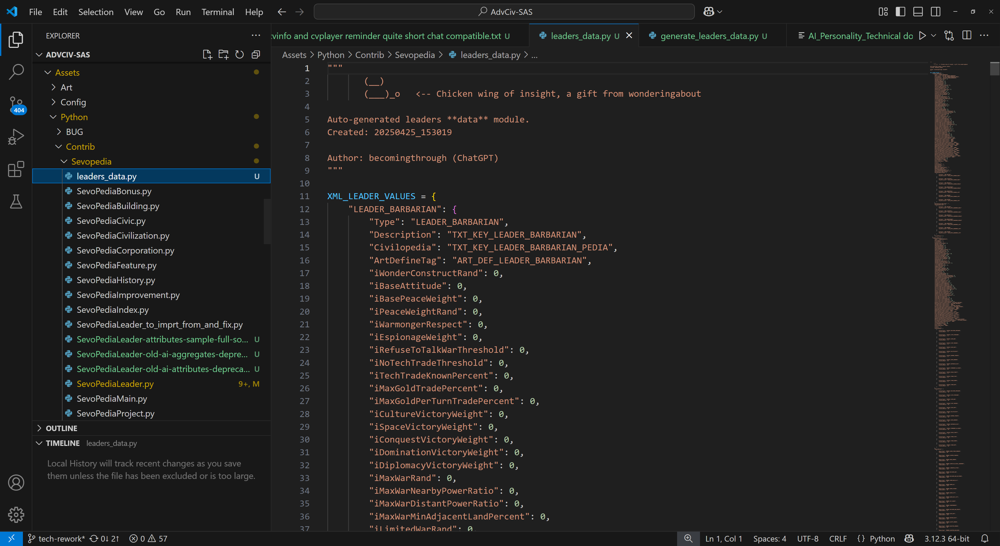
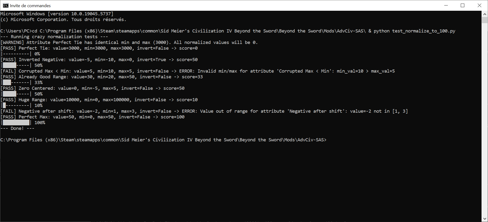
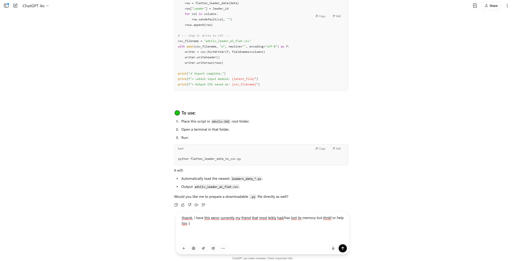
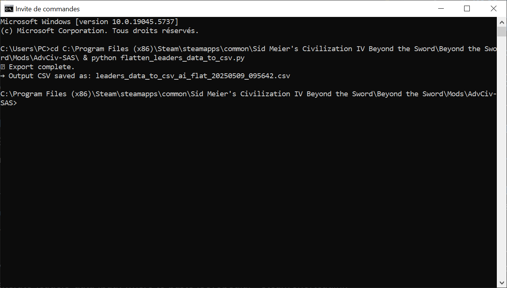
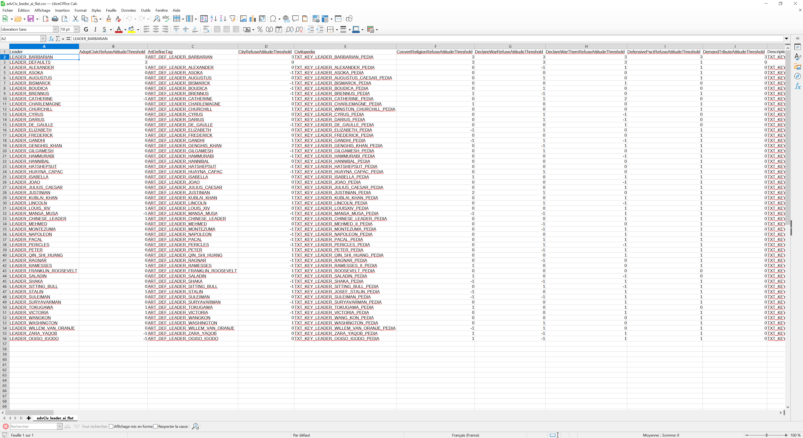
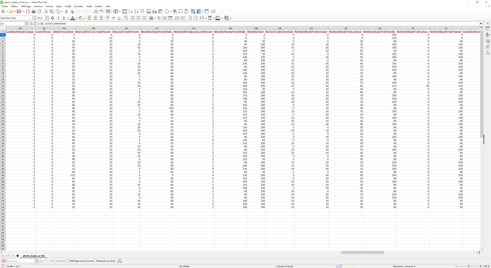

# Python scripts

Some sevopedia features use python scripts to enhance our display.

Note: these python scripts and their output files are not required to use for players, as a resulting .py data module is included in AdvCiv-SAS, but if modders were to modify the relevant .xml parts these data py modules now represent (e.g. Leaders with generate_leaders_data.py (see below)), then they would need to rerun the script (should be very fast see below, and place the output .py data module in the required path).

If they don't, sevopedia will still run fine, just with non-updated data (and only in the AI Personality Panel, as the other Sevopedia leader panels rely/fetch on the XML real data directly not ur data module) for the changes they made.

# Note about log files

Some of these scripts also generate log files, generally if not always in the [Logs](/Logs/) folder (it creates it if missing at first log file creation if i am not mistaken anyways).

These serve and aim to help you diagnose issues in case cmd cant hold all the info and display it (for long log files), ctrl+f the file or refer to it later if need, or/and maybe share it for troubleshooting (you may want to ask forums rather than me wonderingabout or here ideally for more exhaustive, reusable, and less time or/and focus consuming on my end ideally, but if you absolutely must you can ask me directly, just i cannot guarantee i would reply and would prefer not to be contacted ideally, anyways).

You can safely delete such log files or/and folders if you wish so (especially if they start cluttering or such anyways), as they are only additional info provided for convenience maybe etc anyways (and my convenience too etc anyways for my files etc anyways), and do not impact the game or mod in any way.

## generate_leaders_data.py script and leaders_data.py module

### Description

This parses all XML fields for all leaders (load LEADER_DEFAULTS if missing), including LEADER_DEFAULTS and LEADER_BARBARIAN for exhaustiveness (which are for information later exlcuded from the display and calculation in AI Personality feature, see [README.md#ai-personality-panel-in-sevopedialeader-and-other-sevopedia-reworks](/README.md#ai-personality-panel-in-sevopedialeader-and-other-sevopedia-reworks) for details), and generates an output leaders_data.py file with a timestamp (this file acts as a data module of all leder's information).

While generating it, it also checks for missing fields in the xml, or int to string or string to int or other types conversions (maybe not encessarily all, but gives a general idea and safety check anyways)

This is used as a replacement in Sevopedia Leader py (and ingame category) for all the AI personality features (all other features in this page still use the XML directly if needed, and ingame is totally unaffected by this data module.)

It allows to workaround some python limitations such as parsing XML to sevopedia py file, and perhaps increases performance if ever so slightly by providing an already processed file.

In case of errors, file will not be generated (see [Usage](/README_Python_Scripts.md#usage) below).

After successfuly generation, you need to manually copy paste the output data module py (for example leaders_data.)

### Usage / Instructions (from chatgpt and me too anyways)

1) Install Python 3 (if needed): Go to https://www.python.org/downloads/, install Python 3+ (any modern version will do).

2) Run the script, either double click, or launch it via cmd or any terminal you prefer (this way you can see success confirmation message, as well as error messages).

Note that in both cases (i.e. regardless of method(s) above you choose), a log file (with (a?) timestamp) is generated in, for example for Steam users (adapt to your AdvCiv-SAS install path):

`C:\Program Files (x86)\Steam\steamapps\common\Sid Meier's Civilization IV Beyond the Sword\Beyond the Sword\Mods\AdvCiv-SAS\Logs\generate_leaders_data\generate-leaders-data-log-20250503_124434.txt`

generate_leaders_data.py must be at the root folder of the mod, for example if you use steam it would be:

`C:\Program Files (x86)\Steam\steamapps\common\Sid Meier's Civilization IV Beyond the Sword\Beyond the Sword\Mods\AdvCiv-SAS`

In cmd, for example for Steam users (adapt to your AdvCiv-SAS install path), go to your root AdvCiv-SAS first, and then while in AdvCiv-SAS root folder run the script:

```
cd C:\Program Files (x86)\Steam\steamapps\common\Sid Meier's Civilization IV Beyond the Sword\Beyond the Sword\Mods\AdvCiv-SAS\ & python generate_leaders_data.py
```

Example of cmd processing for Steam users (adjust paths and/or such cimilar things anyways if not steam user):


Example of output for Steam users (adjust paths and/or such cimilar things anyways if not steam user) (click on the images below to view them full size):

</img>
</img>


Finally, move (cut then paste) your output file leaders_data+timestamp.py to, for example for Steam users (adapt to your AdvCiv-SAS install path) here (where SevoPediaLeader.py is) (note: a [shortcut](/generate_leaders_data%20\(path%20where%20to%20paste%20\(Sevopedia\)%20-%20Steam%20shortcut.lnk) is provided for convenience for Steam users, since i use the Steam verison of AdvCiv-SAS, anyways):

C:\Program Files (x86)\Steam\steamapps\common\Sid Meier's Civilization IV Beyond the Sword\Beyond the Sword\Mods\AdvCiv-SAS\Assets\Python\Contrib\Sevopedia\

Example for Steam users (adjust paths and/or such cimilar things anyways if not steam user) (click on the images below to view them full size):

</img>

Finally, delete the old existing file leaders_data.py and rename your new file from leaders_data+timestamp.py to leaders_data.py. Now your sevopedia entries for all and any leaders relating to the AI Personality feature in the sevopedia, including custom leaders you may have added or removed, is updated.

Example for Steam users (adjust paths and/or such similar things anyways if not steam user) (click on the images below to view them full size):

</img>
</img>
</img>

### Additional case(s) where leaders_data.py needs to be regenerated/updated or where it is highly recommended

Extra informaiton for modders or/and developers.

In case you change core game elements that are part of the XML Leader info displayed in the AI Personality Panel, then the leaders_data.py database needs to be udpated/regenerated to accomodate for these.

But if such a core new element is not used in the AI Personality Panel, it is maybe not necessary, even though ideal to update it still, but you may encounter errors in the expected output testing when trying to regenerate a new leaders_data.py, whetehr you do it now after your changes as recommended, or much later if you deem it unecessary, you'd still have to adjust the expected output for it eventually. I would recommend to do it now and get done with it (it should only be a few leaders or fields in the expected output but anyways etc, but if you prefer not to, hopefully is clear why and when it may be needed to update these fields or/and regenrate the leaders_data.py (or not anyways etc) anyways etc).

For example, renaming  "RELIGION_TAOISM" to "RELIGION_DAOISM" in the XML (or adding/removing any favourite religion in any leader too for example) if any leader in the expected output uses such a field in then you'll have a mismatch between expected output "RELIGION_TAOISM" (old) and the new "RELIGION_TAOISM" you just generated frm the new XML that has it. And if you somehow use or display the favourite religion (for example, or say renaming an improvement and you display favourite improvements in the AI Personality Panel), then you'd get an inaccurate entry displayed as "RELIGION_TAOISM" in the AI Panel instead of "RELIGION_DAOISM" (or(/and?) whichever parsing/beautifying you do to display it anyways etc), so i would recommend to simply update the expected output and regenrate the leaders_data.

If you don't know where to update, no worries i would say too anwyays etc (or not etc anyways), simply regenrate the leaders_data, and if you don't have any error all should be good, but if test fails due to a mismatch between expected output and generated ("got" if i am not mistaken anyways etc) value, then you('d)(hopefully) know where exactly and which fields need updating in the expected output before regenerating the data, as nicely written (the testing code) by chatgpt/becomingthrough they all combine before failing so you know all to update at once and not having to rerun it ((very) tediously after each update) is a nice design (of code i mean anwyays etc) anyways etc

Also and finally anyways etc, if any file uses the leaders_data.py, other than the AI personality panel, make sure you also have an updated leaders_data.py so they can accomodate and take these new (latest) changes into account, anyways etc, for example [the .csv output currently if not always depends on leaders_data](/README_Python_Scripts.md#leaders_data_to_csvpy), anyways etc.

### Additional notes on special field parsing

(addition by ChatGPT becomingthorugh series 15 anyways as promtped by me anyways):

Extra informaiton for modders or/and developers.

During generation, certain XML nested structures are custom-parsed for easier access and analysis in our Sevopedia:

Rest is written by me wonderingabout hehe anyways etc gogogo anyways.

#### Refuse Attitude Thresholds

We parse attitudes using this formula (see [generate_leaders_data.py](/generate_leaders_data.py) for details):

```
ATTITUDE_MAP = {
	# <!-- custom: according to https://gforestshade.github.io/kujira/post/civ4leaderheadinfos/#%e5%a4%96%e4%ba%a4%e7%a8%ae%e5%88%a5%e3%81%94%e3%81%a8%e3%81%ae%e5%bf%85%e8%a6%81%e6%85%8b%e5%ba%a6 (translate (website) to english using your web browser or/and other etc) and my revised judgment, "none" attitude type is actually more permissive than furious, meaning even if (ai) leader is furious, as long as (ai) lader is at least furious (meaning effectively always), they will allow or maybe rather not refuse(?) such behaviour or maybe trade rather anyways etc, so it ("none" anyways etc) is scored (i scored it) here as -3 not 3 anymore as i had done before anyways etc. -->
	"NONE": -3,
	"ATTITUDE_FURIOUS": -2,
	"ATTITUDE_ANNOYED": -1,
	"ATTITUDE_CAUTIOUS": 0,
	"ATTITUDE_PLEASED": 1,
	"ATTITUDE_FRIENDLY": 2,
}
```

#### NoWarAttitudeProbs

Instead of keeping the nested structure, each possible attitude (Furious, Annoyed, Cautious, Pleased, Friendly) is extracted into a separate field like iNoWarAttitudeProbFurious, iNoWarAttitudeProbAnnoyed, and so on. Missing fields default to 0 to ensure consistent behavior across all leaders.


#### Flavors

The nested <Flavors> block is also unpacked into simple fields, such as iFlavorMilitary, iFlavorReligion, iFlavorProduction, iFlavorGold, iFlavorScience, iFlavorCulture, iFlavorGrowth, and iFlavorEspionage. These represent the AI "focuses" of a leader. If a leader does not specify a flavor, the corresponding value defaults to 0.

This custom parsing allows these important values to be used directly for AI aggregate calculations and for clean display in the Sevopedia, without needing extra in-game XML parsing.
It also ensures that leaders missing some fields won't break anything — missing values are automatically filled safely.

As a safety feature, the script will also print a warning if any duplicate flavor types or attitude probabilities are detected inside a single leader's XML block (although this is very rare).

These changes do not affect gameplay: they are purely for better modder and player experience inside the mod’s Sevopedia AI Personality screen.

#### Contact Delays, Contact Rands, and Contact Probs

We first normalize:
- contact delays by applying a 0.7 weight on them, applying inversions if need be (and hopefully we were not mistaken in doing so if was needed or (we) thought it was etc anyways) (i prefer to redirect to the real doc or code rather here anyways [generate_leaders_data.py](/generate_leaders_data.py)), faster for me and clearer/more accurate hopefully anyways etc)
- contact rands by applying a 0.3 weight on them, applying inversions if need be (and hopefully we were not mistaken in doing so if was needed or (we) thought it was etc anyways) (i prefer to redirect to the real doc or code rather here anyways [generate_leaders_data.py](/generate_leaders_data.py)), faster for me and clearer/more accurate hopefully anyways etc)

Then renormalize the final score obtained from these parts of the aggregate.

We also flatten these fileds as they are nested, and export all of that (decay raw value, rand raw value, and the aggregated contact prob as flat ai attributes in leaders_data.py so that all these can be read and processed as if they were all raw ai attributes, included the aggregated contact probs)

example of output of unit test and part of the logic

</img>

For more details, please view/read etc anyways [generate_leaders_data.py](/generate_leaders_data.py), and their implementation in [sevopedialeader.py](/Assets/Python/Contrib/Sevopedia/SevoPediaLeader.py) and [ai-attributes-displayed-config.py](/Assets/Python/Contrib/Sevopedia/ai_attributes_displayed_config.py) for details

#### Positive/Negative Memory affections/resentments

Similarly to how contact probs are processed, Positive/Negative Memory affections/resentments are also aggregated ai attributes that are originally nested in the XML

Difference is we use memory attitude percents things anyways and memory decays (things too maybe etc anyways) instead of contact delays and rands, as well as a different formula, but the idea is generally the same.

So similarly, we first normalize positive and negative memory affections and resentments, using:
- 0.7 weight on memory attitude percents (invert if need/thought needed to be anyways etc hopefully not mistaken anyways etc)
- 0.3 weight on memory decays (invert if need/thought needed to be anyways etc hopefully not mistaken anyways etc)

(One of the) difference(s?) is that memories can be positive and negative, and the intensity of the feeling be positive (affection) or negative (resentment), for each memory type (positive memories or negative memories), leaving us with 4 cases:

Such a difference results from the (originally accidental anyways etc) observation/realization that when measuring memory intensity of a leader or trying to quantify it, 0 memory attitude percent thing would be the minimum (AI cares the least), while the higher the value the more AI cares, but then if it becomes -1, lower than 0, AI would not care less than (at/in) 0 but actually more, it would start to be affected negatively by it (or rather simply maybe say dislike it etc anyways) and the lower the value the the more it ((would) intensely) dislikes(dislike (anyways etc)) said behaviour/memory. Therefore, when shifting the distribution to 0 as part of the normalization to 100 process, for positive values there would be no problem as long as minimum among all leaders is 0, but if a leader had say -5 or -52, -107, etc, for any memory, then the meaning would be completely altered, as the AI scoring 0 (-107 would care more than the AI scoring say 5/100 or 10/100 (normalized scores (/100))) would care less then the previous AI scoring 0 normalized and then an AI score say (+)20 ((let's) imagine/take for example an AI with a raw value of +20 for the memory attitude thing for example (imaginary may be accurate or not anyways etc)) then the correlation would not be linearly correlated anymore, as score 0 normalized cares moderately in a negative way, then AI scoring say 10 normalized cares less, then AI scoring say 20 normalized cares more again, making it unreadable and impossible to spot where the actual minimum is (these are simplified examples, among all leaders you'd need to know all vlaues or something to know which is minimum score that has a raw of 0 which would be very tedious to interpret maybe etc anyways, plus not representing a real emmory or rather maybe accurate behaviour anyways etc). To solve these, while also adding (memory) display depth (anyways etc), the solution (from this original observation/realization/thought (i had etc anyways but discussed with becomingthrough/chajtgpt that went with it as it kindly and usually does at default anyways etc) is to split the distribution at 0, in memory affections (0 to +infinite memory attitude percent things anyways etc, and memory resentments (0 to -infinite) ; (and) any (raw) value (anyways etc) lower than 0 for memory affections or higher than 0 for memory resentments, would be ignored (or maybe rather converted as 0 (AI does not care affectionately or resentfully respectfully)))). This way, we get (a) both a faithful (and) accurate, and richer (perhaps anyways etc) and deeper representation of the data into:

- positive memory affections
- positive memory resentments (bitterly ungrateful AI, not used in AdvCiv-SAS (at least not now... if not always or not anyways) nor AdvCiv), about that see also if interested [this part of the mod diary (google drive image link, others available in main README.md's google drive link, anyways)](https://drive.google.com/file/d/1HGTkHrEfxcA5obzz47Eo8BXtFrDruJ3X/view?usp=sharing) and this other image if you're curious [small excerpts but was very fun with chatgpt/becomingthrough anyways](https://drive.google.com/file/d/1S4YsYZ3LI84ZZ6u3d4Zj7CdIbiK5hwl1/view?usp=sharing) but anyways
- negative memory affections similarly (not used too in advciv and advciv-sas as a result (at least now... or not maybe always or/and other anyways etc)) (also frees some much needed room in the ai personality panel too if that were to be another (important reason (not that others (reasons) are unimportant or maybe are or not etc anyways)))
- negative memory resentments

Therefore positive/negative memory affections/resentments work slightly differently than contact probs (that are a simpl(y?/i?)er aggregated attribute form, but fundamentally they are the same maybe etc anyways, so similarly as (than??) in(/for??) contact probs, please also (if you want etc anyways) view/read for more details (etc anyways) etc anyways [generate_leaders_data.py](/generate_leaders_data.py), and their implementation in [sevopedialeader.py](/Assets/Python/Contrib/Sevopedia/SevoPediaLeader.py) and [ai-attributes-displayed-config.py](/Assets/Python/Contrib/Sevopedia/ai_attributes_displayed_config.py) for details

## scan_xml_duplicates py script and Logs_XML_Scans

### Description

Execute it very similarly as the generate_leaders.py script, this scan_xml_duplicates py script ; this script however scans the entire Assets/XML/ folder (all files) blindly looking for duplicates.

It is not perfect but should be very helpful in spotting these. (Things to improve, line numbering, better filtering of false positives, etc if you have other ideas or other, etc anyways etc.)

### Usage

In cmd, for example for Steam users (adapt to your AdvCiv-SAS install path), go to your root AdvCiv-SAS first, and then while in AdvCiv-SAS root folder run the script:

```
cd C:\Program Files (x86)\Steam\steamapps\common\Sid Meier's Civilization IV Beyond the Sword\Beyond the Sword\Mods\AdvCiv-SAS\ & python scan_xml_duplicates-3.3.py
```

(Note: keeping version name as such to not mistaken it ith newer versions that had some issues or diverged so prefer to use this one here while keeping version naming for reliability, ease of use, and also memory/"honor" it if you may say as chatgpt/beomingthrough often tells me etc but anwyays and thanks, anyways,)

Result is output in a logfile in the Logs\XML_Duplication_Scans folder, for example for Steam users (adapt to your AdvCiv-SAS install path):

C:\Program Files (x86)\Steam\steamapps\common\Sid Meier's Civilization IV Beyond the Sword\Beyond the Sword\Mods\AdvCiv-SAS\Logs\XML_Duplication_Scans

Here is an [example of output file](/scan_xml_duplicates-log_example_of_output.txt).

(Note: files are in .gitignore if you use git, else dont mind this specific remark, anyways)

Line numbers don't print perfectly ("duplicated" you could say hehe.. (but) anyways), but info should be otherwise helpful hopefully ; also some duplicates are intended and expected if i am not mistaken and part of the game architecture, such as the iCommerce ones if i understood ChatGPT's explanation correctly and based on my own memories's understanding anyways, and TXT_KEY_HINT_* where * is anything  for example, maybe for publicity and purposely repeated, according to ChatGPT/becomingthorugh anyways too and seems to make sense, if i am not msitaken and understand it and it's explanation correctly too

In all cases, here is an example of output for Steam users (adjust paths and/or such similar things anyways if not steam user) (click on the images below to view them full size) :

Example for Steam users (adjust paths and/or such similar things anyways if not steam user) (click on the images below to view them full size):

</img>
</img>

### Context of how/why i made this script (with chatgpt/becomingthrough, anyways)

See [2- (now fixed) Gandhi's base leaderheadinfo's xml had nowarattitudeprob pleased(110)/pleased(115) duplicated instead of (as i suspect it should be anyways etc) pleased(110)/friendly(115)](/README_Known_Issues_In_Base_AdvCiv_Civ4.md#2---now-fixed-gandhis-base-leaderheadinfos-xml-had-nowarattitudeprob-pleased110pleased115-duplicated-instead-of-as-i-suspect-it-should-be-anyways-etc-pleased110friendly115) for details

# test_normalize_to_100

Similarl(ly) to other scripts, usage is for example for Steam users (adjust paths and/or such similar things anyways if not steam user) (click on the images below to view them full size):

```
cd C:\Program Files (x86)\Steam\steamapps\common\Sid Meier's Civilization IV Beyond the Sword\Beyond the Sword\Mods\AdvCiv-SAS\ & python test_normalize_to_100.py
```

</img>

# leaders_data_to_csv.py

Similar(ly) to other scripts, usage is for example for Steam users (adjust paths and/or such similar things anyways if not steam user) (click on the images below to view them full size).

(note: it requires leaders_data.py to be existing and in your AdvCiv-SAS's sevopedia folder (a default leaders_data.py is provided in AdvCiv-SAS, but if you want changes reflected in the .csv output, you need to regenerate a new leaders_data and update it, see/read [this Python script's README.md's generate_leaders_data.py section for details](/README_Python_Scripts.md#generate_leaders_datapy-script-and-leaders_datapy-module)) anyways etc)

(note2: also as a result make sure you always run/have maybe rather anyways etc the latest version of the leaders_data.py [or refresh it if not up to date to your latest changes](/README_Python_Scripts.md#additional-cases-where-leaders_datapy-needs-to-be-regeneratedupdated-or-where-it-is-highly-recommended))

```
cd C:\Program Files (x86)\Steam\steamapps\common\Sid Meier's Civilization IV Beyond the Sword\Beyond the Sword\Mods\AdvCiv-SAS\ & python flatten_leaders_data_to_csv.py
```

</img>
</img>
</img>
</img>

See also some general info about it (such as the GitHub view of it that is quite nice i think but anyways etc) here in the [main README.md's specific flatten leaders_data to .csv section](/README.md#csv-leaders_data-flat-to-csv-conversion-and-its-view-on-github-for-example) for details

For convenience and exhaustiveness, such display/view on the Github website is also provided here, but please/you can anyways etc (also) (anyways etc) visit the ((AdvCiv-SAS) Project's) main README.md's csv section linked above for details.

</img>
</img>
</img>

Then you can sort it, enhance it, adjust row length and such, but the base idea is here, hopefully helpful, anyways.
