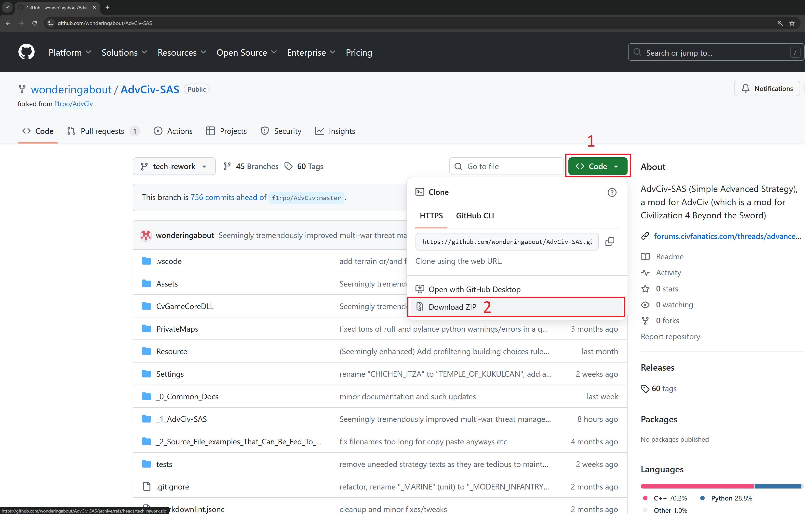
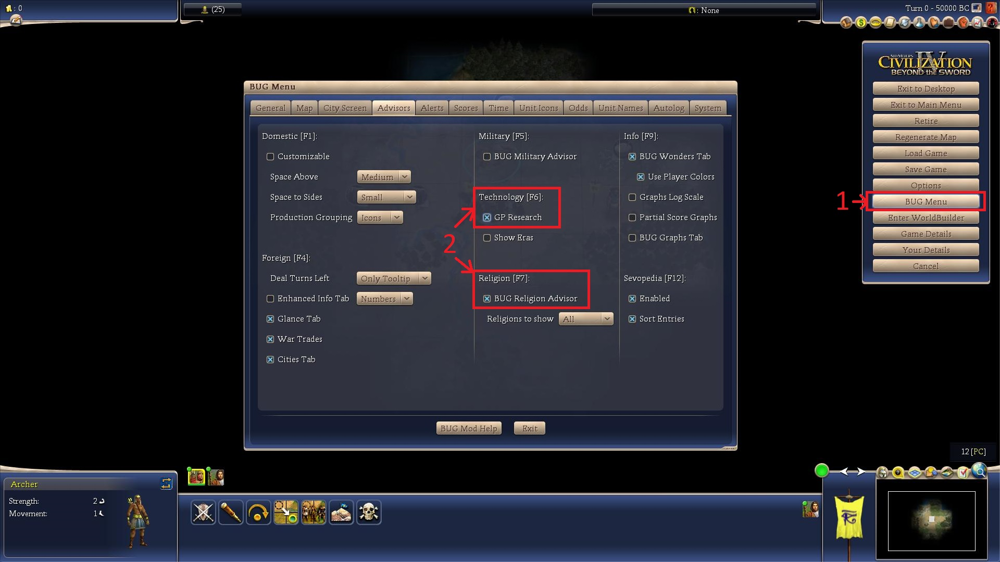

# Install Civilization 4 Beyond the Sword and the AdvCiv-SAS mod

To install and play this mod AdvCiv-SAS, you can follow the steps in this document/readme.

## Menu

[Install Civilization 4 Beyond the Sword (skip if already done)](/_1_AdvCiv-SAS/Docs/README_Quick_Install_Setup_Guide.md#install-civilization-4-beyond-the-sword-skip-if-already-done)  
[Download this mod AdvCiv-SAS](/_1_AdvCiv-SAS/Docs/README_Quick_Install_Setup_Guide.md#download-this-mod-advciv-sas)  
&emsp;[Stable Version](/_1_AdvCiv-SAS/Docs/README_Quick_Install_Setup_Guide.md#stable-version)  
&emsp;[Development version](/_1_AdvCiv-SAS/Docs/README_Quick_Install_Setup_Guide.md#development-version)  
&emsp;[Any version](/_1_AdvCiv-SAS/Docs/README_Quick_Install_Setup_Guide.md#any-version)  
[Extract the mod to your civ4 folder](/_1_AdvCiv-SAS/Docs/README_Quick_Install_Setup_Guide.md#extract-the-mod-to-your-civ4-folder)  
[Place a shortcut of the mod on your desktop](/_1_AdvCiv-SAS/Docs/README_Quick_Install_Setup_Guide.md#place-a-shortcut-of-the-mod-on-your-desktop)  
[Version number](/_1_AdvCiv-SAS/Docs/README_Quick_Install_Setup_Guide.md#version-number)  
[Upgrading/Downgrading version of the mod](/_1_AdvCiv-SAS/Docs/README_Quick_Install_Setup_Guide.md#upgradingdowngrading-version-of-the-mod)  
[If you have trouble downloading/installing/using/upgrading/downgrading the mod](/_1_AdvCiv-SAS/Docs/README_Quick_Install_Setup_Guide.md#if-you-have-trouble-downloadinginstallingusingupgradingdowngrading-the-mod)  
&emsp;[Full Development version (to modify it yourself)](/_1_AdvCiv-SAS/Docs/README_Quick_Install_Setup_Guide.md#full-development-version-to-modify-it-yourself)  
[Configure your game](/_1_AdvCiv-SAS/Docs/README_Quick_Install_Setup_Guide.md#configure-your-game)  
&emsp;[General ideas](/_1_AdvCiv-SAS/Docs/README_Quick_Install_Setup_Guide.md#general-ideas)  
&emsp;[Relevant BUG Menu Options — enable if needed](/_1_AdvCiv-SAS/Docs/README_Quick_Install_Setup_Guide.md#relevant-bug-menu-options--enable-if-needed)  
[Settings if you want to develop/modify the mod or try some autoplay or such anyways etc (skip this section if only playing without wanting extra details)](/_1_AdvCiv-SAS/Docs/README_Quick_Install_Setup_Guide.md#settings-if-you-want-to-developmodify-the-mod-or-try-some-autoplay-or-such-anyways-etc-skip-this-section-if-only-playing-without-wanting-extra-details)  
[Where to download more/other mods](/_1_AdvCiv-SAS/Docs/README_Quick_Install_Setup_Guide.md#where-to-download-moreother-mods)  

## Install Civilization 4 Beyond the Sword (skip if already done)

First you need to install (or have it installed already) Civilization 4 Beyond the Sword. (skip if already done)

If you don't have the game, i recommend buying it from GOG rather than Steam (i have no affiliation with either xd, although i have the steam version myself for convenience and such, as the executable or whatever they call it is cleaner and closer if not entirely unmodified unlike the Steam one if i am not mistaken, but check to be sure).

It should work fine with the Steam one too, but given the choice again i may have bought it from GOG rather hehe, although it is not certain as Steam one is convenient too for library access of other games or centralized games lbirary for me i mean or such, but i hope this information helps you decide in this case i mean but anyways etc, check if i am not mistaken i mean too or for extra or updated info if any change has been made since maybe.

## Download this mod AdvCiv-SAS

### Stable Version

You can download the latest stable version from:

- the [CFC Modpacks downloads page](https://forums.civfanatics.com/resources/advciv-sas-simple-advanced-strategy.32513/)
- the [ModDB website](https://www.moddb.com/mods/advciv-sas-simple-advanced-strategy)
- or alternatively from GitHub (you can get it from the [github tags](https://github.com/wonderingabout/AdvCiv-SAS/tags) page (that also has links to cumulative changes since last version in git history format for each version), or clone from github if you know how as you prefer).

### Development version

If you want the latest functionnalities even if it might be buggy (generally not, but saying this just in case it might be), consider also testing the development version! It should be further enhanced with possibly a stronger AI or/and other changes if any (if you want to see the list of changes, see the [git commit history, as of now here](https://github.com/wonderingabout/AdvCiv-SAS/commits/tech-rework/)).

To download the development version, go to the [mod's github main page](https://github.com/wonderingabout/AdvCiv-SAS), and click on the green rectangle on the top right, then click "download zip".

(example of how to do it in the screenshot below, click to view it full screen anyways etc)

</img>

Note: the 48 civs DLL may often not be updated in this version as it is tedious to do so at every development version change, but the default 18 civs DLL should be; see [README.md#48-civs-dll](/README.md#48-civs-dll) for details and to be sure anyways etc.

Note 2: if you want to modify AdvCiv-SAS, this player development version is missing some files, see [Full Development version (to modify it yourself)](/_1_AdvCiv-SAS/Docs/README_Quick_Install_Setup_Guide.md#full-development-version-to-modify-it-yourself) for details.

### Any version

With github you can actually download the mod at any version/commit if i'm not mistaken, but it is a bit less intuitive how to do it if you don't know how, todo write anyways etc.

## Extract the mod to your civ4 folder

Extract the archive in the Mods folder of your civ4 BTS/BTS folder (be careful twice BTS (i.e. "Beyond The Sword")), for example, using Steam the path of AdvCiv-SAS should be **(remove version name such as "-5030" or any name like "-tech-rework" (git branch name, remove when extracting to your civ4 mods folder)** or similar or anything else xd in your folder destination name so it is **strictly "AdvCiv-SAS"**):

```C:\Program Files (x86)\Steam\steamapps\common\Sid Meier's Civilization IV Beyond the Sword\Beyond the Sword\Mods\AdvCiv-SAS\```

If you don't use Steam you can still play this AdvCiv-SAS mod, you'll just have to change the path to where civ4 was installed (and might have less DRMs at the same time so may be even better as you prefer).

Note: be careful while extracting, a common error (which i made too having no clue why it didn't work...) is to extract with an extra subfolder, then i don't think the game would function. So for example for the steam version of the game, one of the mod files such as AdvCiv-SAS.ini should be found in `C:\Program Files (x86)\Steam\steamapps\common\Sid Meier's Civilization IV Beyond the Sword\Beyond the Sword\Mods\AdvCiv-SAS\AdvCiv-SAS.ini` and NOT in `C:\Program Files (x86)\Steam\steamapps\common\Sid Meier's Civilization IV Beyond the Sword\Beyond the Sword\Mods\AdvCiv-SAS\AdvCiv-SAS\AdvCiv-SAS.ini` (i.e. don't do this `\AdvCiv-SAS\AdvCiv-SAS\`).

## Place a shortcut of the mod on your desktop

Finally, add a shortcut to your desktop which link is, for example for Steam:

```"C:\Program Files (x86)\Steam\steamapps\common\Sid Meier's Civilization IV Beyond the Sword\Beyond the Sword\Civ4BeyondSword.exe" mod=\AdvCiv-SAS```

For convenience i have also provided a steam shortcut of this same link just above (since this is the version i have i.e. the steam one of the game anyways etc), ready to use, (AdvCiv-SAS - Steam shortcut.lnk). You can just move (cut then paste, it's just a link so is safe) it to the desktop for your convenience.

Note: you can do this same process (download and install a Civ 4 mod(s), then place a shortcut of it to desktop or wherever you want/prefer if i'm not mistaken but anyways etc) for any number of mods you want, just extract it in same Mods folder but with a different folder name, for example you could play Cavemen2Cosmos, Realism Invictus, even AdvCiv alongside AdvCiv-SAS as long they are in different folders, they are/should be totally indepedent in theory if i'm not mistaken anyways etc, the settings or files of one will/should not override or affect the other mods, thanks to the very awesome design of Civ 4, thanks!

## Version number

See [/README.md#version-number](/README.md#version-number)

## Upgrading/Downgrading version of the mod

If you want to change the version of AdvCiv-SAS (be it an upgrade to a newer version, or a downgrade to an older version, process is the same anyways etc), delete the entire mod folder and put instead your new version of AdvCiv-SAS (deleting it does not delete savegames as they are not located in this mod folder anyway if i'm not mistaken anyways etc) (or/and make a backup if you want to be safe of the old AdvCiv-SAS folder until you see all works well or want to keep it longer in case anyways etc, but it shouldn't be useful unless the development version crashes and you want to switch back (even then you could just redownload it if you want to)).

## If you have trouble downloading/installing/using/upgrading/downgrading the mod

Consider asking the question in [the AdvCiv-SAS CFC forum's discussion thread here](/https://forums.civfanatics.com/threads/advciv-sas-simple-advanced-strategy.699716/) rather than messaging me privately (although i don't mind, just it would be more useful if other people see the question (and does some publicity for me xd at the same time if i may say shamelessly xd but anyways etc, although it is a non-financial profit mod if i may say too but anyways etc...) and reply in case they encounter same issue or/and such, but do as you prefer and hopefully i or/and others can provide some help if i may say i mean but anyways etc).

### Full Development version (to modify it yourself)

If you want to modify AdvCiv-SAS, the player "download ZIP" options do not include all files (images, some texts, etc.) as they are not needed just to play yet take significant size needlessly.

You'd need to git clone this repo or some similar method so that the exclusion list at [`.gitattributes`](../../.gitattributes) is not applied.

## Configure your game

### General ideas

Recommended, change your config as you prefer. For example as for me, i play at 1920x1080 (seems to display best ingame, even though i have a larger screen actually (4K but anyways etc) i also optimized sevopedia features like the AI personality panel for 1920x1080 (but may work as well for higher resolutions although i didn't test it but anyways etc)) in full screen, but when i need to debug or test the windowed mode is so much more practical.

There are some options i use personally xd but anyways etc in ingame settings then like if i'm not mistaken (from memory since i can't find the txt files where i stored it if i ever did (which i think i did but anyways etc)), so do as you prefer, but as for me i use these civ4 options for example if not already enabled before anyways etc (non-exhaustive in case i forgot / didn't show some anyways etc):

- wait at end of turn
- quick attack
- quick defense
- quick moves
- single unit graphics
- numbers on city bar

Then in BUG Menu options i also use this for example hehe but do as you prefer as well anyways etc (non-exhaustive in case i forgot / didn't show some anyways etc):

- wide city bars

### Relevant BUG Menu Options — enable if needed

Some of the [UI reworks or changes mentionned in the Main Changes Guide](/_1_AdvCiv-SAS/Docs/README_Main_Changes_Guide.md#ui-in-game) require to enable the corresponding **BUG MENU**'s Option to see them.

For example, to see the tech bulbing indicators, enable "GP Research" in the BUG Menu -> Advisors tab.

</img>

Note 2: the tech bulbing indicators may be disabled at turn 0, but should if so appear at turn 1 onwards. See [KI#85](/_1_AdvCiv-SAS/Docs/README_Known_Issues_In_Base_AdvCiv_Civ4.md#85---corrected-explanation-bug-tech-advisors-bulbing-indicators-causing-pregamestart-cvappinterface-error-at-turn-0-so-as-in-base-advciv-it-is-disabled-at-this-turn-and-enabled-only-from-turn-1-onwards-but-base-advcivs-explanation-about-it-affecting-very-large-maps-was-incorrect-happened-on-a-standard-size-map-as-well).

## Settings if you want to develop/modify the mod or try some autoplay or such anyways etc (skip this section if only playing without wanting extra details)

(skip this section if only playing without wanting extra details)

If you're developping a mod, or simply want to run some autoplays or such yourself, you'd most likely want to enable debug mode as well as do autoplay runs yourself. See [Modding_Ressources/README.md#how-to-autoplay-let-the-ai-play-for-you-super-fast-gameplay--testing-tool-anyways-etc-in-map-loaded-save-file-new-game-etc-view-anyways-etc](/_1_AdvCiv-SAS/Docs/Modding_Ressources/README.md#how-to-autoplay-let-the-ai-play-for-you-super-fast-gameplay--testing-tool-anyways-etc-in-map-loaded-save-file-new-game-etc-view-anyways-etc) for details on how to do it and such anyways etc.

Also, if you're developping/modding or doing autoplays or such, i highly recommend "windowed" rather than fullscreen (`fullscreen = 0` in CivilizationIV.ini file (or maybe in ingame settings although i didn't test it but anyways etc)), as this is so much more convenient in order to do screenshots and browse them easily, as well as go back and forth to your windows folders without having a lag of several seconds everytime you click outside of the game, etc. Otherwise fullscreen is nice for playing i think and much more immersive at least i'd prefer it i think, but fullscreen is way too tedious when modding and testing etc.

## Where to download more/other mods

If you want to try/play other mods than AdvCiv-SAS or browse them (but you may already know if you downloaded this, still, or if not, maybe this can help you too), consider visiting, among other possible sources/websites:

- CivFanatics Center (also known as CFC) 's forums -> Civ 4 forum -> Modpacks forum (is a forum of a forum called a forum(?)): [civfanatics website's civ4 modpacks forum](https://forums.civfanatics.com/forums/civ4-modpacks.171/) or the [civfanatics website's civ4 modpacks downloads section](https://forums.civfanatics.com/resources/categories/civ4-modpacks.2/)
- ModDB (but does not have as much mods i think, AdvCiv (base mod) is not listed for example (which is the most interesting of the AdvCiv mods i think, except my awesome (xd but anyways etc) mod maybe as interesting maybe as AdvCiv)): [ModDB website (Civilization 4 Mods)](https://www.moddb.com/games/civilization-iv/mods) anyways etc.

But i say it just for exhaustiveness, even though i am (quite) friendly i think, i prefer to stay alone and relax and do my own things, so i might get stressed if you contact me.. Still, if this project would help you reader or even those who don't read, i may be quite happy of it, especially as i contribute(d) to it.
