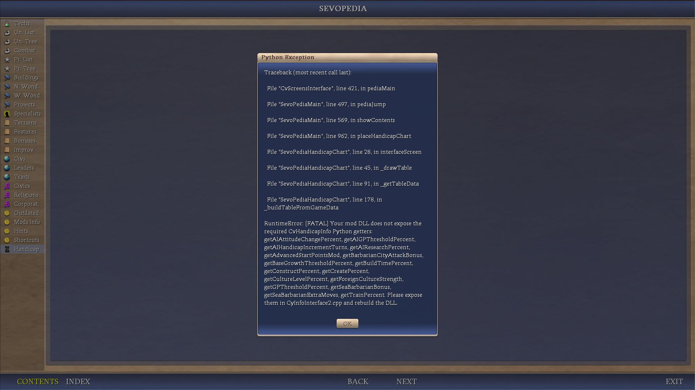
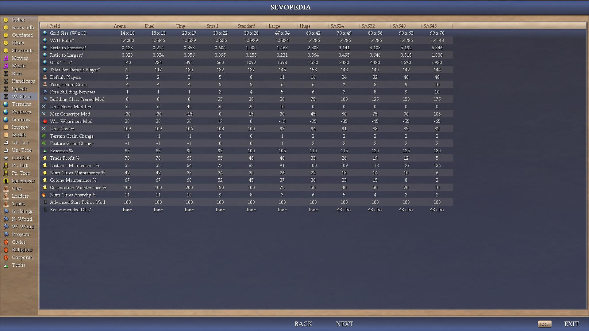
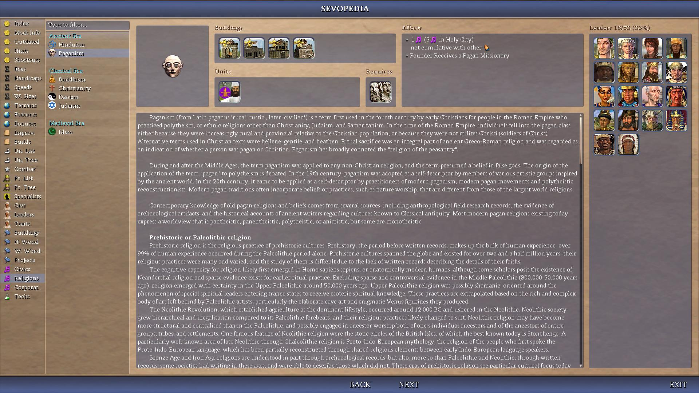
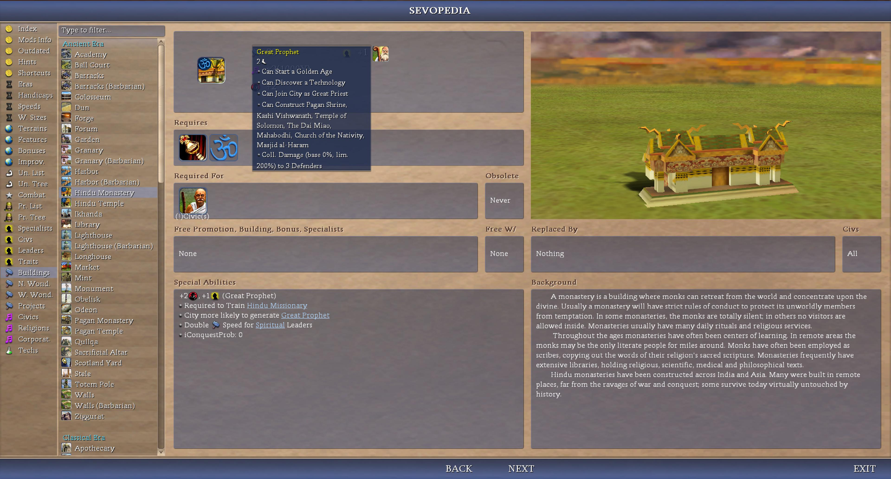

# README_Sevopedia_Reworks.md

Below are more detailed examples of the Sevopedia reworks.

Not always listed in each specific Sevopedia category as would be tedious and redundant and all, but several Sevopedia pages now have their entries optionally groupable (as of now default) by various options, such as civic type (e.g. Government, Economy, etc.) in the first implementation, or eras (Ancient Era, Classical Era, No Tech Prerequisite, etc.), and various other types of groupings. See [_sevopedia_main_groupings.py](/Assets/Python/Contrib/Sevopedia/_sevopedia_main_groupings.py).

Note: some many minor changes such as in Sevopedia traits beautification changes may not be mentioned here for concision or effectiveness.

Note 2: in below sample examples, click the images to view them full size.

## Menu

[Some Lower Level Changes or new features](/_1_AdvCiv-SAS/Docs/README_Sevopedia_Reworks.md#some-lower-level-changes-or-new-features)  
&emsp;[example 0.0: heavily refactored Sevopedia maintain so it is much easier to maintain or customize](/_1_AdvCiv-SAS/Docs/README_Sevopedia_Reworks.md#example-00-heavily-refactored-sevopedia-maintain-so-it-is-much-easier-to-maintain-or-customize)  
&emsp;[example 0.1: added a search bar. Used in several Sevopedia pages](/_1_AdvCiv-SAS/Docs/README_Sevopedia_Reworks.md#example-01-added-a-search-bar-used-in-several-sevopedia-pages)  
&emsp;[example 0.2: added keyboard arrow (UP/DOWN and LEFT/RIGHT) navigation support. Used in several Sevopedia pages](/_1_AdvCiv-SAS/Docs/README_Sevopedia_Reworks.md#example-02-added-keyboard-arrow-updown-and-leftright-navigation-support-used-in-several-sevopedia-pages)  
&emsp;[example 0.3: Index As Category](/_1_AdvCiv-SAS/Docs/README_Sevopedia_Reworks.md#example-03-index-as-category)  
[Other new categories](/_1_AdvCiv-SAS/Docs/README_Sevopedia_Reworks.md#other-new-categories)  
&emsp;[Widget Python 6798 to link (e.g. for Builds, for Traits)](/_1_AdvCiv-SAS/Docs/README_Sevopedia_Reworks.md#widget-python-6798-to-link-eg-for-builds-for-traits)  
&emsp;&emsp;[example 0.40 builds category (e.g. "Remove Jungle", "Build Road", "Create a Farm")](/_1_AdvCiv-SAS/Docs/README_Sevopedia_Reworks.md#example-040-builds-category-eg-remove-jungle-build-road-create-a-farm)  
&emsp;&emsp;[example 0.41 Votes category (VoteInfo and VoteSourceInfos)](/_1_AdvCiv-SAS/Docs/README_Sevopedia_Reworks.md#example-041-votes-category-voteinfo-and-votesourceinfos)  
&emsp;&emsp;[example 0.42 EventTriggers category (EventTriggerInfo and EventInfo cards)](/_1_AdvCiv-SAS/Docs/README_Sevopedia_Reworks.md#example-042-eventtriggers-category-eventtriggerinfo-and-eventinfo-cards)  
&emsp;[Charts (e.g. Handicap Chart, Game Speed Chart, World Sizes Chart, Eras Chart)](/_1_AdvCiv-SAS/Docs/README_Sevopedia_Reworks.md#charts-eg-handicap-chart-game-speed-chart-world-sizes-chart-eras-chart)  
&emsp;&emsp;[example 0.5: Handicap Chart category](/_1_AdvCiv-SAS/Docs/README_Sevopedia_Reworks.md#example-05-handicap-chart-category)  
&emsp;&emsp;[example 0.6: Game Speed Chart category](/_1_AdvCiv-SAS/Docs/README_Sevopedia_Reworks.md#example-06-game-speed-chart-category)  
&emsp;&emsp;[example 0.7: World Sizes Chart category](/_1_AdvCiv-SAS/Docs/README_Sevopedia_Reworks.md#example-07-world-sizes-chart-category)  
&emsp;&emsp;[example 0.8: Eras Chart category](/_1_AdvCiv-SAS/Docs/README_Sevopedia_Reworks.md#example-08-eras-chart-category)  
&emsp;&emsp;[example 0.90: Media Player](/_1_AdvCiv-SAS/Docs/README_Sevopedia_Reworks.md#example-090-media-player)  
&emsp;&emsp;[example 0.91: Movies category (with audio support)](/_1_AdvCiv-SAS/Docs/README_Sevopedia_Reworks.md#example-091-movies-category-with-audio-support)  
&emsp;&emsp;[example 0.92: Music category (~1750 audio scripts playable in Sevopedia)](/_1_AdvCiv-SAS/Docs/README_Sevopedia_Reworks.md#example-092-music-category-1750-audio-scripts-playable-in-sevopedia)  
&emsp;&emsp;[example 0.93: Expanded text panel (with EXPAND and CLOSE buttons)](/_1_AdvCiv-SAS/Docs/README_Sevopedia_Reworks.md#example-093-expanded-text-panel-with-expand-and-close-buttons)  
&emsp;&emsp;[example 0.94: Expanded content (non-text; e.g., animation) panel (with EXPAND, RELOAD, and CLOSE buttons)](/_1_AdvCiv-SAS/Docs/README_Sevopedia_Reworks.md#example-094-expanded-content-non-text-eg-animation-panel-with-expand-reload-and-close-buttons)  
&emsp;&emsp;[example 0.95: Expanded leaderhead panel](/_1_AdvCiv-SAS/Docs/README_Sevopedia_Reworks.md#example-095-expanded-leaderhead-panel)  
[Sevopedia Pages individual reworks](/_1_AdvCiv-SAS/Docs/README_Sevopedia_Reworks.md#some-lower-level-changes-or-new-features)  
&emsp;[example 1: leaders category (AI Personality and other changes)](/_1_AdvCiv-SAS/Docs/README_Sevopedia_Reworks.md#example-1-leaders-category-ai-personality-and-other-changes)  
&emsp;[example 1.5: traits category (Traits Charts and other changes)](/_1_AdvCiv-SAS/Docs/README_Sevopedia_Reworks.md#example-15-traits-category-traits-charts-and-other-changes)  
&emsp;[example 1.6: techs category (Starting and Untradeable Techs Charts and other changes)](/_1_AdvCiv-SAS/Docs/README_Sevopedia_Reworks.md#example-16-techs-category-starting-and-untradeable-techs-charts-and-other-changes)  
&emsp;[example 2: unit chart category](/_1_AdvCiv-SAS/Docs/README_Sevopedia_Reworks.md#example-2-unit-chart-category)  
&emsp;[example 3: features category](/_1_AdvCiv-SAS/Docs/README_Sevopedia_Reworks.md#example-3-features-category)  
&emsp;[example 3.5: improvements category (Improvement Weights (Leaders) Chart and other changes)](/_1_AdvCiv-SAS/Docs/README_Sevopedia_Reworks.md#example-35-improvements-category-improvement-weights-leaders-chart-and-other-changes)  
&emsp;[example 4: bonuses category](/_1_AdvCiv-SAS/Docs/README_Sevopedia_Reworks.md#example-4-bonuses-category)  
&emsp;[example 5: religion category](/_1_AdvCiv-SAS/Docs/README_Sevopedia_Reworks.md#example-5-religion-category)  
&emsp;[example 6: civilization category](/_1_AdvCiv-SAS/Docs/README_Sevopedia_Reworks.md#example-6-civilization-category)  
&emsp;[example 7: units category](/_1_AdvCiv-SAS/Docs/README_Sevopedia_Reworks.md#example-7-units-category)  
&emsp;[example 8: buildings category](/_1_AdvCiv-SAS/Docs/README_Sevopedia_Reworks.md#example-8-buildings-category)  
&emsp;[example 9: terrains category](/_1_AdvCiv-SAS/Docs/README_Sevopedia_Reworks.md#example-9-terrains-category)  
&emsp;[example 10: specialists category](/_1_AdvCiv-SAS/Docs/README_Sevopedia_Reworks.md#example-10-specialists-category)  
&emsp;[example 11: shortcuts category](/_1_AdvCiv-SAS/Docs/README_Sevopedia_Reworks.md#example-11-shortcuts-category)  
&emsp;[example 12: promotions category](/_1_AdvCiv-SAS/Docs/README_Sevopedia_Reworks.md#example-12-promotions-category)  
&emsp;[example 13: civics category](/_1_AdvCiv-SAS/Docs/README_Sevopedia_Reworks.md#example-13-civics-category)  
&emsp;[example 14: projects category](/_1_AdvCiv-SAS/Docs/README_Sevopedia_Reworks.md#example-14-projects-category)  
&emsp;[example 15: corporations category](/_1_AdvCiv-SAS/Docs/README_Sevopedia_Reworks.md#example-15-corporations-category)  

## Some Lower Level Changes or new features

Here are some lower level changes we did to the Sevopedia, such as adding a search bar in many pages, keyboard navigation using the UP/DOWN arrows, etc.

Note: some other changes such as caching, header groupings, etc. are not mentioned here but instead in their respective sections in this doc or in other docs.

## example 0.0: heavily refactored Sevopedia maintain so it is much easier to maintain or customize

Havily simplified Sevopedia Main that had tons of spaghetti and was super hard to maintain. Now, category creation is centralized instead of being scattered, and it is much easier to add or reorder categories. This served as the backbone for further Sevopedia expansions much easier onwards.

See [commit/aca192481508a3cac3e8812dc970aebc8675b874](https://github.com/wonderingabout/AdvCiv-SAS/commit/aca192481508a3cac3e8812dc970aebc8675b874).

Following this, i notably reordered categories and changed their allocated char icons to what i find prettier or more intuitive or relevant. Examples in other Sevopedia screenshots.

### example 0.1: added a search bar. Used in several Sevopedia pages

In AdvCiv-SAS 5247, with the help of claude opus 4.5 and chatgpt 5.2, we introduced a search bar in AdvCiv-SAS that is shared by several Sevopedia pages. It allows to **search** for entries using the **keyboard**.

The code is in [SevoPediaMain.py](/Assets/Python/Contrib/Sevopedia/SevoPediaMain.py). It minimally modifies a base AdvCiv 1.12 Sevopedia Main, and so it should be compatible with most mods (but check to be sure as i don't know too much about these). Seemingly fully functional ingame.

- 1st commit: It minimally modifies a base AdvCiv 1.12 Sevopedia Main, and so it should be compatible with most mods (but check to be sure as i don't know too much about these). Seemingly fully functional ingame: [commit/6c67df16f99479500a820d34dddd4f4fe569bc8e](https://github.com/wonderingabout/AdvCiv-SAS/commit/6c67df16f99479500a820d34dddd4f4fe569bc8e).
- 2nd commit: now preserves headers and spacers, and seemingly functions just as well if groupings (headers + their spacers) are disabled, as in `SAS_SEVOPEDIA_MAIN_TECHS_GROUP_BY_ERA` for instance. See screenshot provided showing this being supported successfully in this sample: [commit/7b0f94bf009b78d5b193ef671742dcbc04efcc17](https://github.com/wonderingabout/AdvCiv-SAS/commit/7b0f94bf009b78d5b193ef671742dcbc04efcc17).
- 3rd commit: fix backspace key (delete to the left last written char if any) firing twice when pressed once in the search bar. Note: no need to support delete to the right key nor enter key as per chatgpt 5.2 and claude opus 4.5's review and solution thanks [commit/1b9d2c8d9eee565d2f5d7b5daba48514cb823234](https://github.com/wonderingabout/AdvCiv-SAS/commit/1b9d2c8d9eee565d2f5d7b5daba48514cb823234).
- 4th commit: Sevopedia index has a search bar too and is its own category, with the very nice help of GPT-5.2-Codex thanks a lot: [commit/6fc9cd7a6f521d7a7ee86081547ca429fdf060d9](https://github.com/wonderingabout/AdvCiv-SAS/commit/6fc9cd7a6f521d7a7ee86081547ca429fdf060d9)

Note: this change causes the Sevopedia leader numerical keyboard controls to type in the search bar instead: they are not functional as of now.

See individual Sevopedia screenshots to see its general appearence. As for how the search bar is used in AdvCiv-SAS, here are some example cases:

Update: since then, changes have been made that are not shown here such as a new CLEAR button, fixes or tweaks, or the support of special characters. See also the main changes guide or code.

</img>
</img>

### example 0.2: added keyboard arrow (UP/DOWN and LEFT/RIGHT) navigation support. Used in several Sevopedia pages

In AdvCiv-SAS 5252, based on C2C mod's code thanks, and with the help of claude opus 4.5 and chatgpt 5.2, we added support for keyboard arrows navigation (using the UP and DOWN arrows to browse entries).

The code is in [SevoPediaMain.py](/Assets/Python/Contrib/Sevopedia/SevoPediaMain.py).

- 1st commit: It is the conservative first stable functional version. Has some minor issues such sometimes as the tree pages (Unit Tree, Promotions Tree) having the arrows not result in anything unless the player clicks on the page itself, or some similar or related issues: [commit/10fd402effc12c3fa90c265b74630a263a7e761e](https://github.com/wonderingabout/AdvCiv-SAS/commit/10fd402effc12c3fa90c265b74630a263a7e761e).
- 2nd commit: Conservative fixes with the help of chatgpt 5.2 and claude opus 4.5. Now scrolling in tree pages is functional without requiring a click, and when going from a tree page to a list page we can now use successfully the arrow keys without requiring a click. : [commit/ed2b7c658621f122e1824a858ab79856a5bef736](https://github.com/wonderingabout/AdvCiv-SAS/commit/ed2b7c658621f122e1824a858ab79856a5bef736).
- 3rd commit: Conservative performance optimizations: Category-aware caching (O(1) navigation) (as per claude opus 4.5's summary of chatgpt 5.2's implementation based on their previous version of this optimization. See commit notes for details as i don't know too much about these, but seems harmless and hopefully helps indeed (check if accurate)) : [commit/e81ea035ab3af8a3fc8e231dc0f86fb50eb59d02](https://github.com/wonderingabout/AdvCiv-SAS/commit/e81ea035ab3af8a3fc8e231dc0f86fb50eb59d02).
- 4th commit: fix an out of range python error that sometimes happened when scrolling beyond first entry with the help of chatgpt 5.2 thanks [commit/1f9b99fd955e07d83cd3984be22b61bad3bc4220](https://github.com/wonderingabout/AdvCiv-SAS/commit/1f9b99fd955e07d83cd3984be22b61bad3bc4220#diff-c8653fbee55dd4a1fa9f17ca80f217b2d5d87a7c49f8d7ac33979c0cf7eb8c2aR2090-R2094) (see commit notes for details as they are written by chatgpt 5.2 thanks who knows better about these and provided the fix).

Note: history handling (i.e. not remembering all visited pages with the arrows inbetween original entry and entry we browsed to) purposely ignored and not supported as it caused issues and fixing it was not easy and created other issues as well, cleaner to just support it as it is (i.e. remembering all these entries as is the default).

Update: since then, many changes or tweaks or such have been, but notably recently we added support for LEFT/RIGHT arrows for BACK/NEXT sevopedia actions: with the very nice help of GPT-5.5, added support for the LEFT/RIGHT keyboard arrows to do BACK/NEXT Sevopedia page visited action: manually moving the mouse to BACK and NEXT footer links each time is tedious, and the LEFT/RIGHT arrows were not used anyway, so use them for this.

Note 2: as of now, as a side effect UP/DOWN scrolling is lost in tree pages (Promotions Tree and Units Tree) (due to as of now changing `screen.setActivation(self.UPGRADES_GRAPH_ID, ActivationTypes.ACTIVATE_NORMAL)` to `screen.setActivation(self.UPGRADES_GRAPH_ID, ActivationTypes.ACTIVATE_MIMICPARENTFOCUS)`) but this is a minor drawback in comparison to being able to have a smooth BACK/NEXT history instead.

Note 3: in the Sevopedia Index, UP/DOWN moves through entries in reading order, using row selection plus text highlight for the current cell because Civ4 tables seemingly do not expose clean per-cell selection.

### example 0.3: Index As Category

Inspired by Middle-earth mod's very nice and amazing platypedia thanks, i moved with GPT-5.2-Codex's big help the index from being a tab to being its own category. This should increase ease-of-access and make it better integrated with the other categories (no need to go back and forth to other pages, etc.).

As of now has its own search bar, but keyboard navigation is not supported.

More recently, added the Builds entries to the Index. See [example 0.40 builds category (e.g. "Remove Jungle", "Build Road", "Create a Farm") new category](/_1_AdvCiv-SAS/Docs/README_Sevopedia_Reworks.md#example-040-builds-category-eg-remove-jungle-build-road-create-a-farm).

Then, to make those Index Builds entries fully clickable and stable, we kept the table selectable, mapped row->Build IDs, and routed the click in `SevoPediaIndex.handleInput` instead of overlaying buttons. The overlay approach looked correct at first but the buttons did not scroll with the table and became desynced. Also, the index search bar was dead on first open until the table received focus, so we explicitly set focus to the index table when building it. Credit: Claude code Opus 4.5 + GPT-5.2-Codex.

Update: Sevopedia Index now uses the same search bar as the shared one the other sevopedia categories use (no longer duplicated Search bar logic in Sevopedia index).

</img>
</img>
</img>

## Other new categories

### Widget Python 6798 to link (e.g. for Builds, for Traits)

Based on the Very nice Middle-earth's (C2C mod does it too it seems) approach in its Platypedia thanks a lot! We have found that it is possible to link to build entries using `WIDGET_PYTHON` (no DLL change required it seems) and some id like `6798` or such.

As a result, builds are linkable: clicking on the entries in the Builds category opens the corresponding page. Also, clicking on the link from e.g. the Sevopedia Improvements' Remove panel's button (e.g. of "Remove Jungle") successfully redirects to the Builds page corresponding entry (e.g. the "Remove Jungle" entry in Sevopedia Builds category)! Added with the big and nice help of GPT-5.2-Codex thanks a lot!

Note: while `WIDGET_PYTHON` is excellent for custom redirects, it does not provide built-in build hover text by itself. In Tech Chooser/Sevopedia build-entry paths we therefore use a hybrid approach (`WIDGET_HELP_IMPROVEMENT` for hover + Python click routing to Builds). See [KI#113](/_1_AdvCiv-SAS/Docs/README_Known_Issues.md#113---worked-around-widget_python-missing-hover-text-in-ui-contexts-eg-builds-in-tech-chooser-and-sevopedia).

We then also used this approach to replace the old clunky base advciv's `CONCEPT_TRAIT` with now instead the `WIDGET_PYTHON` (with an id as of now of `6799`), which preserves linking and allowed us to delete old XML clutter. See also [example 1.5: traits category (Traits Charts and other changes)](/_1_AdvCiv-SAS/Docs/README_Sevopedia_Reworks.md#example-15-traits-category-traits-charts-and-other-changes).

#### example 0.40 builds category (e.g. "Remove Jungle", "Build Road", "Create a Farm")

Added a new Builds category under Improvements and a dedicated Builds page with Requires, Result, Removes Features, and Build Info panels (build time/cost/consumes unit).

Notably among additions, it also has FeatureStruct panels and mod-agnostic new Civilopedia blurbs-based Background panel (added the new XML field `Civilopedia`> to BuildInfos; blurbs generated with the help of ChatGPT-5.2 Thinking thanks).

It uses the new `WIDGET_PYTHON` approach and as of now does not require a DLL compile! Added with the very nice help of GPT-5.2-Codex thanks a lot! Claude code Opus 4.5 also helped in some other additions for this category.

It features info in a beautified way, partly based on the Sevopedia Feature's approach. See [example 3: features category](/_1_AdvCiv-SAS/Docs/README_Sevopedia_Reworks.md#example-3-features-category).

Then added iFeatureproduction panel with the help of GPT-5.3-Codex thanks.

</img>
</img>
</img>

### Charts (e.g. Handicap Chart, Game Speed Chart, World Sizes Chart, Eras Chart)

Also added a new "LOG" button to print to `PythonDbg.log` the tables output, and this is done to other charts too.

Note: it mirrors the log button we added in the Info screen's [new Timeline Tab](/README.md#new-advisors) we added in AdvCiv-SAS.

#### example 0.41 Votes category (VoteInfo and VoteSourceInfos)

More recently, we have added using widget python trick as well a new Votes category that was totally absent from Civ4, with the help of Claude code Opus 4.7 thanks a lot and GPT-5.4? (which i wanted to be GPT-5.3-Codex but it seems openai or such annoyingly forcibly rerouted it to 5.4 causing all kinds of issues or complications) and GPT-5.3-Codex? (not sure if it reverted back somewhere along the way).

It features both VoteInfo and VoteSourceInfos. See [Main Changes Guide](/README.md#main-changes-guide).

</img>
</img>
</img>

#### example 0.42 EventTriggers category (EventTriggerInfo and EventInfo cards)

We also added a new EventTriggers category showing Event triggers and their event cards with the very nice help of Claude code Opus 4.7, "GPT-5.4?" (hard to use but was a bit helpful after some careful and long steering), and GPT-5.5 thanks a lot.

See main implementation points at the [Main Changes Guide](/README.md#main-changes-guide).

</img>
</img>
</img>

#### example 0.5: Handicap Chart category

New Sevopedia category pages were added in AdvCiv-SAS such as the Handicap Chart page, added with the help of GPT-5.2-Codex and based on the Middle-earth's Platypedia code.

Note: as for Sevopedia leader's AI Personality Panel where we exposed in AdvCiv-SAS the BBAI victory weights getters, in the Handicap Chart we have also exposed to python some missing HandicapInfo fields, which requires a recompile of the DLL. If missing in your DLL, the Handicap Chart page will raise an error.

They are also sortable by emojis, which allows to group them by theme (e.g. war, gold, knowledge, etc.).

Then, chatgpt 5.2 (web) helped refactor it for perf opt, clarity, and such; thanks a lot!

Note 2 : in AdvCiv-SAS we don't use AIFreeTechs nor FreeTechs anymore.

</img>
</img>
</img>

### example 0.6: Game Speed Chart category

Extending on the Handicap Chart, with the help of GPT-Codex-5.2 and ChatGPT 5.2 (web) i added a Game Speed Chart category in Sevopedia to show gamespeed info.

Especially useful to see the full calendar/timeline info in compact rows such as `"+2*10k=30k"` or `"+40*m2=2076m9"` for all increments and all game speeds. It allowed me to spot a mistaken in Very Slow that ended in 2116 AD instead of 2105 AD!

Note: computed or manually added fields such as `Total Turns*` (e.g. "165" (turns) for the Game Speed Nitro), that don't exist in XML are provided for convenience. They are marked with an `*` at the end of the field name to help distinguish them from regular XML info fields.

Note 2 : similarly to how the handicap chart does, in the game speed chart you also need to expose the DLL getters to python or you'll get an error message notifying you of such.

Since then, we notably also added in game speeds chart extra analysis rows like `Summary 08 (40%)` with values like `T200=+1400 (120)`, or `Increments Years 02` with values like `750, 500, 250`, or `Increments Months 02` with values like `9000, 6000, 3000`, with the very nice help of GPT-5.3-Codex and claude code Opus 4.6.

Also added with the help of GPT-5.3-Codex and Claude code Opus 4.6, notably with new calibration tools ([compare_speed_summaries.py](/LLM_Helpers/compare_speed_summaries.py) and [autotune_speed_from_xml.py](/LLM_Helpers/autotune_speed_from_xml.py) in [LLM_Helpers](/LLM_Helpers/) for finer LLM-enhanced tuning. See also [/LLM_Helpers/](/LLM_Helpers/).

</img>
</img>

### example 0.7: World Sizes Chart category

Extending on the Handicap Chart similarly, with the help of GPT-Codex-5.2, i also added a World Sizes Sevopedia category.

Note: computed or manually added fields such as `Ratio to Standard*` (e.g. "3.640" for the SAS24 World Size), `Ratio to Largest*` (e.g. "0.502" for SAS24 World Size), `Recommended DLL*` (e.g. "48 Civs" for the SAS24 World Size), that don't exist in XML are provided for convenience. They are marked with an `*` at the end of the field name (e.g. `Ratio to Standard*` or `Recommended DLL*`).

Note 2: similarly to how the handicap chart does, in the game speed chart you also need to expose the DLL getters to python or you'll get an error message notifying you of such.

</img>

### example 0.8: Eras Chart category

Extending on the Handicap Chart similarly, with the help of GPT-Codex-5.2.

Note 2: similarly to how the handicap chart does, in the game speed chart you also need to expose the DLL getters to python or you'll get an error message notifying you of such.

More recently, added optional era buttons. Idea i got from watching how the c2c mod does ingame. Done with the help of GPT-5.2-Codex, Claude code Opus 4.5, and Claude code Sonnet 4.5 thanks.

</img>
</img>

### example 0.90: Media Player

Added a common screen for Media Playing (as of now shared for Movies and Music).

Implementation based on the Middle-earth mod's Platypedia's Movies category and adjusted and then expanded on for AdvCiv-SAS with the very nice help of GPT-5.2-Codex and Claude code Opus 4.5, and Claude code Sonnet 4.5 a bit for some UI, thanks a lot!

The Sevopedia Media player screen is opened with audio from main menu being silent, an as of now Eject button to exit it midway if wished, and audio from main menu resuming while the media's audio ends. History navigation is preserved because it is a new screen.

A play button allows to replay track without exiting the screen (useful for `_ORDER` or `_SELECT` Civilizations sounds for example as they replay variants for the same item).

Also supports Previous Track and Next track, Toggle Movies/Music button, Fast Up and Fast Down to move to next grouping, timer (no end time detection as of now but resets successfully on track change), and a playlist on the right side (for non-bik files since these use fullscreen it seems) or on bottom in a more compact way (for nif, dds, etc. since they fit in the TV panel).

So the common media playing logic to Sevopedia Movies and Music is in [SevoPediaMediaPlayer.py](/Assets/Python/Contrib/Sevopedia/SevoPediaMediaPlayer.py) with the very nice help of GPT-5.2-Codex thanks a lot!

</img>
</img>
</img>
</img>
</img>
</img>

### example 0.91: Movies category (with audio support)

Added a Movies category in Sevopedia that lists movies (as of now Victories, Wonders, Projects, Religions, Eras, Corporations) from bik, nif, dds, with audio support and play on item/entry click. The implementation also uses `WIDGET_PYTHON`.

Emoji-based Play button is added to corresponding Sevopedia page like Sevopedia Building or such.

Note: Corporations show "None" because as of now no `MovieFile` nor `MovieSound` are set for them.

</img>
</img>

### example 0.92: Music category (~1750 audio scripts playable in Sevopedia)

Expanding on the Movies category, we added a new Sevopedia Music category, that allows as of now to play 963 AS2D and 786 AS3D audio scripts! So in total as of now 1749 audio files that can be listened to ingame in Sevopedia!

The implementation also uses `WIDGET_PYTHON`.

Also, to show script track name as of now for era tracks, we exposed getters in the DLL with changes in [CvInfo_GameOption.h](/CvGameCoreDLL/CvInfo_GameOption.h), [CvInfo_GameOption.h](/CvGameCoreDLL/CvInfo_GameOption.cpp), [CvInfo_GameOption.cpp](/CvGameCoreDLL/CvInfo_GameOption.cpp), and [CyInfoInterface3.cpp](/CvGameCoreDLL/CyInfoInterface3.cpp).

We added in related Sevopedia categories (as of now Tech, Leader, Civilization, Era Chart) a new Music Panel with a clickable Play button that redirects from/to Sevopedia Music.

One notable feature is how we made the item list much wider so it can display the full script name, which is sometime long, plus this allows to use the search bar on item names.

Can use the search bar with it too which is very handy as well!

Note: some sounds appear twice such as Tech, Leader, Era sounds. This is because an audio script may exist in the game's audio assets while not being allocated to any real asset (e.g., as of now the space elevator remains, or the tutorial sounds we don't use in our mod). Ideally should clean these up (if it does not create issues to do so), but having the real XML info entry (e.g. `<DiploScriptId>AS2D_DIPLO_ALEXANDER_EARLY</DiploScriptId>`) vs a list of audio scripts in 2D or 3D allows to make sure each ingame asset has a corresponding audio as well as being able to check in-game which it is.

Later on, added civilizations parsing as well similarly with buttons. Note: the same item can be replayed many times and has a different sound (i.e. multiple select and order sounds per civilization)

Done with the very big and nice help of GPT-5.2-Codex, Claude code Opus 4.5, Claude code Sonnet 4.5, ChatGPT-5.2 Thinking, Gemini 2.5 pro (in VS Code).

The implementation still needs some minor polish, but it is as of now entirely functional. Polish includes:

- Add a custom dds or nif (like leader animation, as we did for religion animations in Sevopedia Movies) while playing, as well as the track name / item name and maybe also text such as quote or such (what the panel displays)
- Search Bar desyncs when we exit an audio file playing, common to other non-mmedia sevopedia categories though it seems at a glance
- Maybe generalize script name for other things than era tracks
- Possibly also something GPT-5.2-Codex mentionned like "If you want song titles beyond script IDs, we can add a simple XML alias map and expose that too." or maybe script volume or such.
- in header add music id / total (like total 1759)

</img>
</img>
</img>
</img>
</img>

### example 0.93: Expanded text panel (with EXPAND and CLOSE buttons)

We also added the ability to view text panel using the item's full page space. Originally to show the newly added great person units' uniquenames (in `placeHistory`), it was added to [_sevopedia_helpers.py](/Assets/Python/Contrib/Sevopedia/_sevopedia_helpers.py) to be reused in other sevopedia categories.

This was inspired by how c2c mod shows animations maximized for units for example on click on them.

Added with the very nice help of GPT-5.3-Codex and Claude code Sonnet 4.6 thanks.

Also added optional Playground to experiment with text color, background, and panel styles, with `+` and `-` button to change them and descriptions like `TEXT: PLAYER_LIGHT_BLUE_TEXT (147,188,252,255) (57/129)`, `BG: MAINMENU_SLIDESHOW_LOAD (2/8)`, and `STYLE: PANEL_STYLE_MAIN_TAN (36/50)`. Helps choosing or testing optimal art style without having to tediously manually testing them one by one.

</img>
</img>
</img>

### example 0.94: Expanded content (non-text; e.g., animation) panel (with EXPAND, RELOAD, and CLOSE buttons)

Similarly also added expanded animation (as of now it's the only use case) panels, for example for units' animations.

We also added a RELOAD button so e.g. the animation can be reloaded (e.g., to change unit color, reset animation, reset camera position/auto-rotation movement) without having to tediously exit and reopen expanded view.

</img>
</img>
</img>

### example 0.95: Expanded leaderhead panel

Similarly also added expanded leaderhead panel. It does not have a RELOAD button since it is ineffective in changing leaderhead animation behaviour but instead has attitude and action buttons matching the ones in sevopedia leader.

Also, animation occupies all page height but width is a percentage of height (e.g., 80 percent) so most of leaderhead is shown (if too high or too low less of the leaderhead animation is visible).

</img>

## Sevopedia Pages individual reworks

This section focuses on the higher level changes we did to Sevopedia, mostly about UI or such.

### example 1: leaders category (AI Personality and other changes)

Note: emojis provided by chatgpt, and also based on [claude AI's code solution in Sevopedia buildings for the power button](/_1_AdvCiv-SAS/Docs/README_Sevopedia_Reworks.md#example-8-buildings-category), see also [Modding_Ressources/README.md#insert-an-img-in-a-text-label-in-sevopedia](/_1_AdvCiv-SAS/Docs/Modding_Ressources/README.md#insert-an-img-in-a-text-label-in-sevopedia).

note 2:See [README_AI_Personality_Panel.md#how-to-enabledisable-emoji-buttons-in-sevopedia-leader](/_1_AdvCiv-SAS/Docs/README_AI_Personality_Panel.md#how-to-enabledisable-emoji-buttons-in-sevopedia-leader) for how to enable/disable emojis.

note 3: See [README_AI_Personality_Panel.md#how-to-show-keys-or-suffixes-instead-of-abbreviated-custom-labels](/_1_AdvCiv-SAS/Docs/README_AI_Personality_Panel.md#how-to-show-keys-or-suffixes-instead-of-abbreviated-custom-labels) for how to show keys or suffixes instead of labels.

Also, Trait icons (chars) are now displayed before trait names in the leader's Traits section, making it easier to identify traits at a glance (similar to the Traits category). Added with the help of GPT-Codex-5.2 thanks.

Free promotion's unit combats are in the same line instead of taking too much vertical space; and add a blank line between traits for readability. Change in [CvGameTextMgr.cpp](/CvGameCoreDLL/CvGameTextMgr.cpp) with the help of GPT-Codex-5.2 thanks.

More recently, we also added linking from the traits panel's textual description like "Aggressive", "Protective", to the corresponding Traits entry in Sevopedia Traits. Change in [CvGameTextMgr.cpp](/CvGameCoreDLL/CvGameTextMgr.cpp) with the help of GPT-Codex-5.2 thanks.

More recently, added optional grouping by civilization with a civilization icon, with the help of GPT-5.3-Codex thanks.

More recently, added leader Attitude (furious, annoyed, cautious, pleased, friendly) and Action Buttons (noanim/idle, greeting, agree, disagree) buttons (from AdvCiv-SAS-NIF-Gallery mod where we first implemented them there). On click, the animation changes its behaviour to that of the buttons clicked.

Since then, increased ai personality panel default font size from body (default 2) to label (default 3), and made item bar shorter with a per font size tunable value to accomodate the AI Personality panel larger rows.

Since then, we also added era attitude buttons with the very nice help of Claude code Sonnet 4.6 thanks.

</img>
</img>
</img>

### example 1.5: traits category (Traits Charts and other changes)

Initially rework was minimal there with only increasing the size of the special panel to see more effects, but more recently this page can also receive links from Sevopedia leader: see [Widget Python 6798 to link (e.g. for Builds, for Traits)](/_1_AdvCiv-SAS/Docs/README_Sevopedia_Reworks.md#widget-python-6798-to-link-eg-for-builds-for-traits) and [example 1: leaders category (AI Personality and other changes)](/_1_AdvCiv-SAS/Docs/README_Sevopedia_Reworks.md#example-1-leaders-category-ai-personality-and-other-changes).

Also enhanced it with a new Background/History panel that shows fairly mod-agnostic trait descriptions, generated with the help of ChatGPT 5.2 thanks a lot, and integrated with the help of Claude code Opus 4.5 thanks a lot!

Then added 2 sortable Traits Charts that show all trait pairs and their representation among all leaders, using as of now a "++++" kind of ranking and clickable leader buttons in the charts, and rows sorted by rank and alphabetically for same ranking rows. Since 0 rows add noise, they are as of now tunable via SAS defines.

Among other enhancements, the Leaders'panel's header has been enhanced with similar info, as of now for example "Leader 12/53 (22%)", and we now display new txt keys that are fairly mod-agnostic (added with the help of ChatGPT 5.2 thanks a lot). Implementation with the help of Claude code Opus 4.5 and GPT-5.2-Codex thanks a lot.

Also added caching at category click for the entire session similarly to how was done in Sevopedia Leader (See [AI Personality panel caching](/_1_AdvCiv-SAS/Docs/README_AI_Personality_Panel.md#notes-about-performance-optimization-of-the-ai-personality-panel-caching).). The data doesn't change during the entire session, and in particular for the combinations panel is as of now always the same, may as well cache it.

</img>
</img>
</img>

### example 1.6: techs category (Starting and Untradeable Techs Charts and other changes)

This is a more recent refactor and beautify that adds era information and such other beautifications. The info pane (top left info of the tech, era, cost as of now) in particular is imported from rfc doc mod and modified/beautified/adjusted further or not for advciv-sas.

More recently, i also fixed based advciv issue of obsoletes spanning vertically with one bullet each instead of horizontally, with the help of Claude code Sonnet 4.5, which was a problem when we had many of them. See [KI#96](/_1_AdvCiv-SAS/Docs/README_Known_Issues.md#96---fixedenhanced-base-advciv-issue-of-obsoletes-spanning-vertically-instead-of-being-horizontally-comma-separated).

And after that, added a new Obsoletes panel with the help of Claude code Sonnet 4.5, that notably shows a new thinner RedX art than in Civ4 (as it was too bold and hard to read at 64px) for any asset that has a button this tech obsoletes. ChatGPT 5.2 very impressively helped adding such a feature. See [README.md#redx-new-art-button](/README.md#redx-new-art-button).

Also, with the help of Claude Opus 4.5 thanks a lot, i reworked and beautified, as well as reordered the panels for a much cleaner and prettier read! Then, merged the old Units Enabled and Buildings Enabled into a new Enables Panel enriched with more information (Civics, Promotions, Bonuses, various effects such as "Centers World Map", "Can Adjust Commerce Rate", etc.), and then also added with the additional help of GPT-5.2-Codex thanks a lot too a new First to Discover panel (Founds Religion, Receives a Great Person, Receives a Free Tech).

Since then, redesigned the UI to free some vertical and horizontal room. Then added new sortable Starting Techs Charts, and clickable buttons, mirroring the Traits' (showing Civilization pairs and combinations for each starting tech or starting tech combination) Charts approach. Also added a new Untradeable Techs Charts showing the count of untradeable, total of any tech in the era for comparison, plus per era untradeable techs as tech button columns. Done with the help of ChatGPT-5.2 Thinking and Claude code Opus 4.5 thanks a lot!

Also added an Untradeable panel with an emoji to visually clearly and quickly indicate if the currently selected tech is tradeable or not.

### example 2: unit chart category

(Unit Combat Types expanded page when you click on a combat type), thanks a lot to RFC DOC mod's code which i used quite heavily, then base AdvCiv which i used to enhance it (blue background, margin), then i rewrote it heavily again to tweak it and add dynamic table size based on unit combat type (for example air units have 10 columns (air interception and air range)), while other unit combat types only have 8

</img>
</img>

### example 3: features category

Based on rfc doc mod's code originally, and significantly tweaked or enhanced since then.

Then following the Sevopedia terrains rework (see for details Sevopedia [terrains category rework](/_1_AdvCiv-SAS/Docs/README_Sevopedia_Reworks.md#example-9-terrains-category)), new placeRelevantUnits and placeUnitsImpassable panels corresponding to these methods/functions have also been added, so now we can see which units are stronger or weaker per feature as well as the numTxt (what i call this, meaning the textual information such as "+25/+50" for example for +25% attack and +50% defense or any promotion information that makes the unit stronger in said feature (such as woodsman for example in jungle and forest in advciv-sas)) if any.

Also added the remove production or time (for example feature_fallout only has iTime and no iProduction as of now) information as part of the jungle rework and then of a later optimziation that moves some logic to pre-load code (similarly to the precomputing as of now in Sevopedia main's placeLeaders and placeTechs) (that as of now also gives production on remove, see [README_Main_Changes_Guide.md#terrains--features](/_1_AdvCiv-SAS/Docs/README_Main_Changes_Guide.md#terrains--features) for details) thanks to claude ai or chatgpt and my prompts and adjustments too.

Also clarified the ressources (called bonuses ina advciv-sas as per the code naming if i may say too) header from rfc doc mod to explicitly name "Bonuses On Any Terrain" for clarification (see [README_Sevopedia_Reworks.md#example-4-bonuses-category](/_1_AdvCiv-SAS/Docs/README_Sevopedia_Reworks.md#example-4-bonuses-category) for details about featurebooleans).

Note: ice feature (named "ice cap" feature as of now in advciv-sas) which is impassable in base advciv +/- civ4 and our mod except for some units that can go on land or water or other if any otherimpassable's display is handled differently than other features due to this property it has so a bit like terrain peak, see Sevopedia feature ice's page for bit of details or code comments and code too in as of now Sevopedia feature's code as well.

Also added Land/Water grouping similarly than for Sevopedia terrain entries, and then i also got the idea to subdivide Land entries into as of now Land (Removable) and Land (Other), reads much clearer like how as of now Land (Growth) was for cottages and such; done with the help of chatgpt 5.2 thanks.

Since then, also added a new Remove as well as a new Units (Remove) panel with the help of GPT-5.2-Codex thanks a lot.

Then added iFeatureproduction panel with the help of GPT-5.3-Codex thanks.

</img>
</img>
</img>

### example 3.5: improvements category (Improvement Weights (Leaders) Chart and other changes)

One of the oldest Sevopedia reworks, i added it in this readme much later so i hope or i think or maybe it fits quite well or maybe well here.

The core changes is on the panel header naming, to help clarify the maning of the modifiers displayed, as well as make text slightly more readable in terms of text size in some panels if i may say and remember it correctly (i could check but i think is how it was). Not much or too big in this casechanges otherwise except some beautification.

More recently, i also added the improvement's build time (`iTime` in XML (note: related to the build's iTime, not the FeatureStruct's `iTime` which is about time to remove the feature as part building this build if i may say and, which is something different not displayed here but in Sevopedia feature, see there or the [sevopedia feature's section in this readme](/_1_AdvCiv-SAS/Docs/README_Sevopedia_Reworks.md#example-3-features-category) for details, thanks,)).

Also refactored and beautified it (for example moved base yields on top in the improvement_pane, reordered and resized panels, etc if any other or yes or not or etc), as well as added new TerrainMakesValids, FeatureMakesValids, and History info/panels (txt_key s imported from m-e mod (see [/README.md#credits](/README.md#credits) for details). As for placeMostYields in particular, beautified it especially more by now using buttons (images) instead of text such as ("(with Irrigation)" or "(with Guids)"), based on m-e mod's placeImprovements code, with the help of claude ai and gemini ai thanks).

Note: you can hover and click on the buttons in placeMostYields, as shown in one of the screenshots below when hovering on the steam power tech button, we can see which button/image it is, so no need to memorize them all, it also tells unknown effects of the tech or civic or other type of asset etc, as well as redirects on click.

More recently, entries are now grouped by Land/Water (e.g. Land Improvements -> Farm/Pasture, Water Improvements -> Fishing Boats/Offshore Platform) depending on whether their terrain is a water type or not (e.g. Land Improvements -> Farm/Pasture, Water Improvements -> Fishing Boats/Offshore Platform) an idea i got from seeing ingame how it is in the Middle-Earth mod which i find very polished and took ideas from btw thanks. Plus subdiving them based on growth or such (e.g. Cottages, hamlet, etc.) as i had the idea too xd as was bit too concentrated in land and we have the booleans i mean as chatgpt 5.2 mentioned that we have (booleans) more generally, and then chatgpt 5.2 found the other "Bonus-capable" idea of a subgroup we could use as well thanks a lot. Now they are nicely ordered i mean.! Implemented with chatgpt 5.2's help as for as of now the other ones thanks a lot.

Then, also added a Build panel redirecting to the corresponding Sevopedia Builds page we added since then.

Since then, reworked the page so we have a new layout and a new sortable Improvement Weights (Leaders) Chart, showing Weights, Count per Weight, and clickable Leader buttons for each weight and improvement, based on the Sevopedia Traits' Charts.

Also beautified the Improvement pane with text based on the Sevopedia Feature implementation.

Done with the help of GPT-5.2-Codex thanks a lot!

Since then, added Graphical Only (e.g., Land Worked, Water Worked) (similarly to how Hill and Peak are shown in Sevopedia Terrain) and Special Map (e.g., City Ruins, Tribal Village) so Sevopedia Improvements can redirect to them and for exhaustiveness, under these groupings.

</img>
</img>
</img>

### example 4: bonuses category

A more extensive rewrite/refactor was done based on [example 7: units category](/_1_AdvCiv-SAS/Docs/README_Sevopedia_Reworks.md#example-7-units-category) and [example-8-buildings-category](/_1_AdvCiv-SAS/Docs/README_Sevopedia_Reworks.md#example-8-buildings-category), and also with the help of Claude AI (see [Authors for details (Claude AI's section) in the main README.md](/README.md#claude-web-chat) for details), in particular changes include that we now have also added a placeObsoleteWith function now that tells us when a bonus/ressource is obsolete (i.e. at which tech). Also, changes include as well showing horizontally improvements rather than vertically while still keeping the auto-cetering of the spacing between improvements; although code is maybe a bit shaky and not too optimal, it does seem to work well for a small number of improvements (didn't test for more how it would display).

More recently, also added with chatgpt's help thanks the terrainbooleans, featurebooleans, and featureterrainbooleans info, see Sevopedia feature screenshots or ingame for what these mean in their respective panel headers (for example featureterrainbooleans is as of now "Terrains only if with this bonus's features" or something similar to this abbreviated if needed for example or if updated since then and not shown in screenshot sample or also updated as well) section information or Main Changes Guide or code comments.

Update: since then, added AI information about `iAIObjective` or such fields in Sevopedia bonus's placeSpecial panel (effects). Viewable ingame in Sevopedia bonus or in xml, and done with the help of claude ai thanks to my prompts too or such.

Update 2: group bonuses by Improvement Type (e.g. Farm -> Wheat/Maize, Pasture -> Sheep/Pig, etc) based on RFC DOC mod code's thanks and chatgpt 5.2's help as well thanks.

</img>
</img>
</img>

### example 5: religion category

new Favorites (Leaders) (based on History Rewritten's code) and Buildings (based originally/initially on RFC DOC's code and then ROM 291 as it was cleaner and seemingly more exahaustive and has more other features too) and Units (based on ROM 291's code too) panels in Sevopedia Religion category, and then modified by Claude AI thanks to my prompts too or adjustments or not, as well as civ4 BUG_Doc, see code comments in Sevopediareligion.py for details.

Also note that all Favorites (Leaders) now have in AdvCiv-SAS an updated pedia entry based on real wikipedia content, hopefully clearer, more exhaustive, neutral enough, and accurate and updated maybe too, may or not be less politically correct but i don't care, in fact i encourage it and like it.

Since then, we also added the Leader count pattern in Sevopedia Traits in the Favorites (Leaders)' panel's header (example "Leader 12/53 (22%)").

</img>

looks quite very great hehe (at least i think so)

### example 6: civilization category

new Cities (based on Middle-earth mod's (very amazing's Platypedia's code) panel; then reordered the existing panels too for a nice display:

More recently, added optional grouping by Artstyle (e.g. European, Asian) with the help of GPT-5.3-Codex thanks.

</img>
</img>
</img>

### example 7: units category

Reordered and beautified the original AdvCiv Sevopedia code while trying to keep its original structure, but added relative positioning everywhere or almost if not everywhere, this means that ideally the panels sizes should adjust to the screen resolution, removing the old harcoded logic, hopefully cleaner now (not tested at smaller resolutions).

Finally and most importantly, new placeReplace (Replaced By / Replaces) addition from (for the replaced by part and idea) RFC DOC, as well as new placeCivilizations (renamed from the original name Claude AI gave to it placeExclusiveCivs) with the help of Claude AI thanks and small adjustments of already working code (tweaked coordinates) and adjusted.

After having written these, combat information was added (which units is this unit strong against or weak against, in which plot types, city or not, terrains, features, etc if any more/other or not etc if not but or, placeFreePromotions, etc) largely with the help of Claude AI (see also [Authors for details (Claude AI's section) in the main README.md](/README.md#claude-web-chat)).

Also fixed and now added missing iCollateralDamage info as well in the collateral damage text in the DLL, for example `<iCollateralDamage>25</iCollateralDamage>` for the chinese crossbowman or `<iCollateralDamage>100</iCollateralDamage>` for the catapult is now displayed as well as of now as for example `Collateral Damage (base 25%, max 200%) to 5 Defenders` for the chinese crossbowman or `Collateral Damage (base 100%, max 200%) to 6 Defenders` for the catapult; added thanks to chatgpt's help as well and me guessing or adjusting it as well(note: changed/fixed in the the DLL the TXT_KEY_UNIT_COLLATERAL_DAMAGE_EXTRA (this unit causes x% extra collateral damage) now being cumulatively displayed ingame (not in Sevopedia, as it was) additionally to the general collateral damage text, instead of it being previously conditionally displayed instead of (`else`) the general collateral damage which would not be visible, so now (e.g. catapult) we see only the general collateral damage message if `pUnit->getExtraCollateralDamage() == 0)`, and alternatively if `(pUnit->getExtraCollateralDamage() != 0)` (e.g. cannon) we now see both the general collateral damage message and additionally also the extra collateral damage as well)

Also added the "no military support cost" (`bMilitarySupport` in unit info's XML) info in Sevopedia unit's placeSpecial as part of giving as of now 0 military support cost for example for the robotic_infantry we (i.e. i) added in advciv-sas; also code was added with the help of chatgpt as well thanks.

Also added the AI information now of as of now the UnitAI and iAIWeight information, optionally disablable (if it's a word xd) in placeSpecial's corresponding panel, by setting `IS_SHOW_AI_INFO` to `False` in [SevoPediaUnit.py](/Assets/Python/Contrib/Sevopedia/SevoPediaUnit.py) similarly to how can be done for some leader flags in Sevopedia leader (example of a similar explanation with screenshots of how to change these from `True` to `False` in [README_AI_Personality_Panel.md#how-to-show-keys-or-suffixes-instead-of-abbreviated-custom-labels](/_1_AdvCiv-SAS/Docs/README_AI_Personality_Panel.md#how-to-show-keys-or-suffixes-instead-of-abbreviated-custom-labels)), thanks to claude ai's help as well and my adjustments and such too

Also added the "May grant unit(s) on capture" info (`<Capture>` in the XML, for example for the generic settler or generic worker) with the help of claude ai thanks.

More recently, i also fixed based advciv issue of obsoletes spanning vertically with one bullet each instead of horizontally, with the help of Claude code Sonnet 4.5, which was a problem when we had many of them. See [KI#96](/_1_AdvCiv-SAS/Docs/README_Known_Issues.md#96---fixedenhanced-base-advciv-issue-of-obsoletes-spanning-vertically-instead-of-being-horizontally-comma-separated).

Then, i added a new Obsolete With panel similarly to how was done in Sevopedia building, with the help of Claude code Opus 4.5 and GPT-5.2-Codex thanks a lot!

Then added worker speed modifiers bullet with the help of GPT-5.3-Codex thanks.

More recently, added unique names in the history (as of now "Background") panel in Sevopedia Unit (e.g., Great General, Great Scientist, Great Prophet) as prepended text before the rest of `placeHistory` pedia text based on the `placeCities`,  with the help of GPT-5.3-Codex thanks.

</img>
</img>
</img>

### example 8: buildings category

Based on the Sevopedia unit previous rework, and also with the help of Claude AI (see [Authors for details (Claude AI's section) in the main README.md](/README.md#claude-web-chat) for details) refactored, beautified, and enhanced Sevopedia building as well, with a few new additions in particular such as placeFreePBBS, placeFreeWith, placeRequiredFor, a more exhaustive placeRequires as well, placeStats reworked (in particular great person buttons (images) show now, commerce double times as well( for example that every 1000 year one building may give double culturee output (flat only i.e. +2 only)), and % modifier as well (for example +25% culture, +25% espionage rate, as well as using a grid for beautification)), anew ObsoleteWith, see similarly code or other docs if they exist, maybe code comments too can help for details in [SevopediaBuilding.py](/Assets/Python/Contrib/Sevopedia/SevoPediaBuilding.py) for details.

Also added later iConquestProb display in placeSpecial, idea i got from watching ingame the Sevopedia of ri mod (didn't watch that part of code as tedious) with chatgpt +/- claude ai i forgot who xd maybe both.

In particular, added hoverable great person image links in as of now `placeStats` using `setImageButtonAt`, for example:

```py
					screen.setImageButtonAt(buttonWidget, panelName, greatPersonButton, buttonX, buttonY, buttonW, buttonH, WidgetTypes.WIDGET_PEDIA_JUMP_TO_UNIT, iGreatPersonUnit, 1)
```

</img>
</img>
</img>
</img>

### example 9: terrains category

Done much later in development of advciv-sas mod, added in particular new placeRelevantUnits and placeUnitsImpassablepanels that these methods handle. They show which units can walk on which tiles, including peak (some code to display some peak information is taken from rfc doc mod for example), but most of the new code is written by me and/with chatgpt's help and my prompts too.

So now we also show Peak and Hill as new "terrains" even though they are both plot types and terrains in civ4. Such info is added using as of now the "Plot Type / Terrain" alternative identifier, reusing the former RFC DOC mod's "Terrain" harcoded identifier, now more flexible and perhaps informative, and info about that in the pedia entry even though not too clean maybe exhaustive or informative.

The reworked Sevopedia terrain page now also shows the unit terrain modifiers (e.g. "+25/+50" for +25% attack and +50% defense on said terrain, etc) or in some cases promotions.

This code uses our latest as of now refactor that uses the multilist code as was done in Sevopedia unit in advciv-sas/our modfirst i mean and also then applied to Sevopedia building. While doing so, i noticed or wanted or just did add such a display for units in terrains. Since the code is modular and was thoroughly debugged and adjusted, it was quite easy relatively to add in Sevopedia units, but some new logic had to be added, and it also helped refine the Sevopedia unit and Sevopedia building implementations if ever slightly or not.

Also more recently added as wellthe featureterrainbooleans (see [README_Sevopedia_Reworks.md#example-4-bonuses-category](/_1_AdvCiv-SAS/Docs/README_Sevopedia_Reworks.md#example-4-bonuses-category) for details) additionally to what was in rfc doc mod's code/logic, as a separate with clarified explicitly headers now in advciv-sas if may say but their code helped lot too especially at the time xd thanks.

Update: i have recently found with the help of chatgpt 5.2 that these `TERRAIN_HILL` and `TERRAIN_PEAK` already existed, but they were hidden in Base AdvCiv in `getSortedList` in [SevoPediaMain.py](/Assets/Python/Contrib/Sevopedia/SevoPediaMain.py). Some info about them is incorrect like them having the `<bWater>1</bWater>` property (even though it is incorrect; they are not watery, but we don't need to change it, only reveal the entry for our needs, without affecting or bothering how the other entries work fine as they are), but the entry is still useful, so as we did keep it displayed in Sevopedia terrain, but now no longer do hardcoded index additions, just unreveal it specifically in Sevopedia terrain and handle the grouping as of now in the "Land (High)" subgroup with the help of chatgpt 5.2, the rest remaining the same.

Since then, also added a new Units (Any Build) panel with the help of GPT-5.2-Codex thanks a lot :)

And then, fixed the Hills' Improvements' RFC DOC mod's formula with the help of GPT-5.2-Codex so we display accurate improvements (check if accurate).

</img>
</img>
</img>

See also the [features category rework](/_1_AdvCiv-SAS/Docs/README_Sevopedia_Reworks.md#example-3-features-category)

</img>
</img>
</img>

### example 10: specialists category

Beautified it (removed the ugly blue panel around the buttons as we did in previous reworks), and added the grouping (by specialist type (as of now normal vs great specialists.)) similarly to how we said as of now at the top of this file. Based on how the RFC DOC mod does it and done with the help of chatgpt 5.2 thanks.

Then, more recently, i added new Extra Slots and Extra Yields panel based on the Middle-earth mod's code and adjusted for AdvCiv-SAS with the help of GPT-5.2-Codex thanks a lot!

</img>
</img>
</img>

### example 11: shortcuts category

No graphical change, only added info about some shortcuts, as of now only about Alt+S (Toggle on/off write some text ("Enter caption") on a tile).

More recently, also added a Cheats Section (from the [CFC thread: All Keyboard Cheats for Civ 4](https://forums.civfanatics.com/threads/all-keyboard-cheats-for-civ-4.664273/)). Also equalized tabs that were misaligned (was seemingly aligned for font 2 instead of **label 3** after upscaling, and fixed a few misaligned rows); generalize shortcut spacing (e.g., `Alt+F4` -> `Alt + F4` as in Cheats item). Done with the very nice help of GPT-5.3-Codex thanks.

</img>
</img>

### example 12: promotions category

This is also a very as of now recent refactor, beautification (moderate), and enhancement by adding as of now the free promotions (units) and place promotion (buildings) using the multilist code from previous Sevopedia reworks.

The buttons are nicely displayed or an as of now "None" text as in other Sevopedia reworks. Done with the help of claude ai thanks as well as my own adjustments and prompts or such (htnkas too maybe).

Output is really nice and nicely informative too, examples below:

</img>
</img>
</img>

### example 13: civics category

This is another very nice rework :) I should have thought of it sooner xd, but it is the quite natural expansion of the placeFavorites (Leaders) panel in Sevopedia religion (not that i believe (anymore) in them).

It allowed to polish a bit the Sevopedia religion that also had a placeSpecial panel that i could beautify a bit as well (upper spacing).

Code provided by/with the help of claude ai too thanks if i may say (and thanks to me too maybe as well if i may say too).

More recently, added the `iCivicPercentAnger` info in Sevopedia and Policy Advisor with the help of chatgpt 5 thanks a lot i mean really.

Since then, we also added the Leader count pattern in Sevopedia Traits in the Favorites (Leaders)' panel's header (example "Leader 12/53 (22%)").

Examples of output below.:

</img>
</img>
</img>

### example 14: projects category

Minor beautified and polished it a bit and now it's quite good xd at least not too bad hehe, and i had also added grouping for entries as in similar reworks previously, so it looks not too bad, quite good actually xd i mean.

As for the grouping, since this is a nice functionnal change, i wanted to show it here as well.

</img>
</img>

### example 15: corporations category

As part of the Sevopedia upscaling pass, we also reworked and beautified the Sevopedia Corporations page, and notably added new Bonuses Consumed, Bonuses Generated, Competes With, and Movie panels (that we had previously overlooked and were missing) with the very nice help of GPT-5.3-Codex thanks a lot.

For the Bonuses Generated panel in particular, we exposed to Python in the DLL `getBonusProduced` (files changed: [CvInfo_Organization.h](/CvGameCoreDLL/CvInfo_Organization.h), [CvInfo_Organization.cpp](/CvGameCoreDLL/CvInfo_Organization.cpp), [CyInfoInterface3.cpp](/CvGameCoreDLL/CyInfoInterface3.cpp)).

</img>
</img>
