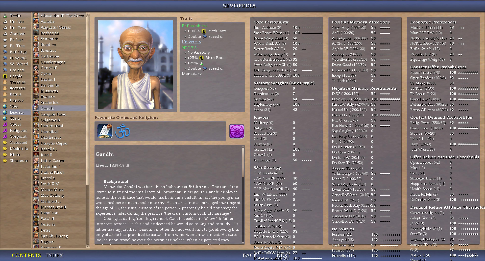
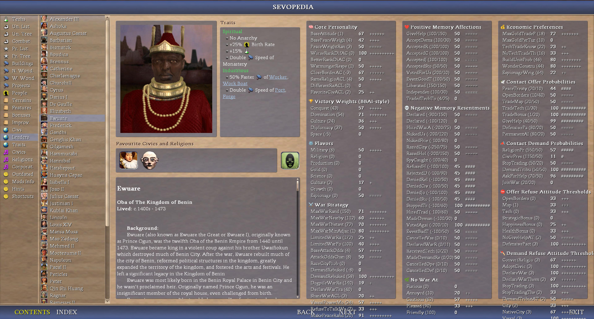

# README_AI_Personality_Panel.md

Not a (strictly) new feature per se, but displaying it as such (and all the computation, display logic, and pre-processing and such that allows that) is indeed new (as well as the new aggregated attributes such as contact probs, positive memory affections, etc).

As always, ChatGPT (see [Authors](/README.md#authors) for details) is a kew co-author and main code contributor.
Please visit the specific Mods Info's entry for details

AI attributes (at least i call them this way not sure it is their exact name but i wanted a name different from "traits" if it is their name as it is used for "aggressive", "cautious", anyways etc.) list (some of) the AI leader's preferences and behavorial characteristics. They are divided into:

- Raw AI attributes such as MaxWarRand, BasePeaceWeight, etc.
- and aggregated AI attributes such as iAggregatedContactPeaceTreatyProb, iAggregatedPositiveMemoryTradedTechToUsAffection, etc. (new addition to AdvCiv-SAS)

## Menu

[Sources about XML AI Attributes and their meaning](/_1_AdvCiv-SAS/Docs_And_Appendixes/README_AI_Personality_Panel.md#sources-about-xml-ai-attributes-and-their-meaning)  
[General Aim of the AI Attributes](/_1_AdvCiv-SAS/Docs_And_Appendixes/README_AI_Personality_Panel.md#general-aim-of-the-ai-attributes)  
&emsp;[how to enable/disable emoji buttons in sevopedia leader](/_1_AdvCiv-SAS/Docs_And_Appendixes/README_AI_Personality_Panel.md#how-to-enabledisable-emoji-buttons-in-sevopedia-leader)  
[Where and how to find the abbreviations (in label) (in the AI Personality Panel)'s meaning](/_1_AdvCiv-SAS/Docs_And_Appendixes/README_AI_Personality_Panel.md#where-and-how-to-find-the-abbreviations-in-label-in-the-ai-personality-panels-meaning)  
[Normalization (to 100 in AdvCiv-SAS anyways) and leader(s) score/ranking](/_1_AdvCiv-SAS/Docs_And_Appendixes/README_AI_Personality_Panel.md#normalization-to-100-in-advciv-sas-anyways-and-leaders-scoreranking)  
[As a player (i.e. only if you want to play anyways etc), what you need to know and do](/_1_AdvCiv-SAS/Docs_And_Appendixes/README_AI_Personality_Panel.md#as-a-player-ie-only-if-you-want-to-play-anyways-etc-what-you-need-to-know-and-do)  
[Display(ing) the AI attributes in the AI Personality Panel and how to read the tables/panels](/_1_AdvCiv-SAS/Docs_And_Appendixes/README_AI_Personality_Panel.md#displaying-the-ai-attributes-in-the-ai-personality-panel-and-how-to-read-the-tablespanels)  
[Notes about performance optimization of the AI Personality panel caching](/_1_AdvCiv-SAS/Docs_And_Appendixes/README_AI_Personality_Panel.md#notes-about-performance-optimization-of-the-ai-personality-panel-caching)  
[If you want to mod](/_1_AdvCiv-SAS/Docs_And_Appendixes/README_AI_Personality_Panel.md#if-you-want-to-mod)  
[Note about some ai attributes being ignored](/_1_AdvCiv-SAS/Docs_And_Appendixes/README_AI_Personality_Panel.md#note-about-some-ai-attributes-being-ignored)  
[Currently if not always unfinished todo or(/and?) not or etc anyways](/_1_AdvCiv-SAS/Docs_And_Appendixes/README_AI_Personality_Panel.md#currently-if-not-always-unfinished-todo-orand-not-or-etc-anyways)  
[Note about the value of 0 not always being 0, and a value > 0 sometimes being 0](/_1_AdvCiv-SAS/Docs_And_Appendixes/README_AI_Personality_Panel.md#note-about-the-value-of-0-not-always-being-0-and-a-value--0-sometimes-being-0)  

## Sources about XML AI Attributes and their meaning

See [Modding_Ressources/README.md's Sources about XML AI Attributes and their meaning](/_1_AdvCiv-SAS/Docs_And_Appendixes/Modding_Ressources/README.md#Sources)

## General Aim of the AI Attributes

The ai attributes (simply) aim to and display:

- for raw ai attributes, the raw value (such as warrand 50 for moctezuma, 400 for gandhi),
- while for aggregated ai attributes, they/we combine several attributes with a specific weight to each, and give a final score for several ai attributes. For example Positive Memory affections combine a main weight (between 0 and 1) on memory decay (value) with some conditions (see [generate_leaders_data.py('s code)](/generate_leaders_data.py) and/or the [README_Python_Scripts.md#generate_leaders_datapy-script-and-leaders_datapy-module](/_1_AdvCiv-SAS/Docs_And_Appendixes/README_Python_Scripts.md#generate_leaders_datapy-script-and-leaders_datapy-module) for details) and secondary weight (1 - main weight equal to 1 at least we check it is as close to 1 as possible if not 1 exactly anyways etc) weight on memory rand, which gives a final score with a 1.0 weight of these scores combined.

Here is an example below of how it looks ingame in the sevopedia leader category:

</img>
</img>
</img>

More screenshot samples in the [sevopedia reworks Google Drive folder](https://drive.google.com/drive/folders/1gHyRYmQ1mkoQDyIB9H4FqxyZ8P0FYbJT?usp=sharing)

### how to enable/disable emoji buttons in sevopedia leader

You can enable/disable images as buttons (i.e. the emojis anyways etc) as i call them but anyways etc, in [GlobalDefines_advciv_sas.xml](/Assets/XML/GlobalDefines_advciv_sas.xml).

Here is how it would look like without emojis for example anyways etc:

</img>

## Where and how to find the abbreviations (in label) (in the AI Personality Panel)'s meaning

note: to understand/find the meaning of abbreviations used in the ai panel, the best way would be (i think) to look directly in the code (use vs code for example in [/Assets/Python/Contrib/Sevopedia/SevoPediaLeader.py](/Assets/Python/Contrib/Sevopedia/SevoPediaLeader.py)), find lines like these (or ctrl+f an abbreviation you don't understand):

```python
	fields_with_direct_getters = {
		# ==== FIRST XML FIELDS PART 1 (from XML order) ====
		"getWonderConstructRand": ("Wonder C.R", False),
		"getBaseAttitude": ("Base Attitude", False),
		"getBasePeaceWeight": ("Base Peace Weig", False),
		"getPeaceWeightRand": ("Peace Weig Rand", False),
		"getWarmongerRespect": ("Warmonger Resp", False),
		"getEspionageWeight": ("Espionage Weig", False),
		"getRefuseToTalkWarThreshold": ("RefToTalkW Span", False),
		"getNoTechTradeThreshold": ("NoTech2AdvTrT", True),
		"getTechTradeKnownPercent": ("NoTechYetRdy%", False),
		"getMaxGoldTradePercent": ("Max Gold Tr%", False),
		"getMaxGoldPerTurnTradePercent": ("Max GPT Tr%", False),
		# ==== BBAI VICTORY WEIGHTS ====
		# <!-- custom: now exposed to python, see sevopedia helpers py file code comments for details -->
		"getCultureVictoryWeight": ("Culture", False),
		"getSpaceVictoryWeight": ("Space", False),
		"getConquestVictoryWeight": ("Conquest", False),
		"getDominationVictoryWeight": ("Domination", False),
		"getDiplomacyVictoryWeight": ("Diplomacy", False),
		# <!-- custom: end of now exposed to python fields -->
		# ==== WAR XML FIELDS (from XML order) ====
		"getMaxWarRand": ("T.W Likely", True),
		"getMaxWarNearbyPowerRatio": ("T.W NearPR", False),
		"getMaxWarDistantPowerRatio": ("T.W DistPR", False),
```

A code block like this means for example that for the line:

```python
"getMaxWarRand": ("T.W Likely", True),
```

that in the label in sevopedia leader ingame "T.W Likely" refers to the field's getter name "getMaxWarRand", but to get info on what this field does, remove the "get" or some similar prefix to be safe, then search online what "MaxWarRand" means and does in civ4, for example go on the 2 sources mentionned [in README.md#sevopedia-reworks-ai-personality-panel-and-other-sevopedia-reworks](/README.md#sevopedia-reworks-ai-personality-panel-and-other-sevopedia-reworks) (kujira's and modiki's websites (for example)), then you'll hopefully find more info about what they do that should be quite if not very reliable anyways.

Be careful because AIs such as ChatGPT tend to invent what they don't know, so even though they often have a very good "broad" understanding of a topic, when delving in the (obscure or not anwyays etc) specifics, they may err, especially if you lead them astray with your (or mine in my case anyways etc) imprecision or lack of knowledge or understanding, so i would suggest to refer to these websites rather for technical info, even though they may be wrong sometimes and myself too, and ChatGPT is still great i think hehe, but this is a caveat i kindly if i may say give hehe anyways.

### how to show keys or suffixes instead of abbreviated custom labels

Similarly to how was done for emoji images, there is also a tunable/knob in [GlobalDefines_advciv_sas.xml](/Assets/XML/GlobalDefines_advciv_sas.xml) but anyways etc that you can configure to show only key names or suffix names (shrunk if too long to fit table length, for example `MaxWarRand` (shrunk if too long anyways etc)) instead of abbreviated custom labels such as `T.W. Likely` for example anyways etc ; useful for calibrating or if you'd prefer to display it as such.

Here is an example below of it would look like with this set to `True` hopefully helpful or not or yes or and other or and not anyways etc:

</img>

## Normalization (to 100 in AdvCiv-SAS anyways) and leader(s) score/ranking

To go back to how ai attributes (raw and aggregated) are computed and displayed, then ranking (or before computing them depending on the calculation formula) is done among leaders, and leaders are sorted from best to worse performing for this attribute, sometimes inversing ranking depending on correlation between distribution and performance for this ai attribute (if lower score is better we invert, if higher score is better we don't invert), for example:

- for raw ai attributes, 50 warrand (moctezuma) is more warlike then 400 warrand (gandhi) even though 50 is lower than 400 so we invert ranking here anyways, but we don't invert it (at least should not unless we made a mistake anyways etc) for example for basepeaceweight where basepeaceweight 10 (gandhi) is better than basepeaceweight 0 (moctezuma); here higher is better so we don't invert the ranking. This means that among these 2 leaders, gandhi will have a maxwarrand score of 0, and moctezuma 100, but for basepeaceweight, gandhi will have a score of 100 and moctezuma 0. Taking a bigger leader sample batch, (52+ leaders, the graduation becomes finer if there are several values between and max (say scores could be 0, 13,18,57,88,100, etc these are examples, or all leaders could have a score of 50 if the value is same among all civ4 leaders for this attribute (happens quite often actually (sadly or not anyways etc)))). This compression (if range between min and max value is higher than 100 (say values go from 5 to 405 for example) or decompression (if range is smaller, say from -2 to 3 for example), as well as other things such as shifting to 0 the distribution and such or not anyways (see normalize_to_100 in [/Assets/Python/Contrib/Sevopedia/ai_utils_shared_with_civ4.py](/Assets/Python/Contrib/Sevopedia/ai_utils_shared_with_civ4.py) for details)) is called normalization to 100 (at least we call it as such in AdvCiv-SAS anyways etc.)
- A similar ranking logic by normalizing raw scores to 100 is done/performed for aggregated ai attributes, with each attribute in an aggregated attribute being possibly (to be) inverted or not depending on correlation between distribution and performance (and then in theory the final (aggregated) score itself could be inverted since it's now behaving like a raw ai attribute (combined) even though it is aggregated.). Also, sometimes each "weight" attribute of the aggregate is first normalized before the final score is also normalized itself, or sometimes not (different ai aggregated attributes use different normalizing formulas and "schemas"/processes, see [generate_leaders_data.py](/generate_leaders_data.py) and the [README_Python_Scripts](/_1_AdvCiv-SAS/Docs_And_Appendixes/README_Python_Scripts.md#generate_leaders_datapy-script-and-leaders_datapy-module) for details)

## As a player (i.e. only if you want to play anyways etc), what you need to know and do

Note: as a player, you don't have/need to know or do anything, everything works as is.

What these columns and symbols mean is explained here in [README_AI_Personality_Panel.md#displaying-the-ai-attributes-in-the-ai-personality-panel-and-how-to-read-the-tablespanels](/_1_AdvCiv-SAS/Docs_And_Appendixes/README_AI_Personality_Panel.md#displaying-the-ai-attributes-in-the-ai-personality-panel-and-how-to-read-the-tablespanels).

If you want to know the code though, it is in Sevopedia Leader py file, [/Assets/Python/Contrib/Sevopedia/SevoPediaLeader.py](/Assets/Python/Contrib/Sevopedia/SevoPediaLeader.py), as well as some helper files, that are as of now only if i am not mistaken anyways etc[/Assets/Python/Contrib/Sevopedia/_sevopedia_helpers.py](/Assets/Python/Contrib/Sevopedia/_sevopedia_helpers.py) and [/Assets/Python/Contrib/Sevopedia/ai_utils_shared_with_civ4.py](/Assets/Python/Contrib/Sevopedia/ai_utils_shared_with_civ4.py) anyways etc

## Display(ing) the AI attributes in the AI Personality Panel and how to read the tables/panels

Finally, the last main point to know regarding this AI personality panel is the display. We separate ai attributes by categories such as "War Strategy", "Core Personality", etc for easier read and clarity or/and other things etc. There are currently 3 panels, containing each:

- first column: "label", a shortened or full descriptive text, like/such as "T.W Likely" (a shortened and (tentative) explanation of what iMaxWarRand means ingame), as said earlier, please read the code in [SevoPediaLeader.py](/Assets/Python/Contrib/Sevopedia/SevoPediaLeader.py), hopefully helpful or not etc anyways. This (column) almost always if not always contains the raw value too, for exhaustiveness, for example "T.W Likely (50)" for moctezuma, 50 is the raw value, or "T.W Likely (400)" for Gandhi, 400 is the raw value, for raw ai atributes. For aggregated ai aattributes, like contact probs, positive and negative memory resentments and affections, etc (if there is/are any anyways etc), the raw value is also displayed, but since there are many components (raw values) used to calculate the aggregated ai attribute, we instead display each of them "/" separated, for example for gandhi in the negative memory resentment category, the "D.W on FR (-200/120)" line (for gandhi) shows that G(g anyways etc)andhi has a raw ai attribute memory attitude percent of -200 ((i.e.? anyways etc) he (gandhi anyways etc) resents quite strongly you declaring war on his friends) and a memory decay of 120. And for moctezuma, for the same "D.W on Fr" negative memory resentment, he (moctezuma (anyways etc)) does not resent as much (memory attitude percent of -100, and memory decay same though of 120 (currently btw decays are same among all leaders if i'm not mistaken (in civ4/advciv and thus advciv-sas too but anyways), not ideal but maybe functional anyways))
- second column: the (normalized) score is displayed. As we explained before at the ranking calculation part, these scores are normalized, which means score is minimum 0 and maximum 100. Sometimes all leaders will have 50 (if same value among all leaders, happens sometimes in civ4 not ideal but anyways), and else leaders are ranked gradually from 0 (worse performer for better or worse) to 100 (best performer for better or worse (war is bad maybe? And peace good? Stiil moctezuma performs good at war attributes, and gandhi good at peace attributes, for example)), if we didn't do (hopefully but anyways) inverting mistakes or oversights/overlook(s?)ings(?) then it should be hopefully accurately represented (inversion in particular). Note that this code is entirely dynamic, you can add more leaders and they'll get the new values and participate and possibly completely upset the best/worse performers ranking depending on their values (if they are different from current leaders ones or not, and how much), and you could also additionally or(/and?) alternatively (anyways etc) (also? anyways etc) tweak the existing leaders xml values as you please. (If you think for example the roman leaders underperform in war, you may tweak their xml. As for aggregated ai attributes, they also display normalized scores, but since they are already normalized at their creation by definition, before leaders_data.py is (has finished being) generated (anyways (etc anyways)), they are still displayed as normalized scores (min 0, max 100, unless all leaders have an equal score/value then all leaders get 50), but since they are already normalized (in generate_leaders_data.py), they are not re-normalized during caching and sevopedialeader.py computation, anyways etc. In short, they can be intepreted similarly as raw ai attributes if i am not mistaken anyways.
- third column: scale, this is an indicative/intuitive (hopefully, at least attempt, or not (or etc) but anyways etc) display, raw ai attributes and aggregated ai attributes are graded graphically 10 by 10 with a symbol, but raw ai attributes use a "+" symbol, while ai aggregated symbols use a "#" symbol (trying to be visually clear hopefully or not or etc but anyways, while also civ4-compatible (not many special characters supported in display anyways (but i like these ones they are quite cool (too but not only too but anyways)))). So for example maxwarrand 400 gandhi has a score of 0 (normalized) among all leaders (it is highest score i.e Gandhi is the least war-like leader(s (if others have a value of 400 too anyways))) so his scale is "++++++++++" (100th percentile if i am not mistaken anyways), while moctezuma has a warrand of 50, score 100 among all leaders (very war-like (in a "T.W war Likely" way highest leader(s (if other have same value of 50 anyways))), so his scale is "" (0th percentile). Aggregated ai attributes follow a similar logic, so for example for the contact offer probabilites ai aggregated attribute, shaka has a "Tr Tech (30/5)" score of 79, meanings he is quite likely (very in fact), relatively to all leaders, to contact you for a tech trade offer, and 79th percentile is a bit short of 80 but still 7 scales/symbols etc anyways so he will be "#######". If the value is 50 sharp, for raw ai attributes or ai aggregated attributes, the symbol will also be "+++++" or "#####" if i am not mistaken anyways. This is especially important because the last symbol is "=====", which only happens if, for both raw ai attributes (at least as of now me writing this doc README etc but anyways) and ai aggregated attributes, if all leaders have strictly the same raw value for this attribute (aggregated or raw is same in this case functionally anyways, i.e. that read after bracket anyways etc: ) they'll both get an equal scale symbol, and precisely 5 scales, also all leaders will scale 50. So 50 "+++++", 50 "#####", and 50 "=====" all have different meanings, one being respectively only for raw ai attributes scoring of said leader, the other of similarly same ai aggregated value of said leader, while the last being the display of an equal value among all leaders, hopefully for an easier read, as chatgpt (see [Authors](/README.md#authors) for details) advised me indeed, nice suggestion :) but anyways (and thanks! but anyways)

## Notes about performance optimization of the AI Personality panel caching

Screenshots about this part of the readme are in this [google drive link folder](https://drive.google.com/drive/folders/1D8RIy6iqkADMXtCl1VuWkEInrpqtIzrU?usp=sharing) with screenshots for details or/and example of how we me and chatgpt implemented it together even though i skipped some prompts where i feel its response was not adequate or i mean correct or optimal or as i wanted anyways etc, but it did help me lot anyways etc.

I am very happy that the AI Personality panel is coded in a way that i find is very efficient and performant. Even though i should say first that i am not an expert in this topic or too knowledgeable about these, i believe still and also thanks to the help of chatgpt i could do this as well thanks a lot anyways etc, that the system is very efficient in terms of memory consumption and load times in particular anyways etc.

For example, we store almost all data as cached precomputed tuples (in [SevoPediaLeaderCachePredumped.py](/Assets/Python/Contrib/Sevopedia/SevoPediaLeaderCachePredumped.py)), and if there are strings it is almost only byte strings not unicode strings. At leader selection, there is barely anything left to do except unpack and display as is fully precomputed display with their label, normalized value, and scale. We also do not cache at module load, and we do not cache at all if we never click at the Leaders category in sevopedia, but we load the precomputed cache before any leader is selected, and we don't reload cache even if sevopedia is closed or a save file loaded during the entire game session (i.e. until game is exited).

The little extra bonus is for example at least is the one that comes to my mind only anyways etc we load the cache in Sevopedia Main's placeLeaders only after the item list is built (i.e. all leaders ist is loaded in items list), therefore no visual hang theoritecally (or theoritically? May have to check if i want but anyways etc...) of having a small theoretical lag (didn't test but i assume maybe caching may generate a micro lag that would be visible for the user on Leaders category's click), but/however after list is loaded, there is some delay until the user clicks on/selects desired leader to display, so this is perfect time to smoothly load the precomputed cache silently without it being visible in terms of performance because nothing else is changing, if such a lag even exists as i didn't check or test but i assume and find this design more plasant.

Using a function call gives us also more control than hardcoded code in sevopedia leader and i really like this part as well so we know when and why we build it and can selectively not do so as needed or and wanted, i really like this design efficient and smart even though shold not be of me to say and perhaps can still be improved, but i believe it is quite efficient as it is in general, even though it could still be improved though, i like as it is as of now as well anyways etc anyways etc. This is also very nice because now in VS Code in sevopedia leader we can also "unwrap" or rather "wrap" maybe i mean "undevelop" the function i don't know how to explain but click on the arrow at left of function name at line number, and we compress=hide all this caching code very nicely to directly and only read the sevopedia leader remaining code we want so i hadn't planend it as such but is very nice side effect if i may say but or not but or yes but or etc but anyways etc anyways etc anyways etc.

Also, loading the precache rather than pre-caching and recomputing at each civ4 game launch, has the advantage for players that they don't need to always recompute these values that do not change on their end, and rarely so even for modders, every time they start civ4. Plus, as the AI Personality Panel is purely only a UI feature, no need to spend so much computation on it, only fetch the precomputed result directly rather. Also, this should scale better computationally so it is cheaper (calculate the max among more leaders or with more xml attributes would be more than linearily more expensive if i'm not mistaken, vs just fetching the precomputed value for say Leader number 150 in a heavy mod if not more). So the burden to update it is on the modder.

Because of these and perhaps other related or other things or not, i believe this is a very very efficient design. Please look at sevopedia leader's code for details and the tiny bits in this case anyways etc in sevopedia main as well for the time where we load the precomputed cache and the flag to not reload the cache anyways etc.

Note: technically should be in modding ressources but fits also here as well so duplicated this entry of the doc with a link there to this anyways etc.

## If you want to mod

If you want to mod and modify the xml civ4 leader info, then you need to either update the [SevoPediaLeaderCachePredumped.py](/Assets/Python/Contrib/Sevopedia/SevoPediaLeaderCachePredumped.py) file manually, or disable the option to use the predumped file (see toggle define as of now at [`GlobalDefines_advciv_sas.xml`](/Assets/XML/GlobalDefines_advciv_sas.xml)).

## Note about some ai attributes being ignored

Some AI attributes (raw or/and aggregated if i were to make them anyways (maybe, not guaranteed, may or may not indeed too, etc anyways)) are not in the data, either because ai panel is incomplete yet (see below in the [README_AI_Personality_Panel.md#currently-if-not-always-unfinished-todo-orand-not-or-etc-anyways](/_1_AdvCiv-SAS/Docs_And_Appendixes/README_AI_Personality_Panel.md#currently-if-not-always-unfinished-todo-orand-not-or-etc-anyways)), or because i have assessed that these are not used anymore in AdvCiv (i may have forgotten some or not, but for example iLoveOfPeace XML AI attribute is not used anymore in AdvCiv if i'm not mistaken, as shown in this code comment for example from [CIV4LeaderHeadInfos.xml](Assets/XML/Civilizations/CIV4LeaderHeadInfos.xml) (adapt if you don't use the Steam version of Civ4 (and by extension of AdvCiv-SAS etc anyways...)):

```xml
			<!-- advc.104: No AdvCiv leader uses this; for mod-mods maybe. See
				 UWAI_WEIGHT_LOVE_OF_PEACE in AI_Variables_GlobalDefines.xml.
				 Also reduces war utility counted for "greed". -->
			<iLoveOfPeace>0</iLoveOfPeace>
```

And since our mod AdvCiv-SAS is based on AdvCiv, we don't use it by extension, anyways etc anyways.
)

## Currently if not always unfinished todo or(/and?) not or etc anyways

Currently, again as of me now writing this doc, there are a few attirbutes missing from the table, such as:

- Attitude changes +/- limits +/- divisors aggregation (may aggregate them too for easier read), or/and move some of them in (other categories (like "core personality, etc))
- improvements (would be nice if i could (we? with chatgpt)) anyways etc also display leader preferences for which improvements (such values exist in xml), for example some leaders prefer mines, others farms etc, with their scale and before that normalized score too (plus raw value in label too ideally) would be even nicer, but there are many improvements, wouuld need to find a way to comapct the view, perhaps only showing values > 0.
- unitais (which ai leaders build for example more ai settle units, or more ai sea explore units for example if i'm not mistaken, etc.) with scales and normalized score(s) (before that) and ranking (as thus if that is a word/expression anyways etc anyways) would be very nice too, perhaps in a compact way like for improvements, especially if some room is freed somewhere in the panel (or writing under the panel xd.. works too maybe indeed, but etc anyways etc anyways...)

## Note about the value of 0 not always being 0, and a value > 0 sometimes being 0

About this (improvements), last thing at least as of now if not always or not anyways to know/pay attention to ideally, is that sometimes normalized values/(i.e.)scores(/ranking among all leaders anyways etc) is 0, but it does not (always indicate no behaviour), and vice versa (a normalized score > 0 does not always indicate the existence of a behaviour).

For example the flavor "espionage" has a raw value of 0 (no default espionage for all leaders), but the score is 50 since is equal among all leaders. However, default is no espionage flavor if i am not mistaken even though 50 > 0.

Similarly, and in a vice-versa (or versa-vice? but anyways...) way etc anyways, for example for moctezuma, in negative memory resentments the "Nuked Fr (-100/80) ; 0 ; " line does not mean that moctezuma does not care at all if you nuke his friends (he has a -100 raw value of attitude percent thing etc anyways so it does affect him a bit negatively), however (rather) that relatively to all leaders, he is the one(or among the ones if others have exactly (-100/80) or a combination of memory attitude percent thing etc anyways + decay that gives a final score exactly equal to the final score given by -100/80 etc anyways) that cares the less among all leaders if you nuke his friends, but does not mean that he does not care at all, nor that he cares a little too, if least caring was -1000 for example or -1500, he would still care a lot but care less than all other leaders (except those with same final score before normalizing) anyways. These are exceptions but hopefully help the read being clearer anyways.

In some cases too, (when) we parse attitudes (we do not always anyways etc) (cautious as a number (0 here in AdvCiv-SAS anyways) when we want to use attitudes thresholds and rank and compare them), so 0 in raw value of, for example in offer refuse attitude thresholds category, at the line "Strategic Bonus (0) ; 50 ; +++++", for moctezuma means that moctezuma needs to be at least more than cautious to consider (or being able to agree) any strategic bonus (ressource) trade you want with him, if i am not mistaken, here again 0 is not the absence of a value, but a specific value.

Except from this exception and a few others like distribution shifting if range is say -20 to +39 then 0 is just -20 as (i.e. because etc anyways) we shift to 0 (always the minimum after shifting) as part of our normalization process (see normalize_to_100 in [/Assets/Python/Contrib/Sevopedia/ai_utils_shared_with_civ4.py](/Assets/Python/Contrib/Sevopedia/ai_utils_shared_with_civ4.py) for details again hopefully helpful or not etc or other anyways), generally raw values, or/and scores more often even, can be interpreted in terms of lower to higher, but not always, however in most cases yes in such a way if i am not mistaken anyways.

note: an older system exists, but is now deprecated and removed from code base, you may find it somewhere in older commits todo add link, which is/was called "ai aggregates". It is/was not the same as aggregated ai attributes, as the ai aggregates are/were an older system that combined any kind of ai attributes more freely to derive correlations or rather behavorial tendencies from their combination (for example "conqueror", "pacifist", "insular researcher", if i am not mistaken, anyways etc.), was less accurate and harder to maintain than simply displaying raw ai attributes or (their) straightforwardedly aggregating(aggregation) them when they are composed of several "components" (like memory decays, memory rands, for memory attributes, etc.)
