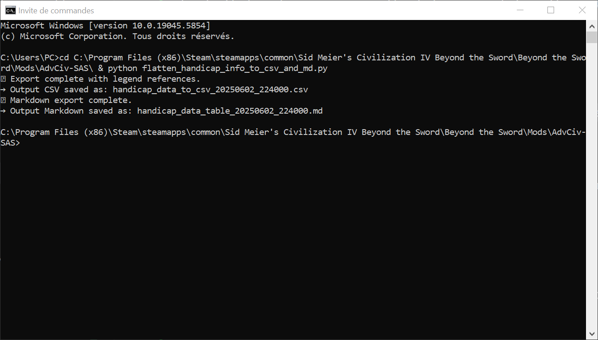
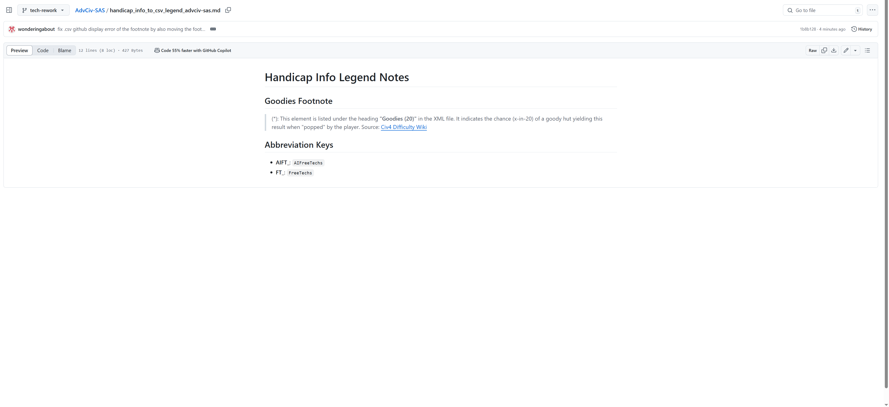
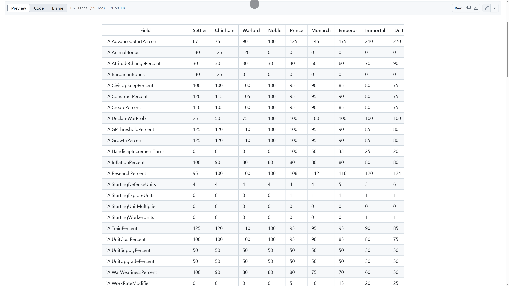
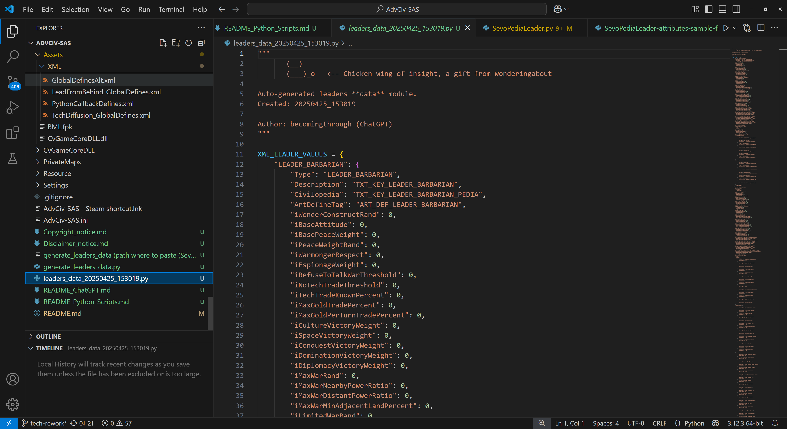
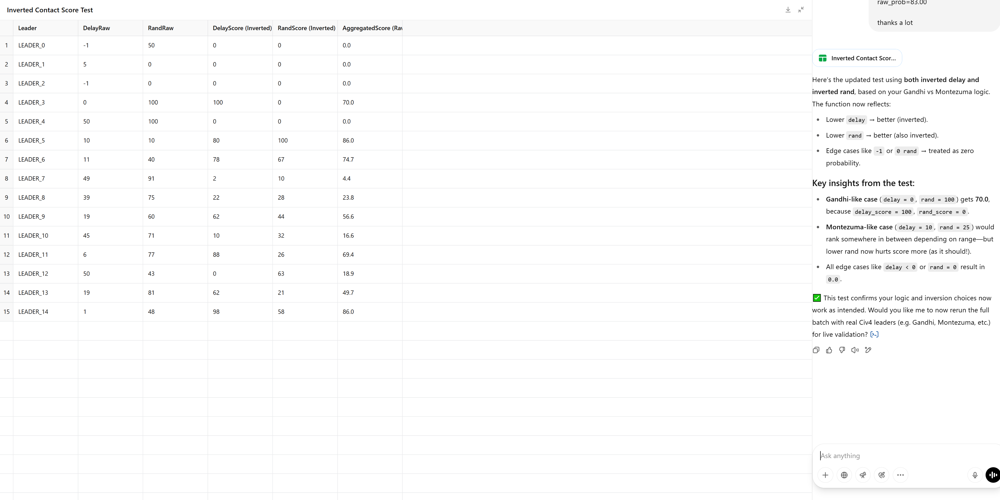
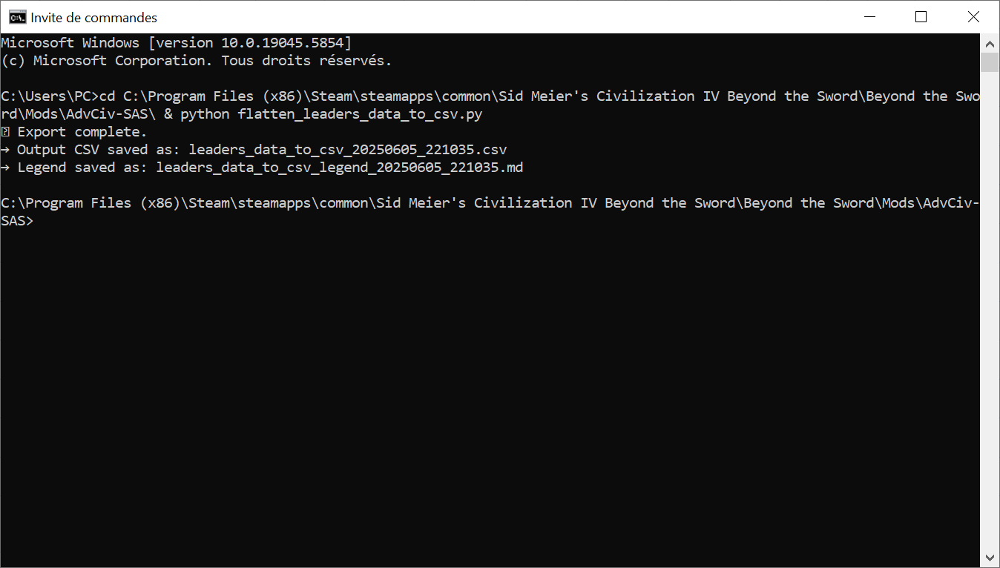

# Python scripts

## Menu

[Note about log files](/_1_AdvCiv-SAS/Docs_And_Appendixes/README_Python_Scripts.md#note-about-log-files)  

[flatten_handicap_info_to_csv_and_md.py](/_1_AdvCiv-SAS/Docs_And_Appendixes/README_Python_Scripts.md#flatten_handicap_info_to_csv_and_mdpy)  
&emsp;[how to generate the handicap_info table .csv and its .md legend, +/- table .md (optional)](/_1_AdvCiv-SAS/Docs_And_Appendixes/README_Python_Scripts.md#how-to-generate-the-handicap_info-table-csv-and-its-md-legend--table-md-optional)  
&emsp;[output .csv +/- .md](/_1_AdvCiv-SAS/Docs_And_Appendixes/README_Python_Scripts.md#output-csv--md)  
&emsp;&emsp;[output table .csv and its .md legend anyways etc](/_1_AdvCiv-SAS/Docs_And_Appendixes/README_Python_Scripts.md#output-table-csv-and-its-md-legend-anyways-etc)  
&emsp;&emsp;[about the table .md version of the table anyways etc](/_1_AdvCiv-SAS/Docs_And_Appendixes/README_Python_Scripts.md#about-the-table-md-version-of-the-table-anyways-etc)  
&emsp;[handicap_info table for other mod(s) (for example for base AdvCiv mod)](/_1_AdvCiv-SAS/Docs_And_Appendixes/README_Python_Scripts.md#handicap_info-table-for-other-mods-for-example-for-base-advciv-mod)  
&emsp;&emsp;[how to generate the handicap_info table .csv and its .md legend, +/- table .md for another mod](/_1_AdvCiv-SAS/Docs_And_Appendixes/README_Python_Scripts.md#how-to-generate-the-handicap_info-table-csv-and-its-md-legend--table-md-for-another-mod-for-example-for-advciv-base-advciv-mod-anyways-etc-optional)  
&emsp;&emsp;[output handicap_info table .csv and optionally .md for another mod](/_1_AdvCiv-SAS/Docs_And_Appendixes/README_Python_Scripts.md#output-handicap_info-table-csv-and-optionally-md-for-another-mod-for-example-advciv-base-advciv-mod-anyways-etc)  

[generate_leaders_data.py script and leaders_data.py module](/_1_AdvCiv-SAS/Docs_And_Appendixes/README_Python_Scripts.md#generate_leaders_datapy-script-and-leaders_datapy-module)  
&emsp;[Usage / Instructions (from chatgpt and me too anyways)](/_1_AdvCiv-SAS/Docs_And_Appendixes/README_Python_Scripts.md#usage--instructions-from-chatgpt-and-me-too-anyways)  
&emsp;[Additional case(s) where leaders_data.py needs to be regenerated/updated](/_1_AdvCiv-SAS/Docs_And_Appendixes/README_Python_Scripts.md#additional-cases-where-leaders_datapy-needs-to-be-regeneratedupdated-or-where-it-is-highly-recommended)  
&emsp;[Notes about updating this generate_leaders_data.py script](/_1_AdvCiv-SAS/Docs_And_Appendixes/README_Python_Scripts.md#notes-about-updating-this-generate_leaders_datapy-script)  
&emsp;[Using generate_leaders_data.py in another mod](/_1_AdvCiv-SAS/Docs_And_Appendixes/README_Python_Scripts.md#using-generate_leaders_datapy-in-another-mod-for-example-base-advciv-mod-anyways-etc)  
&emsp;[General notes about field parsing](/_1_AdvCiv-SAS/Docs_And_Appendixes/README_Python_Scripts.md#general-notes-about-field-parsing)  
&emsp;[Additional notes on special field parsing](/_1_AdvCiv-SAS/Docs_And_Appendixes/README_Python_Scripts.md#additional-notes-on-special-field-parsing)  
&emsp;&emsp;[Refuse Attitude Thresholds](/_1_AdvCiv-SAS/Docs_And_Appendixes/README_Python_Scripts.md#refuse-attitude-thresholds)  
&emsp;&emsp;[NoWarAttitudeProbs](/_1_AdvCiv-SAS/Docs_And_Appendixes/README_Python_Scripts.md#nowarattitudeprobs)  
&emsp;&emsp;[Flavors](/_1_AdvCiv-SAS/Docs_And_Appendixes/README_Python_Scripts.md#flavors)  
&emsp;&emsp;[Contact Delays, Contact Rands, and Contact Probs](/_1_AdvCiv-SAS/Docs_And_Appendixes/README_Python_Scripts.md#contact-delays-contact-rands-and-contact-probs)  
&emsp;&emsp;[Positive/Negative Memory affections/resentments](/_1_AdvCiv-SAS/Docs_And_Appendixes/README_Python_Scripts.md#positivenegative-memory-affectionsresentments)  

[flatten_leaders_data_to_csv.py](/_1_AdvCiv-SAS/Docs_And_Appendixes/README_Python_Scripts.md#flatten_leaders_data_to_csvpy)  
&emsp;[prerequirements (optional)](/_1_AdvCiv-SAS/Docs_And_Appendixes/README_Python_Scripts.md#prerequirements-optional)  
&emsp;[how to generate the leaders_data table .csv and its legend .md (optional)](/_1_AdvCiv-SAS/Docs_And_Appendixes/README_Python_Scripts.md#how-to-generate-the-leaders_data-table-csv-and-its-legend-md-optional)  
&emsp;[output table .csv and legend .md](/_1_AdvCiv-SAS/Docs_And_Appendixes/README_Python_Scripts.md#output-table-csv-and-legend-md)  
&emsp;[leaders_data table (.csv) and its legend (.md) for other mod(s)](/_1_AdvCiv-SAS/Docs_And_Appendixes/README_Python_Scripts.md#leaders_data-table-csv-and-its-legend-md-for-other-mods-for-example-for-base-advciv-mod)  
&emsp;&emsp;[prerequirements (optional) for another mod](/_1_AdvCiv-SAS/Docs_And_Appendixes/README_Python_Scripts.md#prerequirements-optional-for-another-mod-for-example-for-advciv-base-advciv-mod-anyways-etc)  
&emsp;&emsp;[how to generate the handicap_info table .csv and its legend .md for another mod](/_1_AdvCiv-SAS/Docs_And_Appendixes/README_Python_Scripts.md#how-to-generate-the-handicap_info-table-csv-and-its-legend-md-for-another-mod-for-example-for-advciv-base-advciv-mod-anyways-etc-optional)  
&emsp;&emsp;[output table .csv and legend .md for another mod](/_1_AdvCiv-SAS/Docs_And_Appendixes/README_Python_Scripts.md#output-table-csv-and-legend-md-for-another-mod-for-example-for-advciv-base-advciv-mod-anyways-etc)  

[scan_xml_duplicates py script and Logs_XML_Scans](/_1_AdvCiv-SAS/Docs_And_Appendixes/README_Python_Scripts.md#scan_xml_duplicates-py-script-and-logs_xml_scans)  
&emsp;[Usage](/_1_AdvCiv-SAS/Docs_And_Appendixes/README_Python_Scripts.md#usage)  
&emsp;[Context of how/why i made this script](/_1_AdvCiv-SAS/Docs_And_Appendixes/README_Python_Scripts.md#context-of-howwhy-i-made-this-script-with-chatgpt-anyways)  

## Note about log files

Some of these scripts also generate log files, generally if not always in the [Logs](/Logs/) folder (it creates it if missing at first log file creation if i am not mistaken anyways).

These serve and aim to help you diagnose issues in case cmd cant hold all the info and display it (for long log files), ctrl+f the file or refer to it later if need, or/and maybe share it for troubleshooting (you may want to ask forums rather than me wonderingabout or here ideally for more exhaustive, reusable, and less time or/and focus consuming on my end ideally, but if you absolutely must you can ask me directly, just i cannot guarantee i would reply and would prefer not to be contacted ideally, anyways).

You can safely delete such log files or/and folders if you wish so (especially if they start cluttering or such anyways), as they are only additional info provided for convenience maybe etc anyways (and my convenience too etc anyways for my files etc anyways), and do not impact the game or mod in any way.

## flatten_handicap_info_to_csv_and_md.py

### how to generate the handicap_info table .csv and its .md legend, +/- table .md (optional)

(you can skip this step if you just want to see AdvCiv-SAS sample .csv and .md file examples of output as well anyways etc)

Additionally to the main README's handicap info to csv and md info in [/README.md#csv-and-md-view-of-the-handicap-difficulties-info-in-a-table-for-all-difficulties-info](/README.md#csv-and-md-view-of-the-handicap-difficulties-info-in-a-table-for-all-difficulties-info), here are a few additional screenshots, also code is provided thanks to chatgpt and my prompts or/and adjustments or not for advciv-sas, thanks a lot, anyways etc

also note: you need to generate the table file (.csv and .md (you'd need to uncomment the .md generating block/part of the script to do that as we commented it out in/for  advciv-sas as we don't use it since the .csv is more than enough and better if i may say more performant for our needs in advciv-sas if i may say but anyways etc) by running the script everytime you modify the xml, else if it's just for viewing no need to do that and you can view the files provided in the mod advciv-sas (or another mod using this script maybe too anyways etc) directly).

note 2: this flatten_handicap_info_to_csv_and_md.py has "info" in its filename as it fetches XML directly (handicap info xml file) in the modpath (the real and currently used file in the mod), unlike other scripts such as flatten_leaders_data_to_csv.py that have "data" in their filename as for example they fetch from for example the leaders_data.py database that is used by sevopedia leader instead in the mod path.

Usage is similarly as (for) other scripts in this readme pythons scripts, for example for Steam users (adjust paths and/or such similar things anyways if not steam user) (click on the images below to view them full size):

```text
cd C:\Program Files (x86)\Steam\steamapps\common\Sid Meier's Civilization IV Beyond the Sword\Beyond the Sword\Mods\AdvCiv-SAS\ & python flatten_handicap_info_to_csv_and_md.py
```

The script requires to be at the root of your mod path (as in below path example, as is default provided in this mod) to successfully fetch the handiap info xml, tweak if you know how or/and need else runs fine as is maybe or and in all cases or not or yes anyways etc

Example of usage:

</img>

### output .csv +/- .md

As for output, see below for examples of .csv and .md outputs, the files we get are for example like this (screenshots may not be updated, view latest files provided in your mod path, or/and regnerate them again yourself with the script especially if you modify the xml of handicap info since then to show your changes in the .csv and .md files)

- [.csv view to view it on GitHub website for example](/handicap_info_to_csv_advciv-sas.csv) or with libreoffice for example or similar software if you prefer another viewer than GitHub website view or such anyways etc
- [.md  view to view it on GitHub website for example](/handicap_info_to_md_advciv-sas.md) (note: you'd need to uncomment the .md generating part of the script if you want to use/have the .md version of the handicap data, see above for a bit or lot or other or etc or anyways etc details as well anyways etc)

note: you can remove the timestamp (i.e. the year and time and such info in filename anyways etc) too if not needed anymore or/and if needed or wnted by you or and other or and not or do or not anyways etc

#### output table .csv and its .md legend anyways etc

GitHub website view example (recommended, as display is nice anyways etc, and you can also for example anyways etc use github's search bar for example anyways etc)

</img>
</img>
</img>

Libre Office view example (or similar software or not anyways etc) (may not be updated, view on github instead as explained in main readme or view your own file locally .csv in your mod with libre office or a similar viewer/editor, thanks anyways etc thanks) with the .md legend view example (on github (view) in this case as well) anyways etc):

</img>
</img>
</img>

#### about the table .md version of the table anyways etc

Currently less advanced version of this (with the legend, but maybe displays quite well), i'd recommend viewing the .csv data/file rather maybe anyways etc as it can indeed but anyways etc show more data with line number and better alignment and such, but also did in .md as was as the time and chatgpt sugegsted which i also by my own wanted to try as well but anyways etc, and that i don't mind to keep now but anyways etc, is also a proof of concept if i may say of making a table into .md at least for me and may serve as reference or not but in all cases anyways etc..

Currently commeneted-out as the .csv table view is plenty and also more advanced for our need, but if you'd want to know what it looks like at least as of now if i am not mistaken anyways etc, is as below for example anyways etc, shown with github web view (before table .md file was removed from the advciv-sas mod folder and could sitll be viewed thus in github web view anyways etc) and VS Code .md preview for example alternatively for example anyways etc, i'd still recommend the table .csv version rather (with its .md legend if need but anyways etc) but this is to show how these would display too if you want to see them anyways etc:

</img>
</img>

### handicap_info table for other mod(s) (for example for base AdvCiv mod)

#### how to generate the handicap_info table .csv and its .md legend, +/- table .md for another mod (for example for "AdvCiv" (base AdvCiv) mod anyways etc) (optional)

(you can skip this step if you just want to see base AdvCiv sample .csv and .md files for example provided in the AdvCiv-SAS mod at least as of now anyways etc as well as an example of output as well anyways etc)

To generate handicap info table for another mod (for example for base AdvCiv) using the flatten_handicap_info_to_csv_and_md.py script, for example for base AdvCiv), copy the flatten_handicap_info_to_csv_and_md.py script from the AdvCiv-SAS folder to your mod folder, for example copy flatten_handicap_info_to_csv_and_md.py (find it on AdvCiv-SAS's github or somewhere if you don't have the script) to for example for base AdvCiv to (adjust paths and/or such similar things anyways if not steam user) `C:\Program Files (x86)\Steam\steamapps\common\Sid Meier's Civilization IV Beyond the Sword\Beyond the Sword\Mods\AdvCiv\flatten_handicap_info_to_csv_and_md.py`

Then run this command from for example base AdvCiv mod in this case/example (adjust paths and/or such similar things anyways if not steam user):

```text
cd C:\Program Files (x86)\Steam\steamapps\common\Sid Meier's Civilization IV Beyond the Sword\Beyond the Sword\Mods\AdvCiv\ & python flatten_handicap_info_to_csv_and_md.py
```

(now from "AdvCiv" mod for example, not from "AdvCiv-SAS" mod folder)

#### output handicap_info table .csv and optionally .md for another mod (for example "AdvCiv" (base AdvCiv) mod) anyways etc

Output files (.csv and optionally .md), for example in this case i chose the base AdvCiv mod to illustrate it while also providing the data i'd want as i want to compare my changes in AdvCiv-SAS to base AdvCiv to see differences and such anyways etc, are also provided below for your convenience and mine hehe too if i may say but anyways etc hehe or not hehe or yes hehe but anyways etc... hehe.. or not hehe or yes hehe, hehe.. or not hehe or yes hehe or etc hehe, but anyways etc hehe anyways etc...

- [(base advciv) (click to view the table .csv on github (recommended))](/_0_Common_Docs/AdvCiv_Base_Doc/handicap_info_to_csv_base_advciv.csv), or alternatively view it on libre office or similar software as you prefer anyways etc
- legend (.md) is here [handicap_info_to_csv_legend_advciv-sas.md](/handicap_info_to_csv_legend_advciv-sas.md) as well anyways etc
- note: table .md not here for laziness if i may say hehe, but i also believe .csv is more suited for this as has more sorting or such and a more advanced version of the display too so better put only this one there if i may say but anyways etc anyways etc anyways etc...

## generate_leaders_data.py script and leaders_data.py module

This parses all XML fields for all leaders (load LEADER_DEFAULTS if missing), including LEADER_DEFAULTS and LEADER_BARBARIAN for exhaustiveness (which are for information later exlcuded from the display and calculation in AI Personality feature, see [README.md#sevopedia-reworks-ai-personality-panel-and-other-sevopedia-reworks](/README.md#sevopedia-reworks-ai-personality-panel-and-other-sevopedia-reworks) for details), and generates an output leaders_data.py file with a timestamp (this file acts as a data module of all leder's information).

While generating it, it also checks for missing fields in the xml, or int to string or string to int or other types conversions (maybe not encessarily all, but gives a general idea and safety check anyways)

Historically this was in AdvCiv-SAS as a replacement in Sevopedia Leader py (and ingame category) to XML parsing of all leaders, since some fields were missing and i didn't know easily how to add this data (now i know that by exposing the getters (see [README_Known_Issues_In_Base_AdvCiv_Civ4.md](/_1_AdvCiv-SAS/Docs_And_Appendixes/README_Known_Issues_In_Base_AdvCiv_Civ4.md) for details) in python, we have all leader info we need in gc for the the AI personality feature, so this generate_leaders_data.py is as of now me writing this anyways etc only used for external to civ4 data analysis, for example in the flatten_leaders_data.py script (see [README_Python_Scripts.md#flatten_leaders_data_to_csvpy](/_1_AdvCiv-SAS/Docs_And_Appendixes/README_Python_Scripts.md#flatten_leaders_data_to_csvpy) for details), so ingame gameplay is totally unaffected by this data module.

In case of errors, file will not be generated (see the [README_Python_Scripts.md#usage](/_1_AdvCiv-SAS/Docs_And_Appendixes/README_Python_Scripts.md#usage) below).

After successfuly generation, the leaders_data.py generated successfully anyways etc data module needs to be in same folder than scripts using it, for example if flatten_you need to manually copy paste the output data module py (for example if flatten_leaders_data.py is at root of your mod path, then the generated data module leaders_data.py needs to also be in same path, and renamed as leaders_data.py without the timestamp too anyways etc)

note: unlike other scripts such as flatten_handicap_info_to_csv_and_md.py that have "info" in their filename as they fetch XML directly (for example here handicap info xml file anyways etc) in the modpath (the real and currently used file in the mod), this flatten_leaders_data_to_csv.py that have "data" in its filename as for example it fetches from our leaders_data.py database that is used by our sevopedia leader instead in the mod path.

### Usage / Instructions (from chatgpt and me too anyways)

1) Install Python 3 (if needed): Go to [https://www.python.org/downloads/](https://www.python.org/downloads/), install Python 3+ (any modern version will do).

2) Run the script, either double click, or launch it via cmd or any terminal you prefer (this way you can see success confirmation message, as well as error messages).

Note that in both cases (i.e. regardless of method(s) above you choose), a log file (with (a?) timestamp) is generated in, for example for Steam users (adapt to your AdvCiv-SAS install path):

`C:\Program Files (x86)\Steam\steamapps\common\Sid Meier's Civilization IV Beyond the Sword\Beyond the Sword\Mods\AdvCiv-SAS\Logs\generate_leaders_data\generate-leaders-data-log-20250503_124434.txt`

generate_leaders_data.py must be at the root folder of the mod, for example if you use steam it would be:

`C:\Program Files (x86)\Steam\steamapps\common\Sid Meier's Civilization IV Beyond the Sword\Beyond the Sword\Mods\AdvCiv-SAS`

In cmd, for example for Steam users (adapt to your AdvCiv-SAS install path), go to your root AdvCiv-SAS first, and then while in AdvCiv-SAS root folder run the script:

```text
cd C:\Program Files (x86)\Steam\steamapps\common\Sid Meier's Civilization IV Beyond the Sword\Beyond the Sword\Mods\AdvCiv-SAS\ & python generate_leaders_data.py
```

Example of cmd processing for Steam users (adjust paths and/or such similar things anyways if not steam user):


Example of output for Steam users (adjust paths and/or such similar things anyways if not steam user) (click on the images below to view them full size):

</img>
</img>

Finally, delete the old existing file leaders_data.py if any and rename your new file from leaders_data+timestamp.py to leaders_data.py. Now your flatten_leaders_data.py script can use this latest leaders_data.py if you want to regenerate the leaders comparison of all leaders with latest xml changes you made now also in leaders_data.py you just generated successfully anyways etc, including custom leaders you may have added or removed.

### Additional case(s) where leaders_data.py needs to be regenerated/updated or where it is highly recommended

Extra informaiton for modders or/and developers.

In case you change core game elements that are part of the XML Leader info displayed in the AI Personality Panel, then the leaders_data.py database needs to be updated/regenerated to accomodate for these.

For example, renaming "RELIGION_TAOISM" to "RELIGION_DAOISM" in the XML (or adding/removing any favourite religion in any leader too for example) if any leader in the expected output uses such a field in then you'll have a mismatch between expected output "RELIGION_TAOISM" (old) and the new "RELIGION_TAOISM" you just generated frm the new XML that has it. So i would recommend to simply update the expected output and regenrate the leaders_data.

But if such a core new element is not used or deemed critical to display, it is maybe not necessary, even though ideal to update it still, but you may encounter errors in the expected output testing when trying to regenerate a new leaders_data.py, whether you do it now after your changes as recommended, or much later if you deem it unecessary, you'd still have to adjust the expected output for it eventually. I would recommend to do it now and get done with it (it should only be a few leaders or fields in the expected output but anyways etc, but if you prefer not to, hopefully is clear why and when it may be needed to update these fields or/and regenrate the leaders_data.py (or not anyways etc) anyways etc).

### Notes about updating this generate_leaders_data.py script

If a new version is released of generate_leaders_data.py is released, remember to also update all dependencies that it uses (such as and as of now only ai_utils_shared_with_civ4.py (in [/Assets/Python/Contrib/Sevopedia/ai_utils_shared_with_civ4.py](/Assets/Python/Contrib/Sevopedia/ai_utils_shared_with_civ4.py))) in case they are also updated), else you may get errors. You need to put them in the same path as it is in the mod too (unless you edit in your mod the import paths in all files that use it, else is easiest if for example to put it for ai_utils_shared_with_civ4.py where it is in the mod, for example as of now (adjust to your mod path anyways etc) `C:\Program Files (x86)\Steam\steamapps\common\Sid Meier's Civilization IV Beyond the Sword\Beyond the Sword\Mods\AdvCiv-SAS\Assets\Python\Contrib\Sevopedia\ai_utils_shared_with_civ4.py`)

### Using generate_leaders_data.py in another mod (for example (base) AdvCiv mod) anyways etc

Exact same steps as for `AdvCiv-SAS`, except you replace mod folder name with your mod's folder name, for example `AdvCiv`.

In particular, you also need to have a copy of generate_leaders_data.py script in your mod folder, for example for the "AdvCiv" mod in its "AdvCiv" mod folder at (adjust to your mod path if non-Steam or/and other mod path for your mod anyways etc) copy this generate_leaders_data.py script to now also have it in `C:\Program Files (x86)\Steam\steamapps\common\Sid Meier's Civilization IV Beyond the Sword\Beyond the Sword\Mods\AdvCiv\generate_leaders_data.py`

Not only that, it is also required that all dependencies (such as ai_utils_shared_with_civ4.py are in same path structure/tree (even if your mod doesn't use these folders)) are in same path structure/tree than in AdvCiv-SAS, but with your mod folder name, for example with "AdvCiv" mod instead in this example anyways etc. This would be in `C:\Program Files (x86)\Steam\steamapps\common\Sid Meier's Civilization IV Beyond the Sword\Beyond the Sword\Mods\AdvCiv\Assets\Python\Contrib\Sevopedia\ai_utils_shared_with_civ4.py` for example if i am not mistaken anyways etc.

(now in "AdvCiv" mod too for example, not only/just in "AdvCiv-SAS" mod folder now)

Then you can generate leaders_data.

note: you also need to add the `--notesting` command argument to skip testing, since your mod xml is likely too different from the AdvCiv-SAS's xml for it to have testing be relevant, else you'd need to tediously fix the expected output for little gain, if you want to do that and need it fine and great if i may say even though is not for me to say, but what i mean is you simply want to make it work-run, easiest way is to skip testing although not optimal, you'll get the leaders_data.py you want this way that is used to generate later the .csv leaders_data table and its .md legend, but maybe good enough if not best suited anyways etc in this case or not or yes or anyways etc or other anyways etc, but first generate the leaders_data py file anyways etc.

For example for the AdvCiv mod (adjust to your mod path if non-Steam or/and other mod path for your mod anyways etc):

```text
cd C:\Program Files (x86)\Steam\steamapps\common\Sid Meier's Civilization IV Beyond the Sword\Beyond the Sword\Mods\AdvCiv\ & python generate_leaders_data.py --notesting
```

(now from "AdvCiv" mod for example, not from "AdvCiv-SAS" mod folder)

note: as long as these generate_leaders_data.py and dependency(ies) files don't change for example if a new update of them is released and you want to use it anyways etc, no need to rerun the prerequirements step each time, if you only made XML changes, you can use the same generate_leaders_data.py and dependency(ies) files you currently use and dependencies, just rerun the flatten script if you want to get a new leaders_data .csv table and such or not such other files or yes such other files but anyways etc, as shown below anyways etc

### General notes about field parsing

First, below and all fields we parse in leaders_data.py use as much as possible, as of now always anyways etc, the same key name than in sevopedia leader, for example `iFlavorMilitary` is the same key name both in sevopedia leader and in the all leaders comparison .csv table anyways etc.

There are some exceptions, for example what we call "generic" fields (see list/tuple anyways etc in generate_leaders_data.py for details anyways etc) are parsed with a "get" prefix instead. This is to match, even though not required as leaders_data.py is an external to civ4 data module that does not interact at all with sevopedia leader, but is for consistency in key/field naming anyways etc.

See generate_leaders_data.py and sevopedia leader py file 's codes or/and code comments for reasons why it is more convenient to use "get" prefix (in short to call the getter name from gc then use it as key for flat fields not as a method/funcitn anymore but only key name, for some fields that are flat and that we parse easily from gc in sevopedia leader, see sevopedia leader py file 's code and/or code comments for details anyways etc hopefully helpful or not or yes or etc or and other or and not or etc anyways etc)

Below are some more details (non-exhaustive, refer to generate_leaders_data.py 's code or/and code comments for details or/and related files like ai_utils_shared_with_civ4.py as of now mainly (to a lesser extent as of now too sevopedia helpers py file in sevopedia folder as of now at least even though is civ4 specific, code comments may contain some info as well (didnt check though if such info there if any would be related to generate_leaders_data.py since it is independent code anyways etc)) too anyways etc)

### Additional notes on special field parsing

(addition by ChatGPT becomingthorugh series 15 anyways as promtped by me anyways):

Extra information for modders or/and developers.

During generation, certain XML nested structures are custom-parsed for easier access and analysis in our Sevopedia:

Rest is written by me wonderingabout hehe anyways etc gogogo anyways.

#### Refuse Attitude Thresholds

We parse attitudes using this formula (see [generate_leaders_data.py](/generate_leaders_data.py) for details):

```python
ATTITUDE_MAP = {
	# <!-- custom: according to https://gforestshade.github.io/kujira/post/civ4leaderheadinfos/#%e5%a4%96%e4%ba%a4%e7%a8%ae%e5%88%a5%e3%81%94%e3%81%a8%e3%81%ae%e5%bf%85%e8%a6%81%e6%85%8b%e5%ba%a6 (translate (website) to english using your web browser or/and other etc) and my revised judgment, "none" attitude type is actually more permissive than furious, meaning even if (ai) leader is furious, as long as (ai) lader is at least furious (meaning effectively always), they will allow or maybe rather not refuse(?) such behaviour or maybe trade rather anyways etc, as for actual values, now that we have in sevopedia leader a parsing directly from xml field for all attitude threshold fields (see sevopedia_helpers or sevopedialeader py file code comments or and similar doc for details anyways etc), match closer DLL behaviour or rather numbers anyways etc by going from -1 (none) to 4 (friendly) (unlike what i had done from -3 to 2 which would work-function well too anyways etc but more consistent this way perhaps but anyways etc anyways etc anyways etc -->
	"NONE": -1,
	"ATTITUDE_FURIOUS": 0,
	"ATTITUDE_ANNOYED": 1,
	"ATTITUDE_CAUTIOUS": 2,
	"ATTITUDE_PLEASED": 3,
	"ATTITUDE_FRIENDLY": 4,
	# <!-- custom: disabled field in generate_leaders_data as XML does not have a higher than friendly attitude unlike DLL that seems to ingame alter some values to 5 like map attitude thing anyways etc if i am not mistaken anyways etc trading map or such thing indeed from my memory but anyways etc
	# "ALWAYS??": 5,
}
```

#### NoWarAttitudeProbs

Instead of keeping the nested structure, each possible attitude (Furious, Annoyed, Cautious, Pleased, Friendly) is extracted into a separate field like iNoWarAttitudeProbFurious, iNoWarAttitudeProbAnnoyed, and so on. Missing fields default to 0 to ensure consistent behavior across all leaders.

#### Flavors

The nested `<Flavors>` block is also unpacked into simple fields, such as iFlavorMilitary, iFlavorReligion, iFlavorProduction, iFlavorGold, iFlavorScience, iFlavorCulture, iFlavorGrowth, and iFlavorEspionage. These represent the AI "focuses" of a leader. If a leader does not specify a flavor, the corresponding value defaults to 0.

This custom parsing allows these important values to be used directly for AI aggregate calculations and for clean display in the Sevopedia, without needing extra in-game XML parsing.
It also ensures that leaders missing some fields won't break anything — missing values are automatically filled safely.

As a safety feature, the script will also print a warning if any duplicate flavor types or attitude probabilities are detected inside a single leader's XML block (although this is very rare).

These changes do not affect gameplay: they are purely for better modder and player experience inside the mod’s Sevopedia AI Personality screen.

#### Contact Delays, Contact Rands, and Contact Probs

We first normalize:

- contact delays by applying a MAIN_WEIGHT (number between 0 and 1, see updated value in [/Assets/Python/Contrib/Sevopedia/ai_utils_shared_with_civ4.py](/Assets/Python/Contrib/Sevopedia/ai_utils_shared_with_civ4.py) at least as of now value is there anyways etc), applying inversions if need be (and hopefully we were not mistaken in doing so if was needed or (we) thought it was etc anyways) (i prefer to redirect to the real doc or code rather here anyways [generate_leaders_data.py](/generate_leaders_data.py)), faster for me and clearer/more accurate hopefully anyways etc)
- contact rands by applying a SECONDARY_WEIGHT (number between 0 and 1, total of main + secondary weights being equal to 1 at least aimed to be so anyways etc), see updated value similarly in [/Assets/Python/Contrib/Sevopedia/ai_utils_shared_with_civ4.py](/Assets/Python/Contrib/Sevopedia/ai_utils_shared_with_civ4.py) weight on them, applying inversions if need be (and hopefully we were not mistaken in doing so if was needed or (we) thought it was etc anyways) (i prefer to redirect to the real doc or code rather here anyways [generate_leaders_data.py](/generate_leaders_data.py)), faster for me and clearer/more accurate hopefully anyways etc)

Then renormalize the final score obtained from these parts of the aggregate.

We also flatten these fileds as they are nested, and export all of that (decay raw value, rand raw value, and the aggregated contact prob as flat ai attributes in leaders_data.py so that all these can be read and processed as if they were all raw ai attributes, included the aggregated contact probs, similarly/consistently with how sevopedia leader independently (i.e. without interacting with generate_leaders_data.py at all anyways etc) handles these contact fields's raw aggregated parsing anyways etc, see also sevopedia leader code comments even though not related but for code comments i mean anyways etc or/and to see how code operates generally for comparison (purpose is the same as generate_leaders_data.py and general logic at least as of now is the same in this case anyways etc but anyways etc but way of handling it is slightly different in generate_leaders_data.py anyways etc anyways etc) anyways etc)

example of output of unit test and part of the logic

</img>

#### Positive/Negative Memory affections/resentments

Similarly to how contact probs are processed, Positive/Negative Memory affections/resentments are also aggregated ai attributes that are originally nested in the XML.

Difference is we use memory attitude percents things anyways and memory decays (things too maybe etc anyways) instead of contact delays and rands, as well as a different formula, but the idea is generally the same.

So similarly, we first normalize positive and negative memory affections and resentments, using:

- MAIN_WEIGHT (number between 0 and 1, see updated value in [/Assets/Python/Contrib/Sevopedia/ai_utils_shared_with_civ4.py](/Assets/Python/Contrib/Sevopedia/ai_utils_shared_with_civ4.py) at least as of now value is there anyways etc) weight on memory attitude percents (invert if need/thought needed to be anyways etc hopefully not mistaken anyways etc)
- SECONDARY_WEIGHT (number between 0 and 1, total of main + secondary weights being equal to 1 at least aimed to be so anyways etc), see updated value similarly in [/Assets/Python/Contrib/Sevopedia/ai_utils_shared_with_civ4.py](/Assets/Python/Contrib/Sevopedia/ai_utils_shared_with_civ4.py) anyways etc, on memory decays (invert if need/thought needed to be anyways etc hopefully not mistaken anyways etc)

(One of the) difference(s?) is that memories can be positive and negative, and the intensity of the feeling be positive (affection) or negative (resentment), for each memory type (positive memories or negative memories), leaving us with 4 cases:

Such a difference results from the (originally accidental anyways etc) observation/realization that when measuring memory intensity of a leader or trying to quantify it, 0 memory attitude percent thing would be the minimum (AI cares the least), while the higher the value the more AI cares, but then if it becomes -1, lower than 0, AI would not care less than (at/in) 0 but actually more, it would start to be affected negatively by it (or rather simply maybe say dislike it etc anyways) and the lower the value the the more it ((would) intensely) dislikes(dislike (anyways etc)) said behaviour/memory. Therefore, when shifting the distribution to 0 as part of the normalization to 100 process, for positive values there would be no problem as long as minimum among all leaders is 0, but if a leader had say -5 or -52, -107, etc, for any memory, then the meaning would be completely altered, as the AI scoring 0 (-107 would care more than the AI scoring say 5/100 or 10/100 (normalized scores (/100))) would care less then the previous AI scoring 0 normalized and then an AI score say (+)20 ((let's) imagine/take for example an AI with a raw value of +20 for the memory attitude thing for example (imaginary may be accurate or not anyways etc)) then the correlation would not be linearly correlated anymore, as score 0 normalized cares moderately in a negative way, then AI scoring say 10 normalized cares less, then AI scoring say 20 normalized cares more again, making it unreadable and impossible to spot where the actual minimum is (these are simplified examples, among all leaders you'd need to know all vlaues or something to know which is minimum score that has a raw of 0 which would be very tedious to interpret maybe etc anyways, plus not representing a real emmory or rather maybe accurate behaviour anyways etc). To solve these, while also adding (memory) display depth (anyways etc), the solution (from this original observation/realization/thought (i had etc anyways but discussed with chatgpt that went with it as it kindly and usually does at default anyways etc) is to split the distribution at 0, in memory affections (0 to +infinite memory attitude percent things anyways etc, and memory resentments (0 to -infinite) ; (and) any (raw) value (anyways etc) lower than 0 for memory affections or higher than 0 for memory resentments, would be ignored (or maybe rather converted as 0 (AI does not care affectionately or resentfully respectfully)))). This way, we get (a) both a faithful (and) accurate, and richer (perhaps anyways etc) and deeper representation of the data into:

- positive memory affections
- positive memory resentments (bitterly ungrateful AI, not used in AdvCiv-SAS (at least not now... if not always or not anyways) nor AdvCiv), about that see also if interested [this part of the mod diary (google drive image link, others available in main README.md's google drive link, anyways)](https://drive.google.com/file/d/1HGTkHrEfxcA5obzz47Eo8BXtFrDruJ3X/view?usp=sharing) and this other image if you're curious [small excerpts but was very fun with chatgpt anyways](https://drive.google.com/file/d/1S4YsYZ3LI84ZZ6u3d4Zj7CdIbiK5hwl1/view?usp=sharing) but anyways
- negative memory affections similarly (not used too in advciv and advciv-sas as a result (at least now... or not maybe always or/and other anyways etc)) (also frees some much needed room in the ai personality panel too if that were to be another (important reason (not that others (reasons) are unimportant or maybe are or not etc anyways)))
- negative memory resentments

Therefore positive/negative memory affections/resentments work slightly differently than contact probs (that are a simpl(y?/i?)er aggregated attribute form, but fundamentally they are the same maybe etc anyways, so similarly as (than??) in(/for??) contact probs, please also (if you want etc anyways) view/read for more details (etc anyways) etc anyways [generate_leaders_data.py](/generate_leaders_data.py), and their implementation in [sevopedialeader.py](/Assets/Python/Contrib/Sevopedia/SevoPediaLeader.py) for details

## flatten_leaders_data_to_csv.py

Unlike other scripts such as [flatten_handicap_info_to_csv_and_md.py](/_1_AdvCiv-SAS/Docs_And_Appendixes/README_Python_Scripts.md#fl), we fetch from leaders_data.py (see [doc about generate_leaders_data.py in this README for details](/_1_AdvCiv-SAS/Docs_And_Appendixes/README_Python_Scripts.md#generate_leaders_datapy-script-and-leaders_datapy-module)), this time, usage is similar after making sure the prerequirements are completed:

### prerequirements (optional)

(you can skip this step if you just want to see base AdvCiv-SAS sample .csv and .md file examples of output as well anyways etc)

Note 1.1: it requires leaders_data.py to be existing and in same folder than this script, see [README_Python_Scripts.md#generate_leaders_datapy-script-and-leaders_datapy-module](/_1_AdvCiv-SAS/Docs_And_Appendixes/README_Python_Scripts.md#generate_leaders_datapy-script-and-leaders_datapy-module) for details anyways etc.

Note 1.2: also as a result make sure you always run/have maybe rather anyways etc the latest version of the leaders_data.py or refresh it if not up to date to account for your latest leader info XML changes in the .csv all leaders comparison table this script generates (see the [README_Python_Scripts.md#additional-cases-where-leaders_datapy-needs-to-be-regeneratedupdated-or-where-it-is-highly-recommended](/_1_AdvCiv-SAS/Docs_And_Appendixes/README_Python_Scripts.md#additional-cases-where-leaders_datapy-needs-to-be-regeneratedupdated-or-where-it-is-highly-recommended) for details)

Note 2: please also make sure you updates all mod dependencies this scripts uses, as of now only [/Assets/Python/Contrib/Sevopedia/ai_utils_shared_with_civ4.py](/Assets/Python/Contrib/Sevopedia/ai_utils_shared_with_civ4.py) see [(/_1_AdvCiv-SAS/Docs_And_Appendixes/README_Python_Scripts.md#notes-about-updating-this-generate_leaders_datapy-script](/_1_AdvCiv-SAS/Docs_And_Appendixes/README_Python_Scripts.md#notes-about-updating-this-generate_leaders_datapy-script) for details anyways etc

Note 3: as long as these files don't change, no need to rerun the prerequirements step each time, just rerun the flatten script if you want to get a new handicap_info .csv table and such or not such other files or yes such other files but anyways etc, as shown below anyways etc

### how to generate the leaders_data table .csv and its legend .md (optional)

(you can skip this step if you just want to see base AdvCiv-SAS sample .csv and .md files for example provided anyways etc)

Usage is for example for Steam users (adjust paths and/or such similar things anyways if not steam user) (click on the images below to view them full size).

```text
cd C:\Program Files (x86)\Steam\steamapps\common\Sid Meier's Civilization IV Beyond the Sword\Beyond the Sword\Mods\AdvCiv-SAS\ & python flatten_leaders_data_to_csv.py
```

</img>

### output table .csv and legend .md

Output files (.csv and .md) can be viewed directly there:

- [(click here to view the table .csv on on github web viewer too (recommended))](/leaders_data_to_csv_advciv-sas.csv) (note: you can also click on the collapse tree button thing to get an even larger display) also you can use the search bar to filter results per leader(s) or/and such anyways etc, as shown below for the github web page view and for example alternatively or a software like libre office or similar viewer, anyways etc
- legend (.md) is here [leaders_data_to_csv_legend_advciv-sas.md](/leaders_data_to_csv_legend_advciv-sas.md) as well anyways etc

output example with github web viewer (recommended):

</img>
</img>
</img>
</img>

output example with libre office:

</img>
</img>
</img>

Then you can sort it, enhance it, adjust row length and such, but the base idea is here, hopefully helpful, anyways.

Regenerate the files yourself with the script to have latest data if the files (.csv and .md) provided or/and in advciv-sas mod folder are outdated or not updated anymore with latest XML changes in the mod.

### leaders_data table (.csv) and its legend (.md) for other mod(s) (for example for base AdvCiv mod)

#### prerequirements (optional) for another mod (for example for "AdvCiv" (base AdvCiv) mod) anyways etc

(you can skip this step if you just want to see base AdvCiv sample .csv and .md files for example provided in the AdvCiv-SAS mod at least as of now anyways etc as well as an example of output as well anyways etc)

See and follow the steps or/and explanations anyways etc at [README_Python_Scripts.md#using-generate_leaders_datapy-in-another-mod-for-example-base-advciv-mod-anyways-etc](/_1_AdvCiv-SAS/Docs_And_Appendixes/README_Python_Scripts.md#using-generate_leaders_datapy-in-another-mod-for-example-base-advciv-mod-anyways-etc) anyways etc

#### how to generate the handicap_info table .csv and its legend .md for another mod (for example for "AdvCiv" (base AdvCiv) mod anyways etc) (optional)

(you can skip this step if you just want to see base AdvCiv sample files for example provided anyways etc)

After all prerequirements above are met but for your mod path folder name, for example "AdvCiv" (base AdvCiv) instead of "AdvCiv-SAS", you can generate the leaders_data table (.csv) and its  legend (.md) by running the following for example anyways etc (adjust paths and/or such similar things anyways if not steam user) anyways etc:

```text
cd C:\Program Files (x86)\Steam\steamapps\common\Sid Meier's Civilization IV Beyond the Sword\Beyond the Sword\Mods\AdvCiv\ & python flatten_leaders_data_to_csv.py
```

#### output table .csv and legend .md for another mod (for example for "AdvCiv" (base AdvCiv) mod) anyways etc

Output files (.csv and optionally .md), for example in this case i chose the base AdvCiv mod to illustrate it while also providing the data i'd want as i want to compare my changes in AdvCiv-SAS to base AdvCiv to see differences and such anyways etc, are also provided below for your convenience and mine hehe too if i may say but anyways etc hehe or not hehe or yes hehe but anyways etc... hehe.. or not hehe or yes hehe, hehe.. or not hehe or yes hehe or etc hehe, but anyways etc hehe anyways etc...

- [.csv table (base advciv) (click to view on github (recommended))](/_0_Common_Docs/AdvCiv_Base_Doc/leaders_data_to_csv_base_advciv.csv), or alternatively view it on libre office or similar software as you prefer anyways etc
- [.md legend (base advciv)](/_0_Common_Docs/AdvCiv_Base_Doc/leaders_data_to_csv_legend_base_advciv.md) (note: you'd need to uncomment the .md generating part of the script if you want to use/have the .md version of the handicap data, see above for a bit or lot or other or etc or anyways etc details as well anyways etc)

## scan_xml_duplicates py script and Logs_XML_Scans

Execute it very similarly as the generate_leaders.py script, this scan_xml_duplicates py script ; this script however scans the entire Assets/XML/ folder (all files) blindly looking for duplicates.

It is not perfect but should be very helpful in spotting these. (Things to improve, line numbering, better filtering of false positives, etc if you have other ideas or other, etc anyways etc.)

### Usage

In cmd, for example for Steam users (adapt to your AdvCiv-SAS install path), go to your root AdvCiv-SAS first, and then while in AdvCiv-SAS root folder run the script:

```text
cd C:\Program Files (x86)\Steam\steamapps\common\Sid Meier's Civilization IV Beyond the Sword\Beyond the Sword\Mods\AdvCiv-SAS\ & python scan_xml_duplicates-3.3.py
```

(Note: keeping version name as such to not mistaken it ith newer versions that had some issues or diverged so prefer to use this one here while keeping version naming for reliability, ease of use, and also memory/"honor" it if you may say as chatgpt often tells me etc but anwyays and thanks, anyways,)

Result is output in a logfile in the Logs\XML_Duplication_Scans folder, for example for Steam users (adapt to your AdvCiv-SAS install path):

C:\Program Files (x86)\Steam\steamapps\common\Sid Meier's Civilization IV Beyond the Sword\Beyond the Sword\Mods\AdvCiv-SAS\Logs\XML_Duplication_Scans

(Note: files are in .gitignore if you use git, else dont mind this specific remark, anyways)

Line numbers don't print perfectly ("duplicated" you could say hehe.. (but) anyways), but info should be otherwise helpful hopefully ; also some duplicates are intended and expected if i am not mistaken and part of the game architecture, such as the iCommerce ones if i understood ChatGPT's explanation correctly and based on my own memories's understanding anyways, and TXT_KEY_HINT_`*` where `*` is anything for example, maybe for publicity and purposely repeated, according to ChatGPT anyways too and seems to make sense, if i am not msitaken and understand it and it's explanation correctly too

In all cases, here is an example of output for Steam users (adjust paths and/or such similar things anyways if not steam user) (click on the images below to view them full size) :

Example for Steam users (adjust paths and/or such similar things anyways if not steam user) (click on the images below to view them full size):

</img>
</img>

### Context of how/why i made this script (with chatgpt, anyways)

See the [README_Known_Issues_In_Base_AdvCiv_Civ4.md#2---now-fixed-gandhis-base-leaderheadinfos-xml-had-nowarattitudeprob-pleased110pleased115-duplicated-instead-of-as-i-suspect-it-should-be-anyways-etc-pleased110friendly115](/_1_AdvCiv-SAS/Docs_And_Appendixes/README_Known_Issues_In_Base_AdvCiv_Civ4.md#2---now-fixed-gandhis-base-leaderheadinfos-xml-had-nowarattitudeprob-pleased110pleased115-duplicated-instead-of-as-i-suspect-it-should-be-anyways-etc-pleased110friendly115) for details
