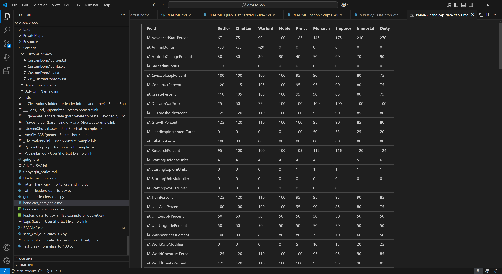

# Quick Get Started Guide

This page does not go to go deep into the technicalities, for that see the other documents in [/_1_AdvCiv-SAS/](/_1_AdvCiv-SAS/) or the main [README.md](/README.md) for details, but it gives instead a quick starter guide on the key few differences between AdvCiv and AdvCiv-SAS, for newcomer players used to AdvCiv, Civ4 BTS, or some similar mods.

## Menu

Below is the menu, generated thanks to chatgpt (as of now i'm using chatgpt 5 which does this very well and fast anyways etc among other versions who/which could or not but anyways etc), feeding it the global search results of these entries and telling the format of the entries :) Hopefully helpful, thanks a lot chatgpt 5 hehe (among other versions or not had i tried with them but anyways etc). If you're curious how i did it, see this [google drive folder link](https://drive.google.com/drive/folders/1B18cJ8GYD8X_0vMoiTihVz0tthg5m_sg?usp=sharing) 's screenshots for details, hopefully helpful or not or yes or etc anyways etc

[Sevopedia AdvCiv-SAS Entries](/_1_AdvCiv-SAS/Docs_And_Appendixes/README_Quick_Get_Started_Guide.md#sevopedia-advciv-sas-entries)  
[Handicap info tables .csv and .md and info about the .py script that can regenerate them if need and how](/_1_AdvCiv-SAS/Docs_And_Appendixes/README_Quick_Get_Started_Guide.md#handicap-info-tables-csv-and-md-and-info-about-the-py-script-that-can-regenerate-them-if-need-and-how)  
[Full exhaustive very long and exhaustive changes](/_1_AdvCiv-SAS/Docs_And_Appendixes/README_Quick_Get_Started_Guide.md#full-exhaustive-very-long-and-exhaustive-changes)  
[Main Changes quick starter guide](/_1_AdvCiv-SAS/Docs_And_Appendixes/README_Quick_Get_Started_Guide.md#main-changes-quick-starter-guide)  
&emsp;[Translations](/_1_AdvCiv-SAS/Docs_And_Appendixes/README_Quick_Get_Started_Guide.md#translations)  
&emsp;[Renaming (non-exhaustive)](/_1_AdvCiv-SAS/Docs_And_Appendixes/README_Quick_Get_Started_Guide.md#renaming-non-exhaustive)  
&emsp;[Sevopedia reworks and other related changes](/_1_AdvCiv-SAS/Docs_And_Appendixes/README_Quick_Get_Started_Guide.md#sevopedia-reworks-and-other-related-changes)  
&emsp;[Concepts (as of now in the "Outdated" sevopedia category)](/_1_AdvCiv-SAS/Docs_And_Appendixes/README_Quick_Get_Started_Guide.md#concepts-as-of-now-in-the-outdated-sevopedia-category)  
&emsp;[AI general behaviour (non-exhaustive…)](/_1_AdvCiv-SAS/Docs_And_Appendixes/README_Quick_Get_Started_Guide.md#ai-general-behaviour-non-exhaustive-see-global-defines-and-ai-variables-and-such-xml-files-for-details)  
&emsp;&emsp;[Units in general (AI)](/_1_AdvCiv-SAS/Docs_And_Appendixes/README_Quick_Get_Started_Guide.md#units-in-general-ai)  
&emsp;&emsp;[Settlers (AI)](/_1_AdvCiv-SAS/Docs_And_Appendixes/README_Quick_Get_Started_Guide.md#settlers-ai)  
&emsp;&emsp;[Workers (AI)](/_1_AdvCiv-SAS/Docs_And_Appendixes/README_Quick_Get_Started_Guide.md#workers-ai)  
&emsp;&emsp;[City Plots (AI)](/_1_AdvCiv-SAS/Docs_And_Appendixes/README_Quick_Get_Started_Guide.md#city-plots-ai)  
&emsp;&emsp;[Specialists (AI)](/_1_AdvCiv-SAS/Docs_And_Appendixes/README_Quick_Get_Started_Guide.md#specialists-ai)  
&emsp;&emsp;[City Production (AI)](/_1_AdvCiv-SAS/Docs_And_Appendixes/README_Quick_Get_Started_Guide.md#city-production-ai)  
&emsp;&emsp;[Leaders (AI)](/_1_AdvCiv-SAS/Docs_And_Appendixes/README_Quick_Get_Started_Guide.md#leaders-ai)  
&emsp;&emsp;[Buildings (AI)](/_1_AdvCiv-SAS/Docs_And_Appendixes/README_Quick_Get_Started_Guide.md#buildings-ai)  
&emsp;&emsp;[Military (AI)](/_1_AdvCiv-SAS/Docs_And_Appendixes/README_Quick_Get_Started_Guide.md#military-ai)  
&emsp;[UI / In-game](/_1_AdvCiv-SAS/Docs_And_Appendixes/README_Quick_Get_Started_Guide.md#ui--in-game)  
&emsp;[General changes (non-exhaustive…)](/_1_AdvCiv-SAS/Docs_And_Appendixes/README_Quick_Get_Started_Guide.md#general-changes-non-exhaustive-see-global-defines-and-other-unrelated-xml-files-for-details)  
&emsp;[Handicap i.e. difficulty settings (non-exhaustive…)](/_1_AdvCiv-SAS/Docs_And_Appendixes/README_Quick_Get_Started_Guide.md#handicap-ie-difficulty-settings-non-exhaustive-see-the-csv-comparison-tables-locally-libreoffice-etc-or-on-github-recommended-provided-orand-sevopedia-orand-xml-for-details)  
&emsp;[Specialists (non-exhaustive…)](/_1_AdvCiv-SAS/Docs_And_Appendixes/README_Quick_Get_Started_Guide.md#specialists-non-exhaustive-see-sevopedia-orand-xml-for-details)  
&emsp;[Terrains / Features (non-exhaustive…)](/_1_AdvCiv-SAS/Docs_And_Appendixes/README_Quick_Get_Started_Guide.md#terrains--features-non-exhaustive-see-sevopedia-orand-xml-for-details)  
&emsp;[Bonus (non-exhaustive…)](/_1_AdvCiv-SAS/Docs_And_Appendixes/README_Quick_Get_Started_Guide.md#bonus-non-exhaustive-see-sevopedia-orand-xml-for-details)  
&emsp;[Improvements and worker builds (non-exhaustive…)](/_1_AdvCiv-SAS/Docs_And_Appendixes/README_Quick_Get_Started_Guide.md#improvements-and-worker-builds-non-exhaustive-see-sevopedia-orand-xml-for-details)  
&emsp;[Technologies (non-exhaustive…)](/_1_AdvCiv-SAS/Docs_And_Appendixes/README_Quick_Get_Started_Guide.md#technologies-non-exhaustive-see-sevopedia-orand-tech-advisor-orand-xml-for-details)  
&emsp;[Eras](/_1_AdvCiv-SAS/Docs_And_Appendixes/README_Quick_Get_Started_Guide.md#eras)  
&emsp;[Civilizations (non-exhaustive…)](/_1_AdvCiv-SAS/Docs_And_Appendixes/README_Quick_Get_Started_Guide.md#civilizations-non-exhaustive-see-sevopedia-orand-xml-for-details)  
&emsp;[Leaders (non-exhaustive…)](/_1_AdvCiv-SAS/Docs_And_Appendixes/README_Quick_Get_Started_Guide.md#leaders-non-exhaustive-see-sevopedia-orand-xml-for-details)  
&emsp;[Barbarians (non-exhaustive…)](/_1_AdvCiv-SAS/Docs_And_Appendixes/README_Quick_Get_Started_Guide.md#barbarians-non-exhaustive-see-sevopedia-orand-xml-for-details)  
&emsp;[Traits (non-exhaustive…)](/_1_AdvCiv-SAS/Docs_And_Appendixes/README_Quick_Get_Started_Guide.md#traits-non-exhaustive-see-sevopedia-orand-xml-for-details)  
&emsp;[Civics (non-exhaustive…)](/_1_AdvCiv-SAS/Docs_And_Appendixes/README_Quick_Get_Started_Guide.md#civics-non-exhaustive-see-sevopedia-orand-xml-for-details)  
&emsp;[Buildings (non-exhaustive…)](/_1_AdvCiv-SAS/Docs_And_Appendixes/README_Quick_Get_Started_Guide.md#buildings-non-exhaustive-see-sevopedia-orand-xml-for-details)  
&emsp;[Culture](/_1_AdvCiv-SAS/Docs_And_Appendixes/README_Quick_Get_Started_Guide.md#culture)  
&emsp;[Religions (non-exhaustive…)](/_1_AdvCiv-SAS/Docs_And_Appendixes/README_Quick_Get_Started_Guide.md#religions-non-exhaustive-see-sevopedia-orand-xml-for-details)  
&emsp;[Corporations (non-exhaustive…)](/_1_AdvCiv-SAS/Docs_And_Appendixes/README_Quick_Get_Started_Guide.md#corporations-non-exhaustive-see-sevopedia-orand-xml-for-details)  
&emsp;[Civilian Units](/_1_AdvCiv-SAS/Docs_And_Appendixes/README_Quick_Get_Started_Guide.md#civilian-units)  
&emsp;[Military and some civilian units related info (non-exhaustive…)](/_1_AdvCiv-SAS/Docs_And_Appendixes/README_Quick_Get_Started_Guide.md#military-and-some-civilian-units-related-info-non-exhaustive-see-sevopedia-orand-xml-for-details)  
[Fixes](/_1_AdvCiv-SAS/Docs_And_Appendixes/README_Quick_Get_Started_Guide.md#fixes)  

## Sevopedia AdvCiv-SAS Entries

Some of the changes from previous to AdvCiv-SAS mods (non-exhaustive) are also listed in the Sevopedia Entry (non-exhaustive), see the main [README.md#changes-from-one-mod-to-another-sevopedia-itemspages](/README.md#changes-from-one-mod-to-another-sevopedia-itemspages) for details.

There are new features and changes in AdvCiv-SAS, in particular written/coded by me wonderingabout, ChatGPT, and Claude AI, which are documented (mostly by me (wonderingabout) though hehe anyways etc), such as the AI personality panel (featuring raw and AI attributes display and ranking for all leaders), hopefully useful in understanding how each and all AI leaders behave and relate to each other. A copy of the screenshots (may not be latest version of it but hopefully quite close to it at least as of now anyways etc) of how it looks ingame:

</img>
</img>
</img>

For more screenshot samples of new sevopedia entries or udpated ones (not exhaustive), you can visit the [README.md#sevopedia-reworks-ai-personality-panel-and-other-sevopedia-reworks](/README.md#sevopedia-reworks-ai-personality-panel-and-other-sevopedia-reworks) link (for details (too anyways etc)).

## Handicap info tables .csv and .md and info about the .py script that can regenerate them if need and how

To follow/understand smoother difficulties (called handicap in civ4 if i am not mistaken but anyways etc), i have also added a table view of the differences between difficulties/handicap settings, please see [/README.md#csv-and-md-view-of-the-handicap-difficulties-info-in-a-table-for-all-difficulties-info](/README.md#csv-and-md-view-of-the-handicap-difficulties-info-in-a-table-for-all-difficulties-info) for details. Example output (non-exhaustive, also screenshot may not be updated, best to see link above i would say but anyways etc for details if interested but anyways etc):

</img>
</img>

See also handicap changes in the main changes quick starter guide section anyways etc.

## Full exhaustive very long and exhaustive changes

If you want to see the full very exhaustive code changes between AdvCiv current latest stable, for example 1.12 here, and AdvCiv-SAS, please visit this [pull request compare](https://github.com/wonderingabout/AdvCiv-SAS/pull/13).

Be warned though it can be very lengthy, so read below if you want (some of the) main quick pointers rather. I tried organizing them in categories if it helps.

## Main Changes quick starter guide

### Translations

For the new content or modified one in this mod (AdvCiv-SAS), only English translations are provided. If your game is in another language, you will still see some text, but in English. For modders, see the detailed explanation (code comment), mostly provided by ChatGPT and which was very helpful (to me at least, anyways, ) on how this is implemented at TXT_KEY_ADVCIV_SAS_CORE_CHANGES_PEDIA_SR 's entry.

### Renaming (non-exhaustive)

- some convenience and quality of life changes: for example WFYABTA ("We fear you are becoming too advanced" is now renamed as "We fear you are trading more than us", but it is exactly the same effect, just it is not related to tech pace at all (i was 4 techs behind from an AI if i remember correctly but still got this message from it, after some (frustrating) research i found it is not related to tech advancement but how much you trade with all players (trade less and it will/should(?) fade eventually)))
- also some other fixes about "the forge has been destroyed" when it was sometimes not destroyed misleading messaged tweaked to something not misleading (for example "The forge has caught fire")
- (Air) interception chance for nukes is now named "Adjusted Air Interception Chance", as it also accounts for Nuke's Air evasion chance if i am not mistaken, see also this [civfanatics forums nukes and such thread](https://forums.civfanatics.com/threads/sdi-icbm-and-tactical-nukes.239415/) for details
- the civilopedia is renamed the sevopedia, it is the same thing but is the name of the more modern version (made by modders) of it.
- Renamed "Ressource" to "Bonus" (so "ressources" would be "bonuses" now anyways etc) for shorter Sevopedia category width, but also perhaps a good opportunity to match code name and game name maybe at least is how i would want to do it an AdvCiv-SAS if hopefully fine as in functionning well anyways etc.
- Renamed some bonuses such as "Ivory" to "Elephants", "Cow" to "Cattle", "Clam" to the more general "Molluscs", and for example also "Wine" to "Grapes", for example. See also Bonus: grapes changes for more / related details anyways etc. Or .
- Renamed "Ice" (Terrain) to "Ice Sheet", and "Ice" (Feature) to "Ice Cap", hopefully clearer and more accurate, see their Sevopedia entries for details
- Renamed "great wonders" to "world wonders", but functionally the exact same if i am not mistaken, i hope it is clearer, more intutiive, and in line with "world project", hinting more strongly at the fact that only one is possible in the entire world if i am not mistaken, anyways etc.
- Renamed some leaders such as "Montezuma" to "Moctezuma II" for accuracy and exhaustiveness, see xml or/and sevopedia list of leaders ingame or/and docs for details if any details are there as well anyways etc
- religion "taoism" has been renamed to "daoism" and all related entries (temple and other buildings, units such as missionary etc, and description/history in sevopedia and such), i have heard many times of the "Dao" (or read maybe rather anyways etc) in manhua (translated) but never ever saw "Tao", while both seem correct as chinese translitterations if am not mistaken, it seemed that Dao is perhaps more fit, but in all cases even if not i'd rather use this one i'm more famililar with and that makes more sense to me, hopefully clearer for others or/and maybe not anyways etc
- unique units are now renamed civilization units, as they are not unique and can be built many times, just by only one civ in AdvCiv-SAS (and in base civ4 BTS/AdvCiv too if i am not mistaken) if i am not mistaken. Could be shortened to civ units maybe too as i may or not or not always do further in this doc or/and other docs, hopefully the meaning of this expression would be clear enough (fast worker for india for example)
- unit promotions have clearer names now too: for example Counter-Archer, counter Siege, Counter-Tank. Or another example is "City Bombard Damage" (instead of barrage). Numeric naming has been changed too for clarity and ease of read: for example "Combat III" is now "Combat 3" too.

### Sevopedia reworks and other related changes

- for sevoedpia new content and most reworks, see above in this readme or in more detail at [README.md#sevopedia-reworks-ai-personality-panel-and-other-sevopedia-reworks](/README.md#sevopedia-reworks-ai-personality-panel-and-other-sevopedia-reworks)
- additionally, also expanded sevopedia so it uses all screen space available (no margins anymore), now more space to display info if want/need or visual clarity, as some also do for example or/and comparison anyways/etc
- reduced main categories width from approxiamtely 200px to 124px approximately, this quite greatly increases the space of the sevopedia for the content or items category(?)/column (the one that lists for example for the leaders category "Alexander[...]", "Ashoka", etc.. until the end of alphabet and for all other main categories too that have a listing of items (which is almost all if i'm not mistaken anyways)). Hopefully clearer now for this non critical info, while still preserving the 2nd category's width, using shortened names when possible or necessary in 1st/main categories's 1st column.
- in particular replaced some pedia entries of religions in particular but not only (also of some techs, buildings, units, bonuses, a few terrains/features as of now too, etc.), with wikipedia based entries (unless stated otherwise in the pedia entry or in code comments or docs), so that it is more accurate and possibly if i may say anyways etc instructive or/and informative or/and neutral/objective or/and perhaps also enjoyable anyways etc.

### Concepts (as of now in the "Outdated" sevopedia category)

- added a few new entries such as concept_rivers, concept_route_road, concept_route_railroad. These are not supported in advciv-sas, hence the "outdated" name (i am not making sure the info is in line with our mod's changes if i may say anyways etc), however i tried to include new entries to give more information about civ4 features i wanted to know / wished i knew about, or/and that we used for other purposes such as redirecting for buttons/images, or that i found informative or/and wanted to add anyways etc. See [README.md#concepts-as-of-now-in-the-outdated-sevopedia-category](/README.md#concepts-as-of-now-in-the-outdated-sevopedia-category) for details.

### AI general behaviour (non-exhaustive, see global defines and ai variables and such xml files for details)

#### General Changes (AI)

- global defines and AI variables and such similar or related files's values have been changed quite extensively to favour AI efficiency and opportunism, sort of mercilessness over role-playing or seemingly suboptimal settings. These changes include but not only religion importance, now being higher (in terms of culture strength (not exactly sure what this means but should be fine and as i intend i think maybe)) or also lower revolt chance, anger from war quite a bit reduced, etc. So overall the AI will be at least in theory / ideally as planned anyways etc be a lot more pragmatic or/and opportunistic AI, and will not be much more aggressive than in AdvCiv, but will hesitate less to declare war if there is profit, but also bother less to engage in wars or/and be cautious about them, especially multi wars, if not to its benefit (which often is not), and also have a higher reluctance to agree to a war trade. AI may also act more on tribute threats and transform them into immediate war declarations if refused (might is right as one or they people may say but is realistic as sad as it may be such is life i mean for better or worse but anyways etc). As well as many other changes, see files such as [GlobalDefines_advc.xml](/Assets/XML/AI_Variables_GlobalDefines.xml), [AI_Variables_GlobalDefines.xml](/Assets/XML/AI_Variables_GlobalDefines.xml), and [BBAI_Game_Options_GlobalDefines.xml](/Assets/XML/BBAI_Game_Options_GlobalDefines.xml) for much more exhaustive details there anyways etc (note: as i don't know much C++ i didn't modify AI behaviour much more if at all than in xml files, but i hope this is still quite extensive and very significant in terms of changes in particular vs base advciv AI i mean anyways etc). Some changes handpicked from these xml files if i may say, but not exhaustive i mean anyways etc, are also available as scattered items throughout this quick get started guide main changes sections if i may say anyways etc, hopefully helpful, anyways etc.

#### Units in general (AI)

- generalized and beyond tremedously improved scrapping logic, now generalized to almost all if not all unitAIs (see known issue 52 in military (AI) section for details anyways etc), in `CvUnit::canScrap()`. What this means is we now don't destroy our units and then rebuild them because we now think we don't have enough, causing us to be stuck in endless very inefficient loops. This is adjusted by unitAI types and now also has a matching logic that handles which unit to allow the production order of, with overproduction quotas in `CvCityAI::AI_chooseUnit`, based on conditions such as war and such, for example we don't want explore units or settlers at war or danger, but we definitely want land units then. As for naval units, if map is naval heavy (e.g. archipelago, etc), we want quite a bit more of these, less if not (e.g. pangea, continents, etc.), and still regardless of map type, we don't want these at war or danger so max is lower if not 0 then at production stage, but as for scrapping, don't scrap existing ones. Workers having a decaying logic for max units so we scrap excess as they are less relevant later if helps (i don't know if they cost maintenance xd but hopefully maybe helps (check if accurate) anyways etc) quite conservatively. This fixes issue of AI in some cases dying in pangea in particular while overproducing despite our previous changes, in some cases still (most likely due to code that short circuited our previous changes or/and our changes not being effective or relevant enough maybe but anyways etc). AI is much more competitive/stronger now, and in same save file quickly shifted/adjuted but anyways etc its production to land units and survival mode when in excess naval units artifically from this desperate already too late save file, so hopefully starting from an earlier time mistake would not have been made in this case i mean but anyways etc. See for details [53 - (Beyond Tremendously Improved) Naval dementia of producing privateers/galleons then seemingly scrapping them and repeat, or/and of more importantly building galleons and privateers in droves and excess if i may say but anyways etc, despite enemy threatening cities of land capture for 20+ turns, and losing capital as a result anyways etc](/_1_AdvCiv-SAS/Docs_And_Appendixes/README_Known_Issues_In_Base_AdvCiv_Civ4.md#53---beyond-tremendously-improved-naval-dementia-of-producing-privateersgalleons-then-seemingly-scrapping-them-and-repeat-orand-of-more-importantly-building-galleons-and-privateers-in-droves-and-excess-if-i-may-say-but-anyways-etc-despite-enemy-threatening-cities-of-land-capture-for-20-turns-and-losing-capital-as-a-result-anyways-etc-fixedaddressed-by-now-managing-production-of-each-unitai-with-max-by-type-in-cvcityaiai_chooseunit-as-well-as-disallowing-scrapping-and-managing-it-by-unitai-type-globally-as-well-in-cvunitcanscrap-by-type-as-well-with-max-and-such-other-conditions-for-some-units-like-as-of-now-workers-anyways-etc). Hopefully we also handle with this possible other silent issues that may have happened like for the workboats infinite loop (see known issue as of now 23 for details) or such other unknown issues possibly preemptively fixed but anyways etc, which hopefully help AI a lot not proceed with nonsensical or/and poorly coordinated logic it is fed/told but anyways etc.

#### Settlers (AI)

- (Seemingly fixed) AIs settling too much and too often on bonuses, especially food bonuses (!!!) and metals and other high production bonuses or also commerce bonuses to a lesser extent. This should now be avoided by the AI unless otherwise locally profitable to settle on (for example there are 2 or such other bonuses nearby or/and some very valuable combination of terrains/features or/and other things we value). Added thanks to chatgpt's help and feedback, as well as my prompts and adjustments too or and such and its help too but anyways etc anyways etc anyways etc, see for details [README_Known_Issues_In_Base_AdvCiv_Civ4.md#25---seemingly-fixed-ais-settling-too-much-and-too-often-on-bonuses-especially-food-bonuses--and-metals-and-other-high-production-bonuses-or-also-commerce-bonuses-to-a-lesser-extent](/_1_AdvCiv-SAS/Docs_And_Appendixes/README_Known_Issues_In_Base_AdvCiv_Civ4.md#25---seemingly-fixed-ais-settling-too-much-and-too-often-on-bonuses-especially-food-bonuses--and-metals-and-other-high-production-bonuses-or-also-commerce-bonuses-to-a-lesser-extent) anyways etc (if not solved, then hopefully should happen much less now if i am not mistaken but anyways etc, check to be sure i mean too but anyways etc). As for the results, i didn't test it too much, but from the few dozen or such autoplays i looked at, it seems AI never (if not, then almost never) settles on bonuses anymore which is very nice, except some cases where it is extremely profitable to do so (like having many water bonuses or land bonuses in city radius or/and many high value (grass, flood plains, etc) tiles in city radius as a result). This was before i refactored this code i added, should now be even better, but check to be sure, anyways etc.
- about water bonuses/ressources in particular, quite often it seems they are in range of city settle/found/plant spot but ignored by AI settling/founding/planting its city instead but anyways etc a non-coastal location, attempt to fix/address this as well by making the penalty in that case much stronger, as of now increased from -165 to -400 (seems to have been -800 in k-mod if i am not mistaken but anyways etc, see [/CvGameCoreDLL/CitySiteEvaluator.cpp](/CvGameCoreDLL/CitySiteEvaluator.cpp) for details or/and updated value anyways etc), hopefully helps the AI consider more often water ressources or at least not ignore them when they are in range of their city sites considerations if i may say in this case at least maybe but anyways etc anyways etc anyways etc
- even for non bonus water ressources, also told the AI to now prioritize settling on coast when food environment is low (many tundra or/and plains or/and desert or/and snow (or/and peak although i assume is not counted but to be safe anyways etc)) (the "Corinth screenshot"), which should make AI settling significantly stronger instead of otherwise starving at very low pop, see [README_Known_Issues_In_Base_AdvCiv_Civ4.md#32---now-seemingly-fixed-prioritize-settling-on-coast-when-food-environment-is-low-many-tundra-orand-plains-orand-desert-orand-snow-orand-peak-although-i-assume-is-not-counted-but-to-be-safe-anyways-etc-the-corinth-screenshot](/_1_AdvCiv-SAS/Docs_And_Appendixes/README_Known_Issues_In_Base_AdvCiv_Civ4.md#32---now-seemingly-fixed-prioritize-settling-on-coast-when-food-environment-is-low-many-tundra-orand-plains-orand-desert-orand-snow-orand-peak-although-i-assume-is-not-counted-but-to-be-safe-anyways-etc-the-corinth-screenshot) for details anyways etc
- (Attemptingly fixed/addressed) tell AI settlers which (non-home and non-bonus tiles) terrains and features environments are best to settle near (for example good if a lot of grass or flood plains in city radius, bad if desert or plains in city radius). As for local tile to settle on (bHome) optimization as well: hate to settle on hill grass or flood plains, love to settle on hill plains or tundra or desert ; overridden only if locally plot is otherwise really good (e.g. allows to have 2 bonuses or such so ideal spot but we have to settle on flood plains for it for example or some other good tile anyways etc), hopefully AI settles much better its cities and is stronger as a result, but check to be sure as i didn't test it since refactor i did which already improved this a lot at that time if i'm not mistaken but anyways etc. And in some local cases, it may be good to override these (e.g. a city spot has few plains but 2 food bonuses, or for example settling on flatland grass but with a lot of flood plains and other flatland grass, etc). See [README_Known_Issues_In_Base_AdvCiv_Civ4.md#26---attemptingly-fixedaddressed-tell-ai-settlers-which-non-home-and-non-bonus-tiles-terrains-and-features-environments-are-best-to-settle-near-for-example-good-if-a-lot-of-grass-or-flood-plains-in-city-radius-bad-if-desert-or-plains-in-city-radius-as-for-local-tile-to-settle-on-bhome-optimization-as-well-hate-to-settle-on-hill-grass-or-flood-plains-love-to-settle-on-hill-plains-or-tundra-or-desert--overridden-only-if-locally-plot-is-otherwise-really-good-eg-allows-to-have-2-bonuses-or-such-so-ideal-spot-but-we-have-to-settle-on-flood-plains-for-it-for-example-or-some-other-good-tile-anyways-etc](/_1_AdvCiv-SAS/Docs_And_Appendixes/README_Known_Issues_In_Base_AdvCiv_Civ4.md#26---attemptingly-fixedaddressed-tell-ai-settlers-which-non-home-and-non-bonus-tiles-terrains-and-features-environments-are-best-to-settle-near-for-example-good-if-a-lot-of-grass-or-flood-plains-in-city-radius-bad-if-desert-or-plains-in-city-radius-as-for-local-tile-to-settle-on-bhome-optimization-as-well-hate-to-settle-on-hill-grass-or-flood-plains-love-to-settle-on-hill-plains-or-tundra-or-desert--overridden-only-if-locally-plot-is-otherwise-really-good-eg-allows-to-have-2-bonuses-or-such-so-ideal-spot-but-we-have-to-settle-on-flood-plains-for-it-for-example-or-some-other-good-tile-anyways-etc) for details.
- disable `AIFoundValue::adjustToBadHealth`, so that now AI settlers would go for yield potential, not avoid immediate bad health if i am not mistaken in thinking so or my understanding but anyways etc. Also now in our mod jungle yields as of now production on remove as well although a bit less than forest for a bit longer time in this case i mean but anyways etc, but what i mean is look at plot potential rather than immediate health, it can't be that different except in mod mods or such, which we don't intend to support with this change anyways etc. Update: since then toned it down a bit and enhanced it: now we have a threshold, we tolerate some bad health without penalty, after not too bad, we can as of now chop jungle for benefits (see changes to feature_jungle below anyways etc), but if too much health to the point we may not grow or it's just too high, and not offset by forest good health, then we avoid the site for our capital quite strongly and a bit less for later cities. For example, as of now for the capital the healthpercent difference we tolerate is <= 350 without applying penalty yet. So if you have as of now (i.e if the AI settler, not human players, anyways etc) 7 jungle tiles, of 50 health percent (i.e -0.50 health in city if i am not mistaken but anyways etc) in city radius (if i am not mistaken too but anyways etc), then you are barely not penalized i mean the AI settler still thinks it is good, same if city spot candidate had say 9 jungle and 3 forest (9 x (-50) + 3 x (+ 50) = 6 x (-50) = -300 still under 350 so AI thinks it's good even for capital, but say 8 jungle tiles without forest is beyond the threshold (8 x (-50) = -400)), so AI will quite strongly avoid it, at least for now, until no better site remains, so that it grows fine. When AI has more workers, it willb e able to chop these easier so i hope these make sense, but old base advciv code penalized them more linearly and not dynamically like we do, but ofc i could be mistaken and just glanced at their code before changing it, so check to be sure if accurate, anyways etc. As of now for later cities the ratio of tolerance is >= 450 if i am not mistaken so we have more leeway, still overly jungly or such areas will be aovided at least at first, else fine. Note: floodplains not counted as their advantage of high food offsets the health penalty, as of now. As a result, AI have better starting cities, not totally rejecting fine sites, but avoid early the very unhelathy one,s and then coming back to them later as they can be often quite good actually in potential, epecially with our jungle changes, but later in the game most often at least in theory (i didn't retest it too much since that change but seems to behave as so and as intended, but check to be sure) check code for details as of now in `AIFoundValue::evaluate` if i am not mistaken anyways etc, anyways etc.
- make ai cities wider spread and simplify conditions with changes in `AIFoundValue::isTooManyTakenTiles` and `AIFoundValue::adjustToCivSurroundings` (remove long distance penalties of settling cities in this case i mean but anyways etc, and if i am not mistaken anyways etc), they were often times too or even very much way too crowded and close in a way that doesn't allow them to grow past size 4 or 6 and they'd compete for yields, hopefully much more efficient now with a wider spreading, although as a result they are a bit thinner and militarily weaker but should be very worth it or so i think but anyways etc.
- since that change, fine tune it further by penalizing too close cities, and also penalizing too far cities. Not from our capital as in old code and that we disabled, but from our nearest city rather. This means that otherwise good city spots that are not compatible with a star-shaped empire will still be considered and not unfairly or unfortunately dismissed because they don't fit this. So thin empires may be good, only criterion is how far or close we are to nearest city. This penalty is strongest early as empire needs to be especially cohesive early, and fades moderately the more cities we have (see `int AIFoundValue::adjustToCivSurroundings` for details). Hopefully AI is more creative and combative, especially later as the game goes on if i may say in this case but anyways etc and the city spots remaining are less, while economy should be stronger and strong enough now in this case i mean but anyways etc to support farther city settlements(/settling ?), and military stronger to protect this potentially thinner empire too if i am not mistaken but anyways etc, in its city settlement(/settling ?) choices. I hope this helps AI spread cities more as is needed as they are too crowded in base advciv +/- civ4 quite often, plus also penalize spreading too far the farther we are, but the less we penalize it the more cities we have. Code provided by gemini ai which i then tweaked, results seem very good (cities nicely spread but not too far as with my first change) but test/check to be sure anyways etc.
- remove some aifoundvalue conditions to simplify logic now that ours is tweaked no need to add distrubance or potential inaccuracy or ineffiency or/and undesired behaviour if i may say but anyways etc
- `AIFoundValue::evaluateDefense`: remove evaluate defense logic as we have a yield focus logic rather, especially do not make barbarian cities weaker, it is infuriating, needless interference, and also this city later will be captured, so make it a good settlement location in all cases anyways etc
- `AIFoundValue::adjustToBarbarianSurroundings`: remove this logic as well: i want AI to take best city spots even if there are barbarians there, do not have this interferring logic that may produce unexpected results and/or lead to weaker AI anyways etc
- restricted settlers for AIs to be built only in capital, and only if city pop >= 5 (i.e. not <= 4 anyways etc). This is so they can use more efficiently the food as production, as it's much easier to produce a settler using food from the many population count additionally to existing hammer yields as well, than it is at low pop. And if city stagnates, it is very efficient too, at least food is put to use instead of stagnating. There are other advantages, such as seemingly a bit less barbarian captures, and more units early. We may use 1 or 2 spots, but barbarian captures happen much less, and secondary cities can grow more. This change is in line with the settler now being a national unit as of now (1 allowed for whole empire including existing unit but anyways etc, check quick get started guide for updated values or/and info, or/and sevopedia or/and xml anyways etc). As for small new cities, it guarantees they grow as well instead of being stuck producing a settler for a long time, as hapepned many times and was the original reason why i did this to begin with, then expanded on it. I added a patch, although should never happen with the settler being a national unit and only in capital, but that if city is very small and stagnant, switch to worker instead, but since only cpaital as of now produces them and it grows fast, this shouldn't happen but if changed this patch woudl help as well small cities being stuck in a very lnog settler production and being stagnant anyways etc, in fact it's necessary now else our capital can't produce a settler, as chatgpt 5 noticed and/or noted as well but anyways etc. Update: also as it mentionned to me to add here as well, there are exceptions such as a city somehow being stagnant, then even if pop is small, we are not using the food anyway, so may as well take our chances and build a settler, as it rightly told me to add to this doc hehe which i forogt but i think this is a quite good summary otherwise if i may say but anyways etc...
- free window: during the first as of now 75 turns at normal game speed (adjusted based on game speed), the AI will have free production of settler (minus restrictions said before). So it can take its time and grow freely. Then after this window, it will consider which strategy to take, either offense mode, or defense mode, or other maybe which i added hardcoded in cvcityAI. Based on these, it may not build settlers anymore and start to stack units. This is something i had a problem with in base advciv, of AI expanding again and again while it was near me, instead of preparing for the likely war. Hopefully AI would react better to these.
- make AI settlers take longer to decide which site to start at for its first city to found, thanks to changes in ``CvUnitAI::AI_foundFirstCity``. In summary, now AI will take a free window of 5 turns of path from its spawn location without any penalty to any potential city site considered in that range, vs 2 with immediate penalties per turn if not found at turn 0 in base advciv if i'm not mistaken and base advciv having 2 turns max even on top of that. Also, non-coastal sites are no longer discarded now in our mod even if coastal ones are in range if i am not mistaken but anyways etc, and non-rivers and non-fresh water ones are no longer discarded as well if rivers or fresh water ones are in range: just pick the best, if it happens to be a coast, great, a river, great, if not, great too, simply pick best without bias or much less or less than before ideally but anyways etc. Our system allows for much better site selection, although in most games AI settlers should sitll choose best site they start on already, but in some cases, like low food tundra or such, if grassland is nearby at a few turns of walk, the AI would probably have settled there in base advciv regardless but not in our mod, where it would instead attempt to hopefully have a stronger, no emergency, and no strong starting type of city bias and discarding potentially locally better ones (if river is best all good, but don't discard a better site just because it doesn't have a river or fresh water, and rivers aand such are valorized already at evaluate part of the code of bets site anyway for all cities to found during the game if i am not mistaken not just first one so no need to overdo it if i am not mistaken but anyways etc) first city site, so hopefully AI has stronger starting city sites thanks to these changes, especially if starting site is somehow really bad ; see for details [43 - (Attemptingly improved/enhanced) AI settlers, for the first city found (i.e. at turn 0 if i am not mistaken anyways etc), settling too soon instead of digging a bit for better sites](/_1_AdvCiv-SAS/Docs_And_Appendixes/README_Known_Issues_In_Base_AdvCiv_Civ4.md#43---attemptingly-improvedenhanced-ai-settlers-for-the-first-city-found-ie-at-turn-0-if-i-am-not-mistaken-anyways-etc-settling-too-soon-instead-of-digging-a-bit-for-better-sites-and-other-related-changes)
- since, then further enhanced AI settler preferences in `AIFoundValue::evaluate`, by discouraging them from settling on too watery starts. As of now, if a city site has less than 12 good starter bfc tiles (what we consider to be any land tile (including peak), or water tiles with bonuses (such as coast fish)), excluding the home plot/tile (i.e. where the city is planted/founded/settled but anyways etc), which would mean if we account for the BFC having 20 plots/tiles (21 minus home plot is 20 if i'm not mistaken but anyways etc), this would mean that 20 - 12 = max 8 water non bonus tiles are tolerated without penalty, after/past that threshold a strong penalty is applied so they are encouraged to explore any site with other settings i didn't change as too messy xd but anyways, up to 5 path turns away as explained in known issue as of now 43 before (see as of now above anyways etc). This behaviour is opposite of base advciv +/- civ4 one which would instead encourage if not enforce starting on coast if i'm not mistaken. Our/this change results in AI having a more central start, securing a later nice city spot, having a more radial empire with a stronger capital that can better defend the empire and expand towards rivals early settling. Economically land tiles allow the capital to grow cottages/workshops etc more than water tiles, so the high water site that may have been fine for city 3/c or 4/d etc is not so good for the capital city. AI is much stronger now, see [44 - (Enhanced) Make/Encourage AI settlers walk away from bad starting sites in this case i mean but anyways etc](/_1_AdvCiv-SAS/Docs_And_Appendixes/README_Known_Issues_In_Base_AdvCiv_Civ4.md#44---enhanced-makeencourage-ai-settlers-walk-away-from-bad-starting-sites-in-this-case-i-mean-but-anyways-etc) for details, with screenshots about moscow AI having a very nice expansion and early and middle game as a result of moving 5 tiles away from its start 17 non bonus water tile edge. I also did while doing these other changes such as making AI like hill plains a lot more, etc, should be explained in other changes but tedious xd to track all, will do for some though but not all anyways etc, hopefully AI is more competitive now as well and enjoyable to play against anyways etc. Note: this change only applies to capital city, as i think it really needs land and a more central position and such for its growth etc, but other cities don't have this restriction, so they can take these sites better as in screenshots, see known issue link as of now 44 as mentionned here for details, hopefully helpful or not or yes or etc but anyways etc.
- other changes in batch in `AIFoundValue::evaluate` (non-exhaustive) and other related functions to AI settler preferences if i am not mistaken anyways etc: value fresh water more for city site by refactoring, simplifying and merging + reworking `AIFoundValue::evaluateFreshWater` in `AIFoundValue::evaluate` with other related changes too if i'm not mistaken but anyways etc, value settling on hill plains extra lot more (extra yield, one less low food tile, defense modifier, no blocking irrigation if i am not mistaken too, etc if any other advantages), disable `AIFoundValue::adjustToCivSurroundings` anti-crowd policy, we don't mind it, simply pick best site and don't interfere with our choice if i'm not mistaken and if i may say anyways etc

#### Workers (AI)

- note: this specific one should not be relevant anymore as we have overhauled AI worker builds entirely if i am not mistaken, but just in case and to be exhaustive too, anyways etc: further discourage AI workers to build forts on bonus/ressources (but since the more extensive AI worker changes i don't know if this is needed anymroe but no harm to keep there maybe in this case i mean but anyways etc), as it is often very inefficient (lower yields than ressource/bonus specific improvements, longer time to build, unlikely to be attacked there as disadvantageous, sometimes AI workers waste time to go out of their way to remove a ressource/bonus specific improvement just to build a fort in base advciv, also allowing/letting the ennemy pillage and rebuild ressources/bonuses that shouldn't be vital for any unless i'm mistaken then rebuilding the improvement later with nice yields should be much cheaper and more efficient i think at least if i may say in this case at least but anyways etc and if i am not mistaken too but anyways etc than guarding it with low yields the entire game), i tried to make this much less, ideally never likely to happen, as should generally be much more efficient to do so. In some cases the forts advantages may be lost such as connecting naval tiles or such, but generally it should benefit the AI and improve its performance. As of now untested, but done with chatgpt's help in modifying the DLL to do so, also guided by existing code comments that help a lot, see also [README_Known_Issues_In_Base_AdvCiv_Civ4.md#24---attemptingly-fixed-ai-workers-often-build-forts-on-ressourcesbonuses-even-if-they-already-have-an-existing-improvement-very-inefficient-and-not-immersive](/_1_AdvCiv-SAS/Docs_And_Appendixes/README_Known_Issues_In_Base_AdvCiv_Civ4.md#24---attemptingly-fixed-ai-workers-often-build-forts-on-ressourcesbonuses-even-if-they-already-have-an-existing-improvement-very-inefficient-and-not-immersive) for details for details
- make AI workers always (in theory at least for this part of the code anyways etc) improve bonuses (see renaming section of this readme or the corresponding sevopedia category for details about what bonuses mean in advciv-sas anyways etc) first before anything else, with a higher priority to food bonuses in particular. Hopefully this fixes AI not prioritizing, sometimes even ignoring for a long while available to improve bonuses, in particular food bonuses but not only these, any bonus, anyways etc. This is done by refactoring/rewriting `CvUnitAI::AI_bestCityBuild`, and seemingly as well results in a slightly faster code as a nice side effect anyways etc, thanks to gemini ai's persistence/stubborness hehe as well anyways etc (and bit of chatgpt's help), see also [/README.md#gemini-ai](/README.md#gemini-ai) and [/README_Known_Issues_In_Base_AdvCiv_Civ4.md#30---attemptingly-fixed-ai-workers-not-prioritizing-bonuses-to-improve-especially-food-bonuses-and-other-ai-workers-optimizations-orand-changes-anyways-etc](/_1_AdvCiv-SAS/Docs_And_Appendixes/README_Known_Issues_In_Base_AdvCiv_Civ4.md#30---attemptingly-fixed-ai-workers-not-prioritizing-bonuses-to-improve-especially-food-bonuses-and-other-ai-workers-optimizations-orand-changes-anyways-etc) for details anyways etc.
- as a result and part of these changes, make AI workers only allocate max one worker per tile being improved (any tile even the ones without bonuses anyways etc), hopefully to, in most cases, improve AI efficiency, especially, when/where AI workers would spend many turns to climb a hill or go to a forest or such high move speed cost tile if i am not mistaken anyways etc, hopefully this helps prevent that. AI now improves bonuses first before anything else if i am not mistaken
- Rewrite and greatly simplify `BuildTypes CvUnitAI::AI_betterPlotBuild(CvPlot const& kPlot, BuildTypes eBuild)`, so that we deprioritize routes for AI workers, and build them only in very rare cases, especially in the early game where yields are so important (now prioritize yields over move speed advantage, should help AI a lot in most cases hopefully at least i think so in this case anyways etc), and AI workers would often in base advciv waste time building roads first, sometimes even forgetting to improve the bonus in particular, or other tiles. I hope this makes AI sharper and more efficient, with a cleaner and much simpler best build override, thanks to gemini ai as well and thanks to me too if i may say in this case but anyways etc, see [README_Known_Issues_In_Base_AdvCiv_Civ4.md#31---attemptingly-fixed-deprioritize-routes-for-ai-workers-in-favour-of-yields-first-except-in-some-rare-cases](/_1_AdvCiv-SAS/Docs_And_Appendixes/README_Known_Issues_In_Base_AdvCiv_Civ4.md#31---attemptingly-fixed-deprioritize-routes-for-ai-workers-in-favour-of-yields-first-except-in-some-rare-cases) for details anyways etc
- Complete overhaul of `CvUnitAI::AI_bestCityBuild` [/CvGameCoreDLL/CvUnitAI.cpp](/CvGameCoreDLL/CvUnitAI.cpp): now AI workers follow a highly optimized build (improvements) routine and strategy, based on terrain, food, health, fast chopping, etc. This is done by completely ignoring base advciv +/- civ4 algorithms or/and logic, and defining probabilistically with a value tree our own value system +/- of priority to build based on our own advciv-sas conditions if i may say but anyways etc. Some of the changes include for example favouring cottages on flood plains unless we are low on food then farm, or not overwriting. Oscillation (i.e. AI workers constantly changing their minds and overwriting a mine with a windmill, then a few turns later rewrite the windmill with a mine, etc) should be much much less frequent if not any, or/and cleanly managed, with a set of "holy" improvements never to overwrite (hamlet, village, town, workshop, etc) and semi-holy ones (farms in low-food environments, cottages in high-food environments as of now for example too but anyways etc), a penalty for overwriting improvements so AI improves other improvements first, a wait later system to keep best tiles for later if we don't have an immediate good move for them and methodically improving next eligible best, as well as a system to tell the AI which are best and bonus-specific improvements, to fix the banana cottage issue, it will do a plantation or nothing, unless the food gain is high (grassland irrigated for example) then it may do a farm very methodically else leave for later to increase AI worker efficiency. Also, these changes fix and remove AI opening on a cottage plain, it will look for flood plains first, then grassland, etc. Logic is fine tuned on hills. There are many related changes as well, please view code there for details. As a result, AI cities and workers should be tremendously stronger than in base advciv, at least in theory. They favour economy improvements a bit too much but seem to handle fine having enough production for now although a bit less than before as i didn't tweak it for such. They also favour slow and steady growth, and adapt to current food situation per city to decide next improvement, without overwriting other improvements that already exist until all good other tiles have been improved first, following a detailed value adjustment system if i may say but anyways etc, with the help of gemini ai and claude ai mostly as well as myself too hehe if i may say but anyways etc. See [README_Known_Issues_In_Base_AdvCiv_Civ4.md#33---tremendously-improved-and-fixed-and-enhanced-ai-worker-buildimprovement-logic-in-cvunitaiai_bestcitybuild](/_1_AdvCiv-SAS/Docs_And_Appendixes/README_Known_Issues_In_Base_AdvCiv_Civ4.md#33---tremendously-improved-and-fixed-and-enhanced-ai-worker-buildimprovement-logic-in-cvunitaiai_bestcitybuild) with screenshot comparison and my analysis and such if i may say for details but anyways etc. Next goal is to fix citizen allocation that is terrible in base advciv +/- civ4, as as of now for example (screenshots 1573 and 1574) ulundi is starving despite having unallocated pig and corn that are improved for many turns!!!! Or (screenshots 1595 and 1596) prague stagnant while its improved sheep grassland is unallocated. This is shit citizen allocation and i hope to fix it but anyways etc. Hopefully AI is already much stronger with our changes but thanks for past if i may say but anyways etc but i hope i can improve these things among others or not in this case i mean but anyways etc. And seemingly further (much) improved it since then if i'm not mistaken but anyways etc, please see update note 2 at [README_Known_Issues_In_Base_AdvCiv_Civ4.md#30---attemptingly-fixed-ai-workers-not-prioritizing-bonuses-to-improve-especially-food-bonuses-and-other-ai-workers-optimizations-orand-changes-anyways-etc](/_1_AdvCiv-SAS/Docs_And_Appendixes/README_Known_Issues_In_Base_AdvCiv_Civ4.md#30---attemptingly-fixed-ai-workers-not-prioritizing-bonuses-to-improve-especially-food-bonuses-and-other-ai-workers-optimizations-orand-changes-anyways-etc) for details with screenshots there as well for comparison anyways etc. Since then updated to now also handle roading choice on not connected but connectable bonuses in BFC with other patches, see update 2 at [README_Known_Issues_In_Base_AdvCiv_Civ4.md#31---attemptingly-fixed-deprioritize-routes-for-ai-workers-in-favour-of-yields-first-except-in-some-rare-cases](/_1_AdvCiv-SAS/Docs_And_Appendixes/README_Known_Issues_In_Base_AdvCiv_Civ4.md#31---attemptingly-fixed-deprioritize-routes-for-ai-workers-in-favour-of-yields-first-except-in-some-rare-cases) for details anyways etc.
- (Seemingly fixed or/and enhanced) Make AI workers move sooner to City B or City C or such, and vice versa, if current city is already improved enough and don't need to be over improved, while other cities are not improved enough and would much rather need it, see [README_Known_Issues_In_Base_AdvCiv_Civ4.md#39---seemingly-fixed-orand-enhanced-make-ai-workers-move-sooner-to-city-b-or-city-c-or-such-and-vice-versa-if-current-city-is-already-improved-enough-and-dont-need-to-be-over-improved-while-other-cities-are-not-improved-enough-and-would-much-rather-need-it](/_1_AdvCiv-SAS/Docs_And_Appendixes/README_Known_Issues_In_Base_AdvCiv_Civ4.md#39---seemingly-fixed-orand-enhanced-make-ai-workers-move-sooner-to-city-b-or-city-c-or-such-and-vice-versa-if-current-city-is-already-improved-enough-and-dont-need-to-be-over-improved-while-other-cities-are-not-improved-enough-and-would-much-rather-need-it). Since then tremendously improved and tweaked in [README_Known_Issues_In_Base_AdvCiv_Civ4.md#41---seemingly-fixed-beyond-tremendously-improved-ai-worker-mobility-flexibility-and-reliability-now-favouring-minimal-big-city-improvement-come-back-to-it-later-but-dont-delay-improving-smaller-ones-quick-moving-to-smaller-ones-and-spending-longer-to-improve-smaller-ones-as-they-grow-fast-but-anyways-etc-as-well-as-being-braver-in-our-own-cultural-borders-orand-moving-to-other-cities-needing-improvements-rather-than-being-parked-in-current-city-if-i-am-not-mistaken-but-anyways-etc-and-such-other-changes-to-increase-ai-efficiency-reliably-and-other-changes-if-any-thanks-to-chatgpt-5-and-me-too-if-i-may-say-but-anyways-etc](/_1_AdvCiv-SAS/Docs_And_Appendixes/README_Known_Issues_In_Base_AdvCiv_Civ4.md#41---seemingly-fixed-beyond-tremendously-improved-ai-worker-mobility-flexibility-and-reliability-now-favouring-minimal-big-city-improvement-come-back-to-it-later-but-dont-delay-improving-smaller-ones-quick-moving-to-smaller-ones-and-spending-longer-to-improve-smaller-ones-as-they-grow-fast-but-anyways-etc-as-well-as-being-braver-in-our-own-cultural-borders-orand-moving-to-other-cities-needing-improvements-rather-than-being-parked-in-current-city-if-i-am-not-mistaken-but-anyways-etc-and-such-other-changes-to-increase-ai-efficiency-reliably-and-other-changes-if-any-thanks-to-chatgpt-5-and-me-too-if-i-may-say-but-anyways-etc) which seemingly Beyond Tremendously Improves AI worker mobility, flexibility, and reliability, now favouring minimal big city improvement (come back to it later but don't delay improving smaller ones), quick moving to smaller ones, and spending longer to improve smaller ones as they grow fast but anyways etc, as well as being braver in our own cultural borders or/and moving to other cities needing improvements rather than being parked in current city if i am not mistaken but anyways etc and such other changes to increase AI efficiency reliably, and other changes if any thanks to chatgpt 5 and me too if i may say but anyways etc, see [README_Known_Issues_In_Base_AdvCiv_Civ4.md#41---seemingly-fixed-beyond-tremendously-improved-ai-worker-mobility-flexibility-and-reliability-now-favouring-minimal-big-city-improvement-come-back-to-it-later-but-dont-delay-improving-smaller-ones-quick-moving-to-smaller-ones-and-spending-longer-to-improve-smaller-ones-as-they-grow-fast-but-anyways-etc-as-well-as-being-braver-in-our-own-cultural-borders-orand-moving-to-other-cities-needing-improvements-rather-than-being-parked-in-current-city-if-i-am-not-mistaken-but-anyways-etc-and-such-other-changes-to-increase-ai-efficiency-reliably-and-other-changes-if-any-thanks-to-chatgpt-5-and-me-too-if-i-may-say-but-anyways-etc](/_1_AdvCiv-SAS/Docs_And_Appendixes/README_Known_Issues_In_Base_AdvCiv_Civ4.md#41---seemingly-fixed-beyond-tremendously-improved-ai-worker-mobility-flexibility-and-reliability-now-favouring-minimal-big-city-improvement-come-back-to-it-later-but-dont-delay-improving-smaller-ones-quick-moving-to-smaller-ones-and-spending-longer-to-improve-smaller-ones-as-they-grow-fast-but-anyways-etc-as-well-as-being-braver-in-our-own-cultural-borders-orand-moving-to-other-cities-needing-improvements-rather-than-being-parked-in-current-city-if-i-am-not-mistaken-but-anyways-etc-and-such-other-changes-to-increase-ai-efficiency-reliably-and-other-changes-if-any-thanks-to-chatgpt-5-and-me-too-if-i-may-say-but-anyways-etc) for details as well anyways etc. Note: as a side effect of now having 1 AI worker per tile, they are harder to capture and no risk of losing a big worker stack, so i believe this is nice all in all of a change, not just for AI efficiency anymore if i am not mistaken but anyways etc. Note 2: AI handicap may have to be reduced as they are so much more efficient now, but i hope at least they are a good and worthwhile and/or fine challenge now and if already then even more, anyways etc, looking forward to other improvements (no pun but anyways etc) i find as well and (/or ?) want to do but anyways etc.
- Tremendously improved and fixed AI worker excessive retreating, causing it in rare cases to have AI workers parked in the city instead of improving other cities badly needing it if i may say but anyways etc, that would stay unimproved still but anyways etc. This is thanks to chatgpt 5's help and the changes include a wake from retreat, don't retreat excessively, and other such changes on top of previous AI worker improvements we had done already, it seems in some cases such as the oen i now solved if i'm not mistaken but anyways etc, excessive retreatign would still happen. See for details, with screenshots and such other explanations and/or such but anyways etc [50 - (Tremendously improved/fixed/enhanced) Excessive AI worker retreat logic causing worker parking in cities in rare cases: now added a wake from retreat and other changes if any other change i mean anyways etc](/_1_AdvCiv-SAS/Docs_And_Appendixes/README_Known_Issues_In_Base_AdvCiv_Civ4.md#50---tremendously-improvedfixedenhanced-excessive-ai-worker-retreat-logic-causing-worker-parking-in-cities-in-rare-cases-now-added-a-wake-from-retreat-and-other-changes-if-any-other-change-i-mean-anyways-etc) anyways etc

#### City Plots (AI)

- (Seemingly fixed/tweaked) Major K-Mod suboptimal food plot AI city allocation: starving or stagnant cities prefer 1 hammer over 4 food plots that are unallocated to any population ("Ulundi screenshots", "Prague Screenshots", and others) + food not being valued when food is production (e.g. worker, settler, etc if any more) when it is in fact the exact same and probably more reliable to set rather than production, see [README_Known_Issues_In_Base_AdvCiv_Civ4.md#34---seemingly-fixedtweaked-major-k-mod-suboptimal-food-plot-ai-city-allocation-starving-or-stagnant-cities-prefer-1-hammer-over-4-food-plots-that-are-unallocated-to-any-population-ulundi-screenshots-prague-screenshots-and-others--food-not-being-valued-when-food-is-production-eg-worker-settler-etc-if-any-more-when-it-is-in-fact-the-exact-same-and-probably-more-reliable-to-set-rather-than-production](/_1_AdvCiv-SAS/Docs_And_Appendixes/README_Known_Issues_In_Base_AdvCiv_Civ4.md#34---seemingly-fixedtweaked-major-k-mod-suboptimal-food-plot-ai-city-allocation-starving-or-stagnant-cities-prefer-1-hammer-over-4-food-plots-that-are-unallocated-to-any-population-ulundi-screenshots-prague-screenshots-and-others--food-not-being-valued-when-food-is-production-eg-worker-settler-etc-if-any-more-when-it-is-in-fact-the-exact-same-and-probably-more-reliable-to-set-rather-than-production) with screenshots and detailed (at least more detailed) analysis there, hopefully AI is a lot or quite a lot or quite a bit or such in this case i mean but anyways etc stronger or more versatile this way while not having the opposite downside of valuing food too much as well hopefully, see there for details, anyways etc.
- (Seemingly fixed / addressed) Tremendous/Major Plot allocation improvement 2: If we are high in happiness, favour food tiles much more, and hammer tiles much less if happiness is really high (favour growth dynamically and plot allocation of these the more we can afford it), even if production is slightly reduced short term as a result, it auto corrects at high happiness, with seemingly much stronger AI and developped cities as a result (excluded if food is production (e.g. worker, settler, etc if i am not mistaken but anyways etc)), see [README_Known_Issues_In_Base_AdvCiv_Civ4.md#40---seemingly-fixed--addressed-tremendousmajor-plot-allocation-improvement-2-if-we-are-high-in-happiness-favour-food-tiles-much-more-and-hammer-tiles-much-less-if-happiness-is-really-high-favour-growth-dynamically-and-plot-allocation-of-these-the-more-we-can-afford-it-even-if-production-is-slightly-reduced-short-term-as-a-result-it-auto-corrects-at-high-happiness-with-seemingly-much-stronger-ai-and-developped-cities-as-a-result-excluded-if-food-is-production-eg-worker-settler-etc-if-i-am-not-mistaken-but-anyways-etc](/_1_AdvCiv-SAS/Docs_And_Appendixes/README_Known_Issues_In_Base_AdvCiv_Civ4.md#40---seemingly-fixed--addressed-tremendousmajor-plot-allocation-improvement-2-if-we-are-high-in-happiness-favour-food-tiles-much-more-and-hammer-tiles-much-less-if-happiness-is-really-high-favour-growth-dynamically-and-plot-allocation-of-these-the-more-we-can-afford-it-even-if-production-is-slightly-reduced-short-term-as-a-result-it-auto-corrects-at-high-happiness-with-seemingly-much-stronger-ai-and-developped-cities-as-a-result-excluded-if-food-is-production-eg-worker-settler-etc-if-i-am-not-mistaken-but-anyways-etc) for details anyways etc

#### Specialists (AI)

- make the AI never ever choose the citizen specialist as it is too inefficient (change in the DLL in `CvCityAI::AI_jobChangeValue` thanks to gemini ai and chatgpt's help too anyways etc and adjusted for advciv-sas too or not anyways etc), that as a side effect may also slightly increase performance due to early return in the function anyways etc. Hopefully this also and most importantly helps increase AI efficiency and strength/competitiveness in the game i mean anyways etc ; added with the help of gemini ai too thanks hehe if i may say but anyways etc.
- since then, added a few extra sanity rules as of now in `CvCityAI::AI_jobChangeValue` for assigning specialists for AI players, such as no specialist in low pop cities (favour growth, as there were quite a few size 2 cities stagnating with food available and all for growth due to too early specialist). After cities are bigger than this size if i may say in this case but anyways etc, all cities, with extra conditions such as having enough food to grow and extra happiness to accomodate it, will now not assign ever a specialist until they can grow no more. This is because even at size 11, some cities would still stagnate when they could have grown more before assigning a specialist and stagnating. And finally, for barbarians, on top of these rules, also never allow any specialist other than the scientist. Hopefully these sanity rules, added with the help of chatgpt 5 too but anyways etc, help AI be stronger and more reliable in its specialist or rather maybe non-specialist choices in most cases especially those that had these major issues, while also not killing versatility while doing so if i am not mistaken but anyways etc. See [45 - (Addressed / Patched / Worked around) AI cities assigning too soon or/and too often specialists, resulting in early stagnation very inefficiently: now added sanity rules to not go for a specialist anyways etc](/_1_AdvCiv-SAS/Docs_And_Appendixes/README_Known_Issues_In_Base_AdvCiv_Civ4.md#45---addressed--patched--worked-around-ai-cities-assigning-too-soon-orand-too-often-specialists-resulting-in-early-stagnation-very-inefficiently-now-added-sanity-rules-to-not-go-for-a-specialist-anyways-etc) for details anyways etc.

#### City Production (AI)

- partially patched/improved the major base advciv +/- civ4 issue of AI cities being in a no production state (they don't produce anything at all, there is a "no entry" like button as chatgpt 5 describe it xd but anyways etc), not even a unit like a warrior or such which would absolutely be free and better than litteral nothing. This wastes a lot of hammers, and happens in quite a few cities, not just during one turn. It seems that later this is covered up by the processes fallback if no other production, although just a guess from me. But we added another fallback of "produce cheapest unit that suits us" (a land unit of offense or defense, not civilian like a scout for example anyways etc), so now cities for which it lasted many turns have it last only 1 turn, and we could squeeze extra units instead of doing absolutely nothing for several turns, so i hope this improves this already, and as a result AI should be stronger as it should have been all along but check to be sure anyways etc. See for details with screenshots and such anyways etc [51 - (Partially patched and worked around / improved) Massive base advciv +/- civ4 issue if i'm not mistaken of many cities entering no production early for 1 or several turns many times during the game early (and possibly later this is why many cities have a process rather than no production, as processes are not available early and are listed among fallbacks if production fails it seems but check to be sure anyways etc): add a fallback cheapest unit production which helps quite a lot reduce this, but not entirely, in CvCity::doProduction](/_1_AdvCiv-SAS/Docs_And_Appendixes/README_Known_Issues_In_Base_AdvCiv_Civ4.md#51---partially-patched-and-worked-around--improved-massive-seemingly-base-advciv---civ4-issue-if-im-not-mistaken-of-many-cities-entering-no-production-early-for-1-or-several-turns-many-times-during-the-game-early-and-possibly-later-this-is-why-many-cities-have-a-process-rather-than-no-production-as-processes-are-not-available-early-and-are-listed-among-fallbacks-if-production-fails-it-seems-but-check-to-be-sure-anyways-etc-add-a-fallback-cheapest-unit-production-which-helps-quite-a-lot-reduce-this-but-not-entirely-in-cvcitydoproduction). So this is not a complete fix but our patch seems to have significantly improved as in reducing the severity or perhaps frequency of the issue as well but i am less sure about the latter. Now instead investigating the huge excessive unit scrapping (i.e. destroying if i'm not mistaken anyways etc) issue i have uncovered while solving this, as after we produce our new squeezed out unit, we somehow end up with less units and not more, which reminds me of known issue as of now 23 (see there for details anyways etc), and which is now urgent to fix and attempt to, but as for this current issue here, i hope AI is now stronger due to our partial patch anyways etc.

#### Leaders (AI)

- adjusted the xml values of some leaders based on chatgpt's feedback and my own perception of it anyways from quite little in this case anyways etc i know about the topic and quite cautiously and bit more if deemed necessary after double check with web search or and such or and comparing with other leaders anyways etc, for example increased as of now julius caesar's buildunitprob from 30 to 40, augustus caesar from 25 to 30, qin shi huang from 20 to 30, genghis khan from 35 to 40, alexander from 35 to 40, tokugawa from 30 to 35, stalin from 30 to 35, brennus from 30 to 35, boudica from 30 to 35, catherine from 25 to 30, mao zedong from 25 to 35, isabella from 25 to 30, kublai khan from 25 to 30, ramesses 2 from 20 to 25 which means they should build relatively quite if not quite bit lot but anyways etc more units than buildings/wonders if i am not mistaken anyways etc ; also reduced buildunitprob for some leaders, as of now like willhem from 25 to 20 for example anyways etc, justinian from 35 to 30, sitting bull from 35 to 30, zara yaqob from 30 to 25, mansa musa from 25 to 20, see xml for details or/and updated values hopefully helpful anyways etc
- additionally to iBuildUnitProb changes to some/specific leaders anyways etc anyways etc, also increase all leaders iBuildUnitProb by 10 so they are more competitive if i may say anyways etc and military focused overall and throughout the game anyways etc, mostly because they die too often to barbarians, especially more now that barbarians are stronger, but it was also a problem in base advciv if i am not mistaken, and generally if i may say anyways etc i was not impressed with their military performance overall even at emperor, they just didn't have enough units, i hope the game is more challenging or and realistic as such without forcing too much of a military profile on games anyways etc
- fixed many religious inaccuracies in leaders, at least some or those i could spot with (being) enough certainty (certain enough) anyways etc, for example frederick the great was agnostic not christian, brennus seems to have leaned more towards no religion in gaul than paganism (not an accuracy just did not make him auto pagan) if i am not mistaken, cyrus not religious pagan but darius is, seemingly, chruchill not being so and really christian that he would (strongly (enough)) prefer it over other religions, (if i am not mistaken about these or/and others) anyways etc, see notes_about_religious_design.txt in the mod's google drive for details. For now only changed favourite religions and such. Did not change XML religious values of leaders even though ideally a todo, but since fits here better put it here than in todoes for exhaustiveness if i may say even though inconsistent with other todoes not being here but anyways etc

#### Buildings (AI)

- tightened or/and reworked wonders 's (world wonders, and national wonders although a bit lenient threshold anyways etc) keep building thresholds in `CvCityAI::AI_chooseProduction`, so that AIs are now more inclined to ditch wonders we (i.e. the AI itself, i.e. from its point of view anyways etc) are currently building if they are not close from completion, if i am not mistaken anyways etc, if in a war context (at war, or/and planning war, or/and in danger), especially if AI is weaker militarily, then the threshold to ditch the wonder is highest (e.g. as of now 80% completion minimum or ditch it if at war and weaker than the enemy, vs seemingly less at least in some related cases such as danger or such, check code to be sure and have updated values anyways etc). Hopefully this helps AI better react to war threats and not invest too much in wonders when our enemy is about or threatening to conquer city anyway: don't build the wonder for our enemy. Attempt to use the hammer for anything else, perhaps a few extra longbowmen, or walls or something. Hopefully AI has a sharper use of its hammer and more responsive building choices as a result anyways etc.
- added quite a lot of pre-filtering to help guide AI building choices, in `CvCityAI::AI_buildingValue`. These aim to help AI better use responsively and more efficiently its hammers. For example if we are not at war or we are strong, we don't need walls (e.g. build swordsmen or a granary or anything instead, just we have more hammer for that). Or if we are behind/weaker, do not build wonders (especially world wonders), just for our neighbours to capture them later, except for those relevant to such war or danger or planning war or such circumstances that we would then value more, and in our core cities only not low hammer ones anyways etc: use instead the hammer for more urgent tasks, especially walls/castle for example or/and other tasks. Culture buildings early only being important for BFC no need for extra, etc. But don't block economy or growth building either, as it can be hard to tell if barracks or a granary or a library are most often better early, let AI pick these if our pre-filtering new rules don't reject the buildings. So after these pre-filtering rules say ok do the base advciv +/- civ4 existing rules apply if possible. In testing, AI behaves massively differently: it still develops its economy and gets most base buildings, but much less wonders are built, although it seems they start to build a bit more later in the game. They are not hardly forbidden, only told to not value it if ROI is low or time to build too long or danger or such. AI should behave much more as a human as a result of these, and i expect their military is quite a bit stronger as well as a result of the better invested hammers or/and economy (more workers/settlers or such or for other buildings instead). Interestingly, heroic epics and national epics in particular seem to be valued much more by the AI, at least by most of them, and i told them to build the military related ones in their top hammer cities only (not necessarily capital but among best anyways etc). See [48 - (Enhanced/Reworked) AI building walls when they are stronger and don't need it, or wonders when they are weaker or in danger (don't build wonders for our neighbours when they capture us), and overall added a lot of extra buildingValue reject or/and always build first logic depending on building type and/or such anyways etc ; and reworked as well the ditching wonders logic to be seemingly stricter and more war/danger focused anyways etc](/_1_AdvCiv-SAS/Docs_And_Appendixes/README_Known_Issues_In_Base_AdvCiv_Civ4.md#48---enhancedreworked-ai-building-walls-when-they-are-stronger-and-dont-need-it-or-wonders-when-they-are-weaker-or-in-danger-dont-build-wonders-for-our-neighbours-when-they-capture-us-and-overall-added-a-lot-of-extra-buildingvalue-reject-orand-always-build-first-logic-depending-on-building-type-andor-such-anyways-etc--and-reworked-as-well-the-ditching-wonders-logic-to-be-seemingly-stricter-and-more-wardanger-focused-anyways-etc) for details, with .md tables of the as of now rules summarized there and screenshots of the autoplay runs before/after i tested it on but anyways etc and/or such for details anyways etc

#### Military (AI)

- (Attemptingly fixed or addressed) AI building too many military naval units then gets invaded on land and can't defend (10+ galleons and barely any land defender) by doing changes in `CvCityAI::AI_bestUnit`. Hopefully makes AI much stronger on land relatively even if it comes at the cost of being slightly weaker on/at naval warfare, i believe most of the critical fighting spot is on land anyway, so i hope the now (although i didn't test it but anyways etc) naval military unit output is still enough at least to protect workboats or such, but besides that i wouldn't want it to be a handicap and mislead it if i may say in this case but anyways etc to build many naval units (10+ galleons in the screenshot in the following link and barely and land defender then die easily by a land invasion). Also, as part of this fix/tentative patch, do not build extra more military naval units if city is landlocked (i.e. for example coastal but in a lake only, these units would be quite pointless) as noted by gemini ai. Also do not build extra more naval military units if war is possible, focus on land warfare rather. Hopefully AI is stronger with these (unless playing archipelago maybe xd but even then cities wouldn't be invaded at least maybe but anyways etc, i hope AI is much more efficient with these at least in theory as i didn't test it but i assume it would do so but anyways etc), and it fixes the example 148 in base advciv issue i had reported at the time, see [README_Known_Issues_In_Base_AdvCiv_Civ4.md#35---attemptingly-fixed-or-addressed-ai-building-too-many-military-naval-units-then-gets-invaded-on-land-and-cant-defend-10-galleons-and-barely-any-land-defender](/_1_AdvCiv-SAS/Docs_And_Appendixes/README_Known_Issues_In_Base_AdvCiv_Civ4.md#35---attemptingly-fixed-or-addressed-ai-building-too-many-military-naval-units-then-gets-invaded-on-land-and-cant-defend-10-galleons-and-barely-any-land-defender) for details with a screenshot and such anyways etc.
- (Attemptingly fixed or addressed) AI building settlers at critical time when war is likely, instead of preparing for war: very bad as the few more units with the hammer saved could make us gain or not lose the war, while the extra city makes all our empire thinner and our units split, on top of having less units overall as well, by doing changes in `CvCityAI::AI_bestUnit` as well but anyways etc. I hope AI is much stronger or at least not weaker in such circumstances as i had noticed happen twice in same game in base advciv in example 47, see also [README_Known_Issues_In_Base_AdvCiv_Civ4.md#36---attemptingly-fixed-or-addressed-ai-building-settlers-at-critical-time-when-war-is-likely-instead-of-preparing-for-war-very-bad-as-the-few-more-units-with-the-hammer-saved-could-make-us-gain-or-not-lose-the-war-while-the-extra-city-makes-all-our-empire-thinner-and-our-units-split-on-top-of-having-less-units-overall-as-well-anyways-etc](/_1_AdvCiv-SAS/Docs_And_Appendixes/README_Known_Issues_In_Base_AdvCiv_Civ4.md#36---attemptingly-fixed-or-addressed-ai-building-settlers-at-critical-time-when-war-is-likely-instead-of-preparing-for-war-very-bad-as-the-few-more-units-with-the-hammer-saved-could-make-us-gain-or-not-lose-the-war-while-the-extra-city-makes-all-our-empire-thinner-and-our-units-split-on-top-of-having-less-units-overall-as-well-anyways-etc) for details anyways etc. See also [README_Quick_Get_Started_Guide.md#civilian-units](/_1_AdvCiv-SAS/Docs_And_Appendixes/README_Quick_Get_Started_Guide.md#civilian-units) for additional or related info (settler now a national unit), which may help quite a lot AI effiency on top of adding extra strategy for all players too but anyways etc. Note: thanks to our changes in known issue as of now 53, this can most likely be removed if desired, AI will stick to one settler at a time now if i'm not mistaken and our new code works as intended as quickly tested successfully for privateers and galleons, and no settler at war, so if you prefer disable it if you want many settlers at a time, hopefully AI will still stick to our rule of 1 at a time or now none if danger or such. But may be fine to keep it as such anyways etc.
- disabled for AIs the unreliable unitais that are unreliable (`UNITAI_COLLATERAL` to aim for less suicides and getting baited and more focused defense or offense units, `UNITAI_PILLAGE` (no time to waste running around, this unit will not be focused attacking or defending if i am not mistaken, avoid this, inefficient), and `UNITAI_PIRATE_SEA` again not efficient and annoying, is also part of reducing naval warfare influence (see below for details anyways etc), as a result we use our hammers more efficiently to have a more effective and efficient unitais. Say a swordsman will be an attacker or a defender, but not a pillager, so the stack will be stronger, and the cities more guarded, at least in theory, results seem good, as Khmer AI could pull an early rush on Medina and capture it with a strong stack.)
- additionally, tweaked unitais, although i don't know how effective these changes will be or if i did them at the right place (as they sometimes seem to be overriden but rarely so and maybe it me not understanding or/and knowing how this works rather or additionally but in all cases i mean anyways etc), in `CvCityAI::AI_bestUnit` and `CvCityAI::AI_bestUnitAI` and `CvCityAI::AI_chooseProduction` functions as of now in cvcityai but anyways etc. It does seem though as of now to be taken quite well into acocunt, but test to be sure anyways etc. This also depends on map type (less on naval maps, a lot more on land maps, hybrid in other maps, see above links in this known issue for details anyways etc), but now for example if an AI enters offense mode, and the map is a land map, say pangea, continents, etc, as best as we could classify them i mean with chatgpt 5 if i may say so check if accurate and if works as intended test to be sure but anyways etc, AI will more or less ignore unitais that don't help it directly in war as we instructed it, so it will value a lot more `UNITAI_ATTACK` or `UNITAI_ATTACK_CITY` for example, a bit of `UNITAI_RESERVE` (visible in debug mode (ctrl+z and "chipotle") by holding ctrl or alt i forgot which while hovering on a unit or unit stack anyways etc), and this means its units won't wander or such and attack more decisively at least in theory, and vice versa in defense mode they'd value these less and unitais such as `UNITAI_CITY_DEFENSE`, `UNITAI_CITY_SPECIAL`, `UNITAI_RESERVE` etc if any more as well i mean too but anyways etc, for the most part. Hopefully helps the AI better execute its attacks but many things could influence it. It will not care to produce any naval or such unitais units. So it can produce say a swordsman with the attack_city or attack or even reserve unitais maybe, but naval units can't have these, and their unitais like `UNITAI_ATTACK_SEA` or such if i'm not mistaken are tremendously less valued. This avoids the issue i had in base advciv of AI having 10 galleons but barely any land defender on a pangea if i'm not mistaken, see above links for details as well. In naval maps, if detcted as such with our code i mean but anyways etc, this is toned down a bit, but the general idea remains to protect our cities first and foremost, and aim for most effiicent roles but anyways etc, see cvcityai for details. Also, is this galleon / trireme / galley really worth the 2-3 extra axemen / swordsmen / extra worker or half settler? Probably not, and wastes turns time to build not just ressources as in yields, so we are delayed in war plans, tech etc. I believe it is more efficient to do so at least for AIs and in most cases but anyways etc. I didn't test code too much, but based on it semeingly having much less barbarian successful invasions, and on the theory of efficiency behind it as i explained and ideas i got and autoplay results, it seems better for the AI to go slower, even if we lose 1-2 city spots or wonders, the benefits are larger it seems anyways etc. This is a summary i attempted to do of the changes and again didn't test too much so far ; while i hope it helps the AI, i am not necessarily too open to feedback, so i would suggest you best share your experience regarding this on a forum, such as CFC forum, i do hope that it helps and is enjoyable to play though but anyways etc. I also hope these changes fix base advciv issue of AI abandonning capital city, sometimes in a way that ruins the entire game, jsut to attack 1 unit. I didn't test it, but i hope with these unitais that now exclude colalteral, pillage, etc, units woudl be more efficient in not doing so, and better guard cities, as well as be, when on offense mode, more focused on their goal, at least in theory, but many other parts of the code could interfere or i coudl have gotten the logic wrong somehow. It seems to be applied quite well in few autoplays i quickly glanced at skimmed through i may say, hopefully helpful and making AI stronger and more capable as a result but test to be sure anyways etc.
- to avoid or reduce fake/suicidal AI war declarations, reduce iPower for some units anyways etc if i am not mistaken anyways etc, like and in particular naval units as warfare happens mostly on land and even if AI has 10 frigates, it will not win against 2 crossbows or even warriors for example if i am not mistaken anyways etc ; also adjust the estimated power of some land units like warrior, animals, etc as part of rebalancing them, see also [CIV4UnitInf_os_UnitAI_and_notes.txt](/Assets/XML/Units/CIV4UnitInf_os_UnitAI_and_notes.txt) for details anyways etc
- reduce the flavor military (as of now from 10 to 6 for the generic barracks (no change for the zulu barracks already at 6 in base advciv at least if i am not mistaken anyways etc, see xml for details anyways etc)) so that hopefully more varied types or/and there is a more even building profile of the barracks among all types of AI leaders not just the strongly military ones if i am not mistaken in my understanding +/- guess anyways etc, both for defense but more importantly for offense if i am not mistaken and from asking chatgpt too with web search anyways etc.
- to compensate this reduction of flavor, also make barracks more valued by AI in all circumstances, if i am not mistaken anyways etc, also increase iAIWeight so that AIs in particular don't do too premature rushes and start building units unit they have barracks ideally so that these units are upgraded units in experience ideally, by also asking chatgpt with web search and such kujira (see useful links or somewhere in readme that mentions kujira anyways etc for details) example to be sure anyways etc, and also by seeing what FFH2 mod does (it uses a value of 40 for example anyways etc) as of now from 0 to 70 (as of now 75 for the zulu bararcks due to extra gold effect, see xml for updated values or and details anyways etc), so all AI leaders (except barbarian as it just needs more units more efficient for it i think anyways etc) prioritize building barracks more, hopefully not too high so that versatility and other alternative efficient or quite efficient strategies could be explored as well, if i am not mistaken, hopefully AI would plan more and execute better their rushes with stronger in experience if i may say anyways etc units even if these rushes are slightly delayed as a result if i am not mistaken anyways etc
- stables buildings: similar reasoning and balance changes, as of now iAIWeight from 0 to 75, see xml or and docs or/and other relevant info in our mod or outside of it maybe if helps and if i am not mistaken too i mean but anyways etc
- rebalanced or reworked some `DefaultUnitAI`, `UnitAIs`, and `NotUnitAIs` in the XML, to make AI go for most efficient roles, despite our units being more versatile now (see Military changes in [README_Quick_Get_Started_Guide.md#military-and-some-civilian-units-related-info-non-exhaustive-see-sevopedia-orand-xml-for-details](/_1_AdvCiv-SAS/Docs_And_Appendixes/README_Quick_Get_Started_Guide.md#military-and-some-civilian-units-related-info-non-exhaustive-see-sevopedia-orand-xml-for-details) for related info anyways etc). In short, even though as of now swordsmen can defend for all players as in for example having access to City Garrison promotions for example but anyways etc, they still, for AIs, will be used only and if not mostly as offensive units, as it is more efficient to do so in most cases, and the rare edge cases are not worth making AI weaker in most cases (like defending with swordsmen and attacking with longbowmen, which would cost more hammers for worse result generally anyways etc).
- adjust unitAIs of some (mostly early as of now anyways etc see xml for details and docs anyways etc) siege units so they don't get baited as much instead of focusing mostly on city attack or "counter" (as in staying in city but attacking the surrounding units) defense (ideally as i didn't explicitly implement it as such but i hope they don't get baited anymore at least but anyways etc anyways etc anyways etc)
- fixed/enhanced AI promotion choices being sometimes very inefficient such as going for woodsman (useless for city combat and in most tiles) or medic (not effective combat booster, better be stronger and die or win than waste exp with this in this case i mean but anyways etc) which is most likely to be almost always bad, or conditionally most likely to be bad such as not going for city_garrison promotion when a unit has a `UNITAI_CITY_DEFENSE` and vice versa for attack city unitai and city raider promotion, as well as other such cases, or going for counter_archer promotion when unitai is a defensive one (archers are rarely attackers, and if they are our other promotions cna help a bit defend against them, so better go for somethign else for example in such cases anyways etc). I made these changes in `CvUnitAI::AI_promotionValue`, to hopefully better guide which promotions are most likely to be good and tell the AI to go for these, while hopefully preserving versatility, and if we don't have a reason to change it hopefully also preserving base advciv behaviour enough anyways etc. So these are hard rules that apply before any of the old code's promotion value best promotion pondering is made, and then if these rules are successfully passed only then would AI consider as it did before which promotion to choose among the remaining ones to choose from if i may say in this case but anyways etc. For example, if we say that for defenders retreat promotion and city raider promotion and blitzkrieg promotions are bad (be tanky not mobile is the priority anyways etc), and that no always pick first promotion was chosen, then only after passing these checks will remaining promotions (e.g. combat, first strike, etc) be considered/pondered and chosen best from if no best emerged from our hard rules in this case i mean but anyways etc before that anyways etc. See more detailed rules with .md tables and nuances in [/README_Known_Issues_In_Base_AdvCiv_Civ4.md#47---fixed--addressed--enhanced-ai-choosing-poorly-promotions-for-its-units-now-added-a-set-of-hard-rules-in-which-case-some-promotions-are-not-good-and-to-ignore-as-is-most-efificient-in-most-times-and-rarely-cases-where-some-promotions-are-best-to-always-go-first-for-eg-as-of-no-city_garrison-first-for-unitai_city_defense-city_raider-first-for-unitai_attack_city-etc-if-any-more-anyways-etc](/_1_AdvCiv-SAS/Docs_And_Appendixes/README_Known_Issues_In_Base_AdvCiv_Civ4.md#47---fixed--addressed--enhanced-ai-choosing-poorly-promotions-for-its-units-now-added-a-set-of-hard-rules-in-which-case-some-promotions-are-not-good-and-to-ignore-as-is-most-efificient-in-most-times-and-rarely-cases-where-some-promotions-are-best-to-always-go-first-for-eg-as-of-no-city_garrison-first-for-unitai_city_defense-city_raider-first-for-unitai_attack_city-etc-if-any-more-anyways-etc). As a result of these changes, AI promotions are seemingly much saner, and i believe AI is stronger as a result, while preserving versatility more than enough i would say maybe but anyways etc, see link in this bullet point for details, anyways etc. Note: unitai and unit are different things, so the "longbowman" unit for example could have `UNITAI_CITY_DEFENSE` and act as a defender or `UNITAI_ATTACK_CITY` and act as an enemy city attacker. Our rules would apply differently to the longbowmen depending on its unitai (e.g. as of now allowing city raider on an offensive unitai longbowmen but not on a defensive unitai longbowmen anyways etc), and as of now not on its unit combat type (for the longboman example at least, as this has some exceptions such as of now recon units combat type having its own unit combat type promotion rules with/in our changes but anways etc but they are as of now an exception(s if any more but anyways etc) to this, anyways etc).
- addressed and seemingly fixed or greatly enhanced new AI cities being imbalancedly guarded vs stronger ones, often causing early easy barbarian captures of these (e.g. capital city has 4+ units stationned but city B only has 1 unit so easily captured). With the help of chatgpt 5 and of geminia ai 2.5 pro a bit too thanks, i added code to make sure we have at least 2 defenders to our new cities. This seems almost always applied if not always, and thanks to this AI should be a bit stronger, with less early captures, even though some still happen, but our cities are betetr guarded and more evenly at least, with the capital having priority. Note: as of now this is disabled after turn 120 (adjusted to game speed) to save computation, as there are many units, no barbarian threats, and although new cities should still be guarded, perhaps AI can handle it well at that time then now that it has enough units or such or in case it helps with other issues by not persisting to do it in this case i mean but anyways etc. The changes have been done as of now in `CvUnitAI::AI_update`, `CvUnitAI::AI_guardCityMinDefender`, `CvCityAI::AI_minDefenders`. See for details, with screenshots as well but anyways etc, [49 - (Enhanced/Addressed) AI having 4+ defenders in capital city but only 1 defender in city B, that gets captured or razed by barbarians then, now almost always if not always new cities go be founded with 2+ defenders](/_1_AdvCiv-SAS/Docs_And_Appendixes/README_Known_Issues_In_Base_AdvCiv_Civ4.md#49---enhancedaddressed-ai-having-4-defenders-in-capital-city-but-only-1-defender-in-city-b-that-gets-captured-or-razed-by-barbarians-then-now-almost-always-if-not-always-new-cities-go-be-founded-with-2-defenders)
- Tremendously enhanced AI scrapping rules/conditions but anyways etc, by adding pre-checks to make sure we don't scrap useful units, in particular as of now always done for land military units, as well as regardless of that for absolutely all units before turn 150. This helps solve issues of AI scrapping its macemen early just after producing them, which is pointless and very bad for its strength, be it against barbarians or other rivals. As long as economy isn't bankrupt (which we don't try to prevent but didn't happen here so fine as such anyways etc), even a little extra is fine and good to have. Since it didn't seem the case and all worked great, including said AI in this example now surviving and thriving (at least not dying and doing decently well, much better than before when it scrapped its units but anyways etc) but anyways etc. See also handicap changes related to these in this guide as well anyways etc, and see for details with screenshots and more explanations or and such but anyways etc [52 - (Beyond Tremendously improved anyways etc) Remove AI scrapping of military land units, as way too many units are scrapped early, yet we really need them to defend against barbarians or our rivals or such anyways etc](/_1_AdvCiv-SAS/Docs_And_Appendixes/README_Known_Issues_In_Base_AdvCiv_Civ4.md#52---beyond-tremendously-improved-anyways-etc-remove-ai-scrapping-of-military-land-units-as-way-too-many-units-are-scrapped-early-yet-we-really-need-them-to-defend-against-barbarians-or-our-rivals-or-such-anyways-etc)
- musketmen now have the unitai_attack_city as well so AIs should use them offensively or more so now if i'm not mistaken, with also other changes or not depending on civ-specific variations or such but anyways etc
- added unitai_city_defense to grenadier and bazooka units so AIs may use them more as defensive (here in particular in cities) units if i'm not mistaken but anyways etc

### UI / In-game

- disabled tile coloring for worker recommended tile to improve (in `CvGame::updateColoredPlots` in CvGameInterface.cpp). These would take needless computation, both in debug mode (ctrl+z and chipotle) and even not in debug mode in regular games, plus most importantly our AI workers now use another logic in `CvUnitAI::AI_bestCityBuild` so the plots recommended are not even the ones that our AI workers would find best. They may be inaccurate if not so good plots, or confusing because we mostly want to see city site recommendations if we have to see anything rather, and i couldn't know if a colored circled tile/plot was a recommended tile to improve for a worker or a recommended site to plant/settle/found a city here. Hopefully for the better disabled for worker plots for all these reasons, while keeping all previous coloring such as city sites recommendations and such anyways etc.

### General changes (non-exhaustive, see global defines and other unrelated xml files for details)

- i intend this AdvCiv-SAS mod to be quite fast paced anyways etc but still long enough to hopefully enjoy it (view docs for details if any more docs or details exist), game starts at -50 000 BC but it increments very fast (5 000 per turn then gradually less, so after a few dozen turns approximately at normal speed you should already be at the bronze age) (view docs or ingame or or [CIV4GameSpeedInfo.xml](/Assets/XML/GameInfo/CIV4GameSpeedInfo.xml) for latest updated info anyways etc), see also for more details [README_Tech_Tree.md](/_1_AdvCiv-SAS/Docs_And_Appendixes/README_Tech_Tree.md). Then the year number and gameplay pace does not slow as much (at least i tried to make it so, that each end game turn doesn't take ages). Note: as of now i only did it for `GAMESPEED_NORMAL`, the other other game speeds still use base advciv timeline (i.e. that starts at 4000 BC) as is tedious to do it for one plus would have to adjust for other game speeds, and when i played i played only at normal gamespeed (so would not involve me too much plus more(most? Anyways etc) importantly i may be mistaken in how i'd balance it, hopefully not too bad as it is or and quite good but anyways etc)
- in global defines or/and related xml files, also changed start map behaviour. There is now not so much terrain polishing (map script removing bad tiles such as jungle or snow or peak, they are now kept, but instead you have more starting vision to choose your spot, which should be realistic too because at 50 000 BCE (approximately) humans may have enough vision of their surroundings to know where to live or adjust to it maybe (even though first city settling is not as realistic, but is for convenience, and could maybe be imagined as a nomadic settlment in the region maybe, still convenient so allowing it))
- slavery iProductionPerPopulation increased (currently as of now set to 27, see xml for latest updated value as it was too weak and also (it was) (anyways etc) too advantageous in base advciv at least in my experience anyways etc at emperor/monarch to not slave at all, so making slavery more of a risk worthy strategy, considering its cost of immediate population loss and anger, detailed reasoning in `HURRY_POPULATION` of [/Assets/XML/GameInfo/CIV4HurryInfo.xml](/Assets/XML/GameInfo/CIV4HurryInfo.xml) for details anyways etc), the granary building is also nerfed or/and reworked a bit rather to compensate for this change if i may say, see Buildings changes for details anyways etc. This was first increased from 24 to 26, then increased again from 26 to 27 after the recent military changes that would favour mostly AIs due to many new unit upgrades and sooner ones now being available anyways etc, so there would need to be more strategic options to match and compete with these, 26 is probably not enough for that as 24 was way too low, so increased a bit more to 27 i mean anyways etc
- reduced PER_EXTRA_LEADER_CIV_SELECTION_WEIGHT from 20 to 0, meaning each civ has an equal roll chance when leader selection is random (read/see GlobalDefines_advc.xml for extra details and conditions anyways etc), so a civ with say 3 leaders will not or not as often be more likely to be picked randomly vs civs with only one leader. This means for example rome or france (examples of civs with multiple/many leaders as of now anyways etc) will not get a higher overall chance of being randomly chosen than say mali or carthage (examples of civs with 1 leader as of now anyways etc) anyways etc.
- otherwise mostly simple gameplay, and overall not too much clutter, i don't want too many things, but i want the things i have/add, to go (very) in depth in them rather maybe anyways etc, so quite lightweight and hopefully easy to digest and get used to it, but deep that you'd want to play it more, maybe, ideally
- we love the king chance is restored unlike in AdvCiv, i think it's a cool mechanic and also pleasant for the player, maybe realistic too, so if it can happen all good (feels good in civ3 for example at least from/in my experience playing it)
- reduce the gap of `iResearchPercent` between sea levels, as of now from 87 to 90 for `SEALEVEL_HIGH`, and from 117 to 110 for `SEALEVEL_LOW`, see [/Assets/XML/GameInfo/CIV4SeaLevelInfo.xml](/Assets/XML/GameInfo/CIV4SeaLevelInfo.xml), in an attempt to guessedly make it closer between all sea level settings, see code comments and xml for updated values anyways and extra info if any but anyways etc

### Handicap i.e. difficulty settings (non-exhaustive, see the .csv comparison tables locally (libreoffice, etc.) or on github (recommended) provided, or/and sevopedia, or/and xml for details)

Note: please see note here as well in this quick guide about the .csv tables where you can compare and view each handicap/difficulty's value and browse it even on github viewer but anyways etc, in: [README_Quick_Get_Started_Guide.md#handicap-info-tables-csv-and-md-and-info-about-the-py-script-that-can-regenerate-them-if-need-and-how](/_1_AdvCiv-SAS/Docs_And_Appendixes/README_Quick_Get_Started_Guide.md#handicap-info-tables-csv-and-md-and-info-about-the-py-script-that-can-regenerate-them-if-need-and-how)

- handicap (i.e. difficulty) settings are now gradually harder, lower/lowest handicap being harder (i don't want them to be placeholders anymore), and highest difficulties being less of a grind and hard in their own ways at least in theory and ideally i mean anyways etc, see docs for details and status update on these or/and xml for details.
- AIs get no free techs now, they should perform well enough, and receive other types of bonuses, that they don't need techs for free, it won't feel anymore like they are playing a different kind of game hopefully, also less of a grind at higher difficulties. I also hope games will be more versatile this way with AIs not going on always same narrow tech paths even if a bit more if not lot but anyways etc
- free techs also disabled for human players.
- costs of tech and units (`iResearchPercent` and `iTrainPercent`) are always the same for the human player at all handicap/difficulties settings unlike in base AdvCiv, now only AI costs (iAIResearchPercent and iAITrainPercent) vary across difficulties anyways etc, maybe it helps for example for calculations and such to have a fixed unit or tech price at all difficulties if you want to go from one difficulty to the other, a unit or tech is always same price for the human player, so you can reuse some strategies more easily maybe or quicker adjust
- there are some exceptions to this, for example `iUnitCostPercent` and `iAIUnitCostPercent` (maintenance in gold per turn for the units if i am not mistaken anyways etc) are now in advciv-sas the same for all players, this is to allow for a fairer gameplay and more reliable at all difficulties, difficulty is adjusted indirectly or and through other parameters/settings to make game more or less hard(er?) accross difficulties, but i wanted the unit maintenance (gold per turn) cost especially to be closer at all difficulties, now exactly the same, see xml or handicap data table (see above at head of this doc for link to the table of all difficulties). Note: when it comes to military hammer cost, it still varies accross difficulties for AI players, but should feel closer now while hopefully still a challenging challenge iff i may say repeatedly but anyways etc, similar reasoning for tech beaker/i.e. flat gold cost i'd need to balance them though now if i want and if not already done after writing this anyways etc, please check docs xml or better or additionally maybe too anyways etc maybe also the handicap data .csv table (link at head of this doc anyways etc)
- disabled `INCREASE_START_TURN`, so for immortal and deity and advanced starts if i am not mistaken too anyways etc, now game starts at turn 0 for everyone and all handicap/difficulty settings anyways. This is because i would want handicap/difficulty settings to be reliable and reliably harder at each difficulty, plus we don't have free techs nor ai free techs anymore now in advciv-sas, and the handicap/difficulty increase is gradual at all difficulties, so i would like all other matetrs to be equal as well anyways etc, reduce handicap/difficulty chosen if too hard or/and i or (other or same anyways etc) players/modders may have to adjust handicap settings directly rather if they are really out of reach anyways etc, see GlobalDefines_advc.xml for details anyways etc. Handicap help texts (descriptions anyways etc) have also been rewritten in AdvCiv-SAS to accomodate this change as well as better reflect the new gradual settings and overall difficulty, as well as not commit to a specific number if i may say too in advciv-sas unlike in base advciv description if i am not mistaken but anyways etc anyways etc anyways etc hopefully helpful anyways etc but anyways etc anyways etc.
- `iAIWorkRateModifier`: now reduced to 0 at all difficulties, meaning if i'm not mistaken that now at all difficulties, individual AI workers will build improvements (e.g. pasture, farm, etc.) at same speed (in number of turns i mean if i'm not mistaken anyways etc) as human players. Since we made so much changes in bestcitybuild and such other places and to AI worker efficiency more generally as well, we can probably afford it and AI will still be competitive, with a fairer experience for human players as well. If needed, may increase the worker count rather at higher difficulties, but not sure this is needed as AI otherwise get many discounts already so not done for now if i'm not mistaken as of now at least if not always or not but anyways etc.
- `iAIStartingWorkerUnits`: now reduced to 0 at all difficulties as well similarly, as AI workers are now with our changes but anyways etc effiicent and smart enough to be competitive without needing a worker advantage, vs how it was in base advciv as of now at least if i'm not mistaken but anyways etc of highest difficulties giving AIs a free worker which breaks balance but anyways etc.
- `Goodies` worker and settler: removed as of now all `GOODY_WORKER` and `GOODY_SETTLER` entries, meaning if i'm not mistaken that now goody huts can't pop a settler or worker almost never, which goes well with me intending them to be playable challenging difficulties as well. These were breaking balance as well, so hopefully these difficulties are more playable now if i may say but anyways etc.
- `Goodies` barbarians weak and strong: rebalanced barbarian goodies as well at higher difficulties, so we have more weak ones and less strong ones. I feel this is not where the difficulty/tediousness should be, plus barbarians are stronger in our mod anyway and will spawn more regardless, so no need to make it harder here and annoying/painful so early in the game, but anyways etc.
- `Goodies` experience: increase GOODY_EXPERIENCE at higher difficulties so it matches the other difficulty having more of them the harder they are, and no reason not to but anyways etc.
- Reduced some handicap settings to accomodate for recent AI improvements in our mod. In particular, as for `iStartingDefenseUnits`, `iStartingWorkerUnits`, `iStartingExploreUnits`, `iAIStartingDefenseUnits`, `iAIStartingWorkerUnits`, `iAIStartingExploreUnits`, they are now the same accross all difficulties/handicap settings. This is possible thanks to recent AI improvements in workers, building choices, scrapping issues, better unit choices, etc, see related changes for more info on those. Hopefully thanks to this the game should feel even or more even, with the AI playing competitively or more competitively ideally (else AI would start to be a bit too strong now if i'm not mistaken but anyways etc), anyways etc.

### Specialists (non-exhaustive, see sevopedia or/and xml for details)

- buff the citizen, as of now now gives 1 hammer and 1 gold (vs only 1 hammer before anyways etc), this was at first mostly to help the AI as it used to allocate a lot of them inefficiently, but may now in all cases anyways etc also help buff the citizen that is still too weak even without that i mean anyways etc, also considering the 2 food cost of a specialist, this is probably balanced and still not better than working any tile, just more even as in i mean anyways etc less penalizing to choose the citizen specialist over any other or working a tile if i am not mistaken anyways etc, see sevopedia ingame or/and xml for updated values anyways etc
- also buff the priest that as of now also gives one extra culture (so total 1 hammer 2 gold 1 culture if i am not mistaken as of now anyways if i am not mistaken i mean anyways etc) anyways etc, see sevopedia ingame or/and xml for updated values anyways etc
- also buff the engineer that as of now also gives one extra hammer (so total 3 hammers as of now anyways etc) anyways etc, see sevopedia ingame or/and xml for updated values anyways etc

### Terrains / Features (non-exhaustive, see sevopedia or/and xml for details)

- some terrains are buffed, for example snow (see Bonus: deer changes), desert (see Bonus: camel changes), and water tiles (see Bonus: water bonus changes, and Buildings: water buildings changes) are stronger and play a more important role in the game now.
- enabled floodplains after raze, hopefully they (previous city (owners) developped the land well enough that it can still be profitable, also for more relaxed and interesting gameplay, i would want the difficulty to be elsewhere, not in such tedious things)
- ground explore/recon units can move through all terrains (`bCanMoveImpassable` enabled in xml anyways etc) since the beginning of the game, not water tiles though, but for example peaks. They also all ignore terrain movement costs, not just the (renaissance) explorer, see sevopedia Terrain Peak (new entry added as part of the sevopedia rework anyways etc, see [README_Sevopedia_Reworks.md#example-9-terrains-category](/_1_AdvCiv-SAS/Docs_And_Appendixes/README_Sevopedia_Reworks.md#example-9-terrains-category) or/and see xml for details as well anyways etc)
- some other units such as for example as of now the quechua warrior can also move through all land terrains (`bCanMoveImpassable` enabled in xml anyways etc), see sevopedia terrain peak or hill (also newly added in sevopedia rework of the terrain category anyways etc) or any terrain there or/and in xml or and docs for relevant units per terrain.
- air explore/recon units (as of now for example the airship (see sevopedia unit or the military changes section in this readme for details about the airship changes anyways etc)) can move through all terrains, including peaks and water tiles (they have additionally on top of `bCanMoveImpassable` also `bCanMoveAllTerrain` enabled in xml anyways etc)
- some units have terrain or/and feature movement restrictions, for example chariot units and some siege units cannot as of now move in jungle or forest feature tiles. Note: this only applies to tiles outside of cultural borders (not me who made it so, civ4 or and base advciv, reusing such logic as it is a fine logic i have no objection against in this case anyways etc). This effect applies to these tiles even if they are roaded (again base civ4 or/and advciv if i am not mistaken, i would like to ideally change this part, leaving as is for convenience as easiest, may or not change it if i find how but not guaranteed may not as well though as i said for convenience ease to keep as is even though not ideal, but anyways etc). Clarified info about it in sevopedia unit, and added this missing info ingame in map view of the unit's bullet point effects, see docs in particular known issues doc for details (link in main readme.md anyways etc) if interested anyways etc, or/and [README_Sevopedia_Reworks.md#example-3-features-category](/_1_AdvCiv-SAS/Docs_And_Appendixes/README_Sevopedia_Reworks.md#example-3-features-category) for details i mean too if i may say but anyways etc
- some other units like mounted_melee (for example the generic horse knight, etc.) units now have forest and jungle penalties to represent how they are handicapped in such dense features for their movement and combat ; some other units such as for example mounted_ranged have milder or in this case more limited penalties, only in defense as they can attack fine from a distance but may not be able to take cover wit their heavy mount or/and navigate the terrain or and such anyways etc, see code comments in xml for detailed reasoning anyways etc, as well as modifiers values in sevopedia terrain jungle or forest entries or and in xml, see also [README_Sevopedia_Reworks.md#example-3-features-category](/_1_AdvCiv-SAS/Docs_And_Appendixes/README_Sevopedia_Reworks.md#example-3-features-category) for details on sevopedia feature category rework that now displays this info for all units (modifier of each unit also available in sevopedia unit category page of any unit if i am not mistaken too but anyways etc anyways etc anyways etc) anyways etc.
- terrains and features have a higher importance in military, more units have terrain/feature (+/- plot types e.g. hill for some units such as of now the quechua warrior but anyways etc) bonuses, and sometimes rarely terrain maluses (i prefer to buff the weak than nerf the strong, unless i think it is relevant (quite strongly) anyways etc... Civ-specific units in particular as of now all have terrain +/- feature modifiers. I tried to follow a dominant terrain and minor ones approach and not make it too op yet still significant (else people would use civ-specific units instead of longbowmen for defense or their verison of the axeman instead of macemen which wouldn't make sense), and was more permissive for features as long as they don't impact city combat (no forest or jungle in city tiles in particular if i am not mistaken but anyways etc). See sevopedia entry of each unit for details about each unit's modifiers, or see sevopedia terrain or/and feature page(s) to easily (or at least much more easily hopefully but anyways etc) visualize these with the new UI additions we made there as well but anyways etc (see for more details [README_Sevopedia_Reworks.md#example-9-terrains-category](/_1_AdvCiv-SAS/Docs_And_Appendixes/README_Sevopedia_Reworks.md#example-9-terrains-category) and [README_Sevopedia_Reworks.md#example-3-features-category](/_1_AdvCiv-SAS/Docs_And_Appendixes/README_Sevopedia_Reworks.md#example-3-features-category) anyways etc). For example as of now the camel knight or the persian immortal are stronger in desert dominantly, or/and other terrains as well, or possibly in features as well. I was more permissive with terrains that are otherwise especially weak, such as snow (ice sheet) and desert. Some generic units have terrain or/and feature modifiers although generally less and as of now only for few units to not skew the  since all players can build them and as is quite needless otherwise and would add too much complication not necessarily in a way that would improve gameplay or experience but anyways etc, so only civ-specific units should have strongest modifiers, but generic units can have modifiers as well at least in advciv-sas when relevant. See also [README.md#other-maps-i-used-for-terrain-modifiers-for-civ-specific-units](/README.md#other-maps-i-used-for-terrain-modifiers-for-civ-specific-units) for additional info anyways etc
- buff build_jungle: now gives hammer on remove, as of now increased from 0 to 20, see `BUILD_REMOVE_JUNGLE` in [CIV4BuildInfos.xml](/Assets/XML/Units/CIV4BuildInfos.xml) for updated value, anyways etc
- reworked feature_jungle: now does not give any food penalty as according to the few websites or such i visited, jungle is vegetation and animal(s? But anyways etc) rich, and since it is so much weaker than feature_forest, removing the food yield penalty to compensate and rebalance it. As part of this change, also increasing health penalty from jungle tiles ; so although jungle is still weaker than forest for balance (giving it food yield would make jungle op and not necessarily realistic nor immersive for example anyways etc) hopefully it is closer now and jungle tiles can have some use at least they are not too bad as compared to forest as of now at least now anyways etc, as of now iHealthPercent has been increased from -25 to -50 (now and as of now i mean anyways etc same as of the forest health positive modifier but negative here anyways etc), see sevopedia feature category's jungle entry or/and xml for details anyways etc
- feature_jungle: reduce `iDefense` (base feature jungle if i am not mistaken but anyways etc) as of now from 0 to -25: gotta get something out of all those jungle penalties, reduce tile defense, which would make it easier for city owners to indirectly defend their cities or/and attack invaders if i am not mistaken, as as outside of cities provide a more man vs man kind of warfare xd if i may say but anyways etc, as also in the jungle everyone is left on their own, which is quite realistic maybe too anyways etc, also this doesn't affect city tile warfare as features are cleared on found if i am not mistaken but anyways etc so should be fine at least i want to do it so anyways etc (note: as of now rival defense of +25% still applies for all features if i am not mistaken, so as of now -25 to +25 (seemingly 25 for all features but i am not 100.0% sure if i may say but anyways etc..., check to be sure anyways etc) would be 0 total feature_jungle defense, vs 0 + 25 = 25 total defense on feature_forest if i am not mistaken anyways etc)
- increased feature_fallout iHealthPercent from as of now -50 to -75 so it is higher than feature_jungle, see sevopedia feature or/and xml for details or/and updated values
- increased feature_flood_plains iHealthPercent from as of now -40 to -50 as the feature is otherwise and was before a bit op, plus no reason not to, and now it is same as jungle health penalty so maybe fine as well, see sevopedia feature or/and xml for details or/and updated values.
- increased tundra base commerce/money/gold anyways etc yield as of now from 0 to 1, to buff tundra and make it a viable alternative tile to plains, not just a weaker tile ; should still be a bit weaker than terrain_plains according to chatgpt as of now at least, and is maybe realistic to represent to tundra higher modern ressource extraction in general terms from what i understand and reprhase of chatgpt's explanation ; see sevopedia terrain or/and xml for details or/and updated values anyways etc

### Bonus (non-exhaustive, see sevopedia or/and xml for details)

- as part of renaming wine to grapes, additionally reworked grapes: now improved by IMPROVEMENT_PLANTATION, not anymore by the old improvement_winery now removed. This matches historicality better if i may say and if it's a word anyways etc, as wine was consumed much before 4000 BC. Also, some wines are not made from grapes at all if i am not mistaken, and grapes can be eaten out of the wine usage. Also, the winery/happiness part of wine is transferred to the grocer building instead, now grapes gives happiness not health anymore. Similarly although not directly related, sugar now also gives happiness not health anymore through grocer. Hopefully buffes these mid game bonuses 's effects while making them more relevant as they were (a) bit (anyways etc) weak compared to say wheat or maize. See code comments for details or the ingame sevopedia entry of the grapes with also maybe or not or yes anyways etc latest updated info if anything changed since i wrote (am writing currently but anyways etc also wrote when viewing from later the new now maybe or not or yes anyways etc) but this should be the bulk of it and hopefully makes gameplay more accurate or/and interesting perhaps or/and enjoyable or not anyways etc.
- not tested if i may say but anyways etc, in theory AIs should value some bonuses especially more as an objective, using `<iAIObjective>10</iAIObjective>` (was 0), (ideally not restricting trade if uneeded extra in possession but not tested nor do i know too much about it anyways etc but hopefully maybe would work as intended maybe not guaranteed though anyways etc may or not anyways etc) if they don't have it, was 0. As of now i set this only for iron, horse, and aluminium (due to robotic/future era changes/additions anyways etc).
- replaced hit bonuses with some other bonuses instead. For example as of now only replaced hit movies, now removed, with camel (on desert tiles only)
- functionally disabled some bonuses that i didn't want to be part of advciv-sas anyways etc, as of now, this only applies to hit bonuses. Due to the preexisting warning `WARNING: It is not recommended that you remove Bonuses due to complications with the LSystem` in [CIV4BonusInfos.xml](/Assets/XML/Terrain/CIV4BonusInfos.xml), i disabled these bonuses rather than actually removing them, so as of now they are available at one of the latest techs where there was room in the tech advisor (i.e. tech tree view anyways etc) and where it seemed quite relevant if not relevant to put them. This is just so they are somewhere on the tech tree, but they do not do anything, are obsolete as soon as revealed, and they do not relate to any other asset (such as the wonder hollywood, the tech mass media, etc.) ; hopefully closest to removing them (functionally anyways etc) without removing in the xml them due to civ4 constraints or so they were said to be constraints anyways etc. The assets affected by this change are rebalanced with another effect instead or/and left as is if deemed fine to do so i mean anyways etc. As for why they are removed, it is tedious (at least to me if i may say anyways etc) or i think it would be since i didn't play much if at all with them to manage them especially in the late game where many other micro actions may be needed no need for these that are not critical in terms of gameplay ; i also don't find it very realistic that art bonuses would have a strong impact on politics and international trade, so disabled for efficiency and no tediousness at least less but anyways etc. I also hope putting them later rather than at beginning of tech tree may or might confuse less the AI since these don't exist at all until very late in the game, in the hypothetical chance that it might make a difference or confuse the AI, such confusion if any wouldn't happen until much later, but it is also possible AI handles this well regardless of when these are available and obsolete, but it was just to be extra safe anyways etc
- adjusted the repartition and spawn chance as well as yields of many bonuses, please view sevopedia bonus for latest info and [this commit](https://github.com/wonderingabout/AdvCiv-SAS/commit/b841968682f022e2cefbe1722efb3520492659b8) for details. In general, to get the main idea of it, some ressources that were weak are now stronger (for example silver, deer, etc.), some are a bit weaker (for example gold, but it could barely be considered a nerf anyways etc), ressources/bonuses overall give less gpt to make game more gradual. Food land ressources spawn significantly less but after various testing increased it to values where they still spawn enough for game not to be boring or tedious, the idea is there will be more competition around them, as a result they also generally have a bit stronger bonuses, as well as reworked ones (for example sugar gives base hammer (productivity, horse gives base food but then improved gives only hammer, etc, see sevopedia bonus for details)), and deer in particular spawns much more as it is the only representative of snow or rather tundra ressources, its bonuses are among strongest which seems accurate as it is both a very healthy and rich food. As a result, tundra cities if they have deer near them should be a lot more viable, example that may not be accurate in the future of me writing this, but for example as of now these screenshots from the drive for example show how it looks (view around screenshot 5235 to 5249 of the google drive for other samples of that time of this rework now finalized as of me writing this anyways etc): view for example screenshots 5238 of [the google drive folder here](https://drive.google.com/file/d/1178did3ROEoIV_wbonpH91jZcdaNtzRg/view?usp=sharing) and 5241 of the drive as well here for example in this [the google drive folder](https://drive.google.com/file/d/15acCk947FpTMmDJdzg6sMXCXOjYwiUB0/view?usp=sharing) anyways etc.
- Also, water ressources spawn more, especially for the molluscs and fish bonuses as they are general ressources. Similarly, i have run a few tests to make sure (or at least try to (as best as i could or and wanted anyways etc hopefully accurate enough or not or yes or and other or and not anyways etc)) they don't spawn too much, so these are quite conservative tweaks but significant.
- whales have been buffed too, in particular as of now they spawn also on coast, please view for details sevopedia bonus or/and docs or/and other pages anyways etc
- remove horse from tundra tiles, there is enough deer for food, plus now that there are less horse tiles, make it more likely players would have them, i.e. in non-tundra tiles anyways etc
- made ressources/bonuses generally spawn more towards the edges of the map, it was a bit too skewed towards central spawning for most bonuses, giving central start too big of an advantage over edge start, hopefully and with other bonuses and changes to spawn rate and such a bit closer now or/and balanced anyways etc
- as for desert tiles, similarly to how tundra tiles were indirectly buffed from the BONUS_DEER (deer), replace BONUS_MOVIES with BONUS_CAMEL that also buffs desert tiles. Unlike deer for tundra tiles though, the rework is quite differently, as the new camel bonus is related to military units (see Military: camel changes) and competing with the BONUS_HORSE for mounted units so their repartition/frequency need to be adjusted as such to keep the balance of mounted units ressources/bonuses (excluding the BONUS_ELEPHANTS as as of now they dont span across several eras anyways etc). BONUS_CAMEL's XML is based on BONUS_HORSE's xml and adjusted and such ; also similarly to deer in tundra tiles, give camel, the only representative animal of desert tiles, a quite high food yield and such, hopefully is accurate too anyways etc as camels can store water in their bodies if i am not mistaken or such in similar or such or not anyway etc kind of "reservoir" if it's a word in english and if i may say or not but anyways etc ; in all cases should be balanced to make camel a quite high food bonus with among highest food yield food
- reduce frequency of bonus_horse which bonus_camel is now an alternative to, to accomodate for this change anyways etc
- also reduced quite bit slightly but anyways etc the repartition of other high food land animal bonuses/ressources anyways etc to accomodate bonus_camel being quite present in the map and have ressources/bonuses being still rare enough hopefully so players fight/compete for them as should be ideally in a strategy game i mean maybe but anyways etc
- bonus_gemstones spawns on new terrains or/and features, in particular it spawns on flood_plains now. It also does not spawn on hills anymore: this is to allow floodplains, but also as flatland plains or desert seem to also be valid in real world for gemstones harvesting according to chatgpt (i very quickly checked geographical aread but not in detail, still should be fine or relevant maybe but anyways etc for/in civ4 terms at least is how i want it to be in advciv-sas if i may say anyways etc), see sevopedia bonus's gemstone page or/and sevopedia terrain's Hill page as well or/and xml for details or/and updated values anyways etc

### Improvements and worker builds (non-exhaustive, see sevopedia or/and xml for details)

- some improvement (worker) or/and build 's techs prerequirements and/or such have been adjusted as well, for example build quarry is sooner, and remove forest and remove jungle are now at same time and sooner in tech tree anyways etc, see sevopedia ingame or/and tech tree view ingame or/and xml for details anyways etc
- the "can build farms without irrigation" ability is unlocked much sooner, as of now now at tech_engineering, see sevopedia or/and tech advisor (i.e. tech tree view anyways etc) for update value/tech if any i mean hopefully helpful anyways etc anyways etc
- worker cost is reduced
- workboats now require a harbor to be built (reworked building in advciv-sas, as of now it is the first and cheapest water building a city can have anyways etc) (note: if one city has a harbor, it can build a workboat to work the tiles in another city even if this other city doesn't have a harbor, may seem obvious but i hadn't noticed/thought of it until i saw it in autoplay xd, hopefully helpful but anyways etc...), first it was to try to work around know issue 23 (see readme there for details anyways etc) of a barbarian workboat production stuck in a loop anyways and often failing to be produced or so it seems anyways etc, but now this is also anyways etc a nice way to balance op starts like many/high anyways etc land food yields plus one or several water food bonuses or/and yields as well that was op. Workboat cost has been reduced to match this change and harbor is a cheap building overall if i may say with a quite strong effect so hopefully stronger midgame but nerfs/reduces the op i mean way too op early high food start even if a bit. AI players have been told via iAIWeight in XML and flavor growth mostly as of now at least anyways etc to value this building and build it soon so they should not be stuck not building workboats in their coastal cities that need it ideally and if i am not mistaken too i mean hopefully more balanced and interesting if i may say this way but anyways etc anyways etc anyways etc ; see xml or and sevopedia for updated values anyways etc
- also allow improvement_workshop to be built on terrain_tundra tiles if i am not mistaken (`<TerrainMakesValids>` in XML if i am not mistaken anyways etc): this is to buff tundra tiles and no reason not to if i am not mistaken as well anyways etc, see sevopedia improvement for allowed terrains for the improvement_workshop as well as what `<TerrainMakesValids>` means in the header there as well if the info is there as well anyways etc.
- railroads can be built sooner or at a different point as per the reworked tech tree in AdvCiv-SAS or/and other mods using it if they do so as well anyways etc, Railroad is an inefficient tech, most likely will be removed in AdvCiv-SAS, so putting railroad now at tech steam power. This also allows railroads to be relevant sooner in the game and not feel like endgame is too far and not worth playing, maybe a bit more like in civ3 where the endgame doesn't feel so out of reach but i may be mistaken in my opinion/memories of it, in all cases is how i'd want to do it in AdvCiv-SAS at least for now anyways etc, hopefully more strategic variety or diversity in possibly tactics or such or not or yes or other anyways etc, see sevopedia ingame for updated latest values anyways etc

### Technologies (non-exhaustive, see sevopedia or/and tech advisor or/and xml for details)

- tech tree is vastly reordered for historical accuracy (for example pottery is before the wheel, metal casting before currency and before bronze working; and medicine much sooner too), but it is mostly the same techs as in civ4 bts/base advciv, hopefully easier to get into/used to, and i did not see a specific reason to change these, initially i started this AdvCiv-SAS mod mostly to readjust tech tree if i remember correctly. Total number of techs is same as in base advciv +/- civ4 too (didn't check how it was in civ4 exactly i mean but i assume so if i am not mistaken but anyways etc), due to the few assessed as inefficient techs removed in advciv-sas, there are now enough techs so that advciv-sas can now have a future era with several / a few techs, all announced by default civ4 announcer with some swapping so that the quote and corresponding audio fits quite well if i may say and if i am not mistaken but anyways etc anyways etc anyways etc.
- some gameplay elements happen at different times, can resarch sooner, build culture sooner, slavery sooner, plantations sooner
- nerf tech whoreism (if that is a word anyways etc), which AIs are especially vulnerable to and that humans can abuse, by adding a few or quite many new this technology "Cannot be traded" flags in sevopedia, tech tree view (tech advisor) at some techs, hopefully this makes the game more interesting and strategic, while not preventing tech trading altogether (unless you use the "No Tech Trading" option in custom game if i am not mistaken which disables it entirely if i am not mistaken too anyways etc), so you can't gain 10 techs in a row with just one tech anymore, but maybe you can profit a bit from tech trading if you don't use the option i.e. if you play with tech trading enabled (personally i don't play with tech trading at least as of now anyways etc and when i last played but anyways etc but i hope it is more balanced this way now anyways), added also a new this technology "Cannot be traded" sevopedia tech (in "Special Abilities" panel (placeSpecial in the py code if i am not mistaken too anyways etc)) and tech tree view (called "technology advisor" if i am not mistaken too anyways etc) (see also [Modding_Ressources/README.md#example-of-dll-modification-of-cvgametextmgrcpp-and-other-related-files-to-add-the-new-this-technology-cannot-be-traded-flag-in-sevopedia-tech-s-placespecial-and-in-tech-tree-view-technology-advisor-anyways-etc](/_1_AdvCiv-SAS/Docs_And_Appendixes/Modding_Ressources/README.md#example-of-dll-modification-of-cvgametextmgrcpp-and-other-related-files-to-add-the-new-this-technology-cannot-be-traded-flag-in-sevopedia-tech-s-placespecial-and-in-tech-tree-view-technology-advisor-anyways-etc) for details on how this was implemented/coded in advciv-sas by me with the help of chatgpt but anyways etc anyways etc anyways etc...), hopefully gameplay is more balanced and interesting this way, perhaps informative too with my changes if i may say, but anyways etc anyways etc anyways etc...
- reduce TECH_COST_NOTRADE_MODIFIER from -23 to -20 GlobalDefines_advc.xml for details and or latest updated value anyways etc), which as reminder according to the base advciv code comment if i am not mistaken anyways etc: `<!-- advc.550d: This modifier is applied to tech costs when playing with the "No Tech Trading" option. The effect of the modifier is reduced in the early and late game. Recommended: -23, meaning that tech costs are taken times 100% - 23% = 77%. This multiplier gets further adjusted to the tech era and map size. Use 0 for BtS behavior (tech costs unaffected by the "No Tech Trading" option). -->`
- game pace advances exponentially: later eras have fewer techs and units. This avoids the hassle of a long and tedious endgame, but is also realistic as most of history in the amount of years, happened in the past. Historically, bronze Age alone was longer than most of recent eras for example, and even more so for Stone Age. There are also less buildings to fasten the end game (but trying to keep just enough techs to make it last long enough) time per turn in minutes/hour played.
- reworked techs 's FirstFreeUnitClass i mean, (i.e. the techs at which first player to discover the tech gets a free unit class, here a great person type, for example as of now a great spy at the new tech game theory anyways etc) anyways etc ; this is to have greater versatility in strategy and relatively boosting the non-main military path in tech tree if players were to choose/risk to take it and reward it relatively more i mean anyways etc in this case anyways etc, with similarly to the corporations great person change only one great person type per tech so that it is balanced and varied as well anyways etc, generally sooner in tech tree as well so that these have a stronger impact, see xml or tech advisor (i.e. tech tree i mean anyways etc) or/and sevopedia for details or/and updated values anyways etc

### Eras

- Reworked the future era to now be anyways etc a real/proper era with techs, and that as of now start with the mandatory malus tech as of now tech_depopulation for realism and also to rebalance the late game, as well as other new assets (i.e. techs, new units, buildings, etc., as well as entirely new music (see [/README.md#copyright-and-disclaimer](/README.md#copyright-and-disclaimer) for details on copyright anyways etc)). See sevopedia ingame or/and xml of the corresponding assets for details anyways etc.
- added era information in sevopedia tech as part of the sevopedia reworks. Currently eras do not do anything in advciv-sas as in base advciv +/- civ4 too if i am not mistaken but anyways etc, but i wanted to add this information as well as some other mods do as well, see for details also about the sevopedia reworks [README_Sevopedia_Reworks.md#example-10-techs-category](/_1_AdvCiv-SAS/Docs_And_Appendixes/README_Sevopedia_Reworks.md#example-10-techs-category)

### Civilizations (non-exhaustive, see sevopedia or/and xml for details)

- new civilizations, for example as of now only the kingdom of benin anyways etc. See also world map with civilizations in this advciv-sas mod if i may say but anyways etc here [README.md#world-map-with-civs](/README.md#world-map-with-civs)

### Leaders (non-exhaustive, see sevopedia or/and xml for details)

- give each leader its own specific if i may say anyways etc music (for example cyrus and darius, or boudica and brennus for example anyways etc would share same music unlike most civ4 leader, now fixed/addressed if i may say anyways etc), see [/README.md#copyright-and-disclaimer](/README.md#copyright-and-disclaimer) for details

### Barbarians (non-exhaustive, see sevopedia or/and xml for details)

- barbarians are now stronger in the early game economically, they should now grow at a similar pace than human and other players too until the middle game where they will quite gradually fade anyways etc. They should also spawn cities more often and be relevant a bit longer in the game anyways etc, even though for now at least if not always or not they have trouble to grow past a certain size, and are still not a real player (no diplomacy and scattered cities that are independent, but that contribute together to the "barbarian(s?)((,)'s) civilization"), and become a key part in politics or invasion decisions, maybe i mean or not or/and other or not anyways etc. Since i made this change i had to tone it down, as once they captured the entire map in emperor difficulty/handicap autoplay, and other times they interferred enough with the game that other civilizations didn't play as much of a role which defeated the purpose a bit xd so they are as of now a bit weaker than stated here even though i updated it again but anyways etc. But generally, among the ways in which they are now stronger, their overall strength increase (for example they are also harder to kill at all difficulties (less to no combat bonus against them, but never reverse bonus to them to make the game fair and balanced and fun as much as possible but anwyays etc)) is gradual with difficulties, while filling some unsettled areas if not claimed fast enough in a quite realistic way too maybe anyways etc. They are also more calculating in who they attack, may raze cities much more than in base AdvCiv/Civ4 if am not mistaken anyways, and are more calculating in who they attack target the weak not the strong, anyways etc, or/and other changes or and not anyways etc. See the Barbarians Sevopedia Civilization entry for details ingame or/and the XML for example for the Steam version of the game [CIV4CivilizationInfos.xml](/Assets/XML/Civilizations/CIV4CivilizationInfos.xml) and related files like CIV4BuildingInfos.xml and CIV4HandicapInfo.xml or/and such, and the .csv table files that compare handicap settings in advciv-sas, with a similar file also being provided about/for base advciv settings even though not related to our mod but as a comparison point if it helps anyways etc.
- added a code in `CvCityAI::AI_chooseBuilding` so barbarians don't waste hammer attempting to or building world wonders, which they sometimes could successfully do before other players due to their economic strength improvement. I suspect/assume issue was also in base advciv, and they just are now able to actually complete them before other players, unless some other xml change i did somehow triggered this, but most likely not and it was already there although i am not 100% sure but anyways etc. As a result of this no world wonder for barbarians change, barbarians may be more efficient with their hammers if they sank some of these in base advciv into attempting to build world wonders rather than say units but anyways etc, see [README_Known_Issues_In_Base_AdvCiv_Civ4.md#3---now-fixed-with-a-dll-patch-barbarians-cities-building-wonders-in-particular-now-fixed-ie-disabled-for-world-wonders-anyways-etc](/_1_AdvCiv-SAS/Docs_And_Appendixes/README_Known_Issues_In_Base_AdvCiv_Civ4.md#3---now-fixed-with-a-dll-patch-barbarians-cities-building-wonders-in-particular-now-fixed-ie-disabled-for-world-wonders-anyways-etc) for details anyways etc
- the barbarian workers are now a civ-specific unit that cannot be captured (this avoids worker farming abuse and is perhaps thematically relevant as well anyways etc), see sevopedia unit where this info has now been added, or `<Capture>` in XML for updated values anyways etc. (Note: the barbarian workboat is a civ-specific unit as of now but only for balance and lower costs purpose to help barbarians catch up, as of now no special effect otherwise from the base workboat if i'm not mistaken, check if accurate, anyways etc)
- the barbarian leader now has a distinct button (i.e. mini-image / "icon" (even though icons in civ4 are more like textual characters not mages if i am not mistaken but is to explain if i may say but anyways etc)) to make it distinct from genghis khan as was very inaccurately shown, visible in sevopedia civilization category mostly but also sevopedia leaders category to a esser extent if i may say in this case but anyways etc, button import from ri mod thanks anways etc thanks anyways etc

### Traits (non-exhaustive, see sevopedia or/and xml for details)

- traits have been reworked, some weak traits have been buffed or/and modified, while some other op traits may have been modified (not necessarily nerfed). For example, the protective trait has been buffed, as i had found it too weak or/and not relevant enough, and the industrious trait has been reworked (wonder building is ridiculous and op or not balanced, instead give worker and similar production based effect instead as of now (from expansive trait as of now that is reworked as well as of now anyways etc)). This is not necessarily for all traits but should still be for most. Please look at the Sevopedia "Traits" entries to have the latest updated version of the traits effects.

### Civics (non-exhaustive, see sevopedia or/and xml for details)

- some civics such as CIVIC_REPRESENTATION have been reworked/rebalanced. For example for CIVIC_REPRESENTATION, it is mainly because it is available sooner in advciv-sas mod, but also to tweak or change its effect a bit too anyways etc.
- some other civics such as CIVIC_SLAVERY have been moved sooner or at another position in tech tree, as of now for example at tech_agriculture for CIVIC_SLAVERY, for historical accuracy and also gameplay balance or/and strategical variety: having it out of the military tree reduces the power/strength of tech_bronze_working in a quite nice way and rewards additional paths as well. So hopefully all in all best or fine to do/try in our mod if i may say as such but anyways etc

### Buildings (non-exhaustive, see sevopedia or/and xml for details)

- as a result of the slavery change in advciv-sas, and also independently as a way to balance them anyways etc, granaries are now a cheaper and (quite) slightly (anyways etc) less (anyways etc) food generating building, see sevopedia building ingame for details or/and docs or/and code comments for details. Civ-specific versions of the granary unaffected at least not all, so the civs with a civ-specific granary have now more of a relative food advantage of having one as their civ-specific building, anyways etc. Reworked in particular the incan granary (qullqa in advciv-sas now anyways etc) to be a production/growth building now not a culture one anymore, see docs for details or/and ideally sevopedia ingame entry for details
- water buildings are reworked and buffed, the harbor (1st water building) as of now at least anyways etc is a food/health building, then the lighthouse is a gold building, then the port is a (new) (anyways etc) hammer building, moai statues is now a world wonder with a global water effect and a bit stronger overall as a result or in general or not anyways etc, customs house have been buffed too, and other or not related water buildings or such changes that hopefully buff in a balanced way water tiles that were too weak. I tried to make sure naval planting doesn't become too op or the opposite for land, i hope more versatility and strategy(ies? Anyways etc) can be used now as part of this rework, as well as more accurate gameplay. I also believe since you need to actually work the tiles, these new per tile yield bonuses should be more balanced as they are more gradual, even though stronger generally than previous ones such as trade routes that would apply even if water tiles are not worked, some of these old effects persist, others may be adjusted or not anyways etc, see sevopedia ingame in sevopedia building or xml for updated values and buildings and such anyways etc
- less national wonders and relatively more world wonders.
- rebalanced or/and reworked palace-like buildings (forbidden palace, palace, versailles, etc if any more anyways etc) in particular: most are now world wonders with other effects instead, and most if not all as of now but anyways etc have a tech prereq, so that they appear in tech tree view, and also to help AI not build them too soon. Also in terms of gameplay and thematically, is not nonsensical and perhaps even more balanced as such but anyways etc. (Note: as of now barbarian_palace not affected by this change but this building is more of a hack to begin with to help barbarians be stronger anyways etc)
- to simplify gameplay and also rebalance world wonders that are mostly too weak or sometimes too strong, reworked most wonders's effects.
- Greatly reduced almost all `BonusProductionModifiers` (i.e. the hammer cost +x% speed with y bonus/ressource) for wonders (all for world wonders, most for national wonders if i am not mistaken anyways etc), for example the parthenon has now and as of now anyways etc +25% speed with BONUS_MARBLE instead of +100% in base advciv +/- base civ4, this is because it is broken that wonders are so easy to build with bonuses/ressources, but they can still help a bit just with reduced effect, seems more balanced to me (i.e. advciv-sas main maintainer/developer anyways etc) this way anyways etc. Reduced the cost (+/- quite anyways etc) a bit of most wonders anyways etc to accomodate this effect/change anyways etc.
- removed some buildings such as the SPACE_ELEVATOR as it was/is anyways etc too unbalanced and weird to build a building to reduce costs for other buildings just for the sake of it i mean, just build the other buildings directly then, simpler and more efficient design anyways etc, or some other buildings such as BUILDING_WEST_POINT as it is a way too weak and inefficient building, hopefully this makes AI stronger too as they focus more on relevant buildings or build units instead or/and more units too anyways etc
- reworked the BUILDING_IRON_WORKS in particular, now requires both coal and iron (i assume in all empire) to be built (vs none before if i'm not mistaken?). Hopefully helps AI not build it for nothing and makes the building more balanced or/and sensical if i understood correctly how it works but anyways etc. Also, reduced the number of cities required to build it, but also increased cost a bit (as of now from 700 to 800, to punish/reward more building it depending on game success so it needs to be more carefully chosen/considered anyways etc) see sevopedia building or xml for details or/and updated values anyways etc.
- also replaced some civ-specific buildings, especially late game ones or/and (those i deemed but anyways etc) (too but anyways etc) inefficient, such as/like but anyways etc the russian research institute (now removed) (is (but anyways etc)) now replaced with the new building gord for a more/stronger early game impact (based on the castle), see xml or ingame sevopedia or and docs or and other or and not for details, anyways etc
- add `BuildingClassNeededs` (i.e. building classes required in city in order to be able to build this building if i am not mistaken but anyways etc) to some buildings so that AIs build them less and focus more on production of military units or wonders or any generally if not in most cases but anyways etc more relevant efficient thing to build if i may say but anyways etc. Is also culturally or thematically more consistent. For example, the drydock, a naval unit production boosting for most but anyways etc building now requires the building_port (see water tiles or such change or sevopedia ingame about this new as of now production-based building for details anyways etc) to be built in the city anyways etc. I tried to limit these new additions to buildings where it is relevant and does not cripple or needlessly slow the game or make building buildings (no pun but anyways etc...) tedious or painful or not worth it economically in this case i mean as well but anyways etc.
- adjusted culture of some buildings, in particular science buildings which are op enough already and have good science benefits/modifiers already as now now have reduced culture, for example from as of now +2 to +1 for the library, and done similarly for not purely cultural national wonders for balance as well as they are a bit op already (as of now the heroic epic, national epic, forbidden palace). Hopefully more balanced this way, plus indirectly makes culture buildings more valuable ; also since everyone builds libraries and such, not much point gaiing free culture for all players this way, also thematically makes more sense if actual cultural buildings give more culture if i may say but anyways etc.

### Culture

- rebalanced great artist: nerf/reduce early bomb culture instant culture gain from 700 to 500 per era, and increase culture per turn for long term victory culture path or and other uses from 12 to 18 per turn anyways etc

### Religions (non-exhaustive, see sevopedia or/and xml for details)

- one new religion, paganism is added, confucianism is removed, maybe more early wars, also historically more relevant +/- accurate too i think, it also has much few adepts if i may say so makes sense to remove this one rather anyways etc. As for judaism, a similar reasoning could have been applied ideally, but it is significant due to preceding the other abrahamic based following religions so serves quite well as the first monotheistic instance representative in the game if i may say anyways etc (i don't know if another monotheistic religion existed before judaism (most likely, but from a quick search lat time i looked i mean anyways etc i didn't find any occurence or result, but i'd expect monotheism to be much older than judaism but is just a guess could or could not be mistaken ideally i'd research more into it if i want (but maybe not too important of a topic at least to me even though maybe "good" to know for general info but anyways etc) but anyways etc)) so keep it maybe as is both simple and nicely representating this part of religious history while keeping a low number of religions for efficiency as well as i seem to have read that 7 was deemed the efficient number firaxis or civ4 devs assessed to be if i am not mistaken in remembering this but anyways etc hopefully helpful or and informative this info and all i added and all or not or yes or other but anyways etc
- missionaries have their cost significantly reduced
- simplified monasteries rework: now a espionage with low great person modifier rate too, also does not obsolete / is not obsolete anymore at any tech i mean anyways etc, and before that does not give science which doesn't/didn't make sense at least to me, as religion drives further away from science not the opposite, plus was not balanced with other science buildings with this being a weird mix, hopefully clearer or more interesting this way if i may say or not or yes but anyways etc, see sevopedia ingame or and xml for details and/or updated values anyways etc
- shrines now require a religion to be built, for example the daoist shrine now (also) requires to have the daoism religion, and not just own the holy city, this way the shrine can appear in the sevopedia religion new buildings panel (see the [README_Sevopedia_Reworks.md#example-5-religion-category](/_1_AdvCiv-SAS/Docs_And_Appendixes/README_Sevopedia_Reworks.md#example-5-religion-category)), but also seems to make more sense unless i am mistaken or/and it (may?) create other issues possibly or maybe not, then (i'd) try it and see, this means for example conquerring a city is now not enough to build a shrine, you need the specific religion for it, which again seems to make more sense to me too so maybe an all in all better change, unless i am mistaken, but try and see, maybe works well or maybe not or yes or other, anyways etc
- shrines now also require a tech to be built, which is their religion's tech requirement. This allows to make shrines to also appear in tech tree, plus now shrines cannot be built without also having the religion's tech matching (for example during conquest or such, anyways etc), since shrines are not special buildings unlike temple, monastery, cathedral, maybe this is a fine even desirable way to handle it (in tech tree display, also about the conquest thing or similar or other issues or examples of what may happen but anyways etc as these are world wonders unlike the temple, the monastery, and the cathedral), tech prerequirement for shrines was NONE. See also [README_Known_Issues_In_Base_AdvCiv_Civ4.md#13---now-fixedreworked-as-an-appendix-to-12---just-before-anyways-etc-shrines-now-also-appear-in-tech-tree-at-their-religions-tech-requirement-unlike-in-base-advciv--civ4-too-if-i-am-not-mistaken-anyways-etc](/_1_AdvCiv-SAS/Docs_And_Appendixes/README_Known_Issues_In_Base_AdvCiv_Civ4.md#13---now-fixedreworked-as-an-appendix-to-12---just-before-anyways-etc-shrines-now-also-appear-in-tech-tree-at-their-religions-tech-requirement-unlike-in-base-advciv--civ4-too-if-i-am-not-mistaken-anyways-etc) for details if any more than this are there anyways such as the/some anyways etc screenshots or and such or and not anyways etc
- in particular, an important nuance, is that a leader can prefer a religion without having said religion himself/herself/itself, for example genghis khan seems to have been tengrist something if i am not mistaken anyways etc, but (see notes linked above for details) still seems to have had a quite strong liking/preference for daoism, especially if he had to choose a religion among those in civ4, including none or daoism, if i am not mistaken about the recollection and analysis i read, so is jsut my opinion not necessarily accurate but convenient to fill daoism if accurate enough, and maybe accurate too in general anyways etc

### Corporations (non-exhaustive, see sevopedia or/and xml for details)

- corporation executives have their cost significantly reduced
- have greater variety in great person type, one great person type per corporation type without overlap anyways etc, see xml or sevopedia for updated values anyways etc

### Civilian Units

- increased DOW_UNIT_CAPTURE_CHANCE from 0 to 50, this means even at the turn where war is declared, chance to capture workers is 50%, no reason to explicitly discourage capturing workers as suprise attacks and opportunistic/efficient attacks as well are an important and natural component of war i think, would help and reward AIs and the human player for behaving as such. It would be the same, otherwise, than having a no capture city at first turn, or such unrealistic limitations i would say. I find best at least in advciv-sas to set this to same number as BASE_UNIT_CAPTURE_CHANCE (as of now and in base advciv as of now too is 50 meaning 50% capture chance if i am not mistaken anywyas etc). So now the worker capture chance in all turns is also extended to being the same capture chance at the turn where/when war is declared too, not 0 anymore at this turn anyways etc.
- the settler is now a national unit: only one allowed per player. This helps AI efficiency a lot (no more building 2 settlers at same time, or one when one already exists (hammer +/- food (used as produciton too for the settler if i am not mistaken but anyways etc) saved while the existing settler unit travels too if i am not mistaken but anyways etc)), but also adds a layer of strategy for all players, as targetting settlers is worth more, also the timing of when to build settlers, whether to slave or not (see slaving changes, that is now buffed in the general or such changes in this readme as well for extra info or details anyways etc) and at which timing and in which city. All these become more important to manage, as well as better escorting settlers too. Since AI has as of now handicap advantages at higher difficulties, it shouldn't be as affected but still greatly benefit in most cases from the increased effiency, as the amount of hammer saved or optimized now could be used to build many things, and if unfortunately as of now its settler is destroyed, then no big deal it can build a new one, as well as prepare for war better or build something else instead of building too many settlers. There may be other related changes in the way to approach settlers strategically thanks to or with this change, but i believe it's interesting also not too sure but looks very good or/and interesting to me. See also [README_Known_Issues_In_Base_AdvCiv_Civ4.md#37---workaround-and-rebalanced-ai-building-2-settlers-very-inefficiently-at-same-time-or-when-a-settler-unit-already-exists---now-settler-is-a-national-unit-only-1-allowed-per-player](/_1_AdvCiv-SAS/Docs_And_Appendixes/README_Known_Issues_In_Base_AdvCiv_Civ4.md#37---workaround-and-rebalanced-ai-building-2-settlers-very-inefficiently-at-same-time-or-when-a-settler-unit-already-exists---now-settler-is-a-national-unit-only-1-allowed-per-player) for details and extra info (although most should be here but maybe screenshots or such extra info if any there, hopefully helpful or not or yes or etc but anyways etc)

### Military and some civilian units related info (non-exhaustive, see sevopedia or/and xml for details)

- Unit combat types refers to unit categories/types, for example in Civ4 BTS/base AdvCiv these were for example archery units, recon units (scout, explorer, (now also added the airship, see below anyways etc)), melee units (spearman, axeman, swordsman, maceman, pikeman, etc.), etc. There are many new unit combat types, still a todo as of now but some have been implemented already (not sure will be done further or/and immediately nor soon if at all, may or may not anyways etc), see the sevopedia entry "Unit Combat Types" for details. This allows to give specific bonuses to specific combat types. For example, there are now new combat types of units (and modified existing ones too), for example the archers combat type is now subdivided instead into new archers (bow, short), archers (long), and archers (crossbow) if one wants to give specific combat modifiers based on these types more specifically if i may say anyways etc (i.e. modifier vs crossbows but not vs longbowmen, or vs short bows and longbows but not vs crossbows or a different modifier i mean anyways etc) ; as of now if i am not mistaken though there should not be much if at all differences between how these units are handled so this is as of now only a functional difference if i may say but ideally one may want to add differences between them maybe, for example crossbows defending first or such against units, but not implemented in advciv-sas as of now if i am not mistaken (didn't check but i don't remember such a change or type of change if i am not mistaken anyways etc).
- some units are now in another combat type, for example as of now the mechanized_infantry is now in armored units, not in gun units anymore.
- This also changes warfare tactics and such for some other unit combat where i made such small or not modifications in this case but anyways etc anyways etc, for example mounted units are now split into mounted melee and mounted range units, so for example pikemen as of now are strong against mounted melee (like the horse knight) but not against the mounted ranged (such as the horse archer or cuirassier for example anyways etc). Also note that some civ-specific units are not in same combat type than their generic "parent" if i may say anyways etc, for example the ballista elephant is mounted ranged vs the war elephant being mounted melee if i may say anyways etc. I have tweaked a bit the advantages of most of the mounted melee units to buff them relatively a bit as they would be a bit weaker otherwise if i am not mistaken anyways etc as of now at least anyways etc, also there are other small or not differences anyways etc such as the defend order or such too if i am not mistaken. Also for example the anti tank infantry and the gunship would now be strong against mechanized infantry if i am not mistaken for example too as of now at least it would be so if i am not mistaken anyways etc. The airship is now a recon unit, not an air unit anymore, meant to be a defensive more effective recon unit than the explorer (also note: the airship as of now cannot see submarines anymore unlike later recon unit(s), see sevopedia unit chart and sevopedia unit of the corresponding units for details), see sevopedia unit for updated values anyways etc.
- new camel units related to the BONUS_CAMEL changes, as an alternative mount to the horse. Also reworked the arabian empire's civ-specific unit as well
- All units now are affected by city defenses (walls, castles, etc if any more/other), even gunpowder and later on units, seems more realistic to me this way, as walls can help against guns and against all (almost?) units, actually even if not having the tech for guns itself. See also for details: bIgnoreBuildingDefense in CIV4UnitInfos.xml or/and (tranlslate to english ((following) web page (anyways etc)) using web browser or such) [https://gforestshade.github.io/kujira/post/civ4unitinfos/#bignorebuildingdefense](https://gforestshade.github.io/kujira/post/civ4unitinfos/#bignorebuildingdefense) for details (too anyways etc(.)) anyways etc...
- fixed the stealth bomber and other units having a lower collateral damage limit than its base collateral damage (`<iCollateralDamage>100</iCollateralDamage>` vs `<iCollateralDamageLimit>50</iCollateralDamageLimit>`), which i don't know a lot about but seems like a mistake or inconsistent with most units (why put a higher than the limit damage, again i could be mistaken about how this works-functions but anyways etc, but we (i.e. me but anyways etc xd if i may say but anyways etc...) also wanted to add more collateral damage support so now all units have some (swordsmen could throw shurikens) collateral damage limit, even though collateral damage itself starts at 0 for most units still ; such info is now displayed in sevopedia unit chart (as of now named "Combat" category, as well as in each unit's sevopedia unit placeSpecial (as of now named "Special Abilities" panel)), and also ingame in map view when hovering over the unit, in its effects panel (we also now show more reliably the extra collateral damage info there as well if i am not mistaken but anyways etc) ; also as a result and in line/following this change but anyways etc, as of now collateral damage 1 and 2 promotions are available to all eligible units (which should be all or almost all, see sevopedia promotion or sevopedia unit for details) ; hopefully i am not mistaken in doing so or/and it is helpful or not or yes or etc but anyways etc)
- some units are buildable at different times/tech, also for historical accuracy, see tech tree i.e. tech advisor for details anyways etc
- rebalanced the warrior / ancient maceman in particular so it gives more base strength but less city combat, as well as now having animal combat modifier as well, and slightly higher cost.
- barracks in particular now require as of now tech_hunting. Hopefully this helps avoiding a military beeline by AIs or human players, or selectively boosts military leaders more with this extra chance in the early game (for those that start with as of now tech_hunting) anyways etc.
- explore units can attack: but their strength should be quite low
- military units are versatile: swordsmen can defend, archers can attack or/and fit more in an attacker as well anyways etc
- rebalanced also naval units and/or other units like animal units and perhaps other units or not or yes while doing so i mean anyways etc, see xml for details or/and sevopedia ingame also for updated values too i mean anyways etc
- rebalanced the archer and longbowman in particular as of now available sooner with lower base strength and cost but with some other stats, for historical accuracy as well as rebalancing these anyways etc. As for the archer, since it is available as of now sooner in our mod, makes sense that it doesn't upgrade to later units anyways, and since the longbowman is as of now also available much sooner, make it as of now upgrade to the crossbow rather anyways etc.
- made units that have a gun and such (musketman, horse and camel cuirassiers, etc.) relatively stronger than pre-gun ones.
- rebalanced the grenadier and bazooka (old anti-tank) as as of now hybrid foot versatile bombers anyways etc
- unit promotions are reworked or/and rebalanced: woodsman for example is buffed, some are rebalanced or nerfed, and other some promotions have also their requirements changed, for example archers have access to city bombard promotion (units are reworked too, see below), or "Logistics" (named "Commando" before) is now accessible after Combat 1 or City Raider I (todo rename to City Attack 1 anyways etc), or City Raider 3 or City Garrison 3 or First Strike 3 as of now also require (i.e. additionally, on top of previous prereq if i'm not mistaken but anyways etc) Combat 2 before that not only the previous level (else was a bit too op before i think but anyways etc). Some are available sooner too, for example "Logistics" is available at "The Wheel", not "Military Science" anymore, since we understand roads we can use them, maybe, more strategic importance now too maybe hopefully.
- removed some promotions such as of now only PROMOTION_TACTICS, as effect is redundant with retreat 1 and retreat 2 plus bypassing it, having too high retreat chance would be broken as well and inefficient as a promotion tree maybe anyways etc
- military units are reworked: for example the holy roman empire special unit, to better accomodate its history and stats, can be built starting from a different tech
- military and some civilian related units are rebalanced: some op units (according to me) are nerfed slightly (for example the cuirassiers and cavalry are slightly more expensive (but also with some small boosts sometimes, some other times not though anyways etc) than in advciv as of now anyways etc (see sevopedia or xml for updated values anyways etc)), some weaker ones buffed quite a lot (for example the jaguar warrior), while some others have been reworked if too weak or/and not relevant or as i wanted in advciv-sas or found it interesting or most competitive/strategic to be anyways etc: for example the dutch east indiaman (naval unit) has been removed and replaced with the dutch swift worker (functionally same as the old bts indian fast worker, not functionally like the advciv indian fast worker) which should be much stronger (naval units have low impact in terms of gameplay and win chance generally so better choose a land unit for civ-specific units ideally or make it strong enough if not anyways etc). Or some other units have been reworked or replaced if too late to be effective, for example the german panzer has been replaced with the german hussar (cuirassier based), also increased costs for most air units, see sevopedia ingame for updated values or/and xml for updated values
- some units have been removed: sometimes for gameplay reasons: for example the nuclear_submarine is not relevant enough and does not actually hold nuclear weapons, only is nuclear powered if i am not mistaken, but effect is not strong enough to justify the hassle so just remove them anyways etc ; or for example the caravel as it was not very sensical / nonsensical to me at least anyways etc that openly nation-specific and announced caravels could freely travel in outer borders even if borders are not open (and send annoying spies and such) without declaring war while doing so, so now this ability is now specific only to the privateer, among visible units at least (unlike the (normal) submarine for example if i am not mistaken anyways etc), and the privateer is now also buffed, see sevopedia for latest values and effects anyways etc, as for the caravel its transportation effect or faster mobility (if i am not mistaken about it being faster due to it being smaller if i am not mistaken about this as well anyways etc) is not worth the hassle of having 2 naval units (i.e. than the galleon anyways etc) at same era that do otherwise about the same thing anyways etc
- some military units have no military support cost such as for example as of now for example the robotic_infantry or the robotic_tank we added in advciv-sas anyways etc, and some no longer have a free cost such as of now the privateer that was free, but now costs like all or almost all military units (even if it has nationality, it would still cost gold/money to run if i may say but anyways etc, but the AI can be considered cheap labor enough that can be considered free to maintain after it has been produced at least in our mod and as of now if i may say but anyways etc). This information is displayed in sevopedia (As of now "No military support cost"), see also [README_Sevopedia_Reworks.md#example-7-unit-list-category](/_1_AdvCiv-SAS/Docs_And_Appendixes/README_Sevopedia_Reworks.md#example-7-unit-list-category) for related info anyways etc
- the stealth ability has been removed from some units where i felt/thought it didn't make sense if any more have this ability that i'd want to be removed, except for units such as submarines, spies, stealth bombers too as it would be tedious to add many new air units, and perhaps complicate needlessly the game, they fit fine as an upgrade to the bomber in civ4 terms i think for both efficient and progressive/gradual strategy maybe anyways etc, and maybe other units too if any other units anyways etc.
- for simplicity most unit upgrades are fairly straightforward and relaxed, for example all mounted units can upgrade to the next mounted tier without much restriction, for example chariots upgrade to horse_archers now not to knights anymore, war elephants upgrade to knights not to cuirassiers anymore, a horse archer can become a camel knight or a horse knight, and a camel archer can become a horse knight or a camel knight as well. I assume that the riders themselves can transition to another mount type so it would make sense to reinvest their skills in new mounts hence them being upgradeable if i am not mistaken anyways etc. In particular, longbows and crossbows, as well as macemen, now upgrade to musketmen not to riflemen anymore, which makes a lot of sense and is historically more accurate, as well as a lot more balanced as cuirassiers and such other gun units can't abuse these early ranged or melee units that would have no problem and be just as suited if not more anyways etc to have a gun as well, should help mostly AIs as they tend to build many longbowmen and macemen and such but perhaps also human players depending on strategy. Cuirassiers are a bit stronger (even though quite a bit more expensive too anyways etc) to compensate and rebalance them. Also note that as of now for similar reasons, cavalry units have been reworked, and now in particular anyways etc upgrade to tanks. There are also other unit upgrade and such related changes to other units as of now too anyways etc, see sevopedia ingame or/and tech tree view or/and xml for accurate/updated value(s) anyways etc
- similarly, also changed/reworked upgrade paths for naval units if i may say anyways etc, and while doing so in particular found the very inconsistent or/and nonsensical ironclad not being able to "walk" on ocean tiles??????? Wtf if i may say but anyways etc.. So disabled this and now ironclad can "walk" on ocean tiles as all naval units of its era or around it if i am not mistaken, i didn't check if accurate but would be surprised if not, buffed ironclad too so it is now an upgrade to frigates for example anyways etc, see [README.md#military-tree-and-changes](/README.md#military-tree-and-changes) for details or/and for all upgrade changes, or/and sevopedia entries of the units or/and related sevopedia entries, or/and xml or docs in advciv-sas mod folder hopefully helpful and most importantly more balanced this way and making sense if i may say but anyways etc anyways etc anyways etc
- in BBAI_Game_Options_GlobalDefines.xml, disabled BBAI_DEFENSIVE_PACT_BEHAVIOR to restore default BTS behavior of defensive pacts between players being broken when a player has declared war on the other if i understood it correctly and am not mistaken in my understanding anyways etc, was 1, now 0 (see xml for updated value anyways etc), anyways etc anyways etc anyways etc
- voluntary vassals are permanent, think of their culture being absorbed by the empire, and them merging with the empire, becoming its citizens, something to pay attention to maybe in particular if you don't want it to happen to other rivals anyways etc anyways etc
- move permanent alliance ability a bit out of the main military tech path (was in both tech communism and tech fascism) to make it relatively weaker and reward relatively more alternate paths, should dissuade or/and incentivize maybe rather to pay more attention or give more weight to non- miltiary techs for players (would need to change flavors or/and such for AIs if i am not mistaken anyways etc) ; also this allows to better respect the seemingly rule of one tech per ability, one tech for map trading ability anyways etc for example anyways etc, one tech for build process culture for example too i mean anyways etc, hopefully more balanced or/and startegically interesting if i may say but anyways etc anyways etc anyways etc

## Fixes

See [Known issues that may be fixed or not fixed in base AdvCiv or/and Civ4 anyways etc](/README.md#known-issues-that-may-be-fixed-or-not-fixed-in-base-advciv-orand-civ4-anyways-etc).
