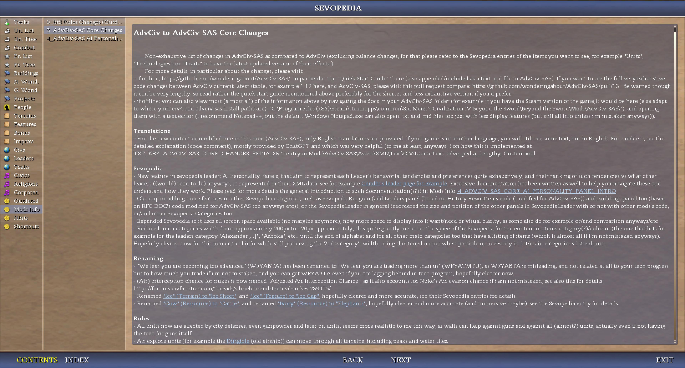

# Quick Get Started Guide

This page does not go to go deep into the technicalities, for that see the
[other documents](/_1_AdvCiv-SAS/) of this mod, but it gives instead a quick
starter guide on the key few differences between AdvCiv and AdvCiv-SAS, for
newcomer players used to AdvCiv, Civ4 BTS, or some similar mods.

todo cleanup extensive comments and move them to a longer changes guide notes

## Sevopedia AdvCiv-SAS Entries

Some of the changes in AdvCiv-SAS (coming from AdvCiv) are also listed in the
Sevopedia Entry (non-exhaustive), please visit it there (the screenshot below
(click to view it full size) may not be updated, it is to give a preview/general
idea):

</img>

There are also other additions, in particular written/coded by me wonderingabout and ChatGPT which are documented (mostly by me (wonderingabout) though hehe anyways etc), such as the AI personality panel (featuring raw and AI attributes display and ranking for all leaders), very important addition to AdvCiv-SAS, hopefully useful in understanding how each and all AI leaders behave and relate to each other, please read (if interested etc anyways) the (more) extensive documentation of how it works [from the main README.md link](/README.md#advciv-sas-core-changes-from-advciv), [or directly here](/README_AI_Personality_Panel.md) if you want (to look etc anyways) for the full page.

A copy of the screenshots (may not be latest version of it) of how it looks ingame:

</img>
</img>
</img>

For more screensot previews of new sevopedia entries or udpated ones (not exhaustive), you can visit [the AI personality panel sevopedialeader feature page of the main README.md](/README.md#ai-personality-panel-sevopedialeader-feature).

## Full exhaustive changes

If you want to see the full very exhaustive code changes between AdvCiv current
latest stable, for example 1.12 here, and AdvCiv-SAS, please visit this [pull
request compare](https://github.com/wonderingabout/AdvCiv-SAS/pull/13).

Be warned though it can be very lengthy, so read below if you
want (some of the) main quick pointers rather.

## Main Changes quick starter guide

- tech tree is vastly reordered for historical accuracy (for example steel is at
iron age, pottery is before the wheel, metal casting before currency and before
bronze working; and medicine at iron age, that too should be about accurate),
but it is mostly the same techs as in civ4 bts/base advciv, hopefully easier to get
into/used to, and i did not see a specific reason to change these, initially i
started this AdvCiv-SAS mod mostly to readjust tech tree if i remember correctly.
- the "citizen" specialist is removed, instead added the doctor specialist (that)
gives health todo and a great doctor great person that gives todo unlocked at
medicine tech todo. I found "citizen" quite useless and annoying even sometimes,
hopefully less now and maybe useful hopefully.
- game pace advances exponentially: later eras have fewer techs and units. This
avoids the hassle of a long and tedious endgame, but is also realistic as most
of history in the amount of years, happened in the past. Bronze Age alone was
longer than most of our recent eras for example, and even more so for Stone Age.
However, units and eras give exponentially bigger bonuses too, and tech costs
and such have been adjusted. Taking also into account that players (should/generally
i think) spend more time on the end game to manage all cities and units or other
things, maybe this will even out and game will still feel the same speed for each
era. Beware to not neglect tech as later ones will be key if no player still has
yet won the game. There are also less units and buildings to fasten the end game
(but trying to keep just enough techs to make it last long enough) time per turn
in minutes/hour played.
- as a result of the previous point, it should be even less likely for a "spearman"
(now there are more units of this type in AdvCiv-SAS, see below at military reworks)
to win against a tank, and also much less likely for a swordsman to every match a
musketman, for example, which should also make more sense historically hopefully.
Defenders may have a chance to prevail while being behind in tech but it will be
(much) harder.
- the civilopedia is renamed the sevopedia, it is the same thing but is the name
of the more modern version (made by modders) of it.
- on that note, unit combat types todo refers to unit categories/types, for example
in Civ4 BTS/base AdvCiv these were for example archery units, recon units (scout,
explorer), melee units (spearman, axeman, swordsman, maceman, pikeman, etc.), etc.
- there are many new unit combat types todo, see the sevopedia entry "Unit Combat
Types" for details. This allows to give specific bonuses to specific combat types.
For example, there are now new combat types of units (and modified existing ones
too), for example there is no more "melee" combat type. Instead, for example about
the former spearman (that was part of the melee combat type), there are now 3 new
combat types the old "spearman" can be part of, melee_lancer_light, melee_lancer_medium
(includes the former spearman that is now a lancer medium combat type at the bronze
age era, for example), melee_lancer_heavy. See the "Unit Combat types" category of the
sevopedia (ingame)(the sevopedia has been a bit tweaked/reworked too btw) for details.
- why bother to do (all) that? Each of these combat types have different units with
different strengths and weaknesses, but to give a general idea, generally the faster
ones will have less damage/strength but better at defense/avoiding/harassing other
units quite freely, while the slower ones have high strength, can defend and attack
well, but no such bonuses, and may cost a bit more too. Strategy should be a lot
more important and versatile/flexible/to be adjusted based on local circumstances.
For a full view of all existing units, on top of viewing the "Unit Combat Types",
you can also see the "Units Tree" for a better view of in the sevopedia ingame, or
this version of the units tree i made that lists the unit combat types and era for
it as well if it helps (may be a bit outdated though but should not be too much)
[military tree map view](/_1_AdvCiv-SAS/Images_In_General/0.43%20military%20tree_modified.png).

- A consequence of this is also that now there will be hopefully no more weirdness of
the axeman being good against lancer, now the relationships between types will be more
complicated or rather defined (may make more sense at same time too), for example an
axeman may be good against swordsmen (for example todo), but not against heavy lances.
Light lances may have strong bonuses against all/most melee types, except fast ones,
and light swords strong bonuses against all/most melee types too except fast ones
(their strength would be lower though). Strategy should be much more important while
not being too tedious ideally.
- another example is an ancient Maceman ("warrior" in the stone age) will be stronger
than a medieval light swordsman, but the medieval light swordsman will have (much more)
bonuses that should make him (or her but most often him) more valuable
as a military unit. This is also realistic too, no reason why an ancient maceman could
not defeat a swordsman, if looking at strength and chance alone, unlike what is, a bit
too extremely the case i think, in base advciv/bts, even accounting for armor and such,
i think, an ancient unit may be stronger by melee alone, so some strategy will be necesasry
to have the best (or better) odds in AdvCiv-SAS, i think, hopefully in an immersive
and not tedious experience too.
- unique units are now renamed civilization units: they are not unique and can be built
many times, just by only one civ in AdvCiv-SAS (and in base civ4 BTS/AdvCiv too if i
am not mistaken) if i am not mistaken. Could be shortened to civ units maybe
too as i may or not or not always do further in this doc or/and other docs, hopefully
the meaning of this expression would be clear enough (fast worker for india for example)
- The tech tree is fairly straightforward, with max one (minus the civ units)
unit type per era, for example, which should hopefully help make sense of that and getting
immersed into it, while not neglecting on strategy, hopefully, at least was my/one of my
goal(s) making (and became as i was making too) this AdvCiv-SAS mod. Note also that this
is not the case for all units and eras, only the ones i found most relevant ones and to
not be tedious enough (there is no work boat 1 work boat 2 workboat 3 etc for example,
only one for all eras, but there are a few workers every few eras, but there are military
units for each new era, at max one unit per combat type (for example "sword light", "lance
heavy", are each one type), and not for all types, also lesser in later stages of the game
to simplify/rush/reach sooner the endgame)
- explore units can attack: but their strength should be quite low
- ground explore units can move through all terrains since the begining of the game,
not water tiles though, but for example peaks. They also all ignore terrain
movement costs, not just the (renaissance) explorer
- air explore units for example the dirigible todo (old airship) can move through
all terrains, including peaks and water tiles
- military units are versatile: swordsmen can defend, archers can attack,
maybe even workers too
- unit promotions have clearer names now too: for example Counter-Archer,
counter Siege, Counter-Tank. Or another example is "City Bombard" (instead
of barrage). Numeric naming has been changed too for clarity and ease of read:
for example "Combat III" is now "Combat 3" too.
- unit promotions are reworked or/and rebalanced: woodsman for example is buffed,
some are rebalanced or nerfed, and other some promotions have also their requirements
changed, for archers have access to city bombard promotion (units are reworked too,
see below), or "Logistics" (named "Commando" before) is now accessible after
Combat 1 or City Attack 1 todo rename. Some are available sooner too, for example
"Logistics" is available at "The Wheel", not "Military Science" anymore, since
we understand roads we can use them, maybe, more strategic importance now too maybe
hopefully.
- military units are reworked: for example the holy roman empire special unit,
to better accomodate its history and stats, can be built starting from a different
tech, in particular the settler is now not freely available but requires agriculture
(is historical too, but for convenience first settler at starting game is provided
for free as it was in Civ4 BTS and AdvCiv)
- some units can only be built under specific conditions, for example each religion
has one unit (same for neo religions at later eras. See religion changes below for
details), for example Buddhism is required to build monks (lance light combat type)
(yes such as shaolin but anyways..) and Christianism for Crusaders, etc.
- on that note, some religious units are listed on the units tree of the sevopedia
while some others not, check for detail the sevopedia (todo update this bullet
point) page of the sevopedia? 
- military units are rebalanced: some op units (according to me) are nerfed
slightly (for example: todo), some weaker ones buffed quite a lot (for example
the jaguar warrior)
- some units have been removed: sometimes for graphical reasons: for example the
rifleman has a new graphic art but the concept of a rifleman remains in itself
(may be rebalanced or not though like the other units though)
- some units have been removed: sometimes for gameplay reasons: for example the
caravel has been removed because too close to the galleon and i want only one
class (for example a caravel, a galleon, a worker, etc.) of unit per era
- also not very sensical to me that somehow these boats can travel incognito or freely
in borders without being attacked. May move this ability to privateers maybe todo
but not sure; or the stealth bomber to simplify gameplay especially the endgame,
there are stronger bombers at each era, just not stealth, or for example the panzer
has been removed for a sooner, more likely to be useful civ unit: the teutonic (foot)
knight. This ability has been removed from most units where i felt/thought it
didn't make sense, such as submarines or/and other units.
- some units have been removed: sometimes for historical accuracy or flavor one
could say maybe reasons: for example the phalanx civ unit of the greek empire
is now the hoplite phalanx (a lancer heavy combat type, not based on the axeman
anymore), and available in mid iron age not in bronze age for better historical
accuracy. I did not check them all (maybe todo fix this note if did) but those
who i did and that i found to be (especially if gravely) mistaken and that i
wanted and did decide to fix or did i did fix. Feel free to point historical
accuracies to me, not guaranteed i would fix them, but if i am available to
read them and all i may or/and reply to those requests about these, but
not guaranteed, may or not,
- some units automatically upgrade, for example the workers, scout, and similar
units. They get a new design graphically at a new era, but also more bonuses, for
example every few eras workers may become more and more productive (faster
improvement build time, or/and move speed/ or and other things for example).
This is to remove the tediousness or a part of it from the game
- about this too, for simplicity most unit upgrade are fairly straightforward and
relaxed: all offensive units can be upraded to offense gun units, same for defensive
melee units into defensive gun units, same for all offensive mounted units into
offensive mounted units. I don't want the tediousness (if any must have to be, not
sure about this too but anyways) to be there. Historically is also not so nonsensical
to think archers started to use a gun, or even axemen actually, once it's not an
effective weapon anymore. Cavalries and similar upgrade into tanks, maybe their skills
translate into driving the tank better or having a better understanding of military
tactics/logistics required in doing so. This is mostly to simplify the tedious parts
of the game while also making all units relevant, a few one rather than many useless
ones, so plan your strategy accordingly.
- terrain is very important, almost all units have terrain bonuses, and sometimes
rarely terrain maluses (i prefer to buff the weak than nerf the strong, unless
i think it is relevant (quite strongly))
- another element of attention is that military (at least early ones, now don't
have much strength difference between them. For example, an ancien maceman (warrior)
would be 10 strength, and a swordsman only 15 strength, while an archer would be 6
strength but with extra or/and other bonuses. In exchange of these adjustments, upgrade
costs are much cheaper todo, so you will not be able to build full warriors then upgrade
them later while going full economy. Also, since units are so close in strength now,
at least early ones, terrain multipliers and promotions multipliers play an especially
big part. The power correction part has been entirely removed or rather negated, in
fact slightly under 100 now. As a human even if odds are slightly below certainty, if
odds are good enough, attack. In exchange also, city attack has been severly increased,
now an AI will want to be about twice +/- as strong as city defenders else would not
bother to attack, ideally. Hopefully and ideally, in theory, this means AIs should/would
behave like a human player would or closer to it, hesitating less to attack and may be
willing to risk if good enough odds or reward, but more guarded about attacking stronger
targets otherwise, at least in theory. They should especially target more lone units
outside of cities, but much less those in cities.)
- global defines have been changed to have religion importance higher (in terms
of culture strength (not exactly sure what this means but should be fine and as i
intend i think maybe)) for example, lower revolt chance, anger from war quite a
bit reduced higher reluctance to agree to a war trade, etc. A bit more pragmatic
or/and opportunistic, or possibly realistic conditions, war may not always be a
fatality, at least in the long run, even though it's hell at first, but this is
not a strong or much likeable opinion of me to have, i simply think it would
make gameplay better/easier/more relaxing, and is also more realistic too this way
- some terrains are buffed, for example snow, desert, and water tiles are (very)
important now. Some terrain specific bonuses are added to some units or/and
Civlizations (for example todo), some buildings give bonus to desert and snow yields
, for example the impluvium building (Kingdom of Benin) improves quite a lot the
desert tiles (you can gain more bonuses with other buildings or techs or civs for
example), and another example is the building that replaces moai (nerfed but not a lot)
gives hammer on all coast and lake tiles (but not ocean) (should be a buff overall)
- More terrain bonuses from techs and buildings: for example fishing gives food
on all water tiles (even without boat)
- traits have been reworked, some weak traits have been buffed or/and modified,
while some other op traits may have been modified (not necessarily nerfed). For
example, the protective trait has been buffed, as i had found it too weak or/and
not relevant enough. This is not necessarily for all traits. Please look at the
Sevopedia "Traits" entries to have the latest updated version of the traits effects
- start map behaviour is affected, not so much terrain polishing (map script
removing bad tiles such as jungle or snow or peak, they are now kept, but
instead you have more starting vision to choose your spot, which should be
realistic too because at 100 000 BCE (approximately) humans may have enough vision
of their surroundings to know where to live or adjust to it maybe (even though
first city settling is not as realistic, but is for convenience, and could maybe
be imagined as a nomadic settlment in the region maybe, still convenient so allowing
it)), also these "bad" terrains should be buffed a bit or quite a lot, so they
would be more considered as alternative strategic options rather than bad tiles, among
other possible changes
- worker cost is reduced
- missionaries, spies, corporation executives todo have their cost greatly reduced,
be sure to build them soon enough, also the effects they give access to (if conversion
succeeds for missionaries (for corproations todo maybe it would be 100%?(?))) are even
stronger.
- no more small wonders! To simplify gameplay, great wonders, now named wonders,
have stronger and more significant effects now. As explained above with the example
of Moai Stautes transformed into a building, some nice effects have also been transferred
Moai Statues, they will become slightly nerfed as a building (also in a way to buff
water tiles as they are quite (very) weak in AdvCiv/BTS i think, trying to address,
for example todo
- some great wonders have changed names to reflect their history more, for example 
"The Great Lighthouse" is now "Lighthouse of Alexandria", and some wonders are tied
to another civ than in civ4 bts/advciv, for example "The great wall" no longer is
linked with China but is now "The Ancient Walls of Benin", if you want to know why,
see [the Mod folder](/_1_AdvCiv-SAS/), i have also put the 
[source](https://thinkafrica.net/walls-of-benin/)
here directly to illustrate this example.
- also, each civilization now is tied to a great wonder, everyone can build it,
but if the civilization tied to it builds it first
- some gameplay elements happen at different times, can resarch sooner, build
culture sooner, slavery sooner, plantations sooner, tech trading a bit later (at
guilds i think todo)
- some ressources are not revealed until a certain tech: sheep is always visible,
but gold not until metal casting.
- a few new civs added, mostly in snow/desert terrains, or underrepresented parts
of the world, see [world map with civs](/_1_AdvCiv-SAS/Images_In_General/0.22_world_map_terrain_with_new_civs.png)
(todo add link), for example The Kingdom Of Benin (Nigeria), or in weaker terrains
(that are now buffed), for example Canada
- Leaders have been changed: unless strongly desired, all civs have at max 2
leaders, should be plenty for a variety of gameplay, i don't want to clutter, prefer
to go deep in strategy instead, for example Joan D'arc has been added, and Louis XIV
and De Gaulle removed, generally i preferred to keep the stronger ones, Cleopatra
added and Hatscheputt removed for example
- Leader animations removed, since now some don't have, better if none have maybe,
instead i tried to put some nice images relatively as i thought would fit and i
like, took quite a lot from existing mods
- Some new ressources, for example camel and todo, some removed ressources, for
example wine and todo
- todo: space victory removed, it's too tedious to do, instead the USA is the
only civ who wins if they build the programme Appolo, make sure to keep them in
check
- some special units are changed: the USA's Navy Seal or some other units are
not relevant soon enough, or/and not accurate (enough), replaced with a sooner
unit for example todo
- religion "taoism" has been renamed to "daoism" and all related entries (temple
and other buildings, units such as missionary etc, and description/history in
sevopedia and such), i have heard many times of the "Dao" (or read maybe rather
anyways etc) in manhua (translated) but never ever saw "Tao", while both seem
correct as chinese translitterations if am not mistaken, it seemed that Dao is
perhaps more fit, but in all cases even if not i'd rather use this one i'm more
famililar with and that makes more sense to me, hopefulyl clearer for others or/and
maybe not anyways etc
- shrines now require a religion to be built, for example the daoist shrine now
(also) requires to have the daoism religion, and not just own the holy city, this
way the shrine can appear in the sevopedia religion new buildings panel (see [the main README.md's note/screenshots for details about Sevopedia religion changes](/README.md#other-sevopedia-category-examples)),
but also seems to make more sense unless i am mistaken or/and it (may?) create other
issues possibly or maybe not, then (i'd) try it and see, this means for example
conquerring a city is now not enough to build a shrine, you need the specific
religion for it, which again seems to make more sense to me too so maybe an all in
all better change, unless i am mistaken, but try and see, maybe works well or maybe
not or yes or other, anyways etc
- one new religion, paganism is added, confucianism is removed, maybe more early
wars, also historically more relevant/+/-accurate too i think
- religion is very important: unlike in civ4 where they are very similar, now
each religion has specific bonuses (for example paganism gives slavery bonuses,
but buddhism gives science bonus), also the cathedrals have been removed (too
much clutter, and now the monasteries are called "Altars", very strong buildings
so you must (i think) pay a lot of attention to religion and consider which one
you want)
- later in the game, neo religion, for example judaism has a neoreligion zionism
(even though not strictly religious), islam has jihad, with big bonuses, just
as in real life, even in modern eras, religions continue to play a big part in
politics and society, for better or worse, i think though
- the techs are mostly the same, they have been completely reordered to better
fit historical accuracy (see timeline i provided too, should be very accurate
now or much more), for example metal casting is before bronze age, the wheel
before pottery, and currency before mathematics. Hopefully should be quite fast
to adjust ideally, it is really the same techs for most at historical points
- gradual gameplay: slower early game, faster late game (less of a chore too
now maybe)
- some units can be built at different times, also for historical accuracy
- otherwise simple gameplay, i don't like clutter
- opportunistic and efficient AI: the AI will not be much more aggressive than
AdvCiv, it will be more cautious to start wars, but will hesitate less when it
(thinks it can) profit, so be careful and plan well
- i intend this to be quite fast paced, game starts at -100 000 BC but it increments
very fast (10 000 per turn, so around turn 40 at normal speed you should already be
around 3000 BC), then the year number and gameplay pace does not slow as much (at
least i tried to make it so, that each end game turn doesn't take ages)
- overall not too much clutter, i don't want too many things, but i want the things i
have/add, to go (very) in depth in them rather, so quite lightweight and hopefully
easy to digest and get used to it, but deep that you'd want to play it more, maybe, ideally
- AIs get no free techs now, todo, they should perform well enough, and receive other
types of bonuses, that they don't need techs for free, it won't feel anymore like they
are playing a different kind of game hopefully, also less of a grind at higher difficulties
(but hard in different ways todo)
- difficulties have also been adjusted in that lower difficulties are harder (i don't
want them to be placeholders anymore), and harder ones less of a grind (ideally),
consider starting at a low difficulty to adjust first if not sure or to get used to
the gameplay
- costs of tech and units are always the same unlike in AdvCiv, maybe it helps if
you want to go from one difficulty to the other, a unit or tech is always same price,
so you can reuse some strategies more easily maybe or quicker adjust
- todo animals can be captured?
- some convenience and quality of life changes: for example WFYABTA ("We fear you are
becoming too advanced" is now renamed as "We fear you are trading more than us", but
it is exactly the same effect, just it is not related to tech pace at all (i was 4 techs
behind from an AI if i remember correctly but still got this message from it, after some
(frustrating) research i found it is not related to tech advancement but how much you
trade with all players (trade less and it will/should(?) fade eventually))), also some other
fixes about "the forge has been destroyed" when it was sometimes not destroyed misleading
messaged tweaked to something not misleading (for example "The forge has caught fire"),
cavalry at rifling not military tradition todo may change, clearer sevopedia with new
menus such as types of ressources, victory conditions, and tweaked existing ones to be
clearer or/and easier to navigate hopefully, i hope this helps.
- enabled floodplains after raze, hopefully they (previous city (owners) developped the
land well enough that it can still be profitable, also for more relaxed and interesting
gameplay, i would want the difficulty to be elsewhere, not in such tedious things)
- voluntary vassals are permanent, think of their culture being absorbed by the empire,
and them merging with the empire, becoming its citizens, so pay attention to that, and
if you don't want it to happen to other rivals, plan your strategy based on that maybe
- unlike in AdvCiv, we love the king chance is restored, i think it's a cool mechanic
and also pleasant for the player, maybe realistic too, so if it can happen all good
(feels good in civ3 for example at least from/in my experience playing it)
- unless specified otherwise, the source for the Sevopedia content, the place text panels
(history text panel generally if i am not mistaken) is more often than not and in most
cases Wikipedia. Info may be reordered and slightly edited or more heavily so, not saying
it everytime (that the source is wikipedia) to reduce tediousness of saying it and writing
everytime, while hopefully not reducing game immersion for the player too. Sometimes i
quote from other sources or make addition of my own, some of these sources may be found
in the [docs](/_1_AdvCiv-SAS/Docs_And_Appendixes/) or/and in other places of this AdvCiv-SAS
mod hopefully, or you (or it in general anyways) could maybe be googled (or search engine
of your choice or preference or some other way) by typing bits of the text content and
hopefully finding the source for the rest. It may be a bit (too) tedious for me to
compile/gather all these sources, but some of them can be found, if not most, in the docs
spread at different places. Hopefully this is convenient enough or not too inconvenient
so that i can focus more on gameplay changes and such, and maybe helps the player too
(immersion, or more indirectly more content and such since i can focus more on other
things but not promised, may or not, ideally would, but doing as i want or not, i hope
this helps though, anyways) 

- todo continue

